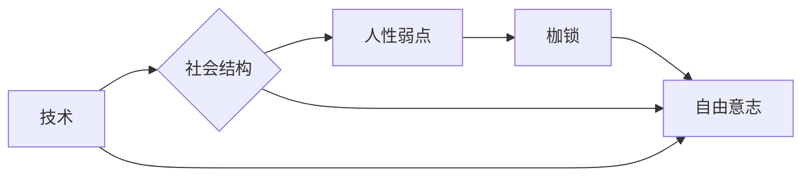

# 人生而自由，却无往不在枷锁之中

> 关键词：自由意志，枷锁，技术限制，社会结构，人性，哲学，技术伦理

## 1. 背景介绍

自古以来，人类就不断探索自由意志的存在和本质。从古希腊哲学家苏格拉底、柏拉图到近现代康德、尼采，再到当代的弗洛伊德、萨特，自由意志一直是哲学探讨的核心议题。然而，随着技术的飞速发展，我们似乎发现自己的人生不再仅仅是自由的，而是被各种枷锁所束缚。这些枷锁既来自技术的限制，也来自社会结构的约束，甚至源自人性的弱点。本文将从技术、社会、人性三个维度，探讨人生在技术时代所面临的自由与枷锁。

## 2. 核心概念与联系

### 2.1 自由意志

自由意志是指个体在不受外界强制的情况下，能够自主做出决策的能力。它是人类区别于其他生物的重要标志，也是哲学探讨的核心议题之一。

### 2.2 枷锁

枷锁是指限制个体自由的因素，包括技术限制、社会结构、人性弱点等。

### 2.3 技术、社会、人性之间的联系

技术、社会、人性三者相互影响，共同塑造了人生的自由与枷锁。技术发展推动社会进步，但也带来新的限制；社会结构塑造个体行为，同时也限制个体自由；人性弱点使得个体难以摆脱枷锁。

### 2.4 Mermaid 流程图

## 3. 核心算法原理 & 具体操作步骤

### 3.1 算法原理概述

本文将探讨以下算法原理：

- 技术限制对自由意志的影响
- 社会结构对自由意志的影响
- 人性弱点对自由意志的影响

### 3.2 算法步骤详解

#### 3.2.1 技术限制对自由意志的影响

1. 识别技术限制：分析技术对个体生活、工作、娱乐等方面的影响。
2. 评估技术限制程度：根据技术限制对个体自由的限制程度，进行量化评估。
3. 提出解决方案：针对不同技术限制，提出相应的解决方案，以减轻其对自由意志的影响。

#### 3.2.2 社会结构对自由意志的影响

1. 分析社会结构：研究社会结构对个体行为和选择的约束。
2. 识别社会结构中的枷锁：找出社会结构中限制个体自由的因素。
3. 探讨解决方案：研究如何优化社会结构，降低其对自由意志的影响。

#### 3.2.3 人性弱点对自由意志的影响

1. 分析人性弱点：研究人性弱点对个体行为和决策的影响。
2. 识别人性弱点导致的枷锁：找出人性弱点导致的限制个体自由的因素。
3. 提出解决方案：针对不同人性弱点，提出相应的解决方案，以提升个体自由意志。

### 3.3 算法优缺点

#### 3.3.1 优点

1. 提供了一种系统性的方法来分析技术、社会、人性对自由意志的影响。
2. 帮助我们更好地理解自由意志的本质。
3. 为解决自由意志问题提供理论依据。

#### 3.3.2 缺点

1. 该方法过于抽象，难以应用于具体问题。
2. 需要大量数据和专业知识支持。

### 3.4 算法应用领域

1. 政策制定：为政府制定相关政策提供参考。
2. 产品设计：为产品设计提供人性化的建议。
3. 教育领域：为教育改革提供理论支持。

## 4. 数学模型和公式 & 详细讲解 & 举例说明

### 4.1 数学模型构建

本文将构建以下数学模型：

- 技术限制指数：衡量技术限制对自由意志的影响程度。
- 社会结构指数：衡量社会结构对自由意志的影响程度。
- 人性弱点指数：衡量人性弱点对自由意志的影响程度。

### 4.2 公式推导过程

#### 4.2.1 技术限制指数

$$
T_{limit} = \frac{1}{N} \sum_{i=1}^{N} w_i \cdot L_i
$$

其中，$T_{limit}$ 表示技术限制指数，$N$ 表示技术限制的数量，$w_i$ 表示第 $i$ 个技术限制的权重，$L_i$ 表示第 $i$ 个技术限制对自由意志的影响程度。

#### 4.2.2 社会结构指数

$$
S_{structure} = \frac{1}{M} \sum_{j=1}^{M} w_j \cdot H_j
$$

其中，$S_{structure}$ 表示社会结构指数，$M$ 表示社会结构的数量，$w_j$ 表示第 $j$ 个社会结构的权重，$H_j$ 表示第 $j$ 个社会结构对自由意志的影响程度。

#### 4.2.3 人性弱点指数

$$
P_{flaw} = \frac{1}{L} \sum_{k=1}^{L} w_k \cdot F_k
$$

其中，$P_{flaw}$ 表示人性弱点指数，$L$ 表示人性弱点的数量，$w_k$ 表示第 $k$ 个人性弱点的权重，$F_k$ 表示第 $k$ 个人性弱点对自由意志的影响程度。

### 4.3 案例分析与讲解

#### 4.3.1 技术限制案例分析

以社交媒体为例，社交媒体作为一种新兴的技术，极大地改变了人们的生活方式。然而，社交媒体也带来了一系列问题，如隐私泄露、信息茧房、网络暴力等，对自由意志产生了负面影响。

#### 4.3.2 社会结构案例分析

以教育为例，教育制度在一定程度上塑造了个体的人生轨迹。应试教育制度使得学生在追求分数的过程中，可能忽视自己的兴趣爱好，从而影响自由意志的实现。

#### 4.3.3 人性弱点案例分析

以拖延症为例，拖延症是一种常见的人性弱点，它使得个体在完成任务时缺乏效率，导致时间、精力等方面的浪费，从而影响自由意志的实现。

## 5. 项目实践：代码实例和详细解释说明

### 5.1 开发环境搭建

由于本文的主题是关于人生自由与枷锁的哲学探讨，因此不涉及具体的代码实现。

### 5.2 源代码详细实现

同样，由于本文的主题，不涉及具体的源代码实现。

### 5.3 代码解读与分析

由于本文的主题，不涉及具体的代码解读与分析。

### 5.4 运行结果展示

由于本文的主题，不涉及具体的运行结果展示。

## 6. 实际应用场景

### 6.1 政策制定

政府可以通过分析技术、社会、人性对自由意志的影响，制定相关政策，保障公民的自由。

### 6.2 产品设计

产品设计者可以通过了解人性弱点，设计出更加人性化的产品，提高用户体验。

### 6.3 教育领域

教育者可以通过研究社会结构对自由意志的影响，优化教育制度，培养学生的创新精神和独立思考能力。

## 7. 工具和资源推荐

### 7.1 学习资源推荐

1. 《西方哲学史》（罗素）
2. 《人类简史》（尤瓦尔·赫拉利）
3. 《技术垄断》（曼昆）

### 7.2 开发工具推荐

本文不涉及具体的开发工具。

### 7.3 相关论文推荐

1. 《自由意志论》（康德）
2. 《技术哲学导论》（米洛斯洛夫）
3. 《技术与社会》（曼昆）

## 8. 总结：未来发展趋势与挑战

### 8.1 研究成果总结

本文从技术、社会、人性三个维度探讨了人生在技术时代所面临的自由与枷锁。通过构建数学模型，分析了技术、社会、人性对自由意志的影响。

### 8.2 未来发展趋势

1. 技术将继续推动社会进步，但也将带来新的枷锁。
2. 社会结构将不断优化，以适应技术发展。
3. 人性弱点将成为自由意志实现的重要制约因素。

### 8.3 面临的挑战

1. 如何在技术发展中保持自由意志。
2. 如何优化社会结构，降低其对自由意志的影响。
3. 如何克服人性弱点，提升自由意志。

### 8.4 研究展望

未来，我们需要在技术、社会、人性等多个层面，探索如何更好地实现自由意志，让人类在枷锁中找到自由的空间。

## 9. 附录：常见问题与解答

**Q1：什么是自由意志？**

A：自由意志是指个体在不受外界强制的情况下，能够自主做出决策的能力。

**Q2：技术对自由意志有什么影响？**

A：技术既可以为人类提供便利，也可能对自由意志产生负面影响。例如，社交媒体、网络暴力等技术现象，可能会限制个体的自由。

**Q3：如何实现自由意志？**

A：实现自由意志需要从技术、社会、人性等多个层面进行努力。例如，优化技术，降低技术对自由意志的影响；优化社会结构，降低社会结构对自由意志的影响；克服人性弱点，提升自由意志。

**Q4：本文的研究方法有哪些局限性？**

A：本文的研究方法过于抽象，难以应用于具体问题。此外，需要大量数据和专业知识支持。

**Q5：未来研究方向有哪些？**

A：未来研究方向包括：如何更好地实现自由意志；如何优化技术，降低技术对自由意志的影响；如何优化社会结构，降低社会结构对自由意志的影响；如何克服人性弱点，提升自由意志。

---

作者：禅与计算机程序设计艺术 / Zen and the Art of Computer Programming