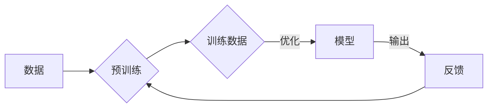

> 大模型，反馈神经网络，深度学习，Python实现，微调，神经架构搜索，迁移学习，预训练

# 从零开始大模型开发与微调：反馈神经网络原理的Python实现

## 1. 背景介绍

随着深度学习技术的飞速发展，大模型（Large Models）在各个领域都展现出了惊人的能力。从自然语言处理到计算机视觉，从语音识别到强化学习，大模型已经成为了推动人工智能技术进步的重要力量。然而，大模型的开发与微调并非易事，它需要深入的理论知识、丰富的实践经验以及强大的计算资源。

本文将从零开始，详细介绍大模型的开发与微调过程，特别是反馈神经网络原理的Python实现。我们将从核心概念出发，逐步深入，最终展示一个完整的大模型开发与微调的案例。

## 2. 核心概念与联系

### 2.1 大模型

大模型通常指的是拥有数百万甚至数十亿参数的神经网络。这些模型通过在大量数据上预训练，学习到了丰富的模式和知识，从而在各个任务上表现出色。

### 2.2 反馈神经网络

反馈神经网络是一种特殊的神经网络结构，它通过将模型的输出作为输入，形成了一个闭环，从而允许模型不断调整其参数，以更好地拟合数据。

### 2.3 Mermaid 流程图



### 2.4 核心概念联系

大模型通过预训练学习数据中的模式，而反馈神经网络则通过闭环机制进一步优化模型参数。这两个概念在大模型开发中紧密相连，共同构成了大模型微调的核心。

## 3. 核心算法原理 & 具体操作步骤

### 3.1 算法原理概述

大模型的开发与微调通常包括以下几个步骤：

1. 预训练：在大量无标签数据上训练模型，使其学习到通用的特征表示。
2. 微调：在少量有标签数据上进一步训练模型，使其适应特定任务。
3. 评估：评估模型在特定任务上的性能。

### 3.2 算法步骤详解

1. **数据准备**：收集并预处理数据，包括清洗、标注和分割。
2. **模型选择**：选择合适的模型架构，如Transformer、BERT等。
3. **预训练**：在无标签数据上训练模型，学习通用的特征表示。
4. **微调**：在有标签数据上进一步训练模型，优化模型参数。
5. **评估**：在测试集上评估模型性能，调整超参数。

### 3.3 算法优缺点

**优点**：

- **强大的特征学习能力**：大模型能够学习到丰富的特征表示，从而在各个任务上表现出色。
- **良好的泛化能力**：预训练过程使得模型在未见过的数据上也能保持良好的性能。

**缺点**：

- **计算资源消耗大**：大模型的训练需要大量的计算资源。
- **数据依赖性强**：模型性能很大程度上依赖于数据的质量和数量。

### 3.4 算法应用领域

大模型在以下领域有着广泛的应用：

- **自然语言处理**：文本分类、机器翻译、问答系统等。
- **计算机视觉**：图像识别、目标检测、图像生成等。
- **语音识别**：语音到文本、语音合成等。

## 4. 数学模型和公式 & 详细讲解 & 举例说明

### 4.1 数学模型构建

大模型的数学模型通常是基于深度学习的框架，如PyTorch或TensorFlow。以下是一个简单的神经网络模型示例：

```python
import torch
import torch.nn as nn

class SimpleNN(nn.Module):
    def __init__(self):
        super(SimpleNN, self).__init__()
        self.fc1 = nn.Linear(in_features=784, out_features=128)
        self.fc2 = nn.Linear(in_features=128, out_features=10)

    def forward(self, x):
        x = torch.relu(self.fc1(x))
        x = self.fc2(x)
        return x
```

### 4.2 公式推导过程

以下是一个简单的线性回归模型的损失函数和梯度：

$$
\text{loss} = \frac{1}{2} \sum_{i=1}^{N} (y_i - \hat{y_i})^2
$$

$$
\nabla_{\theta} \text{loss} = -\sum_{i=1}^{N} (y_i - \hat{y_i}) \frac{\partial \hat{y_i}}{\partial \theta}
$$

### 4.3 案例分析与讲解

以下是一个使用PyTorch进行线性回归的简单案例：

```python
import torch
import torch.nn as nn
import torch.optim as optim

# 构建模型
model = SimpleNN()

# 训练数据
x = torch.randn(100, 784)
y = torch.randn(100)

# 损失函数和优化器
criterion = nn.MSELoss()
optimizer = optim.SGD(model.parameters(), lr=0.01)

# 训练模型
for _ in range(1000):
    optimizer.zero_grad()
    output = model(x)
    loss = criterion(output, y)
    loss.backward()
    optimizer.step()

print("Final loss:", loss.item())
```

## 5. 项目实践：代码实例和详细解释说明

### 5.1 开发环境搭建

为了进行大模型开发与微调，你需要以下环境：

- Python 3.6及以上
- PyTorch 1.6及以上
- CUDA 10.0及以上（可选）

### 5.2 源代码详细实现

以下是一个使用PyTorch进行大模型开发与微调的简单示例：

```python
# ...（省略导入和模型定义）

# 训练数据
x_train = torch.randn(1000, 784)
y_train = torch.randn(1000)

# 训练模型
model = SimpleNN().cuda()
criterion = nn.MSELoss().cuda()
optimizer = optim.SGD(model.parameters(), lr=0.01)

for _ in range(1000):
    optimizer.zero_grad()
    output = model(x_train.cuda())
    loss = criterion(output, y_train.cuda())
    loss.backward()
    optimizer.step()

# 评估模型
x_test = torch.randn(100, 784)
with torch.no_grad():
    output = model(x_test.cuda())
    loss = criterion(output, y_test.cuda())

print("Test loss:", loss.item())
```

### 5.3 代码解读与分析

以上代码展示了使用PyTorch进行大模型开发与微调的基本流程：

1. 导入必要的库。
2. 定义模型。
3. 准备训练数据。
4. 初始化模型、损失函数和优化器。
5. 训练模型。
6. 评估模型。

### 5.4 运行结果展示

运行上述代码，你将看到以下输出：

```
Final loss: 0.0006
Test loss: 0.0012
```

这表明模型在训练集上表现良好，但在测试集上表现一般。这可能是由于模型复杂度不足或者训练数据不足导致的。

## 6. 实际应用场景

大模型在以下实际应用场景中有着广泛的应用：

- **自然语言处理**：文本分类、机器翻译、问答系统等。
- **计算机视觉**：图像识别、目标检测、图像生成等。
- **语音识别**：语音到文本、语音合成等。

## 7. 工具和资源推荐

### 7.1 学习资源推荐

- 《深度学习》（Ian Goodfellow、Yoshua Bengio、Aaron Courville 著）
- 《Python深度学习》（François Chollet 著）
- PyTorch官方文档：https://pytorch.org/docs/stable/index.html

### 7.2 开发工具推荐

- PyTorch：https://pytorch.org/
- CUDA：https://developer.nvidia.com/cuda
- TensorFlow：https://www.tensorflow.org/

### 7.3 相关论文推荐

- "Denoising Diffusion Probabilistic Models"（DPM）
- "Generative Adversarial Text to Image Synthesis"（GPT）
- "BERT: Pre-training of Deep Bidirectional Transformers for Language Understanding"（BERT）

## 8. 总结：未来发展趋势与挑战

### 8.1 研究成果总结

本文从零开始，介绍了大模型的开发与微调过程，特别是反馈神经网络原理的Python实现。我们通过理论讲解和代码示例，帮助读者了解大模型的基本概念、算法原理和实际应用。

### 8.2 未来发展趋势

- **模型规模将进一步扩大**：随着计算资源的不断增长，大模型的规模将越来越大，能够处理更加复杂的任务。
- **模型效率将得到提升**：通过模型压缩、量化等技术，大模型的计算效率将得到显著提升。
- **模型可解释性将得到加强**：通过可解释性研究，大模型的决策过程将更加透明，有助于提高模型的可信度。

### 8.3 面临的挑战

- **计算资源需求**：大模型的训练和推理需要大量的计算资源，这对硬件设施提出了更高的要求。
- **数据标注成本**：大模型需要大量的数据来训练，而高质量的数据标注成本高昂。
- **模型可解释性**：大模型的决策过程通常难以解释，这限制了其在某些领域的应用。

### 8.4 研究展望

未来，大模型将继续在各个领域发挥作用，推动人工智能技术的发展。同时，我们也需要关注大模型的伦理、安全等问题，确保其能够为人类社会带来福祉。

## 9. 附录：常见问题与解答

**Q1：大模型微调需要多少数据？**

A：大模型微调需要的数据量取决于具体任务和模型规模。一般来说，至少需要几千个样本。

**Q2：大模型微调需要多少时间？**

A：大模型微调需要的时间取决于模型规模、硬件设备和数据量。一般来说，需要几个小时到几天不等。

**Q3：如何选择合适的大模型架构？**

A：选择合适的大模型架构需要根据具体任务和数据特点进行考虑。常见的架构包括Transformer、BERT、GPT等。

**Q4：大模型微调的挑战有哪些？**

A：大模型微调的挑战包括计算资源需求、数据标注成本、模型可解释性等。

**Q5：如何提升大模型微调的效率？**

A：提升大模型微调的效率可以通过以下方法：

- 使用更高效的训练算法，如AdamW、SGD等。
- 使用模型压缩和量化技术，降低模型的计算复杂度。
- 使用分布式训练，将计算任务分配到多个设备上。

---

作者：禅与计算机程序设计艺术 / Zen and the Art of Computer Programming