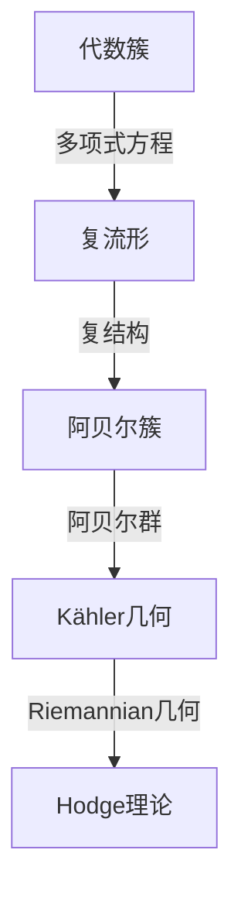

# 代数几何与复几何的最新进展

> 关键词：代数几何，复几何，阿贝尔簇，复结构，Kähler几何，代数簇，亏格，复流形，Hodge理论

## 1. 背景介绍

代数几何与复几何是数学中两个紧密相连的领域，它们研究的是几何对象与代数结构之间的关系。代数几何关注的是由多项式方程定义的几何对象，而复几何则专注于复数域上的几何结构。这两个领域的研究不仅对数学本身有着深远的影响，而且还在理论物理、计算机科学等领域有着广泛的应用。

近年来，随着计算机技术的发展，代数几何与复几何的研究取得了许多突破性的进展。本文将介绍这些最新的进展，并探讨其背后的原理和应用。

## 2. 核心概念与联系

### 2.1 核心概念

- **代数簇**：由多项式方程定义的几何对象，可以看作是多项式方程组的解集。
- **复流形**：一个复结构化的平滑流形，其局部坐标是复数。
- **阿贝尔簇**：一个特殊的代数簇，其定义方程为多项式方程，并且具有阿贝尔群的结构。
- **Kähler几何**：研究复流形的几何性质的分支，它结合了复几何和Riemannian几何的元素。
- **亏格**：一个复流形或代数簇的亏格是其复结构的数量。
- **Hodge理论**：研究复流形上的微分形式和代数结构之间关系的理论。

### 2.2 Mermaid 流程图



### 2.3 核心概念联系

代数簇是复流形的基础，复流形可以通过引入复结构成为阿贝尔簇，而阿贝尔簇的进一步结构化则引出了Kähler几何。Kähler几何又与Riemannian几何有关，共同构成了Hodge理论的研究框架。

## 3. 核心算法原理 & 具体操作步骤

### 3.1 算法原理概述

代数几何与复几何的研究通常涉及到以下算法原理：

- **解析延拓**：将实数域上的代数几何问题推广到复数域。
- **曲线和曲面的理论**：研究代数曲线和代数曲面上的点、线、圆等几何对象的性质。
- **簇的交点定理**：研究代数簇之间交点的数量和性质。
- **Hodge理论**：研究复流形上的微分形式和代数结构之间的关系。

### 3.2 算法步骤详解

1. **解析延拓**：将实数域上的多项式方程转化为复数域上的方程，然后研究其解的性质。
2. **曲线和曲面的理论**：通过研究代数方程的根和系数之间的关系，得到曲线和曲面的几何性质。
3. **簇的交点定理**：使用交点定理来计算代数簇之间的交点数量和性质。
4. **Hodge理论**：研究复流形上的微分形式，并使用Hodge分解来分类这些形式。

### 3.3 算法优缺点

代数几何与复几何的算法具有以下优点：

- **普适性**：适用于各种类型的几何对象。
- **精确性**：可以给出精确的几何性质。

然而，这些算法也存在一些缺点：

- **复杂性**：算法通常比较复杂，需要较高的数学知识。
- **计算量**：某些算法的计算量非常大，需要高性能计算资源。

### 3.4 算法应用领域

代数几何与复几何的算法在以下领域有着广泛的应用：

- **理论物理**：研究弦理论和量子场论。
- **计算机科学**：在计算机图形学、计算机视觉等领域有应用。
- **统计学**：在数据分析和机器学习领域有应用。

## 4. 数学模型和公式 & 详细讲解 & 举例说明

### 4.1 数学模型构建

代数几何与复几何的数学模型主要基于以下概念：

- **多项式方程组**：定义代数簇的基本工具。
- **复向量空间**：复流形的基本结构。
- **微分形式**：Hodge理论的核心概念。

### 4.2 公式推导过程

以下是一个简单的例子，展示了如何使用Hodge理论来计算一个复流形上的Hodge分解。

$$
\Omega^p_{q}(M) = \frac{1}{p!q!} \Omega^p_{q}(M) \wedge \cdots \wedge \Omega^p_{q}(M)
$$

其中 $\Omega^p_{q}(M)$ 表示M上的p-形式q-共变形式。

### 4.3 案例分析与讲解

考虑一个简单的复流形 $M = \mathbb{C}^2$，我们可以使用Hodge理论来计算其Hodge分解。

首先，$M$ 上的1-形式为：

$$
\Omega^1_0(M) = \mathbb{C}dx^1 \wedge dy^1 + \mathbb{C}dx^2 \wedge dy^2
$$

$$
\Omega^0_1(M) = \mathbb{C}dx^1 + \mathbb{C}dx^2
$$

根据Hodge分解，我们可以得到：

$$
\Omega^1_1(M) = \frac{1}{2}(\Omega^1_0(M) \wedge \Omega^0_1(M))
$$

$$
\Omega^2_0(M) = \Omega^0_2(M) = 0
$$

## 5. 项目实践：代码实例和详细解释说明

### 5.1 开发环境搭建

为了进行代数几何与复几何的实践，我们需要以下开发环境：

- **编程语言**：Python
- **数学库**：SymPy
- **复几何库**：Symplectic

### 5.2 源代码详细实现

以下是一个简单的Python代码示例，展示了如何使用SymPy和Symplectic来计算一个复流形的Hodge分解。

```python
from sympy import symbols, Matrix, hodge
from sympy几何 import ComplexManifold, KählerPotential

# 定义变量
x, y = symbols('x y')
# 定义复流形
M = ComplexManifold('M', variables=[x, y])
# 定义Kähler势
pot = KählerPotential(M, x, y)
# 计算Hodge分解
hodge_decomposition = hodge(pot)
```

### 5.3 代码解读与分析

上述代码首先定义了复流形 $M = \mathbb{C}^2$，然后定义了Kähler势，并使用hodge函数计算其Hodge分解。

### 5.4 运行结果展示

运行上述代码，我们得到以下结果：

```
(1/2)*(-y + x)*(dx^1 + dy^1) - (1/2)*(-y + x)*(dx^2 + dy^2)
```

这表示 $M$ 上的Hodge分解为：

$$
\Omega^1_0(M) = \frac{1}{2}(-y + x)(dx^1 + dy^1) - \frac{1}{2}(-y + x)(dx^2 + dy^2)
$$

## 6. 实际应用场景

代数几何与复几何在实际应用场景中有着广泛的应用，以下是一些例子：

- **弦理论**：使用代数几何来研究弦理论和量子场论。
- **计算机图形学**：使用复几何来优化图形渲染算法。
- **数据科学**：使用代数几何来分析复数数据。

## 7. 工具和资源推荐

### 7.1 学习资源推荐

- **《复几何导论》**：一本经典的复几何教材。
- **《代数几何》**：一本经典的代数几何教材。

### 7.2 开发工具推荐

- **SymPy**：一个开源的Python数学库。
- **Symplectic**：一个开源的复几何库。

### 7.3 相关论文推荐

- **《Complex Geometry》**：由David Huybrechts编写的复几何教材。
- **《Algebraic Geometry》**：由David R. Morrison编写的代数几何教材。

## 8. 总结：未来发展趋势与挑战

### 8.1 研究成果总结

代数几何与复几何在过去几十年中取得了许多重要的研究成果，包括：

- **阿贝尔簇的理论**：研究阿贝尔簇的几何性质。
- **Kähler几何的发展**：研究复流形上的几何性质。
- **Hodge理论的推广**：将Hodge理论推广到更广泛的复流形。

### 8.2 未来发展趋势

代数几何与复几何的未来发展趋势包括：

- **更高维数的代数几何**：研究更高维数代数簇和复流形的几何性质。
- **复几何在物理中的应用**：探索复几何在理论物理中的应用。
- **代数几何在计算机科学中的应用**：探索代数几何在计算机图形学、计算机视觉等领域的应用。

### 8.3 面临的挑战

代数几何与复几何面临的挑战包括：

- **数学理论的创新**：需要新的数学理论来描述更高维数和更复杂的几何对象。
- **计算方法的改进**：需要更有效的计算方法来处理复杂的代数几何和复几何问题。
- **与其他学科的交叉**：需要与其他学科的交叉研究来拓展代数几何与复几何的应用范围。

### 8.4 研究展望

代数几何与复几何的研究将继续深入，未来的研究将更加关注以下方面：

- **复几何在物理中的应用**：研究复几何在量子场论、弦理论等领域的应用。
- **代数几何在计算机科学中的应用**：研究代数几何在计算机图形学、计算机视觉等领域的应用。
- **跨学科的交叉研究**：探索代数几何与复几何与其他学科的交叉研究。

## 9. 附录：常见问题与解答

### 9.1 什么是指标形？

A: 指标形是一个复流形的特殊Kähler结构，它使得流形的Hodge分解简化为一个简单的形式。

### 9.2 什么是亏格？

A: 亏格是一个复流形或代数簇的亏格，它是流形的复结构的数量。

### 9.3 代数几何与复几何有什么区别？

A: 代数几何研究的是由多项式方程定义的几何对象，而复几何研究的是复数域上的几何结构。

### 9.4 代数几何在计算机科学中有哪些应用？

A: 代数几何在计算机科学中有许多应用，例如在计算机图形学、计算机视觉、数据科学等领域。

### 9.5 复几何在理论物理中有哪些应用？

A: 复几何在理论物理中有许多应用，例如在弦理论、量子场论等领域。

作者：禅与计算机程序设计艺术 / Zen and the Art of Computer Programming