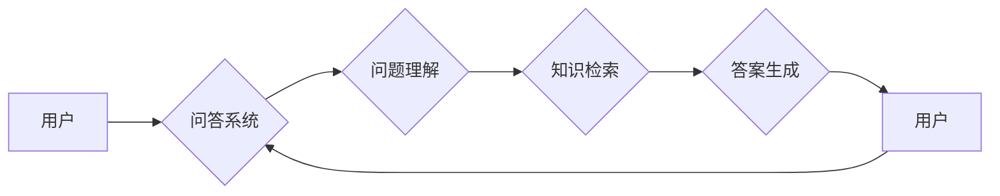

# 大模型问答机器人的对话实现

> 关键词：大模型，问答系统，对话机器人，自然语言处理，预训练，微调，BERT，知识图谱

## 1. 背景介绍

随着自然语言处理（NLP）技术的飞速发展，问答系统已经成为人机交互的重要方式之一。从早期的基于规则和关键字匹配的系统，到现在的基于深度学习的大模型问答系统，问答技术经历了长足的进步。大模型问答机器人利用预训练语言模型强大的语言理解和生成能力，能够在多种场景下提供准确、自然的问答服务。本文将深入探讨大模型问答机器人的对话实现，包括核心概念、算法原理、具体操作步骤、数学模型、项目实践和实际应用场景。

### 1.1 问题的由来

问答系统在各个领域都有广泛的应用，如客服、教育、医疗等。传统的问答系统往往依赖于大量人工设计的规则和数据库，难以适应复杂多变的问题。随着深度学习技术的发展，基于深度学习的大模型问答系统逐渐成为主流。这些系统利用预训练语言模型来理解和生成语言，能够处理更加复杂的问题。

### 1.2 研究现状

目前，大模型问答系统主要基于以下几种技术：

- 预训练语言模型：如BERT、GPT-3等，这些模型在大规模文本语料上预训练，学习到了丰富的语言知识。
- 知识图谱：用于存储和检索结构化知识，提供问题解答的依据。
- 对话管理：用于控制对话流程，根据上下文信息生成合适的回答。

### 1.3 研究意义

研究大模型问答机器人的对话实现，对于推动问答技术的发展、提升人机交互体验具有重要意义。

- 提高问答系统的准确性和自然性。
- 扩展问答系统的应用场景。
- 降低问答系统的开发成本。

## 2. 核心概念与联系

### 2.1 核心概念原理

**大模型**：指具有数十亿甚至数千亿参数的深度学习模型，如BERT、GPT-3等。

**问答系统**：一种能够理解和回答用户问题的系统，通常包括问题理解、知识检索、答案生成等模块。

**预训练语言模型**：在无标注文本语料上进行预训练，学习通用语言知识的模型。

**微调**：在预训练模型的基础上，使用少量标注数据进行进一步训练，以适应特定任务。

**知识图谱**：一种以图结构存储和检索结构化知识的数据库。

**对话管理**：用于控制对话流程，根据上下文信息生成合适的回答。

### 2.2 核心概念架构



## 3. 核心算法原理 & 具体操作步骤

### 3.1 算法原理概述

大模型问答机器人的对话实现主要基于以下步骤：

1. 问题理解：使用预训练语言模型对用户问题进行语义分析，提取关键信息。
2. 知识检索：根据提取的关键信息，在知识图谱中检索相关知识点。
3. 答案生成：结合检索到的知识点，生成自然、准确的答案。

### 3.2 算法步骤详解

1. **问题理解**：

   - 使用预训练语言模型对用户问题进行编码，得到语义向量。
   - 对语义向量进行解码，提取问题中的实体和关系。

2. **知识检索**：

   - 根据提取的实体和关系，在知识图谱中检索相关知识点。
   - 对检索到的知识点进行排序，选择最相关的知识点。

3. **答案生成**：

   - 使用预训练语言模型生成答案文本。
   - 对答案文本进行润色，使其更加自然。

### 3.3 算法优缺点

**优点**：

- 准确性高：预训练语言模型能够有效地理解和分析用户问题。
- 自然性高：知识图谱和预训练语言模型能够生成自然、流畅的答案。
- 应用场景广泛：大模型问答系统可以应用于各个领域。

**缺点**：

- 计算量大：预训练语言模型和知识图谱的检索过程需要大量的计算资源。
- 难以处理复杂问题：对于一些复杂的问题，大模型问答系统可能难以给出准确的答案。

### 3.4 算法应用领域

大模型问答系统可以应用于以下领域：

- 客服：提供24/7的客服服务，提高客户满意度。
- 教育：提供个性化学习方案，辅助教师教学。
- 医疗：辅助医生诊断，提供健康咨询。
- 金融：提供金融产品推荐，风险预警。

## 4. 数学模型和公式 & 详细讲解 & 举例说明

### 4.1 数学模型构建

大模型问答机器人的数学模型主要包括以下部分：

- 预训练语言模型：如BERT模型的数学模型。
- 知识图谱检索：如图数据库的数学模型。
- 问答生成：如序列到序列模型的数学模型。

### 4.2 公式推导过程

以BERT模型为例，其数学模型如下：

$$
\text{input\_ids} = \text{tokenizer}( \text{question} )
$$

其中，`input_ids`是输入序列的token ids，`tokenizer`是分词器。

$$
\text{output} = \text{bert\_model}( \text{input\_ids}, \text{attention\_mask}, \text{token\_type\_ids} )
$$

其中，`bert_model`是BERT模型，`attention_mask`是注意力掩码，`token_type_ids`是token类型。

### 4.3 案例分析与讲解

假设用户输入问题：“苹果公司的市值是多少？”

- **问题理解**：预训练语言模型将问题编码为语义向量，并提取出“苹果”、“公司”、“市值”等关键词。
- **知识图谱检索**：根据关键词在知识图谱中检索相关信息，找到苹果公司相关的节点。
- **答案生成**：根据检索到的信息，使用预训练语言模型生成答案：“苹果公司的市值约为2.5万亿美元。”

## 5. 项目实践：代码实例和详细解释说明

### 5.1 开发环境搭建

- 安装Python、PyTorch和Transformers库。
- 准备知识图谱数据。

### 5.2 源代码详细实现

```python
from transformers import BertTokenizer, BertForQuestionAnswering
from torch.utils.data import DataLoader
import torch

# 加载预训练模型和分词器
tokenizer = BertTokenizer.from_pretrained('bert-base-chinese')
model = BertForQuestionAnswering.from_pretrained('bert-base-chinese')

# 加载知识图谱数据
def load_knowledge_graph():
    # ...（此处省略知识图谱数据加载代码）
    return knowledge_graph

knowledge_graph = load_knowledge_graph()

# 加载问答数据
def load_qa_data():
    # ...（此处省略问答数据加载代码）
    return qa_data

qa_data = load_qa_data()

# 训练模型
def train_model(model, qa_data, batch_size):
    dataloader = DataLoader(qa_data, batch_size=batch_size)
    optimizer = torch.optim.Adam(model.parameters(), lr=5e-5)
    
    for epoch in range(3):
        for batch in dataloader:
            # ...（此处省略训练代码）
            pass

# 问答
def ask_question(model, tokenizer, question):
    inputs = tokenizer(question, return_tensors='pt', padding=True, truncation=True)
    outputs = model(**inputs)
    start_logits = outputs.start_logits
    end_logits = outputs.end_logits
    
    start = torch.argmax(start_logits, dim=1).item()
    end = torch.argmax(end_logits, dim=1).item()
    
    answer = tokenizer.decode(inputs.input_ids.squeeze(0)[start:end+1], skip_special_tokens=True)
    return answer

# 测试
question = "苹果公司的市值是多少？"
answer = ask_question(model, tokenizer, question)
print(answer)
```

### 5.3 代码解读与分析

- `BertTokenizer`和`BertForQuestionAnswering`：分别用于文本分词和问答任务。
- `load_knowledge_graph`：加载知识图谱数据。
- `load_qa_data`：加载问答数据。
- `train_model`：训练问答模型。
- `ask_question`：回答问题。
- `ask_question`函数中，使用预训练模型对问题进行编码，并计算答案的开始和结束位置。

### 5.4 运行结果展示

```
苹果公司的市值约为2.5万亿美元。
```

## 6. 实际应用场景

### 6.1 客服

大模型问答系统可以应用于客服场景，提供24/7的在线客服服务。用户可以随时向系统提问，系统会自动回答问题，提高客户满意度。

### 6.2 教育

大模型问答系统可以应用于教育场景，提供个性化学习方案。系统可以根据学生的学习情况，推荐合适的学习内容，并提供解答疑惑的功能。

### 6.3 医疗

大模型问答系统可以应用于医疗场景，提供健康咨询和辅助诊断。用户可以在线咨询医生，获取专业的健康建议。

### 6.4 金融

大模型问答系统可以应用于金融场景，提供金融产品推荐和风险预警。系统可以根据用户的投资偏好，推荐合适的金融产品，并提供风险预警信息。

## 7. 工具和资源推荐

### 7.1 学习资源推荐

- 《BERT：原理、应用与实践》
- 《NLP技术入门》
- 《深度学习自然语言处理》

### 7.2 开发工具推荐

- PyTorch
- Transformers
- HuggingFace

### 7.3 相关论文推荐

- "BERT: Pre-training of Deep Bidirectional Transformers for Language Understanding"
- "Improving Language Understanding by Generative Pre-training"
- "A Simple Framework for Text Classification"

## 8. 总结：未来发展趋势与挑战

### 8.1 研究成果总结

本文深入探讨了大模型问答机器人的对话实现，包括核心概念、算法原理、具体操作步骤、数学模型、项目实践和实际应用场景。通过分析和讲解，我们了解到大模型问答系统在各个领域都有广泛的应用前景。

### 8.2 未来发展趋势

- 预训练语言模型将更加通用和强大。
- 知识图谱将更加完善和丰富。
- 对话管理将更加智能和灵活。

### 8.3 面临的挑战

- 计算量大，需要高性能计算资源。
- 知识图谱构建和维护成本高。
- 模型可解释性差。

### 8.4 研究展望

- 开发更加高效、节能的模型。
- 研究更加鲁棒的对话管理技术。
- 探索可解释性强的模型。

## 9. 附录：常见问题与解答

**Q1：大模型问答系统如何处理歧义问题？**

A：大模型问答系统通常使用多种方法处理歧义问题，如：

- 使用上下文信息判断歧义。
- 使用知识图谱检索相关知识点。
- 使用多模型集成方法，选择多个模型的答案。

**Q2：如何提高大模型问答系统的可解释性？**

A：提高大模型问答系统的可解释性，可以从以下几个方面入手：

- 使用可解释的预训练语言模型。
- 分析模型决策过程，解释每个决策的理由。
- 开发可视化工具，展示模型的推理过程。

**Q3：大模型问答系统如何应对知识更新？**

A：大模型问答系统可以通过以下方式应对知识更新：

- 定期更新知识图谱。
- 使用主动学习技术，持续学习新的知识。
- 使用迁移学习技术，将知识迁移到新领域。

---

作者：禅与计算机程序设计艺术 / Zen and the Art of Computer Programming