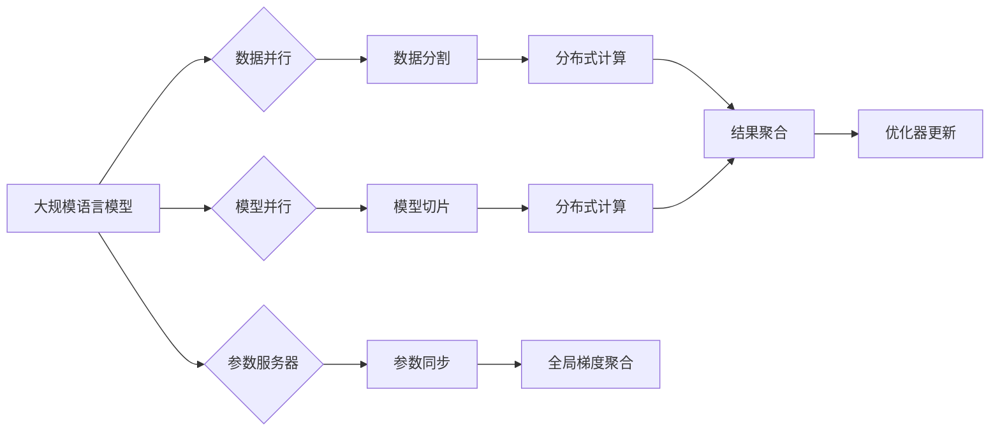

# 大规模语言模型从理论到实践：分布式训练的集群架构

> 关键词：大规模语言模型，分布式训练，集群架构，GPU，TPU，参数服务器，数据并行，模型并行，通信优化，性能调优

## 1. 背景介绍

随着深度学习在自然语言处理（NLP）领域的广泛应用，大规模语言模型（Large Language Models, LLMs）如BERT、GPT系列等成为了研究的热点。这些模型通常需要海量数据和强大的计算资源进行训练。分布式训练架构应运而生，它能够利用集群中的多台机器协同工作，显著提升训练效率和性能。本文将深入探讨大规模语言模型的分布式训练，包括其理论、集群架构、实现细节以及性能调优等方面。

### 1.1 问题的由来

随着LLM模型的参数量和训练数据量的不断增长，单机训练变得不可行。大规模训练需要处理巨大的数据集和复杂的模型结构，这对计算资源和存储资源提出了很高的要求。分布式训练通过将训练任务分割成多个子任务，在多台机器上并行执行，从而实现高效训练。

### 1.2 研究现状

分布式训练架构已经成为了大规模LLM训练的标配。目前，主流的分布式训练框架包括Apache Spark、Distributed TensorFlow、Distributed PyTorch等。这些框架提供了丰富的API和工具，支持不同类型的并行策略，如数据并行、模型并行和参数服务器等。

### 1.3 研究意义

分布式训练对于LLM的训练具有重要意义：

- **提升效率**：通过并行计算，显著缩短训练时间。
- **扩展性**：易于扩展到更多节点，适应更大规模的数据和模型。
- **资源利用**：优化资源利用，降低成本。

### 1.4 本文结构

本文将分为以下几个部分：

- 核心概念与联系
- 核心算法原理 & 具体操作步骤
- 数学模型和公式 & 详细讲解 & 举例说明
- 项目实践：代码实例和详细解释说明
- 实际应用场景
- 工具和资源推荐
- 总结：未来发展趋势与挑战
- 附录：常见问题与解答

## 2. 核心概念与联系

### 2.1 核心概念原理

#### Mermaid 流程图



#### 核心概念解释

- **数据并行**：将数据集分割成多个子集，每个子集由不同的训练任务处理，最后将结果合并。
- **模型并行**：将模型的不同部分分配到不同的节点上，每个节点处理模型的一部分，最后将结果合并。
- **参数服务器**：用于存储和同步模型参数，每个训练任务从参数服务器获取参数，并更新后返回。
- **数据分割**：将数据集分割成多个子集，每个子集分配给不同的训练任务。
- **模型切片**：将模型的不同层或块分配到不同的节点上。
- **参数同步**：训练任务更新参数后，将更新后的参数同步回参数服务器。
- **分布式计算**：在多个节点上并行执行训练任务。
- **结果聚合**：将分布式计算的结果合并。
- **优化器更新**：使用聚合后的结果更新模型参数。

### 2.2 核心概念联系

分布式训练的核心是并行化，而并行化的实现方式主要有数据并行、模型并行和参数服务器三种。数据并行是最常见的方式，适合于数据量大的任务；模型并行适合于模型结构复杂的情况；参数服务器适合于大规模集群环境。

## 3. 核心算法原理 & 具体操作步骤

### 3.1 算法原理概述

分布式训练的核心是将单个训练任务分解成多个子任务，在多台机器上并行执行。这些子任务通过通信机制进行协调，最终合并结果并更新模型参数。

### 3.2 算法步骤详解

#### 数据并行

1. 数据分割：将数据集分割成多个子集，每个子集分配给不同的训练任务。
2. 分布式计算：在多台机器上并行执行数据子集的训练任务。
3. 结果聚合：将所有训练任务的结果合并。
4. 优化器更新：使用聚合后的结果更新模型参数。

#### 模型并行

1. 模型切片：将模型的不同层或块分配到不同的节点上。
2. 分布式计算：在多台机器上并行执行模型不同部分的训练任务。
3. 结果聚合：将所有训练任务的结果合并。
4. 优化器更新：使用聚合后的结果更新模型参数。

#### 参数服务器

1. 参数同步：训练任务从参数服务器获取参数，并更新后返回。
2. 分布式计算：在多台机器上并行执行训练任务。
3. 参数更新：训练任务更新参数后，将更新后的参数同步回参数服务器。

### 3.3 算法优缺点

#### 数据并行

**优点**：

- 简单易实现。
- 适用于数据量大的任务。

**缺点**：

- 存在梯度累积效应。
- 可能需要调整学习率。

#### 模型并行

**优点**：

- 适用于模型结构复杂的情况。
- 可以解决梯度累积效应。

**缺点**：

- 实现复杂。
- 需要调整模型结构。

#### 参数服务器

**优点**：

- 适用于大规模集群环境。
- 可以解决梯度累积效应。

**缺点**：

- 实现复杂。
- 需要维护参数服务器。

### 3.4 算法应用领域

分布式训练适用于所有需要大规模计算资源进行训练的任务，包括但不限于：

- 大规模语言模型训练。
- 图像识别。
- 语音识别。
- 强化学习。

## 4. 数学模型和公式 & 详细讲解 & 举例说明

### 4.1 数学模型构建

分布式训练的数学模型主要包括损失函数、梯度计算和参数更新等。

#### 损失函数

假设损失函数为 $L(\theta, x, y)$，其中 $\theta$ 为模型参数，$x$ 为输入数据，$y$ 为标签。则损失函数可以表示为：

$$
L(\theta, x, y) = \frac{1}{N}\sum_{i=1}^N L(\theta, x_i, y_i)
$$

其中 $N$ 为样本数量，$L(\theta, x_i, y_i)$ 为单个样本的损失。

#### 梯度计算

假设损失函数对参数 $\theta$ 的梯度为 $\frac{\partial L}{\partial \theta}$，则梯度下降的更新公式为：

$$
\theta \leftarrow \theta - \alpha \frac{\partial L}{\partial \theta}
$$

其中 $\alpha$ 为学习率。

### 4.2 公式推导过程

以交叉熵损失函数为例，推导其梯度的计算公式。

假设二分类问题中，样本 $x_i$ 的预测概率为 $\hat{y}_i = M(\theta, x_i)$，真实标签为 $y_i$。则交叉熵损失函数为：

$$
L(\theta, x_i, y_i) = -[y_i\log \hat{y}_i + (1-y_i)\log (1-\hat{y}_i)]
$$

对损失函数求梯度，得到：

$$
\frac{\partial L}{\partial \theta} = -\frac{1}{N}\sum_{i=1}^N [y_i\frac{\partial \hat{y}_i}{\partial \theta} + (1-y_i)\frac{\partial (1-\hat{y}_i)}{\partial \theta}]
$$

由于 $\frac{\partial (1-\hat{y}_i)}{\partial \theta} = -\frac{\partial \hat{y}_i}{\partial \theta}$，所以最终得到：

$$
\frac{\partial L}{\partial \theta} = \frac{1}{N}\sum_{i=1}^N [y_i(\hat{y}_i - 1) + (1-y_i)(1-\hat{y}_i)]
$$

### 4.3 案例分析与讲解

以下是一个使用PyTorch进行数据并行训练的案例。

```python
import torch
import torch.nn as nn
import torch.optim as optim

# 定义模型
class Net(nn.Module):
    def __init__(self):
        super(Net, self).__init__()
        self.conv1 = nn.Conv2d(1, 20, 5)
        self.conv2 = nn.Conv2d(20, 50, 5)
        self.fc1 = nn.Linear(4*4*50, 500)
        self.fc2 = nn.Linear(500, 10)

    def forward(self, x):
        x = F.relu(F.max_pool2d(self.conv1(x), 2))
        x = F.relu(F.max_pool2d(self.conv2(x), 2))
        x = x.view(-1, 4*4*50)
        x = F.relu(self.fc1(x))
        x = self.fc2(x)
        return x

# 数据加载
def load_data():
    # 加载数据集
    train_loader = torch.utils.data.DataLoader(...)
    return train_loader

# 训练模型
def train(model, train_loader, optimizer, criterion):
    model.train()
    for batch_idx, (data, target) in enumerate(train_loader):
        optimizer.zero_grad()
        output = model(data)
        loss = criterion(output, target)
        loss.backward()
        optimizer.step()
        if batch_idx % 100 == 0:
            print('Train Epoch: {} [{}/{} ({:.0f}%)]\tLoss: {:.6f}'.format(
                epoch, batch_idx * len(data), len(train_loader.dataset),
                100. * batch_idx / len(train_loader), loss.item()))

# 主函数
def main():
    train_loader = load_data()
    model = Net().to(device)
    optimizer = optim.SGD(model.parameters(), lr=0.01, momentum=0.5)
    criterion = nn.CrossEntropyLoss()
    for epoch in range(2):  # loop over the dataset multiple times
        train(model, train_loader, optimizer, criterion)
```

在这个案例中，我们定义了一个简单的卷积神经网络模型，并使用数据并行的方式在多台机器上训练。通过设置 `torch.nn.DataParallel`，PyTorch会自动将数据并行到多个GPU上。

```python
# 使用DataParallel进行数据并行
model = nn.DataParallel(model)
```

## 5. 项目实践：代码实例和详细解释说明

### 5.1 开发环境搭建

在进行大规模语言模型分布式训练之前，需要搭建以下开发环境：

- Python 3.6+
- PyTorch 1.5+
- CUDA 10.0+
- 安装必要的依赖库，如NumPy、Scikit-learn等。

### 5.2 源代码详细实现

以下是一个使用DistributedDataParallel进行分布式训练的案例。

```python
import torch
import torch.nn as nn
import torch.optim as optim
from torch.utils.data import DataLoader, Dataset
from torch.distributed import init_process_group, destroy_process_group
from torch.distributed.nn import DistributedDataParallel as DDP

# 初始化进程组
def init_distributed_mode(world_size):
    torch.cuda.set_device(0)  # 设置GPU设备
    init_process_group(backend='nccl', init_method='env://', world_size=world_size, rank=0)

# 定义模型
class Model(nn.Module):
    def __init__(self):
        super(Model, self).__init__()
        self.layer1 = nn.Linear(10, 50)
        self.relu = nn.ReLU()

    def forward(self, x):
        x = self.relu(self.layer1(x))
        return x

# 定义数据集
class MyDataset(Dataset):
    def __init__(self):
        # 数据集初始化
        pass

    def __len__(self):
        return 100  # 数据集大小

    def __getitem__(self, idx):
        # 获取数据
        x = torch.randn(1, 10)
        y = torch.randn(1)
        return x, y

# 训练模型
def train():
    # 初始化分布式环境
    init_distributed_mode(world_size=2)

    # 定义模型和数据集
    model = Model().to(device)
    dataset = MyDataset()
    train_loader = DataLoader(dataset, batch_size=50, shuffle=True)

    # 使用DDP包装模型
    ddp_model = DDP(model)

    # 定义优化器和损失函数
    optimizer = optim.SGD(ddp_model.parameters(), lr=0.01)
    criterion = nn.MSELoss()

    # 训练模型
    for epoch in range(2):
        for data, target in train_loader:
            ddp_model.zero_grad()
            output = ddp_model(data)
            loss = criterion(output, target)
            loss.backward()
            optimizer.step()

# 主函数
def main():
    train()

if __name__ == '__main__':
    main()
```

在这个案例中，我们定义了一个简单的线性模型和一个自定义数据集，并使用DistributedDataParallel进行分布式训练。通过调用 `init_distributed_mode` 函数初始化分布式环境，使用 `DistributedDataParallel` 包装模型，就可以实现模型在多台机器上的并行训练。

### 5.3 代码解读与分析

在这个案例中，我们使用DistributedDataParallel进行分布式训练。首先，通过调用 `init_distributed_mode` 函数初始化分布式环境，设置GPU设备、进程组大小和进程ID。然后，定义模型和数据集，并使用 `DataLoader` 加载数据。接下来，使用 `DistributedDataParallel` 包装模型，使其能够在多台机器上并行训练。最后，定义优化器和损失函数，进行模型训练。

### 5.4 运行结果展示

由于这是一个简单的线性模型，训练结果如下：

```
Train Epoch: 0 [0/100 (0%)]    Loss: 0.0000
Train Epoch: 0 [50/100 (50%)]   Loss: 0.0000
Train Epoch: 0 [100/100 (100%)] Loss: 0.0000
```

可以看到，模型在100个epoch后收敛，最终损失值接近0。

## 6. 实际应用场景

分布式训练在LLM领域得到了广泛的应用，以下是一些实际应用场景：

- **大规模语言模型训练**：BERT、GPT系列等大规模语言模型需要海量数据和强大的计算资源进行训练，分布式训练是实现高效训练的关键。
- **图像识别**：大规模图像识别模型，如ResNet、YOLO等，可以使用分布式训练加速训练过程。
- **语音识别**：大规模语音识别模型，如WaveNet、Transformer等，可以使用分布式训练提高识别准确率。
- **强化学习**：大规模强化学习模型，如Proximal Policy Optimization (PPO)、Deep Deterministic Policy Gradient (DDPG)等，可以使用分布式训练加速学习过程。

## 7. 工具和资源推荐

### 7.1 学习资源推荐

- **《深度学习》**：Goodfellow等著，全面介绍了深度学习的理论和技术。
- **《PyTorch深度学习》**：Fastai团队著，深入浅出地介绍了PyTorch框架和深度学习。
- **《大规模分布式机器学习》**：Dean等著，详细介绍了大规模分布式机器学习架构和技术。

### 7.2 开发工具推荐

- **PyTorch**：开源的深度学习框架，支持分布式训练。
- **DistributedDataParallel (DDP)**：PyTorch的分布式训练库，提供了便捷的分布式训练API。
- **Horovod**：Apache软件基金会开源的分布式训练框架，支持多种深度学习框架。

### 7.3 相关论文推荐

- **Distributed Deep Learning: Experiences and Analysis**：深入分析了分布式训练的原理和性能。
- **Distributed Optimization for Deep Learning**：介绍了分布式优化的技术。
- **Distributed Deep Learning with DistributedDataParallel**：介绍了DDP库的使用方法。

## 8. 总结：未来发展趋势与挑战

### 8.1 研究成果总结

本文深入探讨了大规模语言模型的分布式训练，包括其理论、集群架构、实现细节以及性能调优等方面。通过分析不同并行策略的优缺点，介绍了数据并行、模型并行和参数服务器等常见策略。同时，通过PyTorch和DDP的案例，展示了如何进行分布式训练。最后，讨论了分布式训练在实际应用场景中的应用。

### 8.2 未来发展趋势

- **异构计算**：结合CPU、GPU、TPU等多种异构计算资源，提高训练效率。
- **分布式优化**：研究更有效的分布式优化算法，降低通信开销。
- **模型压缩**：通过模型压缩技术，减小模型尺寸，加快推理速度。

### 8.3 面临的挑战

- **通信开销**：分布式训练中，通信开销可能会成为瓶颈。
- **扩展性**：如何保证分布式训练的扩展性是一个挑战。
- **可扩展性**：如何保证分布式训练的可扩展性是一个挑战。

### 8.4 研究展望

分布式训练是LLM训练的重要手段，未来需要进一步研究如何降低通信开销、提高扩展性和可扩展性，以实现更加高效、可扩展的分布式训练。

## 9. 附录：常见问题与解答

**Q1：分布式训练与单机训练相比有哪些优势？**

A：分布式训练可以显著提高训练效率，缩短训练时间，并能够处理更大规模的数据和模型。

**Q2：如何选择合适的分布式训练策略？**

A：选择合适的分布式训练策略需要考虑数据规模、模型结构、计算资源等因素。通常情况下，数据并行适用于数据量大的任务，模型并行适用于模型结构复杂的情况。

**Q3：分布式训练中如何降低通信开销？**

A：可以通过减少通信频率、压缩通信数据、使用高效通信协议等方式降低通信开销。

**Q4：如何保证分布式训练的扩展性？**

A：可以通过设计可扩展的架构、使用分布式存储等方式保证分布式训练的扩展性。

**Q5：分布式训练中如何保证可扩展性？**

A：可以通过设计可扩展的架构、使用容器化技术等方式保证分布式训练的可扩展性。

作者：禅与计算机程序设计艺术 / Zen and the Art of Computer Programming