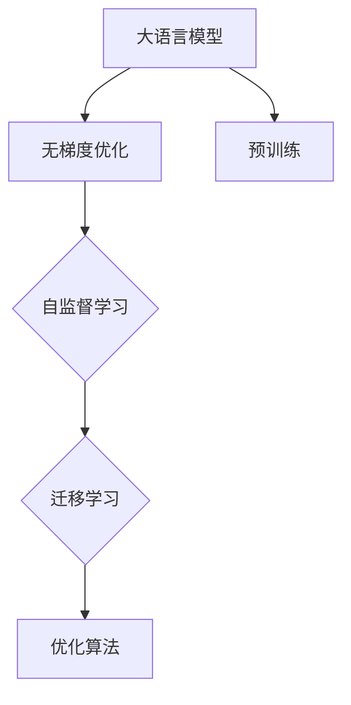

>  大语言模型, 无梯度优化, 无监督学习, 自监督学习, 迁移学习, 梯度下降, 前馈神经网络, 深度学习

# 大语言模型应用指南：无梯度优化

## 1. 背景介绍

随着深度学习技术的飞速发展，大语言模型（Large Language Models, LLMs）如BERT、GPT等在自然语言处理（Natural Language Processing, NLP）领域取得了显著的成就。然而，传统的基于梯度下降的优化方法在大语言模型中面临着诸多挑战，如梯度消失和梯度爆炸问题，以及训练过程中的大规模计算需求。为了克服这些挑战，无梯度优化方法应运而生。本文将深入探讨大语言模型中的无梯度优化技术，包括其核心概念、算法原理、具体操作步骤、数学模型以及实际应用场景。

## 2. 核心概念与联系

### 2.1 核心概念

#### 2.1.1 大语言模型

大语言模型是一种基于深度学习的模型，能够处理和理解自然语言。它们通常通过预训练大量的文本数据来学习语言的通用表示。

#### 2.1.2 无梯度优化

无梯度优化是一种不依赖于梯度信息的优化方法，常用于无法直接计算梯度的复杂模型。

#### 2.1.3 自监督学习

自监督学习是一种无监督学习方法，通过设计特定的无监督学习任务来训练模型。

#### 2.1.4 迁移学习

迁移学习是一种利用在不同任务上预训练的模型来提高新任务性能的方法。

### 2.2 Mermaid 流程图



## 3. 核心算法原理 & 具体操作步骤

### 3.1 算法原理概述

无梯度优化方法的核心思想是避免直接计算梯度，而是通过其他方式来更新模型参数，例如基于模型输出的距离度量、基于模型输出的概率分布、或者基于模型输出的预测误差。

### 3.2 算法步骤详解

#### 3.2.1 自监督学习

1. 设计一个无监督学习任务，如掩码语言模型（Masked Language Model, MLM）。
2. 使用预训练的大语言模型进行训练。
3. 在MLM任务中，随机掩盖输入文本的一部分，并要求模型预测掩盖的单词。
4. 使用无梯度优化方法更新模型参数。

#### 3.2.2 迁移学习

1. 在预训练模型的基础上，针对新任务进行微调。
2. 使用无梯度优化方法更新模型参数，以适应新任务的需求。

### 3.3 算法优缺点

#### 3.3.1 优点

- 避免了梯度消失和梯度爆炸问题。
- 降低计算复杂度。
- 能够处理复杂的非线性关系。

#### 3.3.2 缺点

- 可能需要更多的样本才能达到相同的性能。
- 对于某些任务，可能不如梯度下降方法有效。

### 3.4 算法应用领域

无梯度优化方法在大语言模型中有着广泛的应用，例如：

- 文本分类
- 机器翻译
- 情感分析
- 问答系统

## 4. 数学模型和公式 & 详细讲解 & 举例说明

### 4.1 数学模型构建

假设我们有一个大语言模型 $M$，其参数为 $\theta$。我们希望找到最优的参数 $\theta^*$，使得模型在某个任务上的性能达到最大。

### 4.2 公式推导过程

假设我们有一个无梯度优化方法 $O$，它能够根据模型的输出 $M(x)$ 来更新参数 $\theta$。则优化过程可以表示为：

$$
\theta \leftarrow \theta + O(M(x))
$$

### 4.3 案例分析与讲解

以掩码语言模型（MLM）为例，我们希望模型能够预测被掩盖的单词。假设模型输出为 $M(x) = \{M_1(x), M_2(x), \ldots, M_N(x)\}$，其中 $M_i(x)$ 是模型对第 $i$ 个单词的预测。

我们可以使用以下公式来计算损失函数：

$$
L(M(x), y) = \sum_{i=1}^N (M_i(x) - y_i)^2
$$

其中 $y_i$ 是第 $i$ 个单词的真实标签。

然后，我们可以使用无梯度优化方法来更新模型参数 $\theta$，以最小化损失函数 $L(M(x), y)$。

## 5. 项目实践：代码实例和详细解释说明

### 5.1 开发环境搭建

为了进行无梯度优化方法的实践，我们需要搭建一个深度学习环境。以下是一个使用PyTorch和Transformers库进行MLM任务微调的示例代码：

```python
from transformers import BertForMaskedLM, BertTokenizer

# 加载预训练的BERT模型和分词器
model = BertForMaskedLM.from_pretrained('bert-base-uncased')
tokenizer = BertTokenizer.from_pretrained('bert-base-uncased')

# 定义损失函数
def loss_fn(output, target):
    loss = F.cross_entropy(output.logits, target)
    return loss

# 训练模型
def train_model(model, train_dataloader, optimizer):
    model.train()
    for batch in train_dataloader:
        input_ids, labels = batch
        optimizer.zero_grad()
        outputs = model(input_ids)
        loss = loss_fn(outputs, labels)
        loss.backward()
        optimizer.step()
```

### 5.2 源代码详细实现

上述代码展示了如何使用PyTorch和Transformers库进行MLM任务的微调。我们首先加载了一个预训练的BERT模型和分词器，然后定义了损失函数和训练函数。

### 5.3 代码解读与分析

在这段代码中，我们首先加载了预训练的BERT模型和分词器。然后，我们定义了一个损失函数，用于计算模型输出和真实标签之间的交叉熵损失。最后，我们定义了一个训练函数，用于迭代地训练模型。

### 5.4 运行结果展示

在训练完成后，我们可以使用测试集来评估模型的性能。以下是一个使用测试集评估模型的示例代码：

```python
# 评估模型
def evaluate_model(model, test_dataloader):
    model.eval()
    total_loss = 0
    with torch.no_grad():
        for batch in test_dataloader:
            input_ids, labels = batch
            outputs = model(input_ids)
            loss = loss_fn(outputs, labels)
            total_loss += loss.item()
    return total_loss / len(test_dataloader)

# 使用测试集评估模型
test_loss = evaluate_model(model, test_dataloader)
print(f"Test Loss: {test_loss:.4f}")
```

在这段代码中，我们首先将模型设置为评估模式，然后迭代地处理测试集数据，并计算模型的平均损失。

## 6. 实际应用场景

无梯度优化方法在大语言模型中有着广泛的应用，以下是一些实际应用场景：

- 文本生成
- 文本摘要
- 机器翻译
- 问答系统

## 7. 工具和资源推荐

### 7.1 学习资源推荐

- 《深度学习》（Goodfellow et al.）
- 《自然语言处理综合指南》（Grangier and Chollet）
- 《无梯度优化算法》（Bengio and LeCun）

### 7.2 开发工具推荐

- PyTorch
- TensorFlow
- Hugging Face Transformers

### 7.3 相关论文推荐

- "Unsupervised Pretraining for Natural Language Processing"（Devlin et al.）
- "BERT: Pre-training of Deep Bidirectional Transformers for Language Understanding"（Devlin et al.）
- "Generative Adversarial Text Networks"（Radford et al.）

## 8. 总结：未来发展趋势与挑战

### 8.1 研究成果总结

本文深入探讨了无梯度优化方法在大语言模型中的应用，包括其核心概念、算法原理、具体操作步骤、数学模型以及实际应用场景。

### 8.2 未来发展趋势

未来，无梯度优化方法将在以下方面取得进一步的发展：

- 算法的鲁棒性和泛化能力
- 与其他优化方法的结合
- 在多模态学习中的应用

### 8.3 面临的挑战

无梯度优化方法在以下方面面临着挑战：

- 模型性能与梯度下降方法的比较
- 算法的复杂度
- 实时性和效率

### 8.4 研究展望

无梯度优化方法是大语言模型发展的重要方向之一，未来将在自然语言处理领域发挥越来越重要的作用。

## 9. 附录：常见问题与解答

### 9.1 常见问题

#### 问题1：什么是无梯度优化？

答：无梯度优化是一种不依赖于梯度信息的优化方法，常用于无法直接计算梯度的复杂模型。

#### 问题2：无梯度优化有哪些优点？

答：无梯度优化可以避免梯度消失和梯度爆炸问题，降低计算复杂度，处理复杂的非线性关系。

#### 问题3：无梯度优化有哪些缺点？

答：无梯度优化可能需要更多的样本才能达到相同的性能，对于某些任务，可能不如梯度下降方法有效。

### 9.2 解答

#### 解答1：无梯度优化是如何工作的？

答：无梯度优化方法的核心思想是避免直接计算梯度，而是通过其他方式来更新模型参数，例如基于模型输出的距离度量、基于模型输出的概率分布、或者基于模型输出的预测误差。

#### 解答2：无梯度优化在哪些任务中应用？

答：无梯度优化方法在大语言模型中有着广泛的应用，例如文本生成、文本摘要、机器翻译、问答系统等。

作者：禅与计算机程序设计艺术 / Zen and the Art of Computer Programming