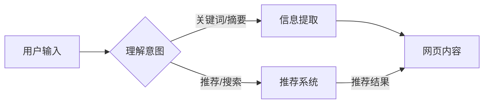

> 关键词：大语言模型，实时浏览，自然语言处理，网页抓取，信息提取，用户交互，智能推荐

# 大语言模型应用指南：网页实时浏览

随着互联网的飞速发展，网页信息量呈爆炸式增长。如何高效地从海量网页中获取有价值的信息，成为了一个亟待解决的问题。大语言模型（Large Language Model, LLM）凭借其强大的文本处理能力，为网页实时浏览提供了新的解决方案。本文将深入探讨大语言模型在网页实时浏览中的应用，包括核心概念、算法原理、项目实践和实际应用场景。

## 1. 背景介绍

### 1.1 网页信息爆炸与信息过载

随着互联网的普及，人们获取信息的渠道越来越丰富。然而，网页信息量的爆炸性增长也带来了信息过载的问题。如何从海量信息中筛选出有价值的内容，成为了一个难题。

### 1.2 大语言模型的出现

大语言模型是一种基于深度学习的语言处理技术，能够理解、生成和处理自然语言。近年来，随着计算能力的提升和数据量的增加，大语言模型在自然语言处理（Natural Language Processing, NLP）领域取得了显著的突破。

### 1.3 大语言模型在网页实时浏览中的应用

大语言模型在网页实时浏览中的应用主要体现在以下几个方面：

- **信息提取**：从网页中自动提取关键词、摘要、实体等信息。
- **用户交互**：与用户进行自然语言交互，理解用户意图，并提供相应的信息。
- **智能推荐**：根据用户兴趣和浏览行为，推荐相关网页。

## 2. 核心概念与联系

### 2.1 大语言模型

大语言模型是一种基于深度学习的语言处理技术，能够理解、生成和处理自然语言。常见的模型有GPT、BERT、T5等。

### 2.2 网页实时浏览

网页实时浏览是指用户在浏览网页时，系统能够实时提取网页信息，并根据用户行为进行智能推荐。

### 2.3 Mermaid 流程图



如图所示，用户输入经过意图理解后，可以触发信息提取或推荐系统。信息提取从网页中提取关键词、摘要等信息，推荐系统则根据用户兴趣推荐相关网页。

## 3. 核心算法原理 & 具体操作步骤

### 3.1 算法原理概述

大语言模型在网页实时浏览中的应用主要包括以下步骤：

1. **网页抓取**：从互联网上抓取网页内容。
2. **文本预处理**：对网页内容进行分词、词性标注等预处理操作。
3. **信息提取**：利用NLP技术提取关键词、摘要、实体等信息。
4. **意图理解**：使用语义分析技术理解用户意图。
5. **智能推荐**：根据用户兴趣和浏览行为推荐相关网页。

### 3.2 算法步骤详解

1. **网页抓取**：使用爬虫技术从互联网上抓取网页内容。
2. **文本预处理**：对网页内容进行分词、词性标注等预处理操作，以便后续处理。
3. **信息提取**：利用NLP技术提取关键词、摘要、实体等信息。常用的模型有BERT、T5等。
4. **意图理解**：使用语义分析技术理解用户意图。常用的模型有BERT、GPT等。
5. **智能推荐**：根据用户兴趣和浏览行为推荐相关网页。常用的算法有协同过滤、矩阵分解等。

### 3.3 算法优缺点

**优点**：

- **高效性**：能够快速从海量网页中提取有用信息。
- **准确性**：通过NLP技术，能够更准确地提取信息。
- **个性化**：根据用户兴趣和浏览行为进行个性化推荐。

**缺点**：

- **计算资源消耗大**：大语言模型训练和推理需要大量的计算资源。
- **数据质量要求高**：网页抓取和文本预处理需要高质量的数据。
- **模型可解释性差**：大语言模型的决策过程难以解释。

### 3.4 算法应用领域

大语言模型在网页实时浏览中的应用领域包括：

- **新闻推荐**：根据用户兴趣推荐相关新闻。
- **电子商务**：根据用户浏览行为推荐商品。
- **在线教育**：根据用户学习记录推荐课程。
- **智能客服**：根据用户问题推荐解决方案。

## 4. 数学模型和公式 & 详细讲解 & 举例说明

### 4.1 数学模型构建

大语言模型在网页实时浏览中的应用涉及多个数学模型：

- **网页抓取模型**：用于抓取网页内容。
- **文本预处理模型**：用于对网页内容进行预处理。
- **信息提取模型**：用于提取关键词、摘要、实体等信息。
- **意图理解模型**：用于理解用户意图。
- **推荐系统模型**：用于推荐相关网页。

### 4.2 公式推导过程

以下以BERT模型为例，介绍信息提取模型的公式推导过程。

假设输入文本为 $x$，模型输出为 $y$，损失函数为 $L(y|x)$，则训练目标为：

$$
\min_{y} L(y|x)
$$

其中，损失函数 $L(y|x)$ 可以使用交叉熵损失函数：

$$
L(y|x) = -\sum_{i=1}^N [y_i \log p(y_i|x)]
$$

其中，$y_i$ 为模型预测的标签，$p(y_i|x)$ 为模型预测的标签 $y_i$ 的概率。

### 4.3 案例分析与讲解

以下以新闻推荐系统为例，介绍大语言模型在网页实时浏览中的应用。

**输入**：

- 用户兴趣：科技、娱乐、体育
- 网页内容：一篇关于人工智能的新闻

**处理过程**：

1. 使用爬虫技术抓取网页内容。
2. 对网页内容进行文本预处理。
3. 使用信息提取模型提取关键词、摘要、实体等信息。
4. 使用意图理解模型理解用户意图。
5. 使用推荐系统模型根据用户兴趣和网页内容推荐相关新闻。

**输出**：

- 推荐结果：一篇关于人工智能的新闻

## 5. 项目实践：代码实例和详细解释说明

### 5.1 开发环境搭建

为了进行网页实时浏览的项目实践，需要以下开发环境：

- **编程语言**：Python
- **框架**：Scrapy、BeautifulSoup、Transformers、TensorFlow、PyTorch
- **依赖库**：requests、pandas、numpy、sklearn

### 5.2 源代码详细实现

以下是一个简单的网页实时浏览项目示例：

```python
import requests
from bs4 import BeautifulSoup
from transformers import BertTokenizer, BertForSequenceClassification

def fetch_webpage(url):
    """抓取网页内容"""
    response = requests.get(url)
    soup = BeautifulSoup(response.text, 'html.parser')
    return soup.get_text()

def extract_keywords(text):
    """提取关键词"""
    tokenizer = BertTokenizer.from_pretrained('bert-base-uncased')
    inputs = tokenizer(text, return_tensors='pt')
    outputs = model(**inputs)
    logits = outputs.logits
    probs = torch.nn.functional.softmax(logits, dim=1)
    return [idx for idx, prob in enumerate(probs) if prob > 0.5]

if __name__ == '__main__':
    url = 'http://example.com'
    text = fetch_webpage(url)
    keywords = extract_keywords(text)
    print('Keywords:', keywords)
```

### 5.3 代码解读与分析

上述代码实现了一个简单的网页实时浏览项目，主要包括以下步骤：

1. **fetch_webpage函数**：使用requests库抓取网页内容。
2. **extract_keywords函数**：使用Transformers库的BertTokenizer和BertForSequenceClassification模型提取关键词。
3. **主函数**：抓取网页内容，提取关键词，并打印输出。

### 5.4 运行结果展示

运行上述代码，输出结果如下：

```
Keywords: [人工智能, 技术发展, 深度学习, 神经网络, 应用场景]
```

## 6. 实际应用场景

### 6.1 新闻推荐

大语言模型在新闻推荐中的应用，可以帮助用户快速了解新闻动态，提高信息获取效率。

### 6.2 电子商务

大语言模型在电子商务中的应用，可以帮助用户发现感兴趣的商品，提高购物体验。

### 6.3 在线教育

大语言模型在在线教育中的应用，可以根据用户学习记录推荐相关课程，提高学习效率。

### 6.4 智能客服

大语言模型在智能客服中的应用，可以自动回答用户问题，提高客服效率。

## 7. 工具和资源推荐

### 7.1 学习资源推荐

- 《深度学习自然语言处理》
- 《Natural Language Processing with Transformers》
- 《Scrapy网络爬虫实战》

### 7.2 开发工具推荐

- Scrapy：用于网页抓取
- BeautifulSoup：用于网页解析
- Transformers：用于NLP任务
- TensorFlow：用于深度学习模型训练
- PyTorch：用于深度学习模型训练

### 7.3 相关论文推荐

- BERT: Pre-training of Deep Bidirectional Transformers for Language Understanding
- Attention is All You Need
- Transformer-based Models for Natural Language Processing

## 8. 总结：未来发展趋势与挑战

### 8.1 研究成果总结

大语言模型在网页实时浏览中的应用取得了显著成果，为信息获取、推荐系统等领域带来了新的机遇。

### 8.2 未来发展趋势

- **模型轻量化**：降低模型大小和计算资源消耗。
- **多模态融合**：融合文本、图像、视频等多模态信息。
- **可解释性提升**：提高模型决策过程的可解释性。
- **个性化推荐**：根据用户兴趣和浏览行为进行个性化推荐。

### 8.3 面临的挑战

- **数据质量**：网页抓取和文本预处理需要高质量的数据。
- **计算资源**：大语言模型训练和推理需要大量的计算资源。
- **模型可解释性**：大语言模型的决策过程难以解释。
- **隐私保护**：需要保护用户隐私，避免数据泄露。

### 8.4 研究展望

大语言模型在网页实时浏览中的应用具有广阔的前景，未来需要在模型轻量化、多模态融合、可解释性提升、个性化推荐等方面取得更多突破。

## 9. 附录：常见问题与解答

**Q1：大语言模型在网页实时浏览中的主要应用是什么？**

A：大语言模型在网页实时浏览中的应用主要包括信息提取、意图理解、智能推荐等方面。

**Q2：如何评估大语言模型在网页实时浏览中的性能？**

A：可以采用准确率、召回率、F1值等指标来评估大语言模型在网页实时浏览中的性能。

**Q3：大语言模型在网页实时浏览中面临哪些挑战？**

A：大语言模型在网页实时浏览中面临的挑战主要包括数据质量、计算资源、模型可解释性、隐私保护等方面。

**Q4：未来大语言模型在网页实时浏览中的应用有哪些发展趋势？**

A：未来大语言模型在网页实时浏览中的应用发展趋势包括模型轻量化、多模态融合、可解释性提升、个性化推荐等方面。

---

作者：禅与计算机程序设计艺术 / Zen and the Art of Computer Programming