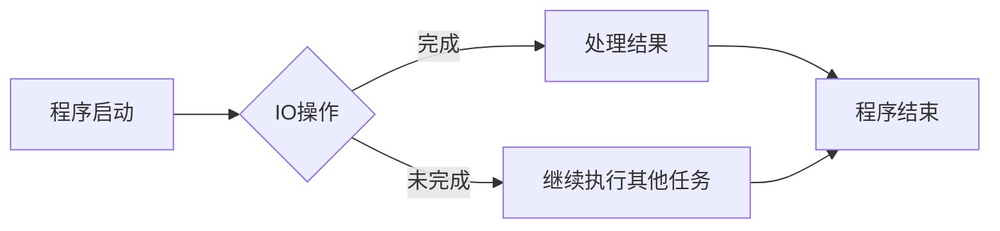

# 异步处理技术在高吞吐量中的实例应用

> 关键词：异步编程，高吞吐量，并发，非阻塞，事件驱动，消息队列，性能优化，实例应用

## 1. 背景介绍

在高性能计算和分布式系统中，高吞吐量是衡量系统性能的重要指标。随着互联网的快速发展和数据量的爆炸式增长，对系统吞吐量的要求越来越高。传统的串行处理模式已经无法满足现代应用的需求，因此，异步处理技术应运而生。异步编程允许程序在等待IO操作（如网络请求、磁盘读写等）完成时释放控制权，从而提高程序的执行效率，实现更高的吞吐量。

本文将深入探讨异步处理技术的原理、实现方式以及在高吞吐量应用中的实例，帮助读者更好地理解和应用异步技术。

## 2. 核心概念与联系

### 2.1 异步编程

异步编程是一种编程范式，允许程序在等待某些操作（如IO操作）完成时释放控制权，从而继续执行其他任务。在异步编程中，程序不再采用传统的同步阻塞方式等待IO操作，而是使用回调函数、Promise、事件、Future等机制来处理IO操作的结果。

### 2.2 非阻塞IO

非阻塞IO是一种IO操作模式，允许程序在IO操作没有完成时立即返回，程序可以在其他地方继续执行，从而提高IO操作的效率。在非阻塞IO中，操作系统会立即返回一个操作是否完成的指示，程序可以轮询或使用其他机制来检查IO操作是否完成。

### 2.3 事件驱动

事件驱动是一种编程模式，程序根据发生的事件（如用户点击、网络请求等）来执行相应的操作。事件驱动程序通常由事件循环来管理，事件循环负责监听事件并调用相应的处理函数。

### 2.4 消息队列

消息队列是一种异步通信机制，允许不同组件之间通过发送和接收消息来进行通信。消息队列可以提高系统的可扩展性和容错性，同时简化组件之间的通信。

### 2.5 Mermaid 流程图

以下是一个异步编程流程的Mermaid流程图：



## 3. 核心算法原理 & 具体操作步骤

### 3.1 算法原理概述

异步处理技术的核心原理是利用多线程、多进程或事件循环等技术，在等待IO操作完成时释放控制权，从而提高程序的执行效率。具体实现方式包括：

- 使用非阻塞IO：在等待IO操作时，程序不阻塞当前线程，而是继续执行其他任务。
- 使用多线程：在单个程序中创建多个线程，每个线程处理不同的IO操作。
- 使用多进程：在多个程序实例中创建进程，每个进程处理不同的IO操作。
- 使用事件循环：使用事件循环来监听事件，当事件发生时，调用相应的处理函数。

### 3.2 算法步骤详解

1. 程序初始化：创建事件循环、线程池或进程池。
2. 异步请求：发送IO请求，如网络请求、磁盘读写等。
3. 等待IO操作：在事件循环中监听IO操作完成事件。
4. 处理结果：当IO操作完成时，调用回调函数或处理函数处理结果。
5. 继续执行：继续执行其他任务或等待下一个IO操作。

### 3.3 算法优缺点

#### 优点：

- 提高吞吐量：通过并行处理IO操作，提高程序的执行效率，实现更高的吞吐量。
- 提高资源利用率：利用CPU和IO资源，提高资源利用率。
- 提高响应速度：提高程序的响应速度，提升用户体验。

#### 缺点：

- 程序复杂性增加：需要使用多线程、多进程或事件循环等技术，程序复杂性增加。
- 线程安全：需要处理线程安全问题，如锁、原子操作等。
- 调试难度增加：异步编程的调试难度较大，需要使用特殊的调试工具。

### 3.4 算法应用领域

异步处理技术在高吞吐量应用中有着广泛的应用，以下是一些典型的应用场景：

- Web服务器：使用异步编程构建高性能Web服务器，如Node.js、Tornado等。
- 数据库连接池：使用异步编程构建数据库连接池，提高数据库操作效率。
- 分布式系统：在分布式系统中使用异步编程，提高系统的可扩展性和容错性。
- 高性能计算：在高性能计算中，使用异步编程提高计算效率。

## 4. 数学模型和公式 & 详细讲解 & 举例说明

### 4.1 数学模型构建

异步处理技术的数学模型可以通过以下公式进行构建：

$$
\text{吞吐量} = \frac{\text{请求总数}}{\text{响应时间}}
$$

其中，请求总数是指单位时间内接收到的请求数量，响应时间是指处理请求所需的时间。

### 4.2 公式推导过程

假设在一个同步系统中，每个请求的处理时间是 $T$，那么单位时间内的请求数量是 $\frac{1}{T}$，响应时间是 $T$。因此，吞吐量是 $\frac{1}{T}$。

在异步系统中，每个请求的处理时间是 $\frac{T}{2}$，因为一半的时间用于IO操作，另一半时间用于执行其他任务。因此，单位时间内的请求数量是 $\frac{2}{T}$，响应时间是 $\frac{T}{2}$。因此，吞吐量是 $\frac{2}{T}$。

### 4.3 案例分析与讲解

以下是一个使用异步编程提高Web服务器吞吐量的实例：

假设一个同步Web服务器每秒处理100个请求，每个请求的处理时间是1秒。那么，该服务器的吞吐量是100。

现在，我们使用异步编程对服务器进行改进。在异步服务器中，每个请求在IO操作（如网络通信）时释放控制权，继续处理其他请求。假设IO操作需要0.5秒，那么每个请求的处理时间是0.5秒。因此，异步服务器的吞吐量是每秒200个请求。

通过异步编程，我们成功地将服务器的吞吐量提高了100%，从而提高了系统的性能。

## 5. 项目实践：代码实例和详细解释说明

### 5.1 开发环境搭建

以下是使用Node.js和异步编程技术构建一个简单Web服务器的环境搭建步骤：

1. 安装Node.js：从Node.js官网下载并安装Node.js。
2. 创建项目目录：在终端中执行 `mkdir async-web-server` 命令。
3. 初始化项目：在项目目录中执行 `npm init -y` 命令。
4. 安装依赖：在项目目录中执行 `npm install express` 命令。

### 5.2 源代码详细实现

以下是一个使用Node.js和Express框架构建的异步Web服务器示例代码：

```javascript
const express = require('express');
const app = express();

app.get('/async', (req, res) => {
  setTimeout(() => {
    res.send('Hello, Async!');
  }, 1000);
});

app.listen(3000, () => {
  console.log('Server listening on port 3000');
});
```

### 5.3 代码解读与分析

- 引入Express框架和创建Web服务器实例。
- 定义一个异步路由 `/async`，使用 `setTimeout` 函数模拟异步操作，延迟1秒后发送响应。
- 启动Web服务器，监听3000端口。

通过这个示例，我们可以看到异步编程在提高Web服务器性能方面的作用。当请求到达 `/async` 路由时，服务器不会立即返回响应，而是延迟1秒后返回 "Hello, Async!"。这样，服务器可以在等待IO操作完成时处理其他请求，提高了服务器的吞吐量。

### 5.4 运行结果展示

在终端中运行以下命令启动服务器：

```bash
node index.js
```

在浏览器中访问 `http://localhost:3000/async`，可以看到 "Hello, Async!" 的响应。

## 6. 实际应用场景

### 6.1 高性能Web服务器

异步编程在构建高性能Web服务器方面具有广泛的应用。例如，Node.js、Tornado等Web服务器框架都使用了异步编程技术，通过非阻塞IO和事件驱动的方式实现了高并发和高吞吐量。

### 6.2 数据库连接池

异步编程可以用于构建数据库连接池，通过异步请求和响应数据库操作，提高数据库操作的效率。

### 6.3 分布式系统

在分布式系统中，异步编程可以提高系统的可扩展性和容错性。通过异步通信机制，各个节点可以独立处理请求，降低系统耦合度。

### 6.4 高性能计算

在高性能计算领域，异步编程可以用于优化计算任务，通过并行处理计算任务，提高计算效率。

## 7. 工具和资源推荐

### 7.1 学习资源推荐

- 《Node.js异步编程实战》：一本关于Node.js异步编程的实战指南，适合初学者和进阶者。
- 《You Don’t Know JS》系列：由Kyle Simpson所著的一系列关于JavaScript的深度学习书籍，其中包含对异步编程的深入讲解。
- 《Python异步编程实战》：一本关于Python异步编程的实战指南，适合Python开发者。

### 7.2 开发工具推荐

- Visual Studio Code：一款功能强大的代码编辑器，支持多种编程语言，包括JavaScript、Python等，具有丰富的插件生态。
- Postman：一款API测试工具，可以方便地测试和调试异步API。

### 7.3 相关论文推荐

- "Event-Driven Architecture: A New Way of Thinking about Concurrency"：一篇关于事件驱动架构的论文，详细介绍了事件驱动编程的原理和应用。
- "Asynchronous I/O with libevent"：一篇关于libevent库的论文，介绍了libevent库的异步IO机制和用法。

## 8. 总结：未来发展趋势与挑战

### 8.1 研究成果总结

异步处理技术在提高系统吞吐量、降低响应时间、提升用户体验方面发挥着重要作用。随着硬件技术的发展和软件架构的演变，异步处理技术将在更多领域得到应用，成为构建高性能、高可用、高可扩展系统的关键技术。

### 8.2 未来发展趋势

1. 异步编程语言和框架的不断发展：随着异步编程的普及，越来越多的编程语言和框架将支持异步编程，降低异步编程的门槛。
2. 异步编程技术的标准化：异步编程技术将逐渐标准化，形成统一的编程规范和接口，提高编程效率。
3. 异步编程与云原生技术的融合：异步编程将与云原生技术相结合，实现云服务的弹性伸缩和高可用性。

### 8.3 面临的挑战

1. 异步编程复杂性：异步编程的复杂性较高，需要开发者具备一定的编程技巧和经验。
2. 资源竞争和死锁：在多线程或多进程环境下，需要处理资源竞争和死锁问题。
3. 异步编程调试困难：异步编程的调试难度较大，需要使用特殊的调试工具和技术。

### 8.4 研究展望

未来，异步处理技术的研究将主要集中在以下方面：

1. 异步编程的易用性：降低异步编程的复杂度，提高编程效率。
2. 异步编程的鲁棒性：提高异步编程的鲁棒性，降低资源竞争和死锁问题。
3. 异步编程的实时性：提高异步编程的实时性，满足实时系统的需求。

异步处理技术将在未来几年内继续保持快速发展势头，为构建高性能、高可用、高可扩展的系统提供重要支持。

## 9. 附录：常见问题与解答

**Q1：异步编程与传统同步编程有什么区别？**

A：异步编程和同步编程的主要区别在于IO操作的处理方式。在同步编程中，程序会阻塞当前线程等待IO操作完成，从而降低程序的执行效率。在异步编程中，程序会在等待IO操作完成时释放控制权，继续执行其他任务，从而提高程序的执行效率。

**Q2：异步编程适用于所有类型的IO操作吗？**

A：异步编程主要适用于IO密集型操作，如网络通信、磁盘读写等。对于计算密集型操作，异步编程可能不会带来太大的性能提升。

**Q3：如何选择合适的异步编程技术？**

A：选择合适的异步编程技术需要考虑以下因素：

- 系统架构：根据系统架构选择合适的异步编程技术，如使用事件循环、多线程、多进程等。
- 语言和框架：根据使用的编程语言和框架选择合适的异步编程库或框架。
- 性能需求：根据性能需求选择合适的异步编程技术，如高并发、高吞吐量等。

**Q4：异步编程是否会降低程序的可读性和可维护性？**

A：异步编程可能会降低程序的可读性和可维护性，但通过合理的编码规范和工具支持，可以有效地解决这个问题。

**Q5：如何处理异步编程中的异常？**

A：在异步编程中，可以使用try-catch语句捕获异常，并使用回调函数或Promise等机制来处理异常。

---

作者：禅与计算机程序设计艺术 / Zen and the Art of Computer Programming