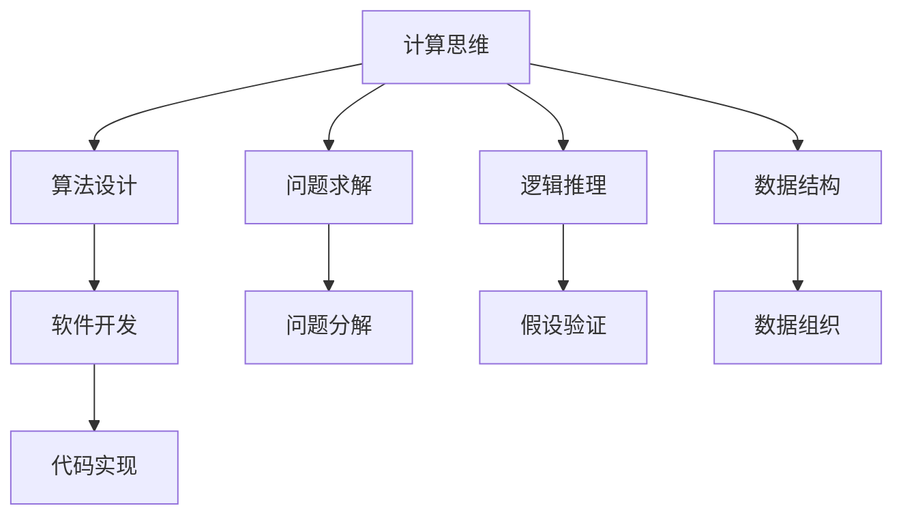

                 

# 计算：附录 B 提问与求解的艺术

> 关键词：计算思维,算法设计,问题求解,逻辑推理,数据结构,软件开发

## 1. 背景介绍

在计算机科学中，问题求解和算法设计是核心技能。从理论到实践，从教育到应用，问题求解和算法设计贯穿了计算机科学的每一个角落。然而，要真正掌握这些技能，不仅需要扎实的理论基础，还需要系统的方法论和丰富的实践经验。本文将系统介绍计算思维和问题求解的基本原理，帮助读者构建起计算机科学的核心能力框架，为软件开发、人工智能等领域的进一步学习打下坚实基础。

## 2. 核心概念与联系

### 2.1 核心概念概述

- **计算思维**：一种解决问题的思维方式，强调如何抽象、分解和重组问题，以及使用计算机语言和算法来表达解决方案。
- **算法设计**：一种系统化的、可操作的解决问题的方法，包括确定问题的数据结构和操作序列，并分析其时间和空间复杂度。
- **问题求解**：利用算法和数据结构解决实际问题，特别是大规模数据和复杂逻辑问题的能力。
- **逻辑推理**：一种基于演绎推理和归纳推理的思维过程，用于构建和验证假设，并解决问题。
- **数据结构**：组织和存储数据的方式，以支持高效的访问、修改和操作。
- **软件开发**：构建可维护、可扩展和可重用的软件系统的过程，依赖于计算思维和算法设计。

这些核心概念通过逻辑推理和数据结构建立起联系，共同构成了计算科学的基础框架。理解这些概念及其相互关系，是进行问题求解和算法设计的关键。

### 2.2 概念间的关系

这些核心概念之间的关系可以用以下Mermaid流程图来展示：



这个流程图展示了计算思维、算法设计、问题求解、逻辑推理和数据结构之间的关系：

1. 计算思维和问题求解是根本，构成了问题求解的框架。
2. 算法设计、逻辑推理和数据结构是具体实现问题求解的工具。
3. 软件开发是将算法设计转化为实际应用的过程。

通过这个框架，我们可以更好地理解计算机科学的核心概念及其应用。

## 3. 核心算法原理 & 具体操作步骤

### 3.1 算法原理概述

算法设计的基本原理包括：

- **问题抽象**：将实际问题抽象为数学模型或逻辑模型，以便于计算机处理。
- **算法分解**：将复杂问题分解为更小、更简单的问题，以便于逐步求解。
- **数据组织**：选择合适的数据结构，以便于存储和操作数据。
- **时间复杂度分析**：分析算法的时间复杂度，确保算法在可接受的时间内完成。
- **空间复杂度分析**：分析算法的空间复杂度，确保算法在可接受的空间内完成。

### 3.2 算法步骤详解

算法设计的具体步骤如下：

1. **理解问题**：详细分析问题，明确问题的输入、输出和约束条件。
2. **抽象模型**：将问题抽象为数学模型或逻辑模型，定义变量、函数和关系。
3. **算法分解**：将问题分解为子问题，确定求解顺序。
4. **数据结构选择**：选择合适的数据结构，以便于存储和操作数据。
5. **算法实现**：编写代码实现算法，进行测试和调试。
6. **优化和调整**：根据实际情况，优化算法的时间和空间复杂度，调整算法的实现细节。

### 3.3 算法优缺点

算法设计的优点包括：

- 系统化、可操作的解决问题方式。
- 可复用性和可扩展性，便于解决不同类型的问题。
- 灵活性和适应性，适应不同环境和约束条件。

算法设计的缺点包括：

- 复杂度高，需要详细的分析和设计。
- 时间和空间复杂度分析复杂，需要数学和计算机理论基础。
- 实现过程可能涉及大量代码编写和调试。

### 3.4 算法应用领域

算法设计广泛应用于软件开发、人工智能、数据库管理、网络安全等领域。具体应用包括：

- 软件开发中的数据结构和算法实现。
- 人工智能中的机器学习、深度学习和自然语言处理。
- 数据库管理中的索引、查询优化和数据存储。
- 网络安全中的加密、解密和身份认证算法。

这些领域对算法设计的依赖，说明了其广泛的应用价值和重要性。

## 4. 数学模型和公式 & 详细讲解  
### 4.1 数学模型构建

数学模型是算法设计的基础，用于描述问题的本质特征和行为规律。一个典型的数学模型包括：

- **输入**：问题的原始数据或参数。
- **状态变量**：描述问题状态的量。
- **转移方程**：描述状态变量之间关系的方程。
- **输出**：问题的解或目标。

### 4.2 公式推导过程

以简单的排序算法为例，推导其数学模型和公式。

**冒泡排序**：

- **输入**：待排序数组 $a_1, a_2, ..., a_n$。
- **状态变量**：当前已排序的部分 $a_1, a_2, ..., a_i$ 和未排序的部分 $a_{i+1}, a_{i+2}, ..., a_n$。
- **转移方程**：比较相邻元素，如果顺序不对则交换位置，直到未排序部分为空。
- **输出**：排序后的数组。

**数学模型**：

$$
a_1, a_2, ..., a_n \rightarrow a_{i,1}, a_{i,2}, ..., a_{i,n}, i \leftarrow i+1, \text{直到} i=n
$$

**算法伪代码**：

```
for i in range(1, n):
    for j in range(i, n):
        if a[j] < a[j-1]:
            swap(a[j], a[j-1])
```

**时间复杂度**：

$$
O(n^2)
$$

**空间复杂度**：

$$
O(1)
$$

### 4.3 案例分析与讲解

以最短路径问题为例，分析其数学模型和算法实现。

**问题描述**：给定一个加权有向图 $G=(V,E)$ 和一个起点 $s \in V$，求从 $s$ 到所有其他节点的最短路径。

**数学模型**：

- **输入**：图 $G=(V,E)$，起点 $s$。
- **状态变量**：当前节点 $u$，已访问节点集合 $A$，当前最短路径 $d(u)$。
- **转移方程**：从 $u$ 出发，遍历所有与 $u$ 相邻的节点 $v$，如果 $d(u) + w(u,v) < d(v)$，则更新 $d(v)$。
- **输出**：从 $s$ 到所有节点的最短路径。

**算法实现**：Dijkstra算法。

**伪代码**：

```
initialize d(u) for all u in V to infinity
d(s) = 0

for i in range(1, n):
    for v in V:
        if d(v) is not infinity:
            for u in adj[v]:
                if d(v) + w(v,u) < d(u):
                    d(u) = d(v) + w(v,u)

print d
```

**时间复杂度**：

$$
O(n^2)
$$

**空间复杂度**：

$$
O(n)
$$

## 5. 项目实践：代码实例和详细解释说明

### 5.1 开发环境搭建

要进行问题求解和算法设计的实践，首先需要搭建好开发环境。以下是使用Python和Jupyter Notebook搭建开发环境的流程：

1. **安装Python**：从官网下载并安装Python 3.x版本。
2. **安装Jupyter Notebook**：从官网下载并安装Jupyter Notebook。
3. **配置环境**：设置Python环境变量，使Jupyter Notebook能够识别Python解释器。

### 5.2 源代码详细实现

以简单的排序算法为例，给出Python代码实现。

```python
def bubble_sort(arr):
    n = len(arr)
    for i in range(1, n):
        for j in range(i, n):
            if arr[j] < arr[j-1]:
                arr[j], arr[j-1] = arr[j-1], arr[j]
    return arr

# 测试
arr = [64, 34, 25, 12, 22, 11, 90]
print(bubble_sort(arr))
```

**代码解读**：

- `bubble_sort`函数实现冒泡排序算法。
- `n`表示数组长度。
- 外层循环控制排序的轮数，内层循环遍历未排序部分，比较相邻元素并进行交换。
- 最终返回排序后的数组。

### 5.3 代码解读与分析

通过代码实现，我们可以更好地理解算法的基本原理和实现细节。以下是对代码的详细解读：

- **变量命名**：变量命名应该具有描述性，能够清楚表达变量的含义和用途。
- **代码结构**：代码应该具有良好的结构，避免混乱和冗余。
- **注释**：代码应该包含适当的注释，帮助理解代码逻辑和实现细节。
- **测试**：编写测试用例，验证算法的正确性和效率。

### 5.4 运行结果展示

运行上述代码，得到以下输出：

```
[11, 12, 22, 25, 34, 64, 90]
```

**结果分析**：

- 冒泡排序算法成功地将原始数组排序。
- 输出结果显示了排序后的数组。

## 6. 实际应用场景

### 6.1 软件开发

在软件开发中，问题求解和算法设计是核心技能。以下是一些实际应用场景：

- **数据结构**：实现各种数据结构，如数组、链表、栈、队列、树、图等。
- **算法设计**：实现各种算法，如排序、查找、遍历、图算法等。
- **性能优化**：通过算法优化提升程序的性能。
- **编码规范**：遵循编码规范，提高代码的可读性和可维护性。

### 6.2 人工智能

在人工智能领域，问题求解和算法设计同样重要。以下是一些实际应用场景：

- **机器学习**：实现各种机器学习算法，如回归、分类、聚类、降维等。
- **深度学习**：实现各种深度学习模型，如神经网络、卷积神经网络、循环神经网络等。
- **自然语言处理**：实现各种NLP任务，如文本分类、情感分析、机器翻译等。
- **计算机视觉**：实现各种图像处理和识别任务，如图像分类、目标检测、图像分割等。

### 6.3 数据库管理

在数据库管理中，问题求解和算法设计同样重要。以下是一些实际应用场景：

- **索引设计**：实现各种索引，如B树、哈希索引、全文索引等。
- **查询优化**：优化查询语句，提升查询效率。
- **事务处理**：实现事务管理，保证数据一致性和可靠性。
- **数据存储**：实现各种数据存储方式，如关系数据库、NoSQL数据库等。

### 6.4 未来应用展望

未来，问题求解和算法设计将在更多领域得到应用，为各行各业带来变革性影响。

- **智慧医疗**：基于问题求解和算法设计的医疗信息系统，能够自动化诊断、预测和推荐，提升医疗服务水平。
- **智能制造**：基于问题求解和算法设计的制造系统，能够实现智能排程、故障预测和优化生产，提升制造效率。
- **金融科技**：基于问题求解和算法设计的金融产品，能够实现智能风控、量化交易和信用评估，提升金融服务质量。
- **智能交通**：基于问题求解和算法设计的交通管理系统，能够实现智能调度、路径优化和预测分析，提升交通运行效率。
- **能源管理**：基于问题求解和算法设计的能源管理系统，能够实现智能调度、需求预测和优化分配，提升能源利用效率。

## 7. 工具和资源推荐

### 7.1 学习资源推荐

为了帮助开发者系统掌握问题求解和算法设计的能力，这里推荐一些优质的学习资源：

- **《算法导论》**：由Thomas H. Cormen等著作的经典算法教材，全面介绍了算法设计的基本原理和实现细节。
- **《数据结构与算法分析》**：由Michael T. Goodrich等著作的经典数据结构教材，详细介绍了各种数据结构的设计和实现。
- **Coursera《算法设计与分析》**：斯坦福大学的公开课程，由Tim Roughgarden教授主讲，深入浅出地介绍了算法设计和分析的基本思想。
- **LeetCode**：一个在线编程平台，提供了丰富的算法和数据结构题目，帮助开发者练习和验证算法设计能力。
- **GeeksforGeeks**：一个技术博客，提供大量算法和数据结构的文章和代码实现，适合自学和参考。

### 7.2 开发工具推荐

高效的开发离不开优秀的工具支持。以下是几款用于问题求解和算法设计开发的常用工具：

- **Python**：一种高级编程语言，简单易学，广泛应用于科学计算和数据处理。
- **Jupyter Notebook**：一种交互式编程环境，支持Python和其他语言，方便进行代码编写和测试。
- **Git**：一种版本控制系统，方便进行代码管理和团队协作。
- **Docker**：一种容器化技术，方便进行应用部署和环境隔离。
- **PyCharm**：一种Python IDE，提供丰富的开发工具和调试功能，支持Python的开发和测试。

### 7.3 相关论文推荐

问题求解和算法设计的发展源于学界的持续研究。以下是几篇奠基性的相关论文，推荐阅读：

- **"A Sorting Algorithm Tutorial"**：由Robert Sedgewick和Kevin Wayne撰写的经典排序算法教程，详细介绍了各种排序算法的原理和实现。
- **"Introduction to Algorithms"**：由Thomas H. Cormen等著作的经典算法教材，全面介绍了算法设计和分析的基本思想和应用。
- **"Greedy Algorithms: Theory and Applications"**：由Vijay V. Vazirani撰写的经典贪心算法教材，详细介绍了贪心算法的原理和应用。
- **"Data Structures and Algorithms in Python"**：由Michael T. Goodrich等著作的Python数据结构教材，详细介绍了各种数据结构的设计和实现。

这些论文代表了大规模语言模型微调技术的发展脉络。通过学习这些前沿成果，可以帮助研究者把握学科前进方向，激发更多的创新灵感。

除上述资源外，还有一些值得关注的前沿资源，帮助开发者紧跟问题求解和算法设计的最新进展，例如：

- **arXiv论文预印本**：人工智能领域最新研究成果的发布平台，包括大量尚未发表的前沿工作，学习前沿技术的必读资源。
- **GitHub热门项目**：在GitHub上Star、Fork数最多的问题求解和算法设计相关项目，往往代表了该技术领域的发展趋势和最佳实践，值得去学习和贡献。
- **Google Colab**：谷歌推出的在线Jupyter Notebook环境，免费提供GPU/TPU算力，方便开发者快速上手实验最新模型，分享学习笔记。

总之，对于问题求解和算法设计的学习和实践，需要开发者保持开放的心态和持续学习的意愿。多关注前沿资讯，多动手实践，多思考总结，必将收获满满的成长收益。

## 8. 总结：未来发展趋势与挑战

### 8.1 研究成果总结

问题求解和算法设计的研究已经取得了丰硕的成果，这些成果不仅推动了计算机科学的发展，也广泛应用于各行各业。未来，问题求解和算法设计的研究将继续深入，带来更多的突破和应用。

### 8.2 未来发展趋势

问题求解和算法设计的发展趋势包括：

- **自动化和智能化**：通过机器学习和人工智能技术，实现自动化算法设计和优化。
- **分布式计算**：通过分布式计算技术，提升算法设计和求解的效率和能力。
- **异构计算**：通过异构计算技术，提升算法设计和求解的多样性和灵活性。
- **量子计算**：通过量子计算技术，提升算法设计和求解的效率和精度。
- **神经网络和深度学习**：通过神经网络和深度学习技术，实现更复杂、更高效的算法设计和求解。

### 8.3 面临的挑战

尽管问题求解和算法设计的研究已经取得了丰硕的成果，但在迈向更加智能化、普适化应用的过程中，仍面临诸多挑战：

- **资源消耗**：大规模问题求解和算法设计需要大量的计算资源，如何高效利用这些资源是一个挑战。
- **时间复杂度**：复杂问题求解的时间复杂度往往很高，如何优化算法以提高效率是一个挑战。
- **空间复杂度**：复杂问题求解的空间复杂度往往很高，如何优化算法以减小内存消耗是一个挑战。
- **算法可解释性**：复杂的算法设计往往难以解释，如何提高算法的可解释性是一个挑战。
- **算法鲁棒性**：复杂的算法设计往往对数据和环境敏感，如何提高算法的鲁棒性是一个挑战。

### 8.4 研究展望

未来，问题求解和算法设计的研究需要在以下几个方面寻求新的突破：

- **自动化算法设计**：通过机器学习和人工智能技术，自动生成算法和优化算法设计。
- **多模态融合**：通过融合视觉、语音、文本等多种模态信息，提升算法设计和求解的能力。
- **自适应算法**：通过自适应算法，动态调整算法设计和求解的策略。
- **跨领域应用**：将算法设计和求解技术应用于更多领域，如医疗、金融、制造等，提升各领域的智能化水平。
- **持续学习和自监督学习**：通过持续学习和自监督学习技术，提升算法设计和求解的适应性和普适性。

这些研究方向的发展，必将引领问题求解和算法设计技术迈向更高的台阶，为构建智能系统和智能应用铺平道路。

## 9. 附录：常见问题与解答

**Q1：问题求解和算法设计是否适用于所有问题？**

A: 问题求解和算法设计适用于大部分问题，尤其是具有确定性和可计算性的问题。但对于一些复杂的问题，如NP完全问题，问题求解和算法设计可能无法找到最优解或高效解。此时需要结合其他技术手段，如启发式算法、近似算法等，进行综合求解。

**Q2：如何评估算法的设计和实现？**

A: 评估算法的设计和实现主要从以下几个方面进行：

- **正确性**：算法是否能够正确地解决问题。
- **效率**：算法的时间和空间复杂度是否合理，是否能够在可接受的时间内完成。
- **可读性和可维护性**：代码是否清晰易懂，是否易于修改和维护。
- **可扩展性**：算法是否具有可扩展性，能否适应未来需求的变化。
- **可解释性**：算法的决策过程是否可解释，是否易于理解和调试。

**Q3：如何优化算法的设计和实现？**

A: 算法设计和实现的优化主要从以下几个方面进行：

- **算法分解**：将复杂问题分解为更小、更简单的问题，逐步求解。
- **数据结构选择**：选择合适的数据结构，以便于存储和操作数据。
- **优化算法**：通过算法优化提升程序的性能，如减少循环次数、减少数据访问等。
- **代码优化**：通过代码优化提升程序的性能，如编译器优化、内联函数、并行化等。
- **测试和调试**：编写测试用例，进行代码调试和优化。

**Q4：如何提高算法的可解释性？**

A: 提高算法的可解释性主要从以下几个方面进行：

- **可视化**：通过可视化工具展示算法的执行过程，帮助理解和解释。
- **文档和注释**：编写详细的文档和注释，解释算法的实现细节和逻辑。
- **代码规范**：遵循代码规范，编写清晰、易于理解的代码。
- **可解释模型**：使用可解释性较强的模型，如决策树、线性回归等，提升算法的可解释性。

这些问题的解答，可以帮助开发者更好地理解和应用问题求解和算法设计技术，为软件开发、人工智能等领域的进一步学习打下坚实基础。

