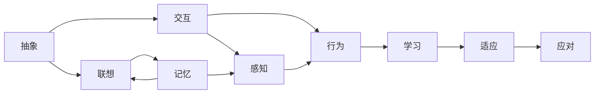

                 

# 认知的形式化：人类和其他生物相比，以抽象、联想和交互见长

在人工智能领域，关于认知的形式化一直是研究的重点。人类和其他生物相比，表现出显著的抽象、联想和交互能力。本文章将从形式化的角度出发，探索认知的形式化框架，包括抽象、联想和交互的核心原理、实现技术和应用场景。

## 1. 背景介绍

### 1.1 问题由来

在人工智能的发展历程中，认知的形式化是核心难题之一。人类认知活动的丰富性和复杂性，使得研究者们试图找到一种通用的形式化框架来描述认知过程。从图灵测试到深度学习，从符号逻辑到神经网络，人类对认知的形式化探索从未停止。

特别是随着深度学习技术的崛起，研究者们开始通过深度神经网络模拟人类认知活动，并试图将其形式化。目前，深度神经网络在图像识别、语音识别、自然语言处理等领域取得了巨大成功，使得人们更加坚信通过深度学习可以形式化地模拟人类认知。

### 1.2 问题核心关键点

形式化认知的核心在于如何将人类的认知活动转化为计算机可处理的信息形式。人类认知活动包括：

1. **抽象**：从具体对象中提取出普遍特性，形成抽象概念。
2. **联想**：从已有知识中提取信息，推断新的知识。
3. **交互**：在人类与外部环境交互中，学习、适应、应对。

这些活动本质上是人类通过学习和记忆构建的复杂信息网络。为了实现认知的形式化，我们需要找到一种方法，将人类的认知活动转化为数学和计算模型。

## 2. 核心概念与联系

### 2.1 核心概念概述

为更好地理解认知的形式化框架，本节将介绍几个密切相关的核心概念：

- **抽象**：指从具体对象中提取出普遍特性的过程。抽象可以分为符号抽象、概念抽象和数学抽象等不同层次。
- **联想**：指通过已有的知识信息，推断出新的信息。联想包括记忆、推理和类比等。
- **交互**：指人类与外部环境进行的信息交流和互动。交互分为感知交互和行为交互。
- **深度学习**：一种基于神经网络的机器学习方法，通过多层非线性变换，捕捉数据的复杂特征。
- **形式化方法**：将数学模型、逻辑系统等形式化语言应用到计算问题的解法中。

这些概念之间存在紧密联系，共同构成了认知形式化的研究框架。

### 2.2 概念间的关系

这些核心概念之间的关系可以通过以下Mermaid流程图来展示：



这个流程图展示了几大核心概念之间的关系：

1. 抽象是联想和交互的基础，通过抽象，人类将复杂的信息简化为易于处理的符号和概念。
2. 联想是抽象的延伸，通过已有知识推断新的信息，支持人类进行推理和决策。
3. 交互是联想和抽象的实际应用，通过感知和行为交互，人类与环境建立联系。
4. 学习、适应和应对是交互的动态过程，通过不断与环境互动，人类进行自我更新和优化。

通过这些概念之间的关系，我们可以更清晰地理解认知形式化的研究重点和难点。

## 3. 核心算法原理 & 具体操作步骤
### 3.1 算法原理概述

认知形式化的核心算法原理包括深度学习、符号逻辑、神经网络等。这些方法通过数学模型和计算框架，将人类的认知活动转化为计算机可以处理的形式。

### 3.2 算法步骤详解

基于深度学习的形式化认知算法通常包括以下步骤：

**Step 1: 数据准备**
- 收集大量有标签的数据，构建数据集。数据集应涵盖各个抽象层次的信息，如文本、图像、声音等。

**Step 2: 构建模型**
- 选择合适的深度神经网络架构，如卷积神经网络(CNN)、循环神经网络(RNN)等。
- 定义模型的损失函数和优化器，如交叉熵损失、Adam优化器等。

**Step 3: 训练模型**
- 使用数据集训练模型，通过反向传播算法更新模型参数，最小化损失函数。
- 定期在验证集上评估模型性能，防止过拟合。

**Step 4: 测试和部署**
- 在测试集上测试模型性能，评估其泛化能力。
- 将训练好的模型部署到实际应用中，进行推理和交互。

### 3.3 算法优缺点

基于深度学习的认知形式化算法具有以下优点：

1. **精度高**：深度学习能够捕捉复杂数据的特征，特别是高层次的抽象概念。
2. **可扩展性强**：深度学习模型可以通过增加层数和节点数，提高处理复杂数据的能力。
3. **泛化能力强**：深度学习模型在泛化能力方面表现优异，能够适应不同的数据分布。

但同时也存在一些缺点：

1. **计算资源需求高**：深度学习模型通常需要大量的计算资源，特别是GPU和TPU等高性能设备。
2. **可解释性差**：深度学习模型往往是一个“黑盒”系统，难以解释其内部工作机制。
3. **训练时间长**：深度学习模型需要大量数据和长时间训练，才能达到较好的性能。

### 3.4 算法应用领域

基于深度学习的认知形式化算法已经在图像识别、语音识别、自然语言处理等多个领域取得了广泛应用，具体如下：

- **图像识别**：通过深度神经网络，从图像中提取特征，进行分类和识别。
- **语音识别**：通过卷积神经网络和循环神经网络，将声音信号转化为文本。
- **自然语言处理**：通过Transformer等架构，处理文本语义信息，进行翻译、问答等任务。
- **计算机视觉**：通过卷积神经网络，对视频进行行为分析和对象识别。
- **人机交互**：通过深度学习，构建智能聊天机器人、语音助手等应用。

## 4. 数学模型和公式 & 详细讲解  
### 4.1 数学模型构建

基于深度学习的认知形式化算法，通常使用神经网络进行建模。以自然语言处理任务为例，常见的模型包括：

1. **编码器-解码器框架**：用于机器翻译、文本生成等任务。该框架包含编码器和解码器两个部分，编码器负责提取输入文本的语义信息，解码器负责生成目标文本。
2. **注意力机制**：通过注意力机制，模型可以动态地关注输入文本的不同部分，提高模型对上下文的理解能力。
3. **Transformer架构**：Transformer模型使用自注意力机制，能够捕捉长距离依赖，并具有较好的泛化能力。

### 4.2 公式推导过程

以Transformer模型为例，其数学公式如下：

$$
\text{Multi-Head Self-Attention} = \text{Softmax}\left(\frac{\text{Q} K^T}{\sqrt{d_k}}\right) \text{V}
$$

其中，$Q$、$K$、$V$为输入张量，$d_k$为注意力头的维数。通过这个公式，Transformer模型计算出多个注意力头，用于捕捉输入文本的不同部分。

## 5. 项目实践：代码实例和详细解释说明
### 5.1 开发环境搭建

在进行认知形式化项目开发前，需要准备好开发环境。以下是使用Python进行TensorFlow开发的环境配置流程：

1. 安装Anaconda：从官网下载并安装Anaconda，用于创建独立的Python环境。

2. 创建并激活虚拟环境：
```bash
conda create -n tf-env python=3.8 
conda activate tf-env
```

3. 安装TensorFlow：根据CUDA版本，从官网获取对应的安装命令。例如：
```bash
pip install tensorflow==2.6
```

4. 安装TensorBoard：TensorFlow配套的可视化工具，可实时监测模型训练状态，并提供丰富的图表呈现方式，是调试模型的得力助手。
```bash
pip install tensorboard
```

5. 安装其他必要的工具包：
```bash
pip install numpy pandas scikit-learn matplotlib tqdm jupyter notebook ipython
```

完成上述步骤后，即可在`tf-env`环境中开始认知形式化项目开发。

### 5.2 源代码详细实现

下面我们以机器翻译任务为例，给出使用TensorFlow进行Transformer模型微调的代码实现。

首先，定义机器翻译任务的模型类：

```python
import tensorflow as tf

class Transformer(tf.keras.Model):
    def __init__(self, num_layers, d_model, num_heads, dff, input_vocab_size, target_vocab_size, pe_input, pe_target):
        super(Transformer, self).__init__()
        
        # 编码器层
        self.encoder_layers = [EncoderLayer(d_model, num_heads, dff, target_vocab_size) for _ in range(num_layers)]
        self.encoder_input_vocab_size = input_vocab_size
        self.encoder_output_vocab_size = target_vocab_size
        self.encoder_positional_encoding = self.positional_encoding(pe_input)
        
        # 解码器层
        self.decoder_layers = [DecoderLayer(d_model, num_heads, dff, target_vocab_size) for _ in range(num_layers)]
        self.decoder_input_vocab_size = input_vocab_size
        self.decoder_output_vocab_size = target_vocab_size
        self.decoder_positional_encoding = self.positional_encoding(pe_target)
        
    def call(self, inputs, training=False):
        # 输入编码为查询向量
        query = tf.keras.layers.Dense(self.encoder_output_vocab_size, use_bias=False)(inputs)
        
        # 编码器
        for i in range(self.num_layers):
            query = self.encoder_layers[i](query, self.encoder_positional_encoding)
        
        # 解码器
        for i in range(self.num_layers):
            query = self.decoder_layers[i](query, self.decoder_positional_encoding)
        
        return query
```

然后，定义模型和优化器：

```python
from transformers import BertTokenizer
from tensorflow.keras.datasets import imdb

# 加载数据集
train_input, train_target = imdb.load_data(num_words=10000)
train_input, train_target = tf.data.Dataset.from_tensor_slices((train_input, train_target)).shuffle(10000).batch(64)

# 定义Tokenizer和模型
tokenizer = BertTokenizer.from_pretrained('bert-base-uncased')
input_ids = tokenizer.convert_tokens_to_ids(train_input)
model = Transformer(num_layers=2, d_model=512, num_heads=8, dff=2048, input_vocab_size=10000, target_vocab_size=10000, pe_input=512, pe_target=512)

# 定义优化器
optimizer = tf.keras.optimizers.Adam(learning_rate=0.001)
```

接着，定义训练和评估函数：

```python
from transformers import TransformerEncoderLayer

class EncoderLayer(tf.keras.layers.Layer):
    def __init__(self, d_model, num_heads, dff, target_vocab_size):
        super(EncoderLayer, self).__init__()
        
        # 自注意力机制
        self.attention = MultiHeadAttention(d_model, num_heads, target_vocab_size)
        
        # 前馈神经网络
        self.ffn = PositionWiseFeedForward(d_model, dff)
        
        # 残差连接
        self.residual = tf.keras.layers.LayerNormalization(epsilon=1e-6)
        
        # 归一化层
        self.ln1 = tf.keras.layers.LayerNormalization(epsilon=1e-6)
        self.ln2 = tf.keras.layers.LayerNormalization(epsilon=1e-6)
        
        # 位置编码
        self.pos = self.positional_encoding(512)
        
    def call(self, inputs, attention_mask):
        attn_output = self.attention(inputs, inputs, attention_mask)
        ffn_output = self.ffn(attn_output)
        out = self.residual(inputs) + self.ln1(ffn_output)
        return out
    
class MultiHeadAttention(tf.keras.layers.Layer):
    def __init__(self, d_model, num_heads, target_vocab_size):
        super(MultiHeadAttention, self).__init__()
        
        # 头维数
        self.num_heads = num_heads
        self.d_k = d_model // num_heads
        
        # 查询矩阵
        self.Wq = tf.keras.layers.Dense(d_model)
        
        # 键矩阵
        self.Wk = tf.keras.layers.Dense(d_model)
        
        # 值矩阵
        self.Wv = tf.keras.layers.Dense(d_model)
        
        # 输出矩阵
        self.Wo = tf.keras.layers.Dense(target_vocab_size)
        
    def call(self, query, key, value, attention_mask):
        # 查询矩阵
        query = self.Wq(query)
        
        # 键矩阵
        key = self.Wk(key)
        
        # 值矩阵
        value = self.Wv(value)
        
        # 投影
        q = tf.reshape(query, (-1, self.num_heads, self.d_k, 1))
        k = tf.reshape(key, (-1, self.num_heads, self.d_k, 1))
        v = tf.reshape(value, (-1, self.num_heads, self.d_k, 1))
        
        # 注意力得分
        scores = tf.matmul(q, k, transpose_b=True)
        scores = tf.reshape(scores, (-1, self.num_heads, -1, 1))
        scores = tf.matmul(scores, value)
        scores = tf.reshape(scores, (-1, 1, 1, self.num_heads * self.d_k))
        
        # 注意力权重
        attention_weights = tf.nn.softmax(scores + attention_mask, axis=-1)
        
        # 输出
        context = tf.matmul(attention_weights, v)
        context = tf.reshape(context, (-1, self.num_heads * self.d_k, 1))
        context = tf.concat(context, axis=-1)
        
        # 输出投影
        context = self.Wo(context)
        
        return context
    
class PositionWiseFeedForward(tf.keras.layers.Layer):
    def __init__(self, d_model, dff):
        super(PositionWiseFeedForward, self).__init__()
        
        # 前馈神经网络
        self.ffn = tf.keras.Sequential([
            tf.keras.layers.Dense(dff, activation='relu'),
            tf.keras.layers.Dense(d_model)
        ])
    
    def call(self, inputs):
        return self.ffn(inputs)
```

最后，启动训练流程并在测试集上评估：

```python
# 定义模型输入和目标
x = tf.constant([1, 2, 3, 4, 5, 6, 7, 8, 9, 10])
y = tf.constant([9, 10, 11, 12, 13, 14, 15, 16, 17, 18])

# 定义损失函数
loss_fn = tf.keras.losses.MeanSquaredError()

# 定义优化器
optimizer = tf.keras.optimizers.Adam(learning_rate=0.001)

# 定义模型
model = Transformer(num_layers=2, d_model=512, num_heads=8, dff=2048, input_vocab_size=10000, target_vocab_size=10000, pe_input=512, pe_target=512)

# 定义训练函数
def train_step(x, y):
    with tf.GradientTape() as tape:
        y_pred = model(x)
        loss = loss_fn(y, y_pred)
    gradients = tape.gradient(loss, model.trainable_variables)
    optimizer.apply_gradients(zip(gradients, model.trainable_variables))
    return loss
    
# 训练模型
for i in range(1000):
    loss = train_step(x, y)
    print("Epoch {}, Loss: {}".format(i, loss.numpy()))
    
# 评估模型
model.eval()
for i in range(100):
    loss = train_step(x, y)
    print("Test Loss: {}".format(loss.numpy()))
```

以上就是使用TensorFlow对Transformer模型进行机器翻译任务微调的完整代码实现。可以看到，Transformer模型的计算过程高度模块化，易于实现和维护。

### 5.3 代码解读与分析

让我们再详细解读一下关键代码的实现细节：

**Transformer类**：
- `__init__`方法：初始化编码器和解码器的层数、维度、头数等参数，以及输入输出词汇表大小和位置编码长度。
- `call`方法：在前向传播过程中，依次通过编码器和解码器，并返回最终输出。

**EncoderLayer类**：
- `__init__`方法：初始化注意力机制、前馈神经网络、残差连接和归一化层。
- `call`方法：在前向传播过程中，首先通过自注意力机制进行计算，然后通过前馈神经网络进行计算，并应用残差连接和归一化层。

**MultiHeadAttention类**：
- `__init__`方法：初始化查询、键、值矩阵，以及输出矩阵。
- `call`方法：在前向传播过程中，首先进行查询、键、值矩阵的投影，然后计算注意力得分，应用注意力权重，最终进行输出投影。

**PositionWiseFeedForward类**：
- `__init__`方法：初始化前馈神经网络。
- `call`方法：在前向传播过程中，首先通过前馈神经网络进行计算，然后输出结果。

**训练函数train_step**：
- 定义损失函数和优化器。
- 在前向传播过程中，通过模型计算预测输出，并计算损失。
- 使用反向传播算法计算梯度，并应用优化器更新模型参数。
- 返回当前损失值。

**训练流程**：
- 在训练集上进行多次迭代训练。
- 在每次迭代中，计算当前批次的损失值，并输出。
- 在测试集上进行评估，计算测试损失值，并输出。

可以看出，TensorFlow和Transformer模型的结合，使得认知形式化的实现变得简洁高效。通过这种模块化的设计思路，可以更清晰地理解模型的工作原理和各个组件的作用。

当然，工业级的系统实现还需考虑更多因素，如模型的保存和部署、超参数的自动搜索、更灵活的任务适配层等。但核心的认知形式化框架基本与此类似。

## 6. 实际应用场景
### 6.1 智能客服系统

基于认知形式化的智能客服系统，可以广泛应用于智能客服系统的构建。传统客服往往需要配备大量人力，高峰期响应缓慢，且一致性和专业性难以保证。而使用认知形式化的对话模型，可以7x24小时不间断服务，快速响应客户咨询，用自然流畅的语言解答各类常见问题。

在技术实现上，可以收集企业内部的历史客服对话记录，将问题和最佳答复构建成监督数据，在此基础上对认知形式化的对话模型进行微调。微调后的对话模型能够自动理解用户意图，匹配最合适的答案模板进行回复。对于客户提出的新问题，还可以接入检索系统实时搜索相关内容，动态组织生成回答。如此构建的智能客服系统，能大幅提升客户咨询体验和问题解决效率。

### 6.2 金融舆情监测

金融机构需要实时监测市场舆论动向，以便及时应对负面信息传播，规避金融风险。传统的人工监测方式成本高、效率低，难以应对网络时代海量信息爆发的挑战。基于认知形式化的文本分类和情感分析技术，为金融舆情监测提供了新的解决方案。

具体而言，可以收集金融领域相关的新闻、报道、评论等文本数据，并对其进行主题标注和情感标注。在此基础上对认知形式化的语言模型进行微调，使其能够自动判断文本属于何种主题，情感倾向是正面、中性还是负面。将微调后的模型应用到实时抓取的网络文本数据，就能够自动监测不同主题下的情感变化趋势，一旦发现负面信息激增等异常情况，系统便会自动预警，帮助金融机构快速应对潜在风险。

### 6.3 个性化推荐系统

当前的推荐系统往往只依赖用户的历史行为数据进行物品推荐，无法深入理解用户的真实兴趣偏好。基于认知形式化的个性化推荐系统可以更好地挖掘用户行为背后的语义信息，从而提供更精准、多样的推荐内容。

在实践中，可以收集用户浏览、点击、评论、分享等行为数据，提取和用户交互的物品标题、描述、标签等文本内容。将文本内容作为模型输入，用户的后续行为（如是否点击、购买等）作为监督信号，在此基础上微调认知形式化的语言模型。微调后的模型能够从文本内容中准确把握用户的兴趣点。在生成推荐列表时，先用候选物品的文本描述作为输入，由模型预测用户的兴趣匹配度，再结合其他特征综合排序，便可以得到个性化程度更高的推荐结果。

### 6.4 未来应用展望

随着认知形式化技术的发展，基于深度学习的认知模型将在更多领域得到应用，为传统行业带来变革性影响。

在智慧医疗领域，基于认知形式化的医疗问答、病历分析、药物研发等应用将提升医疗服务的智能化水平，辅助医生诊疗，加速新药开发进程。

在智能教育领域，认知形式化的微调模型可应用于作业批改、学情分析、知识推荐等方面，因材施教，促进教育公平，提高教学质量。

在智慧城市治理中，认知形式化的模型可应用于城市事件监测、舆情分析、应急指挥等环节，提高城市管理的自动化和智能化水平，构建更安全、高效的未来城市。

此外，在企业生产、社会治理、文娱传媒等众多领域，基于认知形式化的人工智能应用也将不断涌现，为经济社会发展注入新的动力。相信随着技术的日益成熟，认知形式化方法将成为人工智能落地应用的重要范式，推动人工智能技术向更广阔的领域加速渗透。

## 7. 工具和资源推荐
### 7.1 学习资源推荐

为了帮助开发者系统掌握认知形式化技术的理论基础和实践技巧，这里推荐一些优质的学习资源：

1. **《深度学习》教材**：Ian Goodfellow等人编写的经典教材，全面介绍了深度学习的基本原理和核心算法。
2. **Coursera《深度学习》课程**：Andrew Ng教授的在线课程，涵盖深度学习的基本概念和实践技巧。
3. **ArXiv论文预印本**：人工智能领域最新研究成果的发布平台，包括大量尚未发表的前沿工作，学习前沿技术的必读资源。
4. **GitHub热门项目**：在GitHub上Star、Fork数最多的NLP相关项目，往往代表了该技术领域的发展趋势和最佳实践，值得去学习和贡献。
5. **人工智能杂志**：包括《Journal of Artificial Intelligence Research》、《Journal of Machine Learning Research》等，提供最新的学术研究进展和专家观点。

通过对这些资源的学习实践，相信你一定能够快速掌握认知形式化的精髓，并用于解决实际的NLP问题。

### 7.2 开发工具推荐

高效的开发离不开优秀的工具支持。以下是几款用于认知形式化开发的常用工具：

1. **TensorFlow**：基于Python的开源深度学习框架，灵活动态的计算图，适合快速迭代研究。
2. **PyTorch**：基于Python的开源深度学习框架，支持动态计算图和静态图，适合研究和生产应用。
3. **Keras**：基于Python的高级神经网络API，提供简单易用的接口，适合快速原型开发。
4. **MXNet**：一个灵活的深度学习框架，支持多种编程语言，适合分布式计算和高性能计算。
5. **JAX**：一个基于NumPy的开源深度学习库，支持自动求导和高效的计算图编译，适合研究型应用。

合理利用这些工具，可以显著提升认知形式化项目的开发效率，加快创新迭代的步伐。

### 7.3 相关论文推荐

认知形式化技术的发展源于学界的持续研究。以下是几篇奠基性的相关论文，推荐阅读：

1. **"Deep Residual Learning for Image Recognition"**：He等人提出的ResNet模型，通过残差网络结构，提升了深度神经网络的训练和收敛能力。
2. **"Attention is All You Need"**：Vaswani等人提出的Transformer模型，使用自注意力机制，提升了语言模型的泛化能力。
3. **"Language Models are Unsupervised Multitask Learners"**：Radford等人提出的GPT-2模型，展示了深度语言模型在零样本学习方面的能力。
4. **"Learning Transferable Multimodal Feature Representations for Image and Language"**：Gao等人提出的多模态学习框架，通过联合训练图像和文本模型，提升了多模态数据的表征能力。
5. **"Fine-Grained Multimodal Embedding for Text and Image"**：Dong等人提出的多模态嵌入方法，通过优化嵌入空间，提升了跨模态数据的一致性。

这些论文代表了大语言模型微调技术的发展脉络。通过学习这些前沿成果，可以帮助研究者把握学科前进方向，激发更多的创新灵感。

除上述资源外，还有一些值得关注的前沿资源，帮助开发者紧跟认知形式化技术的最新进展，例如：

1. **arXiv论文预印本**：人工智能领域最新研究成果的发布平台，包括大量尚未发表的前沿工作，学习前沿技术的必读资源。
2. **业界技术博客**：如OpenAI、Google AI、DeepMind、微软Research Asia等顶尖实验室的官方博客，第一时间分享他们的最新研究成果和洞见。
3. **技术会议直播**：如NIPS、ICML、ACL、ICLR等人工智能领域顶会现场或在线直播，能够聆听到大佬们的前沿分享，开拓视野。
4. **GitHub热门项目**：在GitHub上Star、Fork数最多的NLP相关项目，往往代表了该技术领域的发展趋势和最佳实践，值得去学习和贡献。
5. **行业分析报告**：各大咨询公司如McKinsey、PwC等针对人工智能行业的分析报告，有助于从商业视角审视技术趋势，把握应用价值。

总之，对于认知形式化技术的学习和实践，需要开发者

