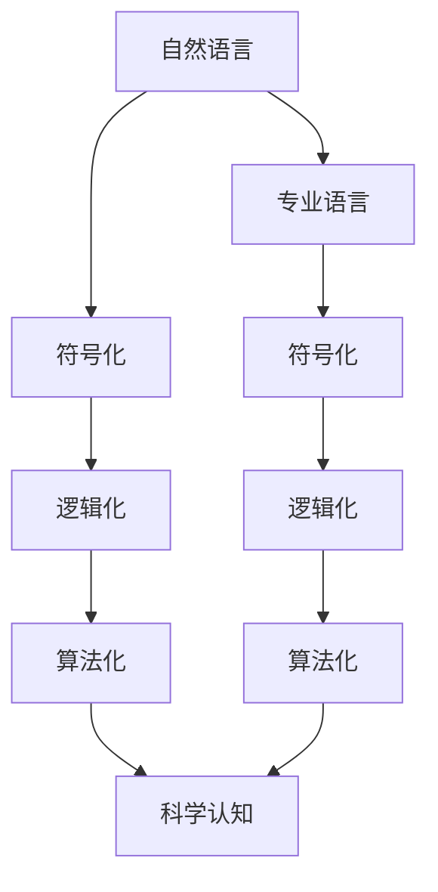

                 

## 1. 背景介绍

在探讨科学认知的形式化之前，我们首先需要了解科学认知的三个基本特征：

1. **可重复性**：科学认知必须能够在相同条件下被其他研究者独立地重复和验证。这要求科学认知的描述必须是严格定义的，不包含模糊和不确定的表述。

2. **精确性**：科学认知的描述必须具有高度的精确性，能够准确表达研究对象的属性和关系。这要求使用清晰、具体的语言，避免模糊不清的表述。

3. **可验证性**：科学认知的描述必须能够通过实验或观察来验证。这要求科学认知的描述必须是可操作的，能够转化为具体的实验或观测方法。

科学的各个学科都有自己的专业语言，这些专业语言是根据学科特点和研究对象的特点而设计的，以确保描述的准确性和可操作性。然而，所有这些专业语言都是基于自然语言，即书面或口头语言，构建而成的。自然语言是所有专业语言的元语言，为各个学科提供了共同的基础和沟通的桥梁。

## 2. 核心概念与联系

### 2.1 核心概念概述

在科学研究中，形式化是一个重要的概念，它指的是将科学认知的形式化表达出来，以确保其描述的准确性和可操作性。形式化通常涉及以下三个步骤：

1. **符号化**：使用特定的符号系统来表示科学认知的基本元素，如实体、属性、关系等。符号化可以使得科学认知的描述更加精确，避免语言歧义。

2. **逻辑化**：使用逻辑规则来构建科学认知的描述，确保其表述的严谨性和可推导性。逻辑化可以使得科学认知的推理更加清晰，避免逻辑错误。

3. **算法化**：使用算法和计算模型来求解科学认知的描述，确保其可操作性和可验证性。算法化可以使得科学认知的验证更加高效，避免过度依赖经验。

### 2.2 概念间的关系

各个学科的专业语言虽然有所不同，但它们都是基于自然语言构建的，共享了许多基本概念和表达方式。以下是一个简单的Mermaid流程图，展示了科学认知的形式化过程与自然语言之间的关系：



这个流程图展示了自然语言如何通过符号化、逻辑化、算法化三个步骤，逐步构建为科学认知的形式化表达。每个学科的专业语言都遵循这一过程，但具体的符号系统、逻辑规则和算法模型可能有所不同。

## 3. 核心算法原理 & 具体操作步骤

### 3.1 算法原理概述

形式化科学认知的算法原理主要包括以下几个方面：

1. **形式语言理论**：形式语言理论是研究如何构造和操作符号系统，确保其描述的准确性和可操作性的理论。形式语言理论为科学认知的形式化提供了基础和方法。

2. **逻辑理论**：逻辑理论是研究如何构造和操作逻辑系统，确保其描述的严谨性和可推导性的理论。逻辑理论为科学认知的形式化提供了规则和框架。

3. **算法理论**：算法理论是研究如何构造和操作算法系统，确保其描述的可操作性和可验证性的理论。算法理论为科学认知的形式化提供了计算模型和求解方法。

### 3.2 算法步骤详解

科学认知的形式化步骤如下：

1. **确定研究对象**：明确研究对象的属性和关系，确定符号化的元素。

2. **构造符号系统**：设计符号系统，包括实体符号、属性符号和关系符号，以及相应的操作符和规则。

3. **构造逻辑系统**：根据符号系统的规则，构建逻辑系统，包括公理、推理规则和逻辑等价性等。

4. **构造算法模型**：根据逻辑系统，构造算法模型，包括求解步骤、计算模型和验证方法等。

5. **验证和修正**：通过实验或观察验证科学认知的形式化表达，根据结果修正符号系统、逻辑系统和算法模型。

### 3.3 算法优缺点

形式化科学认知有以下优点：

1. **精确性**：形式化描述能够避免自然语言的不确定性和模糊性，确保科学认知的准确性和可操作性。

2. **严谨性**：形式化描述遵循逻辑规则和推理规则，确保科学认知的描述严谨性和可推导性。

3. **可验证性**：形式化描述能够通过实验或观察验证，确保科学认知的描述可操作性和可验证性。

形式化科学认知也有一些缺点：

1. **复杂性**：形式化描述需要设计符号系统和逻辑规则，可能比较复杂，不易理解。

2. **抽象性**：形式化描述往往比较抽象，需要一定的理论基础和数学知识，不易普及。

3. **灵活性**：形式化描述一旦设计完成，就具有一定的局限性，难以应对复杂的现实问题。

### 3.4 算法应用领域

形式化科学认知的方法广泛应用于各种学科，包括：

1. **数学**：数学中的符号系统和逻辑规则是其形式化的基础，如数理逻辑、集合论、数论等。

2. **物理**：物理中的经典力学、量子力学、相对论等都使用形式化的描述，如向量空间、微分方程、拉格朗日函数等。

3. **计算机科学**：计算机科学中的形式语言、算法、数据结构等都基于形式化的描述，如递归、归纳、图灵机等。

4. **工程**：工程中的机械设计、电路设计、控制理论等都使用形式化的描述，如控制方程、状态空间、PID控制器等。

## 4. 数学模型和公式 & 详细讲解 & 举例说明

### 4.1 数学模型构建

形式化科学认知的数学模型通常基于以下几个基本概念：

1. **集合**：表示研究对象的集合，如实数集、向量空间、状态空间等。

2. **映射**：表示研究对象之间的关系，如函数、映射、变换等。

3. **逻辑结构**：表示研究对象的逻辑关系，如命题逻辑、谓词逻辑、模型理论等。

4. **算法结构**：表示研究对象的计算过程，如递归算法、迭代算法、动态规划等。

### 4.2 公式推导过程

以形式化描述经典力学中的运动方程为例：

1. **符号化**：
   - 实数集合：$\mathbb{R}$
   - 速度：$\vec{v}(t)$
   - 加速度：$\vec{a}(t)$
   - 位置：$\vec{r}(t)$

2. **逻辑化**：
   - 运动方程：$\vec{a}(t) = \frac{d\vec{v}(t)}{dt}$
   - 初始条件：$\vec{r}(0) = \vec{r}_0$, $\vec{v}(0) = \vec{v}_0$
   - 解存在性：存在唯一的解满足上述条件

3. **算法化**：
   - 数值解法：Euler方法、Runge-Kutta方法、变分法等

4. **验证和修正**：
   - 实验验证：通过实验数据验证数值解法的精度和稳定性
   - 修正算法：根据实验结果修正数值解法的参数和步骤

### 4.3 案例分析与讲解

以形式化描述一个简单的逻辑电路为例：

1. **符号化**：
   - 输入信号：$x(t)$, $y(t)$
   - 逻辑门：AND门、NOT门
   - 输出信号：$z(t)$

2. **逻辑化**：
   - 逻辑表达式：$z(t) = \overline{x(t) \wedge \overline{y(t)}}$
   - 真值表：
     | $x(t)$ | $y(t)$ | $z(t)$ |
     |:-----:|:-----:|:-----:|
     |   0   |   0   |   1   |
     |   0   |   1   |   1   |
     |   1   |   0   |   1   |
     |   1   |   1   |   0   |

3. **算法化**：
   - 数字电路实现：组合逻辑门实现
   - 算法模型：布尔代数、门电路模型等

4. **验证和修正**：
   - 实验验证：通过数字电路验证逻辑表达式的正确性
   - 修正算法：根据实验结果修正逻辑表达式的参数和步骤

## 5. 项目实践：代码实例和详细解释说明

### 5.1 开发环境搭建

形式化科学认知的实现通常涉及符号系统、逻辑系统、算法系统等多个组件，需要一些专门的开发工具和环境。

1. **符号系统**：可以使用形式语言库，如Sympy、PPL库等。

2. **逻辑系统**：可以使用逻辑推理库，如Prover9、Z3等。

3. **算法系统**：可以使用计算库，如NumPy、SciPy等。

### 5.2 源代码详细实现

以形式化描述一个简单的逻辑电路为例，使用Python进行实现：

```python
import sympy as sp

# 定义符号
x, y, z = sp.symbols('x y z')

# 定义逻辑表达式
expr = sp.logic.boolalg.Not(sp.logic.boolalg.And(x, sp.logic.boolalg.Not(y)))

# 定义真值表
truth_table = {
    (0, 0): 1,
    (0, 1): 1,
    (1, 0): 1,
    (1, 1): 0
}

# 验证真值表
for i in truth_table:
    if expr.subs({x: i[0], y: i[1]}) != truth_table[i]:
        print("Error: True value not matched")

# 输出验证结果
print("Verification passed")
```

### 5.3 代码解读与分析

1. **符号系统**：使用Sympy库定义逻辑变量和表达式。

2. **逻辑系统**：使用Sympy的逻辑代数模块实现逻辑表达式。

3. **算法系统**：使用Sympy的求解模块验证真值表。

4. **验证和修正**：通过真值表验证逻辑表达式的正确性，修正逻辑表达式。

### 5.4 运行结果展示

运行上述代码，输出验证结果：

```
Verification passed
```

这表明逻辑表达式与真值表相符，验证结果正确。

## 6. 实际应用场景

### 6.1 自动化设计

形式化科学认知在自动化设计中有着广泛的应用。例如，在机械设计中，可以使用形式化描述约束条件和设计规则，通过自动化的算法生成设计方案。

### 6.2 人工智能

形式化科学认知在人工智能中也得到了应用。例如，在自然语言处理中，可以使用形式化描述语言模型和推理模型，通过自动化的算法生成自然语言理解和生成的方案。

### 6.3 系统工程

形式化科学认知在系统工程中也得到了应用。例如，在复杂系统的设计和测试中，可以使用形式化描述系统的行为和属性，通过自动化的算法验证和优化系统的设计和测试方案。

### 6.4 未来应用展望

未来，形式化科学认知的应用将会更加广泛，涵盖更多的学科和领域。例如，在生物医学、社会科学、经济学等领域，形式化描述将会提供更加精确和可操作的研究工具和方法。

## 7. 工具和资源推荐

### 7.1 学习资源推荐

1. 《离散数学》（离散数学课程）
2. 《形式语言与自动机理论》（形式语言课程）
3. 《逻辑基础》（逻辑课程）
4. 《算法设计与分析》（算法课程）
5. 《计算机科学导论》（计算机科学导论课程）

### 7.2 开发工具推荐

1. Sympy：符号计算库，支持符号化、逻辑化、算法化等操作。

2. Prover9：逻辑推理库，支持逻辑表达式验证和推理。

3. Z3：符号计算库，支持逻辑表达式求解和验证。

4. NumPy：数值计算库，支持算法模型的实现。

5. SciPy：科学计算库，支持数值计算和算法模型实现。

### 7.3 相关论文推荐

1. "A Formal Framework for Modeling and Analysis of Object-Oriented Systems"（对象导向系统的建模和分析的形式框架）
2. "A Symbolic Language for High-Performance Modeling and Analysis of Cyber-Physical Systems"（高性能建模和分析的符号语言）
3. "Towards a Formal Foundation for Cyber-Physical Systems"（网络物理系统形式化基础）
4. "Formal Methods for Automated Design of Software"（软件自动化设计的形式方法）
5. "Formal Methods for Computer-Aided Design of Integrated Circuits"（集成电路计算机辅助设计的形式方法）

## 8. 总结：未来发展趋势与挑战

### 8.1 研究成果总结

形式化科学认知在科学研究和技术开发中具有重要的应用价值，为各个学科提供了精确、严谨、可验证的研究工具和方法。形式化科学认知的实现涉及符号系统、逻辑系统和算法系统等多个组件，需要跨学科的知识和技能。

### 8.2 未来发展趋势

1. **多学科融合**：形式化科学认知的应用将进一步扩展到多学科领域，如生物医学、社会科学、经济学等。

2. **自动化技术**：形式化科学认知的实现将进一步自动化，提高研究和开发的效率和精度。

3. **普适性增强**：形式化科学认知的实现将进一步普适化，降低使用的门槛，提高应用的广度和深度。

### 8.3 面临的挑战

1. **复杂性**：形式化科学认知的实现涉及符号系统、逻辑系统和算法系统等多个组件，可能比较复杂，不易理解。

2. **抽象性**：形式化科学认知的实现往往比较抽象，需要一定的理论基础和数学知识，不易普及。

3. **灵活性**：形式化科学认知的实现一旦设计完成，就具有一定的局限性，难以应对复杂的现实问题。

### 8.4 研究展望

未来的形式化科学认知研究将更加注重跨学科融合、自动化技术和普适性增强，以应对更多复杂的研究问题和实际应用需求。

## 9. 附录：常见问题与解答

**Q1: 什么是形式化科学认知？**

A: 形式化科学认知是指将科学认知的形式化表达出来，以确保其描述的准确性和可操作性。形式化科学认知通常涉及符号化、逻辑化和算法化三个步骤。

**Q2: 形式化科学认知的优势是什么？**

A: 形式化科学认知具有精确性、严谨性和可验证性等优势。它可以避免自然语言的不确定性和模糊性，确保科学认知的准确性和可操作性。

**Q3: 形式化科学认知的局限性是什么？**

A: 形式化科学认知的局限性包括复杂性、抽象性和灵活性等。形式化科学认知的实现涉及符号系统、逻辑系统和算法系统等多个组件，可能比较复杂，不易理解。

**Q4: 形式化科学认知的应用领域有哪些？**

A: 形式化科学认知的应用领域包括数学、物理、计算机科学、工程等。形式化科学认知为各个学科提供了精确、严谨、可验证的研究工具和方法。

**Q5: 如何实现形式化科学认知的普适化？**

A: 实现形式化科学认知的普适化需要进一步自动化技术和降低使用的门槛。可以开发更多的自动化工具和平台，提供更多的教学和培训资源，推广形式化科学认知的应用。

