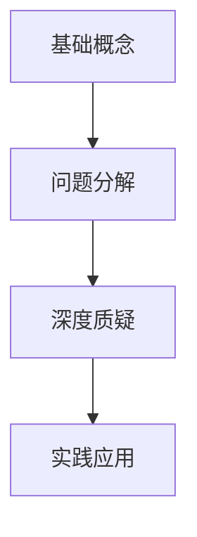
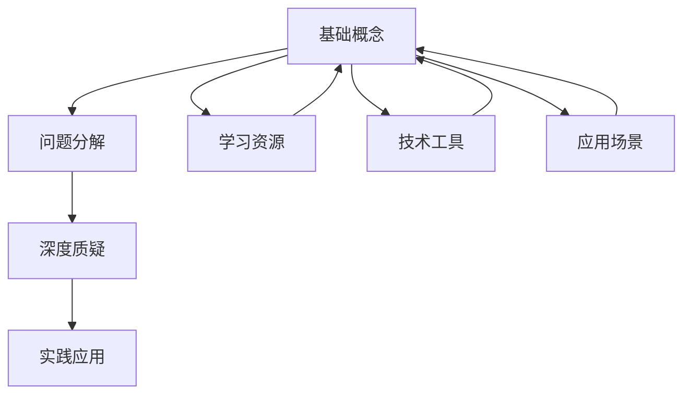

                 

# 费曼提问法激发管理者思考深度

## 1. 背景介绍

费曼提问法（Feynman Technique），由诺贝尔物理学奖得主理查德·费曼（Richard Feynman）提出，是一种通过向自己提问的方式，深入理解和掌握知识的深度学习方法。该方法通过逐步深入、分层次地提问，不断自我挑战，逐步实现从浅层次理解到深层次掌握的过程。在企业管理领域，费曼提问法同样能够激发管理者的思考深度，帮助他们全面、深入地理解和掌握各项管理和技术知识。

### 1.1 问题由来
现代企业管理面临诸多复杂和动态变化的环境，管理者需要掌握多元化的知识和技能。然而，传统的学习和培训方法往往难以应对这些挑战。管理者往往缺乏足够的深度思考时间，无法系统化、有针对性地提升自身能力。费曼提问法则提供了一种简单而有效的学习和思考方法，帮助管理者深入理解复杂问题，实现知识的内化和转化。

### 1.2 问题核心关键点
费曼提问法的核心在于通过一系列深入、有层次的提问，逐步深入理解问题。这种方法强调知识的自下而上构建，从基础概念到复杂问题，逐步深入，最终形成对问题全面而深刻的理解。

在企业管理中，费曼提问法可以帮助管理者：
- 深入理解复杂概念，如组织架构、战略规划、绩效管理等。
- 系统化掌握多项技术技能，如数据分析、项目管理、领导力培养等。
- 提升问题分析和解决能力，快速应对各种挑战和变化。

### 1.3 问题研究意义
费曼提问法在企业管理中的应用，不仅有助于管理者的个人成长，更能推动企业整体能力的提升。通过深入学习企业管理的核心知识和技能，管理者可以更好地把握企业发展的战略方向，制定科学有效的决策，提升企业竞争力。

此外，费曼提问法还具有以下重要意义：
- 提升团队学习氛围。通过引导团队成员运用费曼提问法，可以提升整体团队的思维深度和问题解决能力。
- 优化企业文化。费曼提问法鼓励不断质疑和探索，有助于形成积极向上的企业文化，促进企业创新和进步。
- 培养领导者素质。费曼提问法有助于培养管理者系统的思维方式和深度思考的能力，进而提升其领导力。

## 2. 核心概念与联系

### 2.1 核心概念概述

费曼提问法主要包括以下几个核心概念：

- 基础概念（Basic Concepts）：是学习或思考的基础，需要深入理解其定义和原理。
- 问题分解（Question Decomposition）：将复杂问题分解为多个小问题，逐步深入。
- 深度质疑（Deep Questioning）：对每个小问题进行深入质疑，从多个角度思考问题。
- 实践应用（Practical Application）：将理解到的知识应用到实际问题中，验证和巩固学习成果。

这些核心概念之间有着紧密的联系，形成一个系统的学习和思考框架。基础概念是学习的前提，问题分解和深度质疑是思考的过程，实践应用是学习的目标。

### 2.2 概念间的关系

这些核心概念之间的关系可以通过以下Mermaid流程图来展示：



这个流程图展示了一个完整的费曼提问法流程：从基础概念出发，经过问题分解和深度质疑两个环节，最终到达实践应用的目标。

### 2.3 核心概念的整体架构

最后，我们用一个综合的流程图来展示这些核心概念在大语言模型微调过程中的整体架构：



这个综合流程图展示了从基础概念到实践应用的完整流程，并指出了学习资源、技术工具和应用场景的支撑作用。通过学习资源获取基础概念，使用技术工具进行问题分解和深度质疑，最终在应用场景中实践应用，形成一个闭环的深度学习过程。

## 3. 核心算法原理 & 具体操作步骤
### 3.1 算法原理概述

费曼提问法的核心原理在于通过逐步深入的提问，激发思考，进而深入理解和掌握知识。具体来说，费曼提问法包括以下几个步骤：

1. **选择问题**：选择需要深入学习的知识点或复杂问题。
2. **初步理解**：查找相关资料，初步理解问题的基本概念和原理。
3. **问题分解**：将问题分解为多个小问题，逐步深入。
4. **深度质疑**：针对每个小问题，进行深入质疑，提出尽可能多的问题。
5. **自我解答**：尝试自己解答每个小问题，如果无法解答，记录下来。
6. **深度挖掘**：对无法解答的问题进行深入研究，查找更多资料和信息。
7. **验证和巩固**：将理解到的知识应用到实际问题中，验证和巩固学习成果。

### 3.2 算法步骤详解

以下是详细的费曼提问法步骤：

**Step 1: 选择问题**
- 确定需要深入学习的知识点或复杂问题。
- 明确学习目标，比如理解某个技术概念、掌握某个管理方法等。

**Step 2: 初步理解**
- 查找相关资料，如书籍、论文、网上课程等，初步理解问题的基本概念和原理。
- 记录下初步理解中的疑惑和难点，作为后续深入质疑的切入点。

**Step 3: 问题分解**
- 将问题分解为多个小问题，以便逐步深入。
- 每个小问题应是基础、具体且易于理解和回答的。

**Step 4: 深度质疑**
- 针对每个小问题，进行深入质疑，提出尽可能多的问题。
- 问题应从不同角度提出，涵盖基本概念、应用场景、实际案例等。

**Step 5: 自我解答**
- 尝试自己解答每个小问题，记录下解答过程和结果。
- 如果不能解答，记下问题，进行下一步深度挖掘。

**Step 6: 深度挖掘**
- 对无法解答的问题进行深入研究，查找更多资料和信息。
- 可以借助他人帮助，参加相关讨论，进行头脑风暴。

**Step 7: 验证和巩固**
- 将理解到的知识应用到实际问题中，验证和巩固学习成果。
- 通过实际应用，进一步理解问题的本质和应用细节。

### 3.3 算法优缺点

费曼提问法具有以下优点：
1. 系统化思维：通过逐步深入的提问，形成系统的思维框架，有助于全面理解和掌握知识。
2. 深入理解：通过深入质疑和深度挖掘，有助于深入理解问题，避免浅层次的理解。
3. 实践应用：通过实际应用，验证和巩固学习成果，确保知识转化为实际能力。
4. 自我驱动：通过自我提问和解答，激发学习兴趣，形成自我驱动的学习习惯。

然而，费曼提问法也存在一些局限：
1. 耗时较长：每个问题需要进行深入的研究和回答，整个过程可能会比较耗时。
2. 依赖资料：需要依赖丰富的学习资源和资料，否则无法进行深度挖掘。
3. 对基础要求高：对于基础概念不牢固的问题，可能会在初步理解环节遇到困难。

### 3.4 算法应用领域

费曼提问法在企业管理中的应用非常广泛，涉及多个领域：

- **组织架构**：通过深入理解组织架构的原理和应用，提升组织管理能力。
- **战略规划**：通过系统化思考战略目标和执行策略，制定科学有效的战略计划。
- **绩效管理**：通过深入理解绩效管理的方法和工具，提高团队绩效和员工满意度。
- **数据分析**：通过深入理解数据分析的基本概念和应用，提升数据驱动的决策能力。
- **项目管理**：通过系统化思考项目管理的各个环节，优化项目执行效率和质量。
- **领导力培养**：通过深度学习和自我提升，提升领导力，实现有效的团队管理和变革领导。

## 4. 数学模型和公式 & 详细讲解 & 举例说明
### 4.1 数学模型构建

费曼提问法主要通过提问和回答的过程来学习知识，并不涉及复杂的数学模型。然而，为了更好地说明问题的分解和深度挖掘，我们可以用一个简单的数学例子来演示。

假设我们要学习一个简单的数学概念：复数的加法。

### 4.2 公式推导过程

对于复数的加法，我们可以将其分解为以下几个小问题：

1. 复数的定义和表示方法。
2. 复数的加法运算规则。
3. 复数加法的具体计算过程。

对每个小问题进行深度质疑和解答：

**Step 1: 复数的定义和表示方法**
- 定义复数：实部和虚部之和的向量表示。
- 复数的表示：$a+bi$，其中$a$为实部，$b$为虚部。
- 深入质疑：复数的实部和虚部分别代表什么？复数的几何表示是什么？

**Step 2: 复数的加法运算规则**
- 复数的加法定义：$(a+bi)+(c+di)=(a+c)+(b+d)i$。
- 深入质疑：复数加法与实数加法有何不同？复数加法的几何意义是什么？

**Step 3: 复数加法的具体计算过程**
- 具体计算：$(1+2i)+(3+4i)=(1+3)+(2+4)i=4+6i$。
- 深入质疑：复数加法与实数加法的计算过程有何不同？如何处理虚部的加法？

### 4.3 案例分析与讲解

通过上述例子，我们可以看到，费曼提问法通过逐步分解和深入提问，帮助学生深入理解复数的加法概念和运算规则。这种学习方式不仅适用于学术研究，同样适用于企业管理中的复杂问题。

在企业管理中，例如理解公司战略规划的制定和执行，可以将问题分解为：
- 公司愿景和使命的制定方法。
- 战略目标的设定和分解策略。
- 战略执行的监控和调整机制。

通过逐步深入提问和解答，可以系统化地掌握战略规划的全过程，提升管理能力。

## 5. 项目实践：代码实例和详细解释说明
### 5.1 开发环境搭建

为了实践费曼提问法，我们需要一个支持记笔记和知识管理的工具。这里推荐使用Evernote、OneNote或Notion等笔记应用，配合Trello、Asana等项目管理工具，形成一个完整的学习和思考框架。

1. 安装Evernote或OneNote，创建笔记空间。
2. 安装Trello或Asana，创建项目和任务板。
3. 使用Evernote或OneNote记录学习和思考过程，使用Trello或Asana管理学习任务和进度。

### 5.2 源代码详细实现

以下是使用Evernote记录费曼提问法学习过程的示例代码：

```python
import pyevernote

# 连接Evernote账户
client = pyevernote.EvernoteClient('your-app-key', 'your-app-secret')
notebook = client.get_notebook_by_name('Learning Notebook')

# 添加笔记
note = pyevernote.EvernoteData.Note()
note.title = '复数加法的费曼提问法学习'
note.content = '\n'.join([
    '复数的定义和表示方法：',
    '实部和虚部之和的向量表示：$a+bi$',
    '深入质疑：复数的实部和虚部分别代表什么？复数的几何表示是什么？',
    '\n',
    '复数的加法运算规则：',
    '复数的加法定义：$(a+bi)+(c+di)=(a+c)+(b+d)i$',
    '深入质疑：复数加法与实数加法有何不同？复数加法的几何意义是什么？',
    '\n',
    '复数加法的具体计算过程：',
    '(1+2i)+(3+4i)=(1+3)+(2+4)i=4+6i',
    '深入质疑：复数加法与实数加法的计算过程有何不同？如何处理虚部的加法？'
])
notebook.add_note(note)
```

### 5.3 代码解读与分析

这段代码使用Python和pyevernote库，连接到Evernote账户，创建一个笔记，记录了复数加法的三部分内容：定义和表示方法、加法运算规则、具体计算过程。每个部分都包括初步理解、问题分解、深度质疑和自我解答等步骤。

通过这种形式化的记录，可以清晰地展示学习过程和思考路径，方便后续的复习和回顾。

### 5.4 运行结果展示

假设我们使用上述代码创建了复数加法的笔记，最终展示效果如下：


通过Evernote等工具，我们可以将费曼提问法的学习过程可视化，形成结构化的知识管理体系，方便后续的复习和应用。

## 6. 实际应用场景
### 6.1 智能客服系统

在智能客服系统中，费曼提问法可以帮助客服团队系统化地掌握客服技能，提升服务质量。

具体应用步骤如下：
1. 分解客服问题：将复杂的客服问题分解为多个小问题，如用户意图识别、问题分类、知识库查询等。
2. 深入质疑：针对每个小问题，进行深度质疑，如用户意图识别的准确率、问题分类的标准、知识库的更新频率等。
3. 自我解答：客服人员通过在线学习、内部培训等方式，自我解答每个小问题。
4. 实践应用：将学到的知识应用到实际客服场景中，通过反馈和监控，不断优化服务质量。

### 6.2 金融舆情监测

在金融舆情监测中，费曼提问法可以帮助金融分析师系统化地理解舆情变化，做出科学的投资决策。

具体应用步骤如下：
1. 分解舆情问题：将舆情变化分解为市场情绪、舆情来源、舆情传播路径等小问题。
2. 深入质疑：针对每个小问题，进行深度质疑，如市场情绪的衡量标准、舆情来源的可靠性、舆情传播路径的影响因素等。
3. 自我解答：通过分析历史数据、市场报告、社交媒体等资料，自我解答每个小问题。
4. 实践应用：将理解到的知识应用到投资决策中，通过实时监测和调整，提升投资绩效。

### 6.3 个性化推荐系统

在个性化推荐系统中，费曼提问法可以帮助推荐团队系统化地掌握推荐算法，提升推荐效果。

具体应用步骤如下：
1. 分解推荐问题：将推荐算法分解为用户画像、物品特征、推荐模型等小问题。
2. 深入质疑：针对每个小问题，进行深度质疑，如用户画像的维度、物品特征的选取、推荐模型的优缺点等。
3. 自我解答：通过阅读文献、实验验证、社区交流等方式，自我解答每个小问题。
4. 实践应用：将学到的知识应用到实际推荐系统中，通过A/B测试、用户反馈等方式，不断优化推荐效果。

### 6.4 未来应用展望

随着企业管理复杂度的增加，费曼提问法将在更多场景中得到应用，帮助管理者系统化地掌握复杂问题，提升整体管理能力。

在智慧医疗领域，费曼提问法可以帮助医疗团队系统化地理解疾病机理、治疗方案等复杂问题，提升医疗服务质量。

在智能教育领域，费曼提问法可以帮助教育工作者系统化地掌握教学方法、学生评估等复杂问题，提升教育效果。

在智慧城市治理中，费曼提问法可以帮助城市管理者系统化地理解城市发展战略、应急管理等复杂问题，提升城市管理水平。

## 7. 工具和资源推荐
### 7.1 学习资源推荐

为了帮助企业管理者系统掌握费曼提问法，这里推荐一些优质的学习资源：

1. 《费曼学习法》：由美籍华人物理学家郭涛编写的书籍，详细介绍了费曼学习法的基本原理和应用方法。
2. Coursera《学习如何学习》课程：由加州大学圣地亚哥分校开设的在线课程，深入讲解了费曼学习法的思想和实践技巧。
3. TED Talk《The Art of Learning》：著名国际象棋世界冠军Josh Waitzkin的演讲，分享了他如何运用费曼学习法，在多个领域取得成功。
4. Evernote官方文档：详细介绍了Evernote的使用方法，帮助企业管理者高效记录和管理学习笔记。
5. Notion官方文档：介绍了Notion作为知识管理工具的各项功能和使用方法，帮助企业管理者构建知识管理体系。

通过对这些资源的学习实践，相信管理者能够更好地掌握费曼提问法，并将其应用到实际工作中，提升自身的管理和技术能力。

### 7.2 开发工具推荐

为了高效实践费曼提问法，推荐使用以下工具：

1. Evernote：功能强大的笔记应用，支持文本、图片、音频等多种类型的记录和管理。
2. OneNote：微软推出的笔记应用，与Office套件深度集成，支持多人协作和分享。
3. Notion：支持文档、数据库、任务管理等多种功能的知识管理工具，适合团队协作和知识共享。
4. Trello：项目管理工具，支持看板、列表、卡片等多种视图，方便任务管理和进度跟踪。
5. Asana：项目管理工具，支持任务分配、进度追踪、团队协作等功能，适合复杂项目的管理。

合理利用这些工具，可以显著提升费曼提问法的实践效率，帮助管理者系统化地掌握复杂问题，提升整体管理能力。

### 7.3 相关论文推荐

费曼提问法作为学习方法的经典理论，其研究成果被广泛应用于教育和心理学等多个领域。以下是几篇重要的相关论文，推荐阅读：

1. "The Feynman Technique"：由Jerry Liu撰写的博客文章，详细介绍了费曼学习法的应用案例和实践技巧。
2. "The Feynman Technique Explained"：由Patrick Grant撰写的博客文章，深入讲解了费曼学习法的基本原理和操作步骤。
3. "How to Learn Anything"：由Annie Ebenhard撰写的博客文章，探讨了费曼学习法在各个领域的实际应用。
4. "The Feynman Technique for Software Development"：由John Williamson撰写的博客文章，分享了费曼学习法在软件开发中的应用和实践技巧。
5. "Feynman Technique in Education"：由Glen Engle撰写的工作论文，研究了费曼学习法在教育领域的应用效果。

这些论文代表了费曼学习法在不同领域的最新研究成果，帮助企业管理者深入理解和应用该方法，提升自身和团队的学习能力。

除上述资源外，还有一些值得关注的前沿资源，帮助管理者紧跟费曼学习法的研究进展，例如：

1. arXiv论文预印本：人工智能领域最新研究成果的发布平台，包括大量尚未发表的前沿工作，学习前沿技术的必读资源。
2. 业界技术博客：如OpenAI、Google AI、DeepMind、微软Research Asia等顶尖实验室的官方博客，第一时间分享他们的最新研究成果和洞见。
3. 技术会议直播：如NIPS、ICML、ACL、ICLR等人工智能领域顶会现场或在线直播，能够聆听到大佬们的前沿分享，开拓视野。
4. GitHub热门项目：在GitHub上Star、Fork数最多的学习相关项目，往往代表了该技术领域的发展趋势和最佳实践，值得去学习和贡献。
5. 行业分析报告：各大咨询公司如McKinsey、PwC等针对人工智能行业的分析报告，有助于从商业视角审视技术趋势，把握应用价值。

总之，对于费曼学习法的研究和应用，需要管理者保持开放的心态和持续学习的意愿。多关注前沿资讯，多动手实践，多思考总结，必将收获满满的成长收益。

## 8. 总结：未来发展趋势与挑战
### 8.1 总结

本文对费曼提问法进行了全面系统的介绍。首先阐述了费曼提问法的学习背景和意义，明确了其在企业管理中的应用价值。其次，从原理到实践，详细讲解了费曼提问法的各个步骤，给出了具体的实践案例和代码实例。同时，本文还探讨了费曼提问法在多个行业领域的应用前景，展示了其在知识管理和学习提升中的广泛应用。

通过本文的系统梳理，可以看到，费曼提问法是一种简单而有效的学习方法和思考工具，在企业管理中的应用前景广阔，能够帮助管理者系统化地掌握复杂问题，提升整体管理能力。

### 8.2 未来发展趋势

展望未来，费曼提问法将在企业管理中的应用持续扩展和深化，呈现以下几个发展趋势：

1. 系统化管理：费曼提问法将被更多地应用于项目管理、团队协作、绩效管理等企业管理领域，形成系统化的管理思路和方法。
2. 多维度应用：费曼提问法不仅应用于知识管理，还将更多地应用于创新思维、领导力培养等管理能力提升的各个维度。
3. 技术融合：费曼提问法将与大数据、人工智能等技术深度融合，形成更加智能化的学习和管理方法。
4. 全球化推广：随着企业全球化布局的推进，费曼提问法将在不同国家和地区的企业中得到广泛应用，促进全球知识共享和交流。
5. 跨领域应用：费曼提问法将拓展到更多领域，如医疗、教育、金融等，形成跨领域的学习和应用模式。

### 8.3 面临的挑战

尽管费曼提问法在企业管理中的应用前景广阔，但在实际应用中也面临诸多挑战：

1. 学习时间成本高：费曼提问法需要管理者投入大量时间和精力进行深入学习，可能会影响日常工作。
2. 知识管理复杂：需要建立一套系统化的知识管理体系，以支持费曼提问法的应用。
3. 团队协作难度大：需要团队成员配合使用同一种知识管理工具，否则无法实现有效的协作。
4. 工具依赖性强：依赖于Evernote、Notion等工具，需要定期更新和学习。
5. 持续改进困难：需要管理者持续改进和优化学习方法和工具，才能适应不断变化的知识管理需求。

### 8.4 研究展望

面对费曼提问法应用中的挑战，未来的研究需要在以下几个方面寻求新的突破：

1. 自动化工具开发：开发更加智能化的知识管理工具，自动记录和管理学习笔记，减轻管理者的负担。
2. 多平台支持：开发跨平台、多设备的知识管理应用，方便管理者随时随地进行学习。
3. 社区协作系统：建立在线社区和协作平台，方便管理者分享和交流学习经验和成果。
4. 个性化学习路径：根据管理者的知识背景和兴趣爱好，推荐个性化的学习路径和资源。
5. 实时反馈机制：通过智能化的反馈系统，实时监控和评估管理者的学习效果，提供个性化的改进建议。

这些研究方向将进一步推动费曼提问法在企业管理中的应用，提升管理者的学习能力和管理水平，帮助企业更好地应对复杂多变的市场环境。

## 9. 附录：常见问题与解答

**Q1：费曼提问法是否只适用于学术研究？**

A: 费曼提问法不仅适用于学术研究，同样适用于企业管理中的复杂问题解决。通过系统化、有层次的提问和回答，可以帮助管理者全面、深入地理解问题，提升整体管理能力。

**Q2：费曼提问法是否需要大量时间投入？**

A: 费曼提问法确实需要投入大量时间进行深入学习，但这种投入是值得的。通过系统化的学习过程，管理者可以更深入地掌握复杂问题，提升整体管理能力。

**Q3：费曼提问法如何应用于团队管理？**

A: 费曼提问法可以应用于团队管理，帮助团队成员系统化地掌握管理技能，提升团队的整体能力。具体应用步骤如下：
1. 分解管理问题：将复杂的管理问题分解为多个小问题，如团队协作、绩效评估、冲突解决等。
2. 深入质疑：针对每个小问题，进行深度质疑，如团队协作的效率问题、绩效评估的标准、冲突解决的方法等。
3. 自我解答：团队成员通过内部培训、阅读文献等方式，自我解答每个小问题。
4. 实践应用：将学到的知识应用到实际管理中，通过反馈和监控，不断优化管理效果。

**Q4：费曼提问法是否需要大量资源支持？**

A: 费曼提问法的应用需要一定的学习资源和工具支持，如Evernote、Notion等知识管理工具，Trello、Asana等项目管理工具。合理利用这些工具，可以显著提升费曼提问法的实践效率。

**Q5：费曼提问法在实际应用中有哪些困难？**

A: 费曼提问法在实际应用中可能会遇到以下困难：
1. 知识管理复杂：需要建立一套系统化的知识管理体系，以支持费曼提问法的应用。
2. 团队协作难度大：需要团队成员配合使用同一种知识管理工具，否则无法实现有效的协作。
3. 工具依赖性强：依赖于Evernote、Notion等工具，需要定期更新和学习。
4. 持续改进困难：需要管理者持续改进和优化学习方法和工具，才能适应不断变化的知识管理需求。

通过合理规划和管理，可以有效克服这些困难，实现费曼提问法的有效应用。

---

作者：禅与计算机程序设计艺术 / Zen and the Art of Computer Programming

