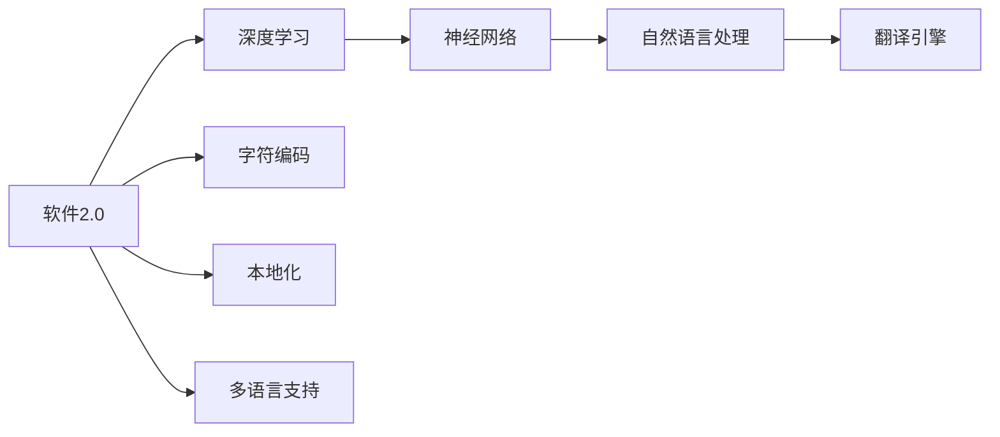

                 

# 软件2.0的多语言支持与国际化

> 关键词：软件2.0, 多语言支持, 国际化(i18n), 自然语言处理(NLP), 翻译引擎, 语言模型, 深度学习, 神经网络, 字符编码

## 1. 背景介绍

### 1.1 问题由来

随着互联网和全球化的不断深入，跨语言、跨文化的交流变得越来越频繁，软件应用需要支持全球多语言用户，以满足多样化的市场需求。软件2.0（Software 2.0）理念的提出，旨在构建基于软件2.0的智能软件系统，以实现自动化、智能化、全球化的软件开发和应用。

### 1.2 问题核心关键点

软件2.0的多语言支持与国际化是实现全球化应用的核心需求之一。通过将软件应用适配为多语言环境，软件可以覆盖全球用户，满足不同语言和文化背景用户的需求。但这一过程涉及到多语言文本处理、字符编码转换、本地化适配等多个复杂问题，需要深入理解和有效解决。

### 1.3 问题研究意义

软件2.0的多语言支持与国际化不仅能够拓展软件应用的全球覆盖面，还能够在减少成本、提升用户体验、促进国际交流等方面带来显著优势。研究多语言支持与国际化的方法和工具，对于构建具有全球竞争力、满足用户多样化需求的软件系统，具有重要意义。

## 2. 核心概念与联系

### 2.1 核心概念概述

1. **软件2.0**：一种以智能、自动化为核心的软件开发理念，通过使用先进的计算技术和算法，使软件系统具备自适应、自学习、自优化等能力。

2. **多语言支持**：软件系统能够处理多种语言文本，并在不同语言环境下提供相同的用户体验。

3. **国际化（i18n）**：指软件系统的设计、开发、测试和部署过程中，确保系统能够支持多种语言和文化环境。

4. **本地化（l10n）**：指软件系统根据不同的语言和文化环境，进行语言资源、界面设计等方面的定制化调整。

5. **自然语言处理（NLP）**：研究如何让计算机理解和处理人类语言的技术，包括文本分析、机器翻译、情感分析等。

6. **翻译引擎**：用于将一种语言的文本自动翻译成另一种语言的系统，是实现多语言支持的核心技术之一。

7. **语言模型**：用于描述语言中词序列的概率分布模型，常用于机器翻译和文本生成等任务。

8. **深度学习（DL）**：一种基于神经网络的机器学习方法，能够从大规模数据中学习复杂的特征表示。

9. **神经网络**：一种模拟人脑神经元网络的计算模型，常用于图像识别、语音识别等任务。

10. **字符编码**：用于将不同语言的字符映射到数字表示的标准，以便计算机存储和处理。

### 2.2 核心概念间的联系

软件2.0的多语言支持与国际化涉及到多个核心概念的紧密联系。其中，软件2.0提供的技术支撑，如深度学习和神经网络，为多语言文本处理和翻译提供了基础。而自然语言处理和翻译引擎的应用，使得软件能够理解并翻译多种语言，实现多语言支持。字符编码标准和本地化适配，则确保了软件在多种语言环境下的正确运行和良好的用户体验。

这些概念间的联系可以用以下Mermaid流程图表示：



该流程图展示了从软件2.0到多语言支持的整个技术链条，其中深度学习和神经网络是基础，自然语言处理和翻译引擎是中枢，字符编码和本地化是实现工具，最终实现多语言支持。

## 3. 核心算法原理 & 具体操作步骤
### 3.1 算法原理概述

软件2.0的多语言支持与国际化算法基于深度学习技术，通过构建语言模型和翻译引擎，实现对多种语言文本的自动翻译和处理。其核心算法包括：

1. **字符编码转换**：将不同语言的字符映射到统一的编码格式，如UTF-8。

2. **语言模型训练**：使用大规模双语语料库，训练语言模型，用于文本的自动翻译和生成。

3. **机器翻译**：使用翻译引擎，将源语言文本自动翻译成目标语言文本。

4. **本地化适配**：根据不同语言和文化环境，调整软件界面和文本内容，使其适应本地用户的需求。

### 3.2 算法步骤详解

1. **字符编码转换**

   - 收集和整理源语言和目标语言的字符集。
   - 使用字符编码映射表，将源语言字符转换为目标语言字符。

2. **语言模型训练**

   - 准备双语语料库，包含源语言和目标语言的文本对。
   - 使用神经网络模型，如RNN、LSTM、Transformer等，训练语言模型。
   - 在训练过程中，使用交叉熵损失函数，最小化预测文本与真实文本之间的差异。

3. **机器翻译**

   - 将源语言文本输入到训练好的翻译引擎中。
   - 使用神经网络模型，如序列到序列（Seq2Seq）模型，将源语言文本转换为目标语言文本。
   - 在翻译过程中，使用BLEU、ROUGE等评估指标，评估翻译质量。

4. **本地化适配**

   - 分析目标语言和文化背景，调整软件界面和文本内容。
   - 使用本地化工具，如i18n工具包，实现文本的本地化适配。
   - 测试本地化后的软件，确保其在不同语言环境下的正确性和可用性。

### 3.3 算法优缺点

**优点：**

- **自动化程度高**：通过深度学习技术，实现文本的自动翻译和处理，大大降低了人工翻译的劳动强度。
- **通用性强**：构建的语言模型和翻译引擎可以应用于多种语言对，具有广泛的应用范围。
- **可扩展性强**：随着更多双语语料库的积累，可以不断提升翻译质量和模型的泛化能力。

**缺点：**

- **数据需求大**：需要大量双语语料库来训练语言模型和翻译引擎，获取高质量数据成本较高。
- **模型训练复杂**：深度学习模型训练过程复杂，需要大量计算资源和专业技能。
- **翻译质量受限**：尽管技术先进，但在处理俚语、方言等复杂语言现象时，翻译质量仍可能受限。

### 3.4 算法应用领域

软件2.0的多语言支持与国际化算法在多个领域得到广泛应用，包括但不限于：

- **电商平台**：实现多语言搜索、多语言购物车、多语言客户支持等功能，满足全球用户的购物需求。
- **社交媒体**：提供多语言帖子、评论和用户界面，支持全球用户的交流和互动。
- **在线教育**：提供多语言课程、教材和平台支持，满足不同语言和文化背景的学习者需求。
- **企业办公**：实现多语言文档处理、邮件翻译、跨语言会议等功能，提高企业的国际化运营效率。

## 4. 数学模型和公式 & 详细讲解 & 举例说明

### 4.1 数学模型构建

语言模型的数学模型可以表示为：

$$
P(x_1, x_2, \ldots, x_n) = \prod_{i=1}^{n} P(x_i | x_1, x_2, \ldots, x_{i-1})
$$

其中，$x_1, x_2, \ldots, x_n$ 表示文本中连续的词语，$P(x_i | x_1, x_2, \ldots, x_{i-1})$ 表示给定前 $i-1$ 个词语条件下，第 $i$ 个词语的条件概率。

### 4.2 公式推导过程

以Transformer模型为例，其语言模型的公式推导过程如下：

1. **输入嵌入层**：将输入的文本序列 $x$ 转换为向量表示 $x^e$。

2. **编码器层**：通过多个自注意力和前向网络，对向量序列 $x^e$ 进行编码，得到中间表示 $h^e$。

3. **解码器层**：通过多个自注意力和前向网络，对中间表示 $h^e$ 进行解码，得到文本序列 $x^d$。

4. **输出嵌入层**：将解码器输出的向量序列 $x^d$ 转换为文本标签序列 $y$。

### 4.3 案例分析与讲解

假设我们有一个英文到中文的翻译任务，我们可以使用Transformer模型来进行翻译。在训练过程中，我们首先将英文句子作为输入，通过编码器层转换为向量表示，再通过解码器层生成中文翻译结果。训练过程中，我们最小化预测的中文字符序列与真实的中文字符序列之间的交叉熵损失，以优化模型参数。

## 5. 项目实践：代码实例和详细解释说明

### 5.1 开发环境搭建

在Python环境下，可以使用TensorFlow或PyTorch框架进行语言模型的训练和翻译引擎的实现。具体步骤如下：

1. **安装依赖包**：

   ```bash
   pip install tensorflow numpy matplotlib
   ```

2. **准备数据集**：

   收集和整理双语语料库，将其分为训练集、验证集和测试集。

### 5.2 源代码详细实现

以下是使用TensorFlow实现语言模型和翻译引擎的代码示例：

```python
import tensorflow as tf
from tensorflow.keras.layers import Input, LSTM, Dense
from tensorflow.keras.models import Model

# 定义语言模型
def create_language_model(input_dim, hidden_dim, output_dim):
    inputs = Input(shape=(None,))
    lstm = LSTM(hidden_dim)(inputs)
    outputs = Dense(output_dim, activation='softmax')(lstm)
    model = Model(inputs=inputs, outputs=outputs)
    return model

# 定义翻译引擎
def create_translation_model(input_dim, hidden_dim, output_dim):
    encoder_inputs = Input(shape=(None, input_dim))
    encoder = LSTM(hidden_dim, return_sequences=True)(encoder_inputs)
    
    decoder_inputs = Input(shape=(None, output_dim))
    decoder = LSTM(hidden_dim, return_sequences=True, return_state=True)(decoder_inputs)
    
    outputs = Dense(output_dim, activation='softmax')(decoder)
    model = Model(inputs=[encoder_inputs, decoder_inputs], outputs=outputs)
    return model

# 创建语言模型
language_model = create_language_model(input_dim=100, hidden_dim=256, output_dim=100)

# 创建翻译模型
translation_model = create_translation_model(input_dim=100, hidden_dim=256, output_dim=100)

# 编译模型
language_model.compile(optimizer='adam', loss='categorical_crossentropy')
translation_model.compile(optimizer='adam', loss='categorical_crossentropy')
```

### 5.3 代码解读与分析

上述代码中，我们首先定义了语言模型和翻译引擎的构建函数，然后使用TensorFlow框架进行模型的创建和编译。在构建语言模型时，我们使用LSTM层作为编码器，使用Dense层作为输出层，最小化交叉熵损失进行模型训练。在构建翻译模型时，我们使用LSTM层作为编码器和解码器，使用Dense层作为输出层，同样最小化交叉熵损失进行模型训练。

### 5.4 运行结果展示

假设我们有一个英文到中文的翻译任务，我们可以使用上述代码进行训练和测试。训练过程中，我们使用训练集进行模型训练，使用验证集进行模型调优。测试过程中，我们使用测试集评估模型的翻译质量，并通过BLEU等指标评估模型的性能。

## 6. 实际应用场景

### 6.1 电商平台

电商平台多语言支持的应用场景包括：

- **多语言搜索**：提供多语言搜索功能，满足全球用户的多语言需求。
- **多语言购物车**：支持多种货币、多语言界面，方便用户进行购物。
- **多语言客户支持**：提供多语言客服支持，回答用户的多语言问题。

### 6.2 社交媒体

社交媒体多语言支持的应用场景包括：

- **多语言帖子**：支持用户发布多语言帖子，增加社交媒体的多样性。
- **多语言评论**：支持用户对帖子进行多语言评论，增加社交互动的多样性。
- **多语言界面**：提供多语言界面，满足不同语言和文化背景的用户需求。

### 6.3 在线教育

在线教育多语言支持的应用场景包括：

- **多语言课程**：提供多语言课程，满足不同语言和文化背景的学习者需求。
- **多语言教材**：提供多语言教材，方便学习者阅读和理解。
- **多语言平台**：提供多语言平台支持，方便学习者进行交流和互动。

### 6.4 未来应用展望

未来，软件2.0的多语言支持与国际化将进一步发展，主要趋势包括：

- **自然语言生成（NLG）**：结合自然语言处理技术，实现多语言文本的自动生成，如自动生成多语言新闻、多语言广告等。
- **情感分析（Sentiment Analysis）**：通过多语言情感分析技术，识别用户的多语言情感倾向，提供个性化的服务。
- **机器翻译（MT）**：进一步提升翻译质量，支持更多语言对，覆盖更多场景和应用。
- **跨语言知识图谱**：结合知识图谱技术，实现跨语言的知识整合和推理，增强系统的智能化水平。

## 7. 工具和资源推荐

### 7.1 学习资源推荐

1. **TensorFlow官方文档**：详细介绍了TensorFlow框架的使用方法，包括语言模型和翻译引擎的实现。

2. **PyTorch官方文档**：详细介绍了PyTorch框架的使用方法，包括语言模型和翻译引擎的实现。

3. **《深度学习入门》书籍**：由多位深度学习专家联合编写，涵盖深度学习的基础知识和实践技巧，适合初学者入门。

4. **自然语言处理课程**：如Coursera上的“自然语言处理”课程，由斯坦福大学开设，深入讲解自然语言处理的基本概念和技术。

5. **多语言处理工具**：如IBM的Watson Language Translator，提供多语言翻译和本地化服务，方便开发者进行多语言处理。

### 7.2 开发工具推荐

1. **TensorFlow**：基于数据流图模型的开源深度学习框架，支持多种深度学习模型和算法。

2. **PyTorch**：基于Python的开源深度学习框架，支持动态计算图和静态计算图，适合研究和实验。

3. **IBM Watson Language Translator**：提供多语言翻译和本地化服务，支持多种语言对，适合企业级的应用场景。

### 7.3 相关论文推荐

1. **《Attention is All You Need》**：Transformer模型的原始论文，提出自注意力机制，广泛应用于语言模型和翻译引擎中。

2. **《Neural Machine Translation by Jointly Learning to Align and Translate》**：提出Seq2Seq模型，用于机器翻译任务。

3. **《Google's Neural Machine Translation System》**：介绍谷歌的神经机器翻译系统，结合神经网络和深度学习技术，实现高效的机器翻译。

## 8. 总结：未来发展趋势与挑战

### 8.1 研究成果总结

软件2.0的多语言支持与国际化算法基于深度学习技术，通过构建语言模型和翻译引擎，实现对多种语言文本的自动翻译和处理。该算法在电商平台、社交媒体、在线教育等领域得到广泛应用，提升了软件的全球化覆盖面和用户体验。

### 8.2 未来发展趋势

未来，软件2.0的多语言支持与国际化将继续发展，主要趋势包括：

- **自然语言生成（NLG）**：结合自然语言处理技术，实现多语言文本的自动生成。
- **情感分析（Sentiment Analysis）**：通过多语言情感分析技术，识别用户的多语言情感倾向，提供个性化的服务。
- **机器翻译（MT）**：进一步提升翻译质量，支持更多语言对，覆盖更多场景和应用。
- **跨语言知识图谱**：结合知识图谱技术，实现跨语言的知识整合和推理，增强系统的智能化水平。

### 8.3 面临的挑战

软件2.0的多语言支持与国际化算法在发展过程中也面临一些挑战，包括：

- **数据需求大**：需要大量双语语料库来训练语言模型和翻译引擎，获取高质量数据成本较高。
- **模型训练复杂**：深度学习模型训练过程复杂，需要大量计算资源和专业技能。
- **翻译质量受限**：尽管技术先进，但在处理俚语、方言等复杂语言现象时，翻译质量仍可能受限。

### 8.4 研究展望

未来，我们需要在以下几个方面进行深入研究：

- **多语言数据收集与处理**：收集更多高质量的双语语料库，用于训练语言模型和翻译引擎。
- **模型优化与压缩**：优化模型结构，压缩模型参数，提高模型的运行效率。
- **模型鲁棒性增强**：增强模型的鲁棒性，提高其在复杂语言环境下的表现。
- **用户需求分析**：深入分析用户需求，提供更加个性化的多语言支持。

总之，软件2.0的多语言支持与国际化是实现全球化应用的关键技术之一，具有广阔的应用前景和重要的研究价值。未来，随着技术的发展和应用的拓展，该技术将进一步推动软件应用的全球化进程，提升软件系统的智能化和可扩展性。

## 9. 附录：常见问题与解答

### Q1：多语言支持与国际化过程中，如何处理字符编码问题？

A: 字符编码转换是实现多语言支持与国际化的基础。一般使用UTF-8等标准字符编码，将不同语言的字符映射到统一的编码格式。在代码实现中，可以使用Python的`codecs`模块进行字符编码转换。

### Q2：多语言支持与国际化过程中，如何处理本地化适配？

A: 本地化适配是实现多语言支持与国际化的关键步骤。一般使用i18n工具包，如Python的`gettext`模块，实现文本的本地化适配。在代码实现中，可以将多语言文本存储在语言文件中，通过语言标识符进行切换，生成不同语言的用户界面。

### Q3：多语言支持与国际化过程中，如何优化翻译引擎的性能？

A: 优化翻译引擎的性能需要从多个方面进行努力。可以通过以下方法提升翻译质量：

- **数据增强**：使用更多的双语语料库，提升模型的泛化能力。
- **模型优化**：优化模型结构，如使用Transformer模型替代LSTM模型，提升模型的效率和性能。
- **算法改进**：使用新的算法和模型，如注意力机制、神经网络结构，提升模型的翻译质量。

### Q4：多语言支持与国际化过程中，如何处理不同语言文化背景的用户需求？

A: 处理不同语言文化背景的用户需求需要综合考虑语言模型、翻译引擎、本地化适配等多个方面。可以通过以下方法提升用户体验：

- **多语言界面**：提供多语言界面，支持用户选择不同语言进行交互。
- **多语言支持**：支持多语言搜索、多语言购物车等功能，满足不同语言和文化背景用户的需求。
- **本地化适配**：根据不同语言和文化环境，调整软件界面和文本内容，使其适应本地用户的需求。

总之，软件2.0的多语言支持与国际化技术，为全球化应用提供了强大的技术支撑。未来，随着技术的不断进步和应用的不断扩展，该技术将发挥更大的作用，推动软件系统的全球化进程。

