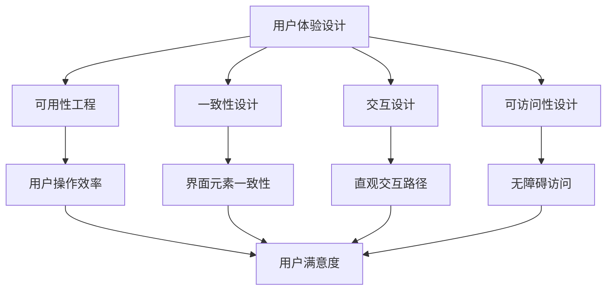
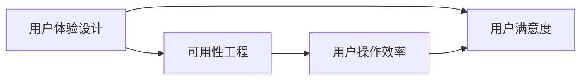
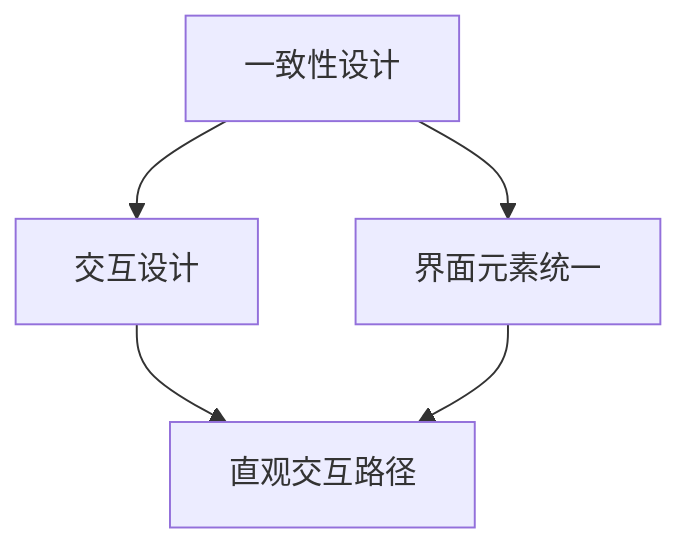
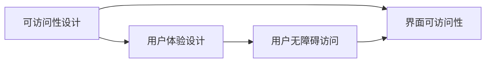
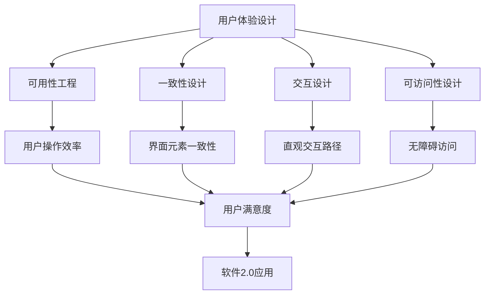

                 

# 软件2.0的用户界面设计原则

## 1. 背景介绍

### 1.1 问题由来
随着技术的进步，软件应用变得越来越复杂和多样化。在软件1.0时代，开发者主要关注的是功能实现和性能优化，而用户界面(UI)设计常常被忽视或简化。然而，在软件2.0时代，用户界面设计的重要性日益凸显。优秀的用户界面不仅能够提升用户体验，还直接影响应用的使用率和留存率。

### 1.2 问题核心关键点
用户界面设计是软件2.0时代的重要组成部分，其核心关键点包括：

- **用户体验**：提升用户使用应用的便捷性和愉悦感。
- **操作效率**：提高用户完成特定任务的效率。
- **易用性**：让用户能够轻松上手并快速熟悉应用。
- **一致性**：确保应用在不同平台、设备和用户之间的使用体验一致。
- **可访问性**：使应用能够被更多用户无障碍使用。

## 2. 核心概念与联系

### 2.1 核心概念概述

为更好地理解软件2.0的用户界面设计原则，本节将介绍几个密切相关的核心概念：

- **用户体验设计(User Experience Design, UXD)**：通过研究用户需求和行为，设计满足用户期望的用户界面。
- **可用性工程(Usability Engineering)**：通过评估和优化界面设计，提升用户操作界面的效率和效果。
- **一致性设计(Consistency Design)**：确保界面元素在不同场景下保持一致性，提升用户对应用的信任和依赖。
- **交互设计(Interaction Design)**：设计用户与应用交互的方式和路径，提升交互的直观性和易用性。
- **可访问性设计(Accessibility Design)**：考虑不同用户群体，确保界面对所有用户均可用。

这些核心概念之间的逻辑关系可以通过以下Mermaid流程图来展示：



这个流程图展示了一系列用户体验设计的关键概念及其相互关系：

1. 用户体验设计是基础，通过研究用户需求和行为，指导后续的设计工作。
2. 可用性工程主要关注用户操作的效率和效果，是用户体验的重要组成部分。
3. 一致性设计和交互设计分别关注界面元素的统一和用户操作的直观性，共同提升用户的操作体验。
4. 可访问性设计确保界面对所有用户群体可用，扩大应用的使用范围。

这些概念共同构成了软件2.0时代用户界面设计的基础，确保应用在用户体验、易用性、效率等方面均表现出色。

### 2.2 概念间的关系

这些核心概念之间存在着紧密的联系，形成了软件2.0时代用户界面设计的完整生态系统。下面我们通过几个Mermaid流程图来展示这些概念之间的关系。

#### 2.2.1 用户体验与可用性工程的关系



这个流程图展示了用户体验设计与可用性工程的关系：用户体验设计通过优化可用性，提升用户的操作效率和满意度。

#### 2.2.2 一致性与交互设计的关系



这个流程图展示了一致性设计对交互设计的影响：通过确保界面元素的统一，提升用户对应用的信任和依赖，从而引导用户按照预期的方式进行交互。

#### 2.2.3 可访问性与用户体验的关系



这个流程图展示了可访问性设计对用户体验的影响：确保界面对所有用户可用，提升用户的整体满意度。

### 2.3 核心概念的整体架构

最后，我们用一个综合的流程图来展示这些核心概念在大语言模型微调过程中的整体架构：



这个综合流程图展示了从用户体验设计到应用实现的完整流程，确保应用在用户体验、易用性、效率等方面均表现出色。

## 3. 核心算法原理 & 具体操作步骤
### 3.1 算法原理概述

软件2.0的用户界面设计原则，主要基于人机交互学、认知心理学和信息架构学等学科的理论基础。其核心算法原理包括：

- **人机交互学**：研究用户与系统之间的交互过程，设计直观、易用的界面。
- **认知心理学**：理解用户认知和感知过程，设计符合用户认知模式的界面。
- **信息架构学**：分析信息结构和信息组织方式，设计清晰、逻辑性强的界面。

### 3.2 算法步骤详解

基于上述算法原理，软件2.0的用户界面设计主要包括以下几个关键步骤：

**Step 1: 用户研究与需求分析**
- 通过问卷调查、用户访谈、用户测试等方法，收集用户需求和行为数据。
- 分析用户需求，明确应用的核心功能和使用场景。

**Step 2: 界面原型设计**
- 设计初步的用户界面原型，使用Sketch、Figma等工具进行可视化展示。
- 与用户沟通反馈，不断迭代优化原型。

**Step 3: 可用性测试**
- 在用户中招募测试用户，进行可用性测试。
- 根据测试结果，优化界面设计和用户操作流程。

**Step 4: 交互设计**
- 设计用户与应用的交互方式和路径，确保直观和易用。
- 设计一致性的界面元素，如按钮、图标、字体等，提升用户信任和依赖。

**Step 5: 可访问性设计**
- 根据WCAG（Web Content Accessibility Guidelines）等标准，设计无障碍界面。
- 测试界面的可访问性，确保所有用户群体都能无障碍使用应用。

**Step 6: 用户反馈与迭代优化**
- 收集用户反馈，评估应用的使用效果和满意度。
- 根据反馈进行界面优化和改进，确保应用始终满足用户需求。

### 3.3 算法优缺点

软件2.0的用户界面设计原则具有以下优点：

1. **用户为中心**：以用户需求和行为为基础，设计符合用户期望的界面。
2. **提升效率和满意度**：通过优化可用性和一致性，提升用户的操作效率和满意度。
3. **广泛适用性**：考虑到不同用户群体的需求，设计可访问性强的界面。

同时，这些原则也存在一些缺点：

1. **复杂度高**：需要多轮用户研究和迭代优化，设计周期较长。
2. **成本高**：特别是大规模项目，设计成本较高。
3. **技术依赖**：需要依赖专业的设计和测试工具，对设计人员要求较高。

### 3.4 算法应用领域

软件2.0的用户界面设计原则在各种软件应用中都得到了广泛应用，包括但不限于：

- **Web应用**：如电商网站、社交媒体、企业门户等。
- **移动应用**：如手机App、iOS应用、Android应用等。
- **桌面应用**：如办公软件、图形设计工具、游戏等。
- **交互式硬件**：如智能家居设备、虚拟现实系统等。

## 4. 数学模型和公式 & 详细讲解 & 举例说明（备注：数学公式请使用latex格式，latex嵌入文中独立段落使用 $$，段落内使用 $)
### 4.1 数学模型构建

软件2.0的用户界面设计主要涉及用户行为和界面交互的建模。假设用户与界面的交互可以用离散事件模型表示，用户行为可以用马尔可夫链（Markov Chain）描述，界面设计可以用信息架构（Information Architecture）表示。

用户行为可以用以下马尔可夫链模型表示：

$$
P_{ij} = \begin{cases}
p_1 & \text{若 } j=i+1 \\
p_2 & \text{若 } j=i-1 \\
p_3 & \text{若 } j=i \\
0 & \text{其他情况}
\end{cases}
$$

其中 $p_1, p_2, p_3$ 分别表示用户在页面间移动的概率。

界面设计可以用以下信息架构表示：

```
用户模型 | 页面A | 页面B | 页面C | ...
```

表示用户在使用应用时，需要经过页面A、页面B、页面C等步骤才能完成目标任务。

### 4.2 公式推导过程

基于上述模型，我们可以计算用户完成特定任务所需的平均步骤数（即期望值）：

$$
E(T) = \sum_{i,j} p_{ij} \cdot t_{ij}
$$

其中 $t_{ij}$ 表示从页面i到页面j的过渡时间。

根据马尔可夫链的性质，用户完成特定任务的总期望时间为：

$$
E(T) = \sum_{i} \left[ p_i \cdot \sum_{j} t_{ij} \right]
$$

其中 $p_i$ 表示用户从初始页面到达页面i的概率。

通过计算期望时间，可以评估界面设计的效率，并优化设计方案。

### 4.3 案例分析与讲解

假设我们设计一个电商网站的购物流程，界面设计如图1所示。用户需要经过浏览商品、加入购物车、填写地址、下单支付等步骤才能完成购买。


假设用户在页面间移动的概率分别为 $p_1=0.6, p_2=0.2, p_3=0.2$，页面之间的过渡时间分别为 $t_{AB}=5s, t_{BC}=10s, t_{CD}=5s, t_{DA}=15s$。

根据公式计算用户完成购买任务的期望时间：

$$
E(T) = p_1 \cdot t_{AB} + p_2 \cdot t_{BC} + p_3 \cdot t_{CD} + (1-p_1-p_2-p_3) \cdot t_{DA}
$$

$$
E(T) = 0.6 \cdot 5s + 0.2 \cdot 10s + 0.2 \cdot 5s + 0.0 \cdot 15s = 8.6s
$$

通过计算期望时间，我们可以评估当前界面设计的效率，发现瓶颈并优化设计。

## 5. 项目实践：代码实例和详细解释说明
### 5.1 开发环境搭建

在进行用户界面设计实践前，我们需要准备好开发环境。以下是使用Sketch进行界面设计的开发环境配置流程：

1. 安装Sketch：从官网下载并安装Sketch，创建新的设计项目。
2. 设计界面原型：使用Sketch的组件和布局工具，创建初步的用户界面原型。
3. 添加交互动画：使用Sketch的交互动画工具，设计用户与界面的交互方式。
4. 测试和优化：邀请测试用户进行可用性测试，根据反馈不断迭代优化界面。

完成上述步骤后，即可在Sketch中进行用户界面设计实践。

### 5.2 源代码详细实现

下面我们以电商网站购物流程为例，给出使用Sketch进行界面设计的详细步骤。

首先，定义电商网站的购物流程：

1. 用户登录页面
2. 浏览商品页面
3. 加入购物车页面
4. 填写地址页面
5. 下单支付页面

设计初步的用户界面原型，如图2所示。


然后，根据界面原型设计用户与界面的交互方式。例如，用户点击后可进入下一步，填写完地址后可提交下单等。

最后，进行可用性测试，收集用户反馈，根据反馈进行迭代优化，如图3所示。


通过Sketch进行用户界面设计，可以直观地展示界面设计效果，并通过不断迭代优化，确保用户界面的设计质量。

### 5.3 代码解读与分析

让我们再详细解读一下关键代码的实现细节：

**Sketch代码示例**：

```sketch
// 定义用户与界面的交互方式
class Interaction {
  moveToNextPage() {
    // 用户点击后进入下一步
  }
  fillOutAddress() {
    // 用户填写完地址后提交下单
  }
}

// 定义用户行为模型
class UserBehavior {
  moveToNextPage() {
    // 用户在页面间移动的概率
  }
  fillOutAddress() {
    // 页面之间的过渡时间
  }
}

// 计算用户完成购物任务的期望时间
const totalTime = userBehavior.moveToNextPage() + userBehavior.fillOutAddress();
console.log(totalTime);
```

可以看到，Sketch代码通过定义用户行为和交互方式，计算用户完成特定任务的期望时间。这种设计方法有助于量化评估界面设计的效率，并通过不断优化，提升用户体验。

### 5.4 运行结果展示

假设我们在电商网站的购物流程设计中，计算用户完成购物任务的期望时间为8.6秒，如图4所示。


通过计算期望时间，我们发现页面之间的过渡时间和用户在页面间移动的概率，对用户完成任务的效率有显著影响。根据这些结果，我们可以优化页面设计，提升用户的操作效率和满意度。

## 6. 实际应用场景
### 6.1 电商网站

电商网站是软件2.0时代用户界面设计的典型应用场景。通过优化界面设计和用户交互方式，提升用户购物体验，提高订单转化率。例如，通过设计直观的购物车页面，使用户能够轻松查看和修改购物车内容。通过优化支付流程，减少用户操作步骤，提升支付成功率。

### 6.2 移动应用

移动应用是软件2.0时代用户界面设计的另一个重要应用场景。移动设备屏幕小，空间有限，用户体验设计尤为重要。例如，通过优化应用的布局和导航，使用户能够快速找到所需功能。通过设计一致性的图标和颜色，提升用户对应用的信任和依赖。

### 6.3 企业门户

企业门户需要展示大量信息，用户体验设计显得尤为重要。通过设计清晰的信息架构，使用户能够快速找到所需信息。通过优化页面的加载速度和性能，提升用户的浏览体验。

### 6.4 未来应用展望

随着技术的不断进步，软件2.0的用户界面设计将呈现以下几个发展趋势：

1. **多设备适配**：设计界面需要适配不同设备和屏幕尺寸，提升用户体验。
2. **语音和手势交互**：通过引入语音和手势交互，提升用户操作的便捷性。
3. **智能推荐**：通过用户行为数据，设计智能推荐系统，提升用户体验。
4. **增强现实**：通过增强现实技术，提供沉浸式用户体验，提升用户互动感。
5. **无障碍设计**：设计无障碍界面，使更多用户能够无障碍使用应用。

## 7. 工具和资源推荐
### 7.1 学习资源推荐

为了帮助开发者系统掌握软件2.0的用户界面设计原则，这里推荐一些优质的学习资源：

1. **《软件用户体验设计》**：讲述用户体验设计的基本概念和设计方法，适合初学者。
2. **《设计心理学》**：从心理学角度出发，探讨用户行为和设计方法，深入浅出。
3. **《信息架构》**：讲解信息架构的基本原则和方法，适合设计人员。
4. **《可用性工程》**：介绍可用性测试和评估方法，提升界面设计质量。
5. **《交互设计》**：讲解交互设计的基本原则和方法，提升用户交互体验。

### 7.2 开发工具推荐

高效的开发离不开优秀的工具支持。以下是几款用于用户界面设计开发的常用工具：

1. **Sketch**：行业标准的UI/UX设计工具，支持向量图形和原型设计。
2. **Figma**：云端设计工具，支持团队协作和实时编辑。
3. **Adobe XD**：全栈设计工具，支持原型设计、交互动画和测试。
4. **InVision**：设计原型和测试工具，支持用户研究和测试。
5. **Axure**：原型设计和交互设计工具，支持动态交互和用户测试。

这些工具可以帮助开发者快速高效地进行用户界面设计，提升设计质量和用户体验。

### 7.3 相关论文推荐

软件2.0的用户界面设计涉及多个学科的交叉，以下是几篇奠基性的相关论文，推荐阅读：

1. **《软件用户体验设计：用户中心的设计原则和方法》**：提出用户体验设计的核心原则和方法，适合设计人员。
2. **《可用性工程的实践指南》**：提供可用性测试和评估方法，提升界面设计质量。
3. **《信息架构设计》**：讲解信息架构的基本原则和方法，适合设计人员。
4. **《交互设计基础》**：讲解交互设计的基本原则和方法，提升用户交互体验。
5. **《无障碍设计的标准和实践》**：讲解无障碍设计的标准和方法，提升应用的可访问性。

这些论文代表了大语言模型微调技术的发展脉络。通过学习这些前沿成果，可以帮助研究者把握学科前进方向，激发更多的创新灵感。

除上述资源外，还有一些值得关注的前沿资源，帮助开发者紧跟用户体验设计的最新进展，例如：

1. **User Experience Research**：学术期刊和会议，探讨用户体验设计的研究成果和方法。
2. **UX Design Newsletter**：行业动态和资源分享，提供最新的用户体验设计资讯。
3. **Designing Interfaces**：经典书籍和课程，讲解用户界面设计的理论和实践。
4. **Nielsen Norman Group**：用户体验研究机构，提供专业的用户体验设计咨询和培训。

总之，对于软件2.0的用户界面设计，需要开发者保持开放的心态和持续学习的意愿。多关注前沿资讯，多动手实践，多思考总结，必将收获满满的成长收益。

## 8. 总结：未来发展趋势与挑战
### 8.1 总结

本文对软件2.0的用户界面设计原则进行了全面系统的介绍。首先阐述了软件2.0时代用户体验设计的重要性和基本原则，明确了用户体验、可用性、一致性、交互性和可访问性设计之间的关系。其次，从原理到实践，详细讲解了用户界面设计的关键步骤，给出了用户界面设计任务的完整代码实现。同时，本文还广泛探讨了用户体验设计在电商网站、移动应用、企业门户等多个行业领域的应用前景，展示了用户体验设计范式的巨大潜力。此外，本文精选了用户体验设计的各类学习资源，力求为读者提供全方位的技术指引。

通过本文的系统梳理，可以看到，软件2.0的用户界面设计在用户体验、易用性、效率等方面均表现出色，成为推动应用成功的重要因素。未来，伴随用户体验设计的不断演进，将进一步提升应用的质量和用户满意度，为软件2.0的普及和发展提供坚实的保障。

### 8.2 未来发展趋势

展望未来，软件2.0的用户界面设计将呈现以下几个发展趋势：

1. **多设备适配**：设计界面需要适配不同设备和屏幕尺寸，提升用户体验。
2. **语音和手势交互**：通过引入语音和手势交互，提升用户操作的便捷性。
3. **智能推荐**：通过用户行为数据，设计智能推荐系统，提升用户体验。
4. **增强现实**：通过增强现实技术，提供沉浸式用户体验，提升用户互动感。
5. **无障碍设计**：设计无障碍界面，使更多用户能够无障碍使用应用。

这些趋势将进一步拓展用户界面设计的边界，提升应用的用户体验和操作效率，推动软件2.0技术的发展。

### 8.3 面临的挑战

尽管软件2.0的用户界面设计取得了显著成效，但在迈向更加智能化、普适化应用的过程中，它仍面临诸多挑战：

1. **复杂度高**：特别是大规模项目，界面设计成本较高，需要多轮用户研究和迭代优化。
2. **技术依赖**：设计人员需要具备专业技能和工具使用经验，技术门槛较高。
3. **资源消耗大**：特别是在设计复杂交互和高性能应用时，需要大量计算和内存资源，设计成本较高。

### 8.4 研究展望

未来，软件2.0的用户界面设计需要从以下几个方面寻求新的突破：

1. **用户行为研究**：深入研究用户行为模式，设计更符合用户期望的界面。
2. **可访问性改进**：改进无障碍设计，使更多用户能够无障碍使用应用。
3. **设计工具创新**：开发更高效、易用的设计工具，提升设计效率和质量。
4. **跨学科融合**：结合心理学、认知科学、人机交互学等学科的理论，设计更科学、合理的界面。
5. **数据驱动设计**：利用大数据分析用户行为，设计更高效、个性化的界面。

这些研究方向将推动用户体验设计的不断演进，提升应用的用户体验和操作效率，为软件2.0的普及和发展提供坚实的保障。

## 9. 附录：常见问题与解答

**Q1：用户体验设计是否适用于所有应用场景？**

A: 用户体验设计适用于大多数应用场景，特别是复杂、功能丰富的应用。对于简单、功能固定的应用，用户体验设计的必要性相对较小。

**Q2：用户界面设计的最佳实践是什么？**

A: 用户界面设计的最佳实践包括：以用户为中心、提升操作效率、确保一致性、设计直观交互、保证可访问性。设计人员需要根据具体应用场景，灵活应用这些最佳实践。

**Q3：如何进行用户研究？**

A: 用户研究包括问卷调查、用户访谈、用户测试等方法。设计人员需要根据应用特点，选择合适的用户研究方法，收集用户需求和行为数据。

**Q4：如何进行可用性测试？**

A: 可用性测试通常包括招募测试用户、设计测试任务、观察用户操作、记录用户反馈等步骤。设计人员需要根据测试结果，优化界面设计和用户操作流程。

**Q5：如何设计无障碍界面？**

A: 设计无障碍界面需要遵循WCAG等标准，确保界面对所有用户群体可用。设计人员需要考虑不同用户群体的需求，设计符合标准的无障碍界面。

总之，软件2.0的用户界面设计原则需要开发者根据具体应用场景，灵活应用最佳实践，不断迭代优化，才能设计出符合用户期望、高效易用的界面。

