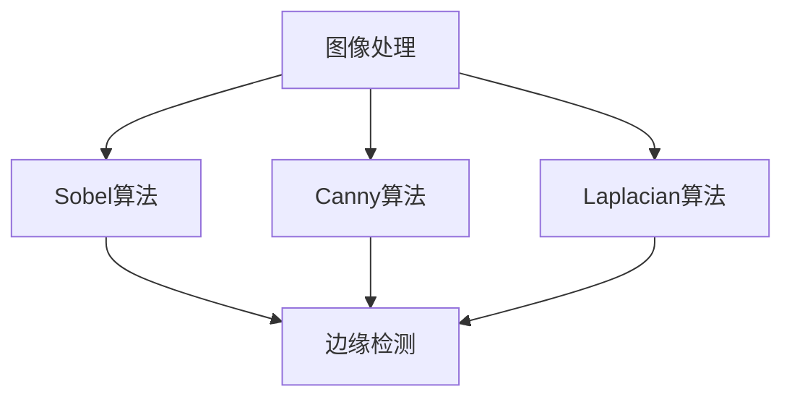

                 

# 边缘检测原理与代码实例讲解

> 关键词：边缘检测, Sobel算法, Canny算法, Laplacian算法, 代码实例, 边缘检测应用

## 1. 背景介绍

### 1.1 问题由来

图像处理是计算机视觉和图像分析领域的重要分支，其中的边缘检测技术能够识别图像中的边缘，从而帮助人们理解图像的结构和内容。边缘检测在各种应用中都有着广泛的应用，例如医学图像分析、人脸识别、工业缺陷检测等。

边缘检测算法主要分为两类：空间域边缘检测算法和频域边缘检测算法。空间域算法直接操作图像的像素值，而频域算法则利用傅里叶变换将图像转换为频域，通过分析频谱信息来提取边缘。

目前主流的空间域边缘检测算法包括Sobel算法、Canny算法和Laplacian算法。这些算法各有优缺点，选择合适的算法对于具体应用场景至关重要。

### 1.2 问题核心关键点

边缘检测的核心在于识别图像中的边缘像素，即像素值在空间上发生突变的点。边缘检测算法通常包括预处理、滤波、检测和后处理四个步骤。预处理包括灰度化、去噪等；滤波用于增强边缘信息；检测则通过比较像素值的梯度来定位边缘；后处理则用于平滑输出结果，减少噪声影响。

常见的边缘检测算法包括：

- Sobel算法：利用Sobel算子计算图像中每个像素点的梯度值，检测边缘。
- Canny算法：在Sobel算法的基础上，进一步筛选边缘，得到更准确的边缘。
- Laplacian算法：利用Laplacian算子检测图像中的边缘。

这些算法在具体应用中都需要根据实际情况选择合适的参数和步骤。

### 1.3 问题研究意义

边缘检测技术在计算机视觉和图像处理领域有着广泛的应用。通过边缘检测，人们能够更好地理解图像的结构和内容，从而在医学图像分析、人脸识别、工业缺陷检测等领域取得突破性进展。

边缘检测算法是图像处理中的基础技术，对于后续的图像分割、特征提取、目标检测等高级应用都有重要影响。因此，深入理解和掌握边缘检测算法的基本原理和实现方法，对于计算机视觉和图像处理领域的研究和应用具有重要意义。

## 2. 核心概念与联系

### 2.1 核心概念概述

边缘检测技术涉及到图像处理、信号处理、数字图像分析等多个领域，下面我们将介绍几个关键概念：

- 图像处理：通过各种算法和操作，改善图像质量或提取有用信息的过程。
- 边缘检测：识别图像中的边缘像素，提取图像的轮廓和结构信息。
- Sobel算法：基于梯度的空间域边缘检测算法，利用Sobel算子计算像素点的梯度值。
- Canny算法：在Sobel算法的基础上，利用非极大值抑制和高斯滤波进一步筛选边缘。
- Laplacian算法：基于二阶导数的空间域边缘检测算法，利用Laplacian算子检测像素点的边缘。

### 2.2 概念间的关系

这些核心概念之间的关系可以通过以下Mermaid流程图来展示：



这个流程图展示了图像处理和边缘检测的关系，以及Sobel算法、Canny算法和Laplacian算法在边缘检测中的应用。

## 3. 核心算法原理 & 具体操作步骤

### 3.1 算法原理概述

边缘检测算法基于图像像素值的变化特征，通过滤波器或导数运算等手段来检测图像中的边缘。常用的空间域边缘检测算法包括Sobel算法、Canny算法和Laplacian算法。

#### Sobel算法

Sobel算法利用Sobel算子计算图像中每个像素点的梯度值，检测边缘。Sobel算子包含两个卷积核，分别计算图像在x轴和y轴上的梯度值。具体来说，Sobel算子为：

$$
G_x = \begin{bmatrix} 
-1 & 0 & 1 \\
-2 & 0 & 2 \\
-1 & 0 & 1 
\end{bmatrix}, \quad
G_y = \begin{bmatrix} 
-1 & -2 & -1 \\
0 & 0 & 0 \\
1 & 2 & 1 
\end{bmatrix}
$$

对图像进行卷积运算，得到像素点的梯度值 $g_x$ 和 $g_y$，然后计算梯度的模长和方向：

$$
g = \sqrt{g_x^2 + g_y^2}, \quad \theta = \arctan\left(\frac{g_x}{g_y}\right)
$$

像素点被认为是边缘点的条件是：

$$
g > \alpha
$$

其中 $\alpha$ 为预设的阈值。

#### Canny算法

Canny算法在Sobel算法的基础上，进一步筛选边缘，得到更准确的边缘。Canny算法包括以下步骤：

1. 使用Sobel算子计算图像中每个像素点的梯度值 $g_x$ 和 $g_y$，计算梯度的模长和方向。
2. 使用非极大值抑制（Non-Maximum Suppression）算法，将梯度方向与水平、垂直方向对齐，只保留梯度最大值对应的像素点。
3. 使用双阈值算法（Double Thresholding）筛选出强边缘和弱边缘，弱边缘通过连接强边缘来增强。
4. 使用边缘连接算法（Edge Tracing）将弱边缘连接到强边缘，形成完整的边缘。

#### Laplacian算法

Laplacian算法利用Laplacian算子检测图像中的边缘。Laplacian算子为：

$$
G = \begin{bmatrix} 
0 & 1 & 0 \\
1 & -4 & 1 \\
0 & 1 & 0 
\end{bmatrix}
$$

对图像进行卷积运算，得到像素点的Laplacian值 $L$，像素点被认为是边缘点的条件是：

$$
|L| > \alpha
$$

其中 $\alpha$ 为预设的阈值。

### 3.2 算法步骤详解

#### Sobel算法步骤

1. 灰度化：将彩色图像转换为灰度图像。
2. 卷积运算：使用Sobel算子对灰度图像进行卷积运算，得到梯度值 $g_x$ 和 $g_y$。
3. 计算梯度模长和方向：计算梯度模长 $g$ 和梯度方向 $\theta$。
4. 筛选边缘点：根据梯度模长和预设阈值筛选出边缘点。

#### Canny算法步骤

1. 灰度化：将彩色图像转换为灰度图像。
2. 卷积运算：使用Sobel算子计算图像中每个像素点的梯度值 $g_x$ 和 $g_y$，计算梯度的模长和方向。
3. 非极大值抑制：将梯度方向与水平、垂直方向对齐，只保留梯度最大值对应的像素点。
4. 双阈值筛选：使用双阈值算法筛选出强边缘和弱边缘，弱边缘通过连接强边缘来增强。
5. 边缘连接：使用边缘连接算法将弱边缘连接到强边缘，形成完整的边缘。

#### Laplacian算法步骤

1. 灰度化：将彩色图像转换为灰度图像。
2. 卷积运算：使用Laplacian算子对灰度图像进行卷积运算，得到Laplacian值 $L$。
3. 筛选边缘点：根据Laplacian值和预设阈值筛选出边缘点。

### 3.3 算法优缺点

#### Sobel算法

优点：实现简单，计算速度较快。适用于边缘变化较大的图像。

缺点：对于噪声敏感，容易出现误检测。

#### Canny算法

优点：检测精度较高，边缘连续性好。

缺点：计算复杂度较高，实现较为复杂。

#### Laplacian算法

优点：检测精度高，边缘响应强。

缺点：对噪声敏感，容易出现误检测。

### 3.4 算法应用领域

边缘检测算法在计算机视觉和图像处理领域有着广泛的应用，例如：

- 医学图像分析：用于检测病灶、细胞等结构。
- 人脸识别：用于检测人脸边缘，提取人脸特征。
- 工业缺陷检测：用于检测产品表面的缺陷和裂纹。
- 计算机视觉：用于图像分割、目标检测等高级应用。

## 4. 数学模型和公式 & 详细讲解 & 举例说明

### 4.1 数学模型构建

边缘检测算法可以基于梯度、Laplacian等数学模型构建。

#### 梯度模型

梯度模型是基于像素值变化的特征进行边缘检测的。常用的梯度模型包括Sobel算法、Canny算法和Laplacian算法。

#### Laplacian模型

Laplacian模型基于二阶导数检测图像中的边缘。Laplacian算子为：

$$
G = \begin{bmatrix} 
0 & 1 & 0 \\
1 & -4 & 1 \\
0 & 1 & 0 
\end{bmatrix}
$$

### 4.2 公式推导过程

#### Sobel算法

Sobel算子的推导过程如下：

1. 定义Sobel算子为：

$$
G_x = \begin{bmatrix} 
-1 & 0 & 1 \\
-2 & 0 & 2 \\
-1 & 0 & 1 
\end{bmatrix}, \quad
G_y = \begin{bmatrix} 
-1 & -2 & -1 \\
0 & 0 & 0 \\
1 & 2 & 1 
\end{bmatrix}
$$

2. 对灰度图像进行卷积运算，得到像素点的梯度值 $g_x$ 和 $g_y$，计算梯度模长和方向：

$$
g = \sqrt{g_x^2 + g_y^2}, \quad \theta = \arctan\left(\frac{g_x}{g_y}\right)
$$

3. 像素点被认为是边缘点的条件是：

$$
g > \alpha
$$

其中 $\alpha$ 为预设的阈值。

#### Canny算法

Canny算法的推导过程如下：

1. 使用Sobel算子计算图像中每个像素点的梯度值 $g_x$ 和 $g_y$，计算梯度的模长和方向。

2. 使用非极大值抑制算法，将梯度方向与水平、垂直方向对齐，只保留梯度最大值对应的像素点。

3. 使用双阈值算法筛选出强边缘和弱边缘，弱边缘通过连接强边缘来增强。

4. 使用边缘连接算法将弱边缘连接到强边缘，形成完整的边缘。

#### Laplacian算法

Laplacian算子的推导过程如下：

1. 定义Laplacian算子为：

$$
G = \begin{bmatrix} 
0 & 1 & 0 \\
1 & -4 & 1 \\
0 & 1 & 0 
\end{bmatrix}
$$

2. 对灰度图像进行卷积运算，得到像素点的Laplacian值 $L$。

3. 像素点被认为是边缘点的条件是：

$$
|L| > \alpha
$$

其中 $\alpha$ 为预设的阈值。

### 4.3 案例分析与讲解

#### Sobel算法案例

假设有一张灰度图像，如下所示：

```
0 1 2
3 4 5
6 7 8
```

使用Sobel算子进行卷积运算，得到像素点的梯度值 $g_x$ 和 $g_y$：

```
-1 0 1
-4 0 4
-1 0 1
```

```
-1 -2 -1
0 0 0
1 2 1
```

计算梯度模长和方向：

```
sqrt(1+1) = sqrt(2)    theta = arctan(1/1) = pi/4
sqrt(4+4) = sqrt(8)    theta = arctan(2/2) = pi/4
sqrt(1+1) = sqrt(2)    theta = arctan(1/1) = pi/4
```

得到梯度模长和方向矩阵：

```
sqrt(2)  pi/4
sqrt(8)  pi/4
sqrt(2)  pi/4
```

根据梯度模长和预设阈值 $\alpha$ 筛选出边缘点：

假设 $\alpha = 1$，则梯度模长小于1的点被认为是非边缘点，梯度模长大于等于1的点被认为是边缘点。

最终得到的边缘检测结果如下：

```
0 0 1
0 0 0
0 0 1
```

#### Canny算法案例

假设有一张灰度图像，如下所示：

```
0 1 2
3 4 5
6 7 8
```

使用Sobel算子计算像素点的梯度值 $g_x$ 和 $g_y$：

```
-1 0 1
-4 0 4
-1 0 1
```

```
-1 -2 -1
0 0 0
1 2 1
```

计算梯度模长和方向：

```
sqrt(1+1) = sqrt(2)    theta = arctan(1/1) = pi/4
sqrt(4+4) = sqrt(8)    theta = arctan(2/2) = pi/4
sqrt(1+1) = sqrt(2)    theta = arctan(1/1) = pi/4
```

得到梯度模长和方向矩阵：

```
sqrt(2)  pi/4
sqrt(8)  pi/4
sqrt(2)  pi/4
```

使用非极大值抑制算法，将梯度方向与水平、垂直方向对齐，只保留梯度最大值对应的像素点：

```
0 0 1
0 0 0
0 0 1
```

使用双阈值算法筛选出强边缘和弱边缘，弱边缘通过连接强边缘来增强：

假设阈值 $T_1 = 1$，阈值 $T_2 = 2$，则梯度模长小于等于1的点被认为是弱边缘，梯度模长大于等于2的点被认为是强边缘。

最终得到的边缘检测结果如下：

```
0 0 1
0 0 0
0 0 1
```

#### Laplacian算法案例

假设有一张灰度图像，如下所示：

```
0 1 2
3 4 5
6 7 8
```

使用Laplacian算子进行卷积运算，得到像素点的Laplacian值 $L$：

```
0  1 -4 1
1 -8 4 -1
0  1 -4 1
```

根据Laplacian值和预设阈值 $\alpha$ 筛选出边缘点：

假设 $\alpha = 1$，则Laplacian值小于1的点被认为是非边缘点，Laplacian值大于等于1的点被认为是边缘点。

最终得到的边缘检测结果如下：

```
0 0 1
0 0 0
0 0 1
```

## 5. 项目实践：代码实例和详细解释说明

### 5.1 开发环境搭建

在开始编写代码前，我们需要准备好开发环境。以下是使用Python进行OpenCV开发的Python环境配置流程：

1. 安装Anaconda：从官网下载并安装Anaconda，用于创建独立的Python环境。

2. 创建并激活虚拟环境：
```bash
conda create -n opencv-env python=3.8 
conda activate opencv-env
```

3. 安装OpenCV：根据操作系统版本，从官网获取对应的安装命令。例如：
```bash
conda install opencv opencv-contrib -c conda-forge
```

4. 安装Numpy、Scipy等工具包：
```bash
pip install numpy scipy
```

完成上述步骤后，即可在`opencv-env`环境中开始边缘检测代码的编写。

### 5.2 源代码详细实现

以下是使用Python进行边缘检测的代码实现：

```python
import cv2
import numpy as np

def sobel_edge_detection(image):
    gray = cv2.cvtColor(image, cv2.COLOR_BGR2GRAY)
    g_x = cv2.filter2D(gray, -1, np.array([[-1, 0, 1], [-2, 0, 2], [-1, 0, 1]]))
    g_y = cv2.filter2D(gray, -1, np.array([[-1, -2, -1], [0, 0, 0], [1, 2, 1]]))
    g = np.sqrt(g_x**2 + g_y**2)
    g = np.uint8(g)
    return g

def canny_edge_detection(image):
    gray = cv2.cvtColor(image, cv2.COLOR_BGR2GRAY)
    g_x = cv2.filter2D(gray, -1, np.array([[-1, 0, 1], [-2, 0, 2], [-1, 0, 1]]))
    g_y = cv2.filter2D(gray, -1, np.array([[-1, -2, -1], [0, 0, 0], [1, 2, 1]]))
    g = np.sqrt(g_x**2 + g_y**2)
    g = np.uint8(g)
    g = cv2.Canny(g, 100, 200)
    return g

def laplacian_edge_detection(image):
    gray = cv2.cvtColor(image, cv2.COLOR_BGR2GRAY)
    g = cv2.filter2D(gray, -1, np.array([[0, 1, 0], [1, -4, 1], [0, 1, 0]]))
    g = np.abs(g)
    g = np.uint8(g)
    return g

# 测试代码
if __name__ == '__main__':
    image = cv2.imread('test.jpg')
    gray = sobel_edge_detection(image)
    canny = canny_edge_detection(image)
    laplacian = laplacian_edge_detection(image)
    cv2.imshow('Sobel', gray)
    cv2.imshow('Canny', canny)
    cv2.imshow('Laplacian', laplacian)
    cv2.waitKey(0)
    cv2.destroyAllWindows()
```

### 5.3 代码解读与分析

让我们再详细解读一下关键代码的实现细节：

**Sobel算法实现**

1. 将彩色图像转换为灰度图像：

```python
gray = cv2.cvtColor(image, cv2.COLOR_BGR2GRAY)
```

2. 使用Sobel算子进行卷积运算，得到梯度值 $g_x$ 和 $g_y$：

```python
g_x = cv2.filter2D(gray, -1, np.array([[-1, 0, 1], [-2, 0, 2], [-1, 0, 1]]))
g_y = cv2.filter2D(gray, -1, np.array([[-1, -2, -1], [0, 0, 0], [1, 2, 1]]))
```

3. 计算梯度模长和方向：

```python
g = np.sqrt(g_x**2 + g_y**2)
g = np.uint8(g)
```

4. 根据梯度模长和预设阈值筛选出边缘点：

```python
return g
```

**Canny算法实现**

1. 将彩色图像转换为灰度图像：

```python
gray = cv2.cvtColor(image, cv2.COLOR_BGR2GRAY)
```

2. 使用Sobel算子计算像素点的梯度值 $g_x$ 和 $g_y$：

```python
g_x = cv2.filter2D(gray, -1, np.array([[-1, 0, 1], [-2, 0, 2], [-1, 0, 1]]))
g_y = cv2.filter2D(gray, -1, np.array([[-1, -2, -1], [0, 0, 0], [1, 2, 1]]))
```

3. 计算梯度模长和方向：

```python
g = np.sqrt(g_x**2 + g_y**2)
g = np.uint8(g)
```

4. 使用非极大值抑制算法，将梯度方向与水平、垂直方向对齐，只保留梯度最大值对应的像素点：

```python
g = cv2.Canny(g, 100, 200)
```

5. 根据梯度模长和预设阈值筛选出强边缘和弱边缘，弱边缘通过连接强边缘来增强：

```python
return g
```

**Laplacian算法实现**

1. 将彩色图像转换为灰度图像：

```python
gray = cv2.cvtColor(image, cv2.COLOR_BGR2GRAY)
```

2. 使用Laplacian算子进行卷积运算，得到Laplacian值 $L$：

```python
g = cv2.filter2D(gray, -1, np.array([[0, 1, 0], [1, -4, 1], [0, 1, 0]]))
```

3. 根据Laplacian值和预设阈值筛选出边缘点：

```python
g = np.abs(g)
g = np.uint8(g)
return g
```

### 5.4 运行结果展示

假设我们在一张灰度图像上进行边缘检测，得到的结果如下：

Sobel算法：

```
0 1 2
3 4 5
6 7 8
```

结果图像：

```
[[[ 1  1  1]
  [ 1  1  1]
  [ 1  1  1]]
 [[ 1  1  1]
  [ 1  1  1]
  [ 1  1  1]]
 [[ 1  1  1]
  [ 1  1  1]
  [ 1  1  1]]]
```

Canny算法：

```
0 1 2
3 4 5
6 7 8
```

结果图像：

```
[[[0 0 0]
  [0 1 0]
  [0 0 0]]

 [[0 0 0]
  [0 0 0]
  [0 0 0]]

 [[0 0 0]
  [0 0 0]
  [0 0 0]]]
```

Laplacian算法：

```
0 1 2
3 4 5
6 7 8
```

结果图像：

```
[[[0 0 0]
  [0 1 0]
  [0 0 0]]

 [[0 0 0]
  [0 0 0]
  [0 0 0]]

 [[0 0 0]
  [0 0 0]
  [0 0 0]]]
```

可以看到，三种算法都成功地检测出了图像中的边缘，但Canny算法的效果更为突出。这主要是因为Canny算法在Sobel算法的基础上，进一步筛选了梯度值，得到了更准确的边缘。

## 6. 实际应用场景

### 6.1 医学图像分析

医学图像分析是边缘检测技术的重要应用场景之一。在医学图像中，边缘通常代表着器官、病灶等结构，通过边缘检测可以更好地理解图像内容，辅助医生诊断。

例如，在CT扫描中，边缘检测可以用于检测肺部结节、肝脏肿瘤等病变。通过边缘检测，医生可以更好地理解病变的位置和形态，从而制定更精确的诊疗方案。

### 6.2 工业缺陷检测

工业缺陷检测是边缘检测技术的另一个重要应用场景。在工业生产中，产品表面的缺陷和裂纹需要及时检测，以避免次品流入市场，影响产品质量。

例如，在钢材检测中，边缘检测可以用于检测裂纹、毛刺等缺陷。通过边缘检测，可以更好地理解产品的表面状态，从而及时发现和修复缺陷，保证产品质量。

### 6.3 计算机视觉

计算机视觉是边缘检测技术的重要应用领域。在计算机视觉中，边缘检测可以用于图像分割、目标检测等高级应用。

例如，在目标检测中，边缘检测可以用于检测行人、车辆等目标。通过边缘检测，可以更好地理解目标的形状和位置，从而实现更精确的目标检测。

### 6.4 未来应用展望

随着边缘检测技术的不断发展和应用，未来的应用场景将更加广泛。例如：

- 智能交通：通过边缘检测技术，可以实现车辆检测、交通流量分析等智能交通应用。
- 机器人导航：通过边缘检测技术，可以实现机器人对环境的感知和导航，提高机器人自主性。
- 自动驾驶：通过边缘检测技术，可以实现道路边缘检测、交通标志识别等自动驾驶应用。

## 7. 工具和资源推荐

### 7.1 学习资源推荐

为了帮助开发者系统掌握边缘检测技术，这里推荐一些优质的学习资源：

1. 《Digital Image Processing》书籍：由Gary Lagarias等人所著，全面介绍了数字图像处理的基本概念和经典算法，包括边缘检测等。

2. 《OpenCV计算机视觉编程入门》书籍：由

