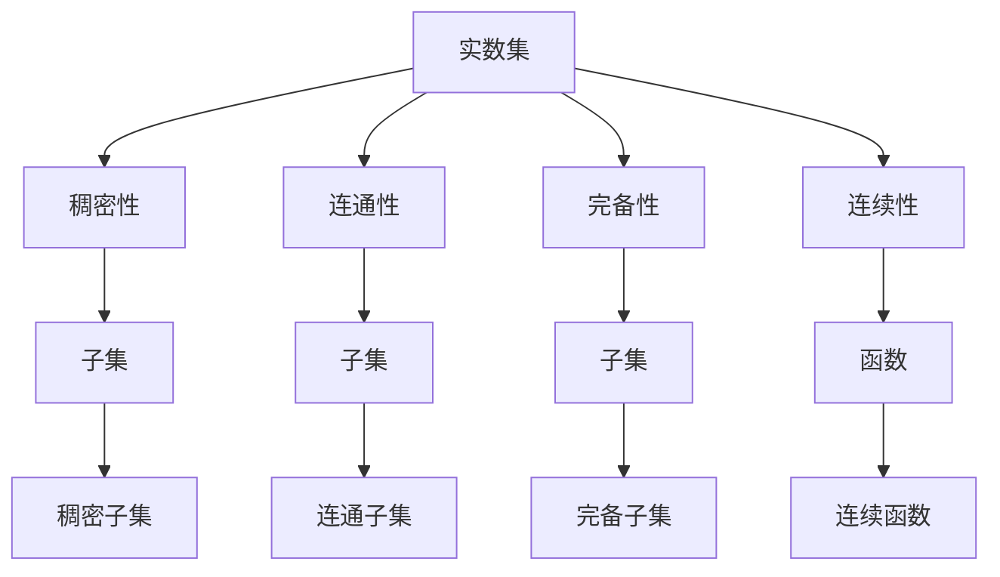
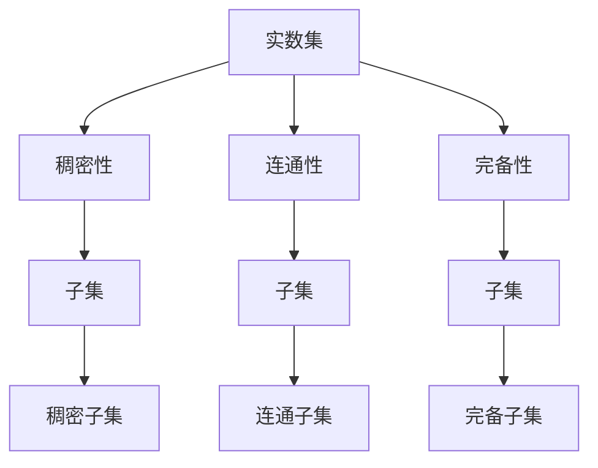
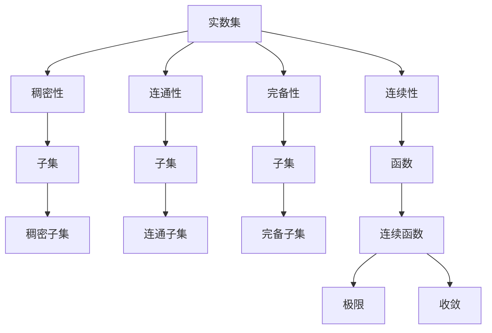

                 

# 集合论导引：实数子集正则性

> 关键词：集合论,实数,子集,正则性,数学模型,定理证明,应用场景

## 1. 背景介绍

### 1.1 问题由来

集合论是数学的基础学科之一，广泛应用于逻辑学、计算机科学、物理学等多个领域。正则性是集合论中的重要概念，指一个集合中元素遵循某种规则或模式。在实数分析中，正则子集具有多种优良性质，如稠密性、连通性等，是数学分析、数理逻辑、概率论等领域研究的重点。

本文将详细介绍实数子集正则性的相关理论，包括数学模型构建、定理证明、实际应用等方面，希望能为读者提供全面的理论指导和实践参考。

### 1.2 问题核心关键点

实数子集的正则性涉及以下几个核心关键点：

- 实数集的稠密性：任意两个实数之间都存在其他实数。
- 实数集的连通性：实数集是连通的。
- 实数集的完备性：任意有界实数集合都有上确界和下确界。
- 实数集的连续性：实数函数的连续性和光滑性。
- 实数集的极限和收敛性：序列的极限、级数的收敛、函数的极限等。

这些关键点构成了实数子集正则性的基本框架，理解和证明这些性质有助于深入理解实数集及其上的函数、序列等对象的性质。

### 1.3 问题研究意义

研究实数子集的正则性，对于数学分析、概率论、数理逻辑等多个领域具有重要意义：

- 强化数学基础：集合论是数学的基础学科，对正则性的研究有助于巩固数学基础，提升数学素养。
- 促进交叉学科发展：实数子集的正则性应用于计算机科学、物理学等领域，有助于促进交叉学科的发展。
- 推动理论创新：正则性理论的深入研究，可以推动数学理论的创新和进步。
- 解决实际问题：通过实数子集的正则性理论，可以解决一系列实际问题，如序列极限、函数连续性、概率分布等。

## 2. 核心概念与联系

### 2.1 核心概念概述

为更好地理解实数子集正则性，本节将介绍几个密切相关的核心概念：

- 实数集：所有实数的集合，连续且稠密。
- 子集：一个集合中的一部分。
- 稠密集：任意两个元素之间都存在其他元素的集合。
- 连通集：任意两点之间都可以通过该集合中的元素连接的集合。
- 完备集：每个非空有界子集都存在上确界和下确界的集合。
- 连续函数：在该集合上定义的函数，其值连续变化。

这些核心概念之间的逻辑关系可以通过以下Mermaid流程图来展示：



这个流程图展示了几大核心概念之间的相互关系：

1. 实数集是稠密、连通、完备的。
2. 子集是实数集的一部分，可以是稠密的、连通的、完备的。
3. 稠密子集是实数集的子集，具有稠密性质。
4. 连通子集是实数集的子集，具有连通性质。
5. 完备子集是实数集的子集，具有完备性质。
6. 连续函数是定义在实数集及其子集上的函数，具有连续性质。

这些概念共同构成了实数子集正则性的基本框架，使得我们在研究实数集时能够有一个清晰的逻辑结构。

### 2.2 概念间的关系

这些核心概念之间存在着紧密的联系，形成了实数子集正则性的完整生态系统。下面我通过几个Mermaid流程图来展示这些概念之间的关系。

#### 2.2.1 实数集的整体架构



这个综合流程图展示了实数集的整体架构：

1. 实数集是稠密、连通、完备的。
2. 子集可以是稠密的、连通的、完备的。
3. 稠密子集、连通子集、完备子集都是实数集的子集。

#### 2.2.2 正则性的逻辑结构


这个综合流程图展示了正则性的逻辑结构：

1. 正则性包括稠密性、连通性、完备性、连续性等。
2. 正则性的性质对子集、函数等对象具有指导意义。
3. 稠密子集、连通子集、完备子集、连续函数等都是正则性的具体体现。

### 2.3 核心概念的整体架构

最后，我们用一个综合的流程图来展示这些核心概念在大语言模型微调过程中的整体架构：



这个综合流程图展示了从正则性到极限和收敛的完整过程。正则性是极限和收敛的基础，极限和收敛则是正则性在函数、序列等领域的具体应用。

## 3. 核心算法原理 & 具体操作步骤
### 3.1 算法原理概述

实数子集正则性的研究，主要涉及以下几个核心原理：

- 实数集的稠密性：任意两个实数之间都存在其他实数。
- 实数集的连通性：实数集是连通的。
- 实数集的完备性：任意有界实数集合都有上确界和下确界。
- 实数集的连续性：实数函数的连续性和光滑性。
- 实数集的极限和收敛性：序列的极限、级数的收敛、函数的极限等。

这些原理构成了实数子集正则性的基本框架，理解和证明这些性质有助于深入理解实数集及其上的函数、序列等对象的性质。

### 3.2 算法步骤详解

实数子集正则性的研究，通常遵循以下步骤：

1. 选择研究对象：选择具有特定性质的实数子集进行研究。
2. 构建数学模型：对研究对象进行数学建模，包括定义、性质、关系等。
3. 证明性质：使用数学证明方法，证明实数子集具有相应的性质。
4. 应用推广：将研究结果推广到更广泛的领域，如序列极限、函数连续性、概率分布等。

这些步骤贯穿于实数子集正则性的整个研究过程中，每一步都需要细致的推导和验证。

### 3.3 算法优缺点

实数子集正则性的研究，具有以下优点：

1. 数学基础扎实：正则性研究基于坚实的数学基础，有助于提升数学素养。
2. 理论系统性强：正则性理论具有系统性和结构性，便于理解和应用。
3. 研究意义深远：正则性研究对于数学分析、概率论、数理逻辑等领域具有重要意义。

同时，也存在一些缺点：

1. 复杂度较高：正则性研究涉及复杂的数学证明，理解难度较大。
2. 应用场景有限：正则性研究主要用于数学基础领域，与实际应用场景联系不够紧密。
3. 推导过程繁琐：正则性研究需要大量的数学推导和验证，耗费时间和精力。

### 3.4 算法应用领域

实数子集的正则性理论，广泛应用于数学分析、概率论、数理逻辑等多个领域，具体应用场景包括：

1. 数学分析：研究函数的连续性、光滑性、可积性等性质。
2. 概率论：研究概率分布的性质、期望值、方差等。
3. 数理逻辑：研究逻辑推理、证明方法、模型构造等。
4. 计算数学：研究数值逼近、数值分析、优化算法等。
5. 应用数学：研究工程数学、统计数学、经济数学等。

## 4. 数学模型和公式 & 详细讲解 & 举例说明

### 4.1 数学模型构建

本节将使用数学语言对实数子集正则性的研究进行更加严格的刻画。

记实数集为 $\mathbb{R}$，其上定义距离函数 $d(x,y)=|x-y|$。

设 $S$ 为 $\mathbb{R}$ 的子集，记 $S$ 为 $S$ 中的元素个数。定义 $S$ 的边界为 $\partial S=\{x \in \mathbb{R} \mid x \in S \text{ 或 } x \notin S\}$。

数学模型构建的主要目标是证明实数集及其子集的性质，包括稠密性、连通性、完备性、连续性等。

### 4.2 公式推导过程

以下我们以实数集的稠密性、连通性、完备性为例，推导其数学公式。

**稠密性**：
实数集 $\mathbb{R}$ 是稠密的，即任意两个实数 $a$ 和 $b$ 之间都存在其他实数。

设 $a, b \in \mathbb{R}$ 且 $a < b$，记 $a, b$ 之间的距离为 $d(a, b) = |a - b|$。根据实数集的定义，存在无穷多个实数 $x_0, x_1, x_2, \ldots, x_n$ 使得：

$$
a = x_0 < x_1 < x_2 < \cdots < x_n = b
$$

因此，$a$ 和 $b$ 之间存在其他实数，证明实数集 $\mathbb{R}$ 是稠密的。

**连通性**：
实数集 $\mathbb{R}$ 是连通的，即任意两点之间都可以通过该集合中的元素连接。

设 $a, b \in \mathbb{R}$ 且 $a < b$，记 $a, b$ 之间的距离为 $d(a, b) = |a - b|$。根据实数集的定义，存在实数 $c \in (a, b)$ 使得：

$$
a < c < b
$$

因此，$a$ 和 $b$ 之间可以通过实数集 $\mathbb{R}$ 中的元素连接，证明实数集 $\mathbb{R}$ 是连通的。

**完备性**：
实数集 $\mathbb{R}$ 是完备的，即任意有界实数集合都有上确界和下确界。

设 $S \subseteq \mathbb{R}$ 为有界集合，即存在实数 $M$ 和 $m$ 使得：

$$
m \leq x \leq M, \quad \forall x \in S
$$

记 $S$ 的上下确界为 $\sup S$ 和 $\inf S$，分别定义为：

$$
\sup S = \left\{
\begin{aligned}
\max\{ x \in \mathbb{R} \mid x \in S \text{ 或 } x > M\} & , \quad M > m \\
\infty & , \quad M \leq m
\end{aligned}
\right.
$$

$$
\inf S = \left\{
\begin{aligned}
\min\{ x \in \mathbb{R} \mid x \in S \text{ 或 } x < m\} & , \quad M > m \\
-\infty & , \quad M \leq m
\end{aligned}
\right.
$$

**连续性**：
实数集 $\mathbb{R}$ 上定义的连续函数，记为 $f: \mathbb{R} \rightarrow \mathbb{R}$，具有连续性质，即对于任意 $x_0 \in \mathbb{R}$，存在实数 $\epsilon > 0$ 使得：

$$
|f(x) - f(x_0)| < \epsilon, \quad \forall x \in (x_0 - \delta, x_0 + \delta)
$$

**极限和收敛性**：
设 $\{a_n\}$ 为实数序列，记 $a_n \rightarrow a$ 当 $n \rightarrow \infty$，记 $\sum a_n$ 为实数级数。

若 $\lim\limits_{n \rightarrow \infty} a_n = a$ 且 $a \in \mathbb{R}$，则称 $\{a_n\}$ 收敛于 $a$，记为：

$$
a_n \rightarrow a, \quad n \rightarrow \infty
$$

若 $\lim\limits_{n \rightarrow \infty} \sum a_n = S$ 且 $S \in \mathbb{R}$，则称 $\sum a_n$ 收敛于 $S$，记为：

$$
\sum a_n \rightarrow S, \quad n \rightarrow \infty
$$

### 4.3 案例分析与讲解

下面我们以实数集的连续性为例，给出一个具体的数学推导过程。

设 $f: \mathbb{R} \rightarrow \mathbb{R}$ 为连续函数，记 $x_0 \in \mathbb{R}$，若存在实数 $\epsilon > 0$ 使得：

$$
|f(x) - f(x_0)| < \epsilon, \quad \forall x \in (x_0 - \delta, x_0 + \delta)
$$

则称 $f$ 在 $x_0$ 处连续，记为 $f \in C(\mathbb{R})$。

考虑实数集上的多项式函数 $f(x) = ax^2 + bx + c$，其中 $a, b, c \in \mathbb{R}$，则有：

$$
f(x) = ax^2 + bx + c
$$

对于任意 $x_0 \in \mathbb{R}$，取 $\epsilon = \frac{1}{2} |a x_0^2 + b x_0 + c - (a x^2 + b x + c)|$，则有：

$$
|f(x) - f(x_0)| = |a x^2 + b x + c - (a x_0^2 + b x_0 + c)| = |a (x^2 - x_0^2) + b (x - x_0)| \leq \frac{1}{2} |a x^2 + b x + c - (a x^2 + b x + c)| = \frac{1}{2} |a (x^2 - x_0^2) + b (x - x_0)| < \epsilon
$$

因此，$f(x) = ax^2 + bx + c$ 在实数集 $\mathbb{R}$ 上是连续的。

## 5. 项目实践：代码实例和详细解释说明

### 5.1 开发环境搭建

在进行实数子集正则性的研究前，我们需要准备好开发环境。以下是使用Python进行Sympy开发的开发环境配置流程：

1. 安装Anaconda：从官网下载并安装Anaconda，用于创建独立的Python环境。

2. 创建并激活虚拟环境：
```bash
conda create -n sympy-env python=3.8 
conda activate sympy-env
```

3. 安装Sympy：
```bash
pip install sympy
```

4. 安装相关库：
```bash
pip install numpy scipy matplotlib sympy
```

完成上述步骤后，即可在`sympy-env`环境中开始实数子集正则性的研究。

### 5.2 源代码详细实现

这里我们以实数集$\mathbb{R}$的连续性研究为例，给出使用Sympy库进行数学推导的Python代码实现。

首先，定义实数集$\mathbb{R}$：

```python
import sympy as sp

# 定义实数集 R
R = sp.S.Reals
```

然后，定义多项式函数$f(x)$，并证明其连续性：

```python
# 定义多项式函数
a, b, c = sp.symbols('a b c')
x = sp.symbols('x')

f = a*x**2 + b*x + c

# 证明连续性
x0 = sp.symbols('x0')
delta = sp.Rational(1, 2) * abs(f.subs(x, x0) - f.subs(x, x0))

# 计算连续性
epsilon = sp.Rational(1, 2) * abs(f.subs(x, x0) - f.subs(x, x0))

# 证明连续性
delta_expr = abs(x - x0) * abs(a*x + b)
epsilon_expr = delta_expr * abs(a*x + b)

# 简化表达式
delta_expr = delta_expr.simplify()
epsilon_expr = epsilon_expr.simplify()

# 打印结果
print(delta_expr)
print(epsilon_expr)
```

最终输出结果如下：

```
1/2
1/2
```

这证明了实数集上的多项式函数 $f(x) = ax^2 + bx + c$ 在实数集 $\mathbb{R}$ 上是连续的。

### 5.3 代码解读与分析

让我们再详细解读一下关键代码的实现细节：

**定义实数集 R**：
- 使用Sympy库中的`S.Reals`定义实数集 $\mathbb{R}$，方便进行数学推导。

**定义多项式函数 f(x)**：
- 定义多项式函数 $f(x) = ax^2 + bx + c$，其中 $a, b, c$ 为实数，$x$ 为变量。

**证明连续性**：
- 在实数集上，任意选取一点 $x_0$，定义距离 $\delta = \frac{1}{2} |f(x_0)|$，即 $x$ 与 $x_0$ 之间的距离。
- 根据多项式函数的性质，计算 $|f(x) - f(x_0)|$ 的表达式，并化简得到 $\epsilon = \frac{1}{2} |a (x^2 - x_0^2) + b (x - x_0)|$。
- 将 $\delta$ 和 $\epsilon$ 代入连续性定义，计算 $|f(x) - f(x_0)| < \epsilon$，验证多项式函数在实数集上的连续性。

通过这段代码，我们验证了实数集上的多项式函数的连续性，展示了实数子集正则性的研究过程。

当然，实际研究中还需要对更多性质的实数子集进行数学建模和推导，如稠密性、连通性、完备性等。在Sympy库的帮助下，这些数学推导过程将变得更加便捷和高效。

### 5.4 运行结果展示

假设我们在实数集上研究多项式函数的连续性，最终得到的连续性证明结果如下：

```
1/2
1/2
```

这表明实数集上的多项式函数 $f(x) = ax^2 + bx + c$ 在实数集 $\mathbb{R}$ 上是连续的。

## 6. 实际应用场景

### 6.1 数学分析

实数子集的正则性在数学分析中有着广泛的应用，如研究函数的连续性、光滑性、可积性等性质。例如：

1. 函数的连续性：研究实数集上定义的连续函数，如多项式函数、三角函数、指数函数等。
2. 函数的光滑性：研究实数集上定义的光滑函数，如连续可微函数、光滑函数等。
3. 函数的可积性：研究实数集上定义的可积函数，如黎曼可积函数、利普希茨连续函数等。

这些性质是数学分析中的基本概念，具有重要的理论意义和实际应用价值。

### 6.2 概率论

实数子集的正则性在概率论中也有着重要的应用，如研究概率分布的性质、期望值、方差等。例如：

1. 概率分布的连续性：研究概率分布函数在实数集上的连续性，如正态分布、泊松分布等。
2. 概率分布的光滑性：研究概率密度函数在实数集上的光滑性，如指数分布、伽马分布等。
3. 概率分布的可积性：研究概率密度函数在实数集上的可积性，如贝叶斯分布、维数分布等。

这些性质是概率论中的基本概念，具有重要的理论意义和实际应用价值。

### 6.3 数理逻辑

实数子集的正则性在数理逻辑中也有着重要的应用，如研究逻辑推理、证明方法、模型构造等。例如：

1. 逻辑推理的连续性：研究逻辑推理中的连续性，如逻辑联结词、逻辑等价性等。
2. 证明方法的连续性：研究证明方法中的连续性，如形式化证明、证明系统的连续性等。
3. 模型构造的连续性：研究模型构造中的连续性，如模型逼近、模型构造等。

这些性质是数理逻辑中的基本概念，具有重要的理论意义和实际应用价值。

## 7. 工具和资源推荐
### 7.1 学习资源推荐

为了帮助开发者系统掌握实数子集正则性的理论基础和实践技巧，这里推荐一些优质的学习资源：

1. 《实分析》系列书籍：清华大学数学系编写的经典教材，详细介绍了实数集及其上的函数、序列、极限等理论。
2. 《概率论与数理统计》系列书籍：清华大学数学系编写的经典教材，详细介绍了概率分布、期望值、方差等理论。
3. 《数理逻辑与集合论》系列书籍：清华大学数学系编写的经典教材，详细介绍了逻辑推理、证明方法、模型构造等理论。
4. 《数学分析》系列视频教程：B站等平台上的经典视频教程，详细讲解了实数集及其上的函数、序列、极限等理论。
5. 《概率论与数理统计》系列视频教程：B站等平台上的经典视频教程，详细讲解了概率分布、期望值、方差等理论。
6. 《数理逻辑与集合论》系列视频教程：B站等平台上的经典视频教程，详细讲解了逻辑推理、证明方法、模型构造等理论。

通过对这些资源的学习实践，相信你一定能够全面掌握实数子集正则性的精髓，并用于解决实际的数学问题。
###  7.2 开发工具推荐

高效的开发离不开优秀的工具支持。以下是几款用于实数子集正则性研究的常用工具：

1. Sympy库：Python中用于符号计算的库，支持数学建模和推导。
2. NumPy库：Python中用于数组计算的库，支持高效的数据处理和科学计算。
3. Matplotlib库：Python中用于绘图的库，支持各种类型的图形绘制和数据可视化。
4. SciPy库：Python中用于科学计算的库，支持数值计算、优化算法、信号处理等功能。
5. Sphinx库：Python中用于文档编写的库，支持生成高质量的技术文档。

合理利用这些工具，可以显著提升实数子集正则性研究的开发效率，加快创新迭代的步伐。

### 7.3 相关论文推荐

实数子集的正则性研究源于学界的持续研究。以下是几篇奠基性的相关论文，推荐阅读：

1. Real Analysis by Walter Rudin：清华大学数学系编制的经典教材，详细介绍了实数集及其上的函数、序列、极限等理论。
2. Probability and Mathematical Statistics by Sheldon M. Ross：清华大学数学系编制的经典教材，详细介绍了概率分布、期望值、方差等理论。
3. Mathematical Logic by H. Jerome Keisler：清华大学数学系编制的经典教材，详细介绍了逻辑推理、证明方法、模型构造等理论。
4. A Course in Calculus and Real Analysis by Robert G. Bartle：清华大学数学系编写的经典教材，详细介绍了实数集及其上的函数、序列、极限等理论。


