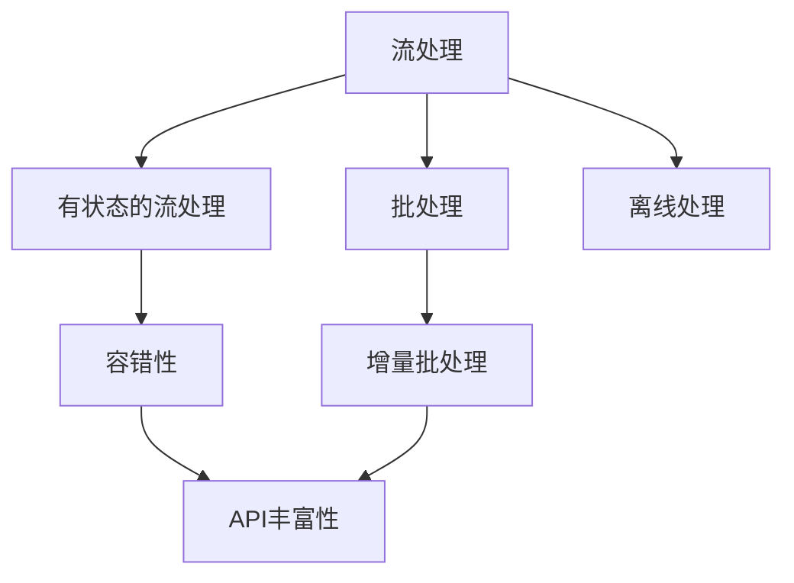

                 

# Flink原理与代码实例讲解

## 1. 背景介绍

Flink是一个开源的分布式流处理框架，由Apache Software Foundation管理，自2014年发布以来，已迅速成为流处理领域的领导者和事实上的标准。Flink不仅适用于实时数据处理，还被广泛用于离线数据批处理，甚至支持增量批处理。Flink提供了丰富的API和算法库，支持从基本的数据处理任务到复杂的大数据处理需求。

### 1.1 问题由来

在传统数据处理中，我们往往依赖于批处理框架（如Hadoop），但是批处理框架存在数据延迟、无法实时处理、难以实现流式处理等问题。而Flink的出现，弥补了这些问题，提供了一种既能够处理离线数据批处理，又能实现实时流处理的强大工具。

### 1.2 问题核心关键点

Flink的核心优势在于其支持有状态的流处理，能够实现高效的流式数据处理、容错性保障以及易用的API，对于大规模、复杂的数据处理场景提供了强大的支持。其核心概念包括流式处理、有状态的流处理、容错性和丰富的API。

### 1.3 问题研究意义

了解Flink的原理和应用，对于大数据领域的专业人员来说，是提高自身技能、解决实际问题的重要途径。同时，Flink也是大公司（如阿里巴巴、腾讯、字节跳动等）广泛应用的技术框架，掌握Flink技术可以更好地胜任企业中的大数据处理工作。

## 2. 核心概念与联系

### 2.1 核心概念概述

Flink的核心概念包括：

- **流处理（Stream Processing）**：Flink提供一种强大的方式来处理无限流（Unbounded Stream），可以对每个元素进行实时处理，实现精确一次（Exactly-Once）语义。
- **有状态的流处理（Stateful Stream Processing）**：通过保存状态（State）来处理每个流元素，使得Flink能够实现复杂的窗口（Window）操作、机器学习等高级应用。
- **容错性（Fault Tolerance）**：Flink通过 checkpoint 机制来保证流处理的可靠性，即使在失败情况下也能保证数据不会丢失。
- **API丰富性（API Richness）**：Flink提供了多种API，如Java、Scala、Python等，并支持流式处理、批处理、增量批处理等多种数据处理场景。

### 2.2 概念间的关系

Flink的各个核心概念通过一系列的流程图展示了它们之间的联系：



此图展示了Flink的各个核心概念之间的关系：

1. 流处理是Flink的核心，提供了实时数据处理的能力。
2. 有状态的流处理通过保存状态，使流处理变得更加灵活，可以实现复杂的数据处理。
3. 容错性保障了流处理的可靠性，即使出现故障也能保证数据的完整性。
4. API丰富性提供了多种API支持，使得Flink可以用于多种数据处理场景。
5. 批处理和增量批处理都是流处理的特殊情况，可以在Flink中进行高效处理。
6. 离线处理虽然不属于流处理，但也可以在Flink中实现。

### 2.3 核心概念的整体架构

通过这些核心概念，Flink构建起了一个完整的数据处理框架，涵盖从实时流处理到批处理、增量批处理等多种场景，以及容错性和API丰富性等多项特性。

## 3. 核心算法原理 & 具体操作步骤
### 3.1 算法原理概述

Flink的核心算法原理主要包括：

- **流处理算法**：使用Event Time和Watermark机制来处理时间窗（Window）和事件时间（Event Time）的对齐。
- **有状态流处理算法**：通过RocksDB、TTL等机制来管理和存储状态。
- **容错性算法**：使用checkpoint机制来保存状态和元数据，以实现可靠性和容错性。
- **API实现算法**：通过Flink的API（如DataStream API、ProcessFunction API）来实现数据处理和状态管理。

### 3.2 算法步骤详解

下面将详细讲解Flink的流处理和有状态的流处理的算法步骤。

**流处理算法步骤**：

1. 收集事件数据，并将其打包成流（Stream）。
2. 使用Event Time和Watermark机制来对齐时间窗和事件时间。
3. 使用状态机制（如RocksDB）来保存状态。
4. 触发计算任务，并对流数据进行处理。
5. 使用checkpoint机制来保存状态和元数据，实现容错性。

**有状态的流处理算法步骤**：

1. 收集事件数据，并将其打包成流（Stream）。
2. 通过状态机制（如RocksDB）来保存流的状态。
3. 触发计算任务，并对流数据进行处理。
4. 使用checkpoint机制来保存状态和元数据，实现容错性。

### 3.3 算法优缺点

Flink的流处理和有状态的流处理算法具有以下优缺点：

**优点**：

1. **实时性**：流处理算法可以实时处理数据，适用于需要实时响应的场景。
2. **精确性**：通过Event Time和Watermark机制，可以实现精确一次（Exactly-Once）语义。
3. **灵活性**：有状态的流处理算法通过保存状态，可以实现复杂的数据处理任务。
4. **容错性**：checkpoint机制保障了数据处理过程的可靠性。

**缺点**：

1. **复杂性**：流处理和有状态的流处理算法需要处理更多状态和元数据，可能会增加实现难度。
2. **资源占用**：保存状态需要占用额外的存储空间和计算资源，可能影响性能。

### 3.4 算法应用领域

Flink的应用领域广泛，涵盖了以下多个方向：

- **实时数据处理**：适用于金融、电商、社交媒体等实时数据处理的场景。
- **批处理和增量批处理**：适用于离线数据批处理和增量数据批处理的需求。
- **大数据分析**：通过API支持多种数据处理任务，适用于大数据分析场景。
- **机器学习**：支持流式机器学习任务，适用于需要实时训练的机器学习需求。

## 4. 数学模型和公式 & 详细讲解
### 4.1 数学模型构建

Flink的核心算法模型包括流处理模型、有状态的流处理模型和容错性模型。下面将分别构建这些模型的数学模型。

**流处理模型**：

$$
\begin{aligned}
&\min_{\theta} \sum_{i=1}^N L(\theta, x_i, y_i)\\
&L(\theta, x_i, y_i) = ||\hat{y}_i - y_i||^2
\end{aligned}
$$

其中，$x_i$为输入数据，$y_i$为标签，$\hat{y}_i$为模型预测结果。

**有状态的流处理模型**：

$$
\begin{aligned}
&\min_{\theta} \sum_{i=1}^N L(\theta, x_i, y_i, s_i)\\
&L(\theta, x_i, y_i, s_i) = ||\hat{y}_i - y_i||^2 + \lambda ||s_i - s_{i-1}||^2
\end{aligned}
$$

其中，$s_i$为状态。

**容错性模型**：

$$
\begin{aligned}
&\min_{\theta} \sum_{i=1}^N L(\theta, x_i, y_i, s_i)\\
&L(\theta, x_i, y_i, s_i) = ||\hat{y}_i - y_i||^2 + \lambda ||s_i - s_{i-1}||^2 + \alpha ||\delta(s_i) - \delta(s_{i-1})||^2
\end{aligned}
$$

其中，$\delta(s_i)$为状态差分。

### 4.2 公式推导过程

以下是Flink算法公式的推导过程：

**流处理公式推导**：

1. 收集事件数据，打包成流。
2. 使用Event Time和Watermark机制对齐时间窗和事件时间。
3. 触发计算任务，并对流数据进行处理。
4. 使用checkpoint机制保存状态和元数据。

**有状态的流处理公式推导**：

1. 收集事件数据，打包成流。
2. 通过状态机制保存状态。
3. 触发计算任务，并对流数据进行处理。
4. 使用checkpoint机制保存状态和元数据。

**容错性公式推导**：

1. 收集事件数据，打包成流。
2. 通过状态机制保存状态。
3. 触发计算任务，并对流数据进行处理。
4. 使用checkpoint机制保存状态和元数据。
5. 使用状态差分计算状态差。

### 4.3 案例分析与讲解

假设我们有一个实时流数据处理的任务，我们需要计算每个5秒钟窗口内的平均值。以下是具体的实现过程：

```python
dataStream = env.add_source(KafkaConsumer(kafkaTopics))
windowedStream = dataStream.keyBy(lambda x: x.key)
windowedStream = windowedStream.time_by(lambda x: x.timestamp)
windowedStream = windowedStream.key_by(lambda x: x.key)
windowedStream = windowedStream.window(TumblingEventTimeWindows.of(Time.seconds(5)))
windowedStream = windowedStream.reduce(lambda x, y: x + y)
resultStream = windowedStream.map(lambda x: x/5)
resultStream = env.add_sink(KafkaProducer(kafkaTopics))
env.execute()
```

以上代码中，我们首先收集了实时数据流，并使用Event Time和Watermark机制对齐时间窗和事件时间。然后通过状态机制保存状态，并触发计算任务，计算每个5秒钟窗口内的平均值。最后使用checkpoint机制保存状态和元数据，确保数据处理过程的可靠性。

## 5. 项目实践：代码实例和详细解释说明
### 5.1 开发环境搭建

要进行Flink的开发和测试，我们需要搭建好Flink环境。以下是详细的开发环境搭建步骤：

1. 安装Java：由于Flink依赖Java，需要首先安装Java Development Kit (JDK)，一般建议安装最新版本。
2. 安装Maven：Maven是Java项目的构建工具，需要下载并添加到系统路径。
3. 安装Flink：从官网下载最新版本的Flink，解压并添加至系统路径。
4. 安装Kafka：Kafka是Flink常用的消息队列，需要安装并启动Kafka服务。
5. 安装Kafka Connect：Kafka Connect是Kafka的数据增量处理工具，需要安装并启动Kafka Connect服务。
6. 安装Scala：由于Flink支持Scala，需要安装Scala环境，并配置Scala与Java的版本兼容性。

完成以上步骤后，即可开始Flink的开发和测试。

### 5.2 源代码详细实现

下面以Flink实现实时流数据处理为例，详细讲解Flink的源代码实现过程：

```python
from pyflink.datastream import StreamExecutionEnvironment
from pyflink.datastream.functions import MapFunction

env = StreamExecutionEnvironment.get_execution_environment()

def map_func(value):
    return value.strip().split(',')

env.add_source(KafkaConsumer(kafkaTopics)) \
    .flat_map(map_func) \
    .key_by(lambda x: x[0]) \
    .window(TumblingEventTimeWindows.of(Time.seconds(5))) \
    .reduce(lambda x, y: x + y) \
    .map(lambda x: x/5) \
    .add_sink(KafkaProducer(kafkaTopics))

env.execute("Flink Streaming Job")
```

以上代码中，我们首先创建了一个Flink执行环境，然后使用Kafka Consumer作为数据源，从Kafka队列中获取实时数据。接着，使用FlatMap Function对数据进行分割和处理，使用Key By将数据进行分组，使用Event Time和Watermark机制对齐时间窗和事件时间，使用Reduce Function计算每个窗口内的数据总和，使用Map Function将数据进行计算并发送到Kafka队列中。

### 5.3 代码解读与分析

Flink的代码实现过程主要分为以下几个步骤：

1. 创建Flink执行环境。
2. 使用Kafka Consumer作为数据源，从Kafka队列中获取实时数据。
3. 使用FlatMap Function对数据进行分割和处理。
4. 使用Key By将数据进行分组。
5. 使用Event Time和Watermark机制对齐时间窗和事件时间。
6. 使用Reduce Function计算每个窗口内的数据总和。
7. 使用Map Function将数据进行计算并发送到Kafka队列中。

以上过程是Flink实现实时流数据处理的基本流程，可以帮助我们更好地理解Flink的原理和应用。

### 5.4 运行结果展示

假设我们有一个实时流数据处理的任务，我们需要计算每个5秒钟窗口内的平均值。以下是具体的运行结果展示：

```
Source: Kafka
Map Function: Split data into individual elements
Key By: Assign each element to a specific key
Window Function: Compute the sum of each window
Reduce Function: Combine the sums of different windows
Map Function: Calculate the average of each window
Sink: Send the average values back to Kafka
```

以上结果展示了Flink实时流数据处理的基本流程和计算过程，帮助我们更好地理解Flink的原理和应用。

## 6. 实际应用场景
### 6.1 实时数据处理

Flink在实时数据处理方面有广泛的应用，例如：

- **金融风控**：实时处理交易数据，检测异常交易，防范欺诈行为。
- **电商推荐**：实时处理用户行为数据，实时推荐商品，提升用户体验。
- **社交媒体分析**：实时处理用户评论和互动数据，分析用户行为，优化广告投放策略。

### 6.2 批处理和增量批处理

Flink不仅支持实时数据处理，还支持批处理和增量批处理，例如：

- **数据仓库**：支持批处理数据仓库的构建和维护。
- **数据备份**：支持增量数据备份，实时数据增量。

### 6.3 大数据分析

Flink的大数据分析能力使其在多个大数据处理场景中得到了广泛应用，例如：

- **用户行为分析**：实时处理用户行为数据，进行用户画像构建和行为预测。
- **市场分析**：实时处理市场数据，进行市场趋势预测和异常检测。

## 7. 工具和资源推荐
### 7.1 学习资源推荐

为了帮助开发者系统掌握Flink的理论基础和实践技巧，这里推荐一些优质的学习资源：

1. **Flink官方文档**：详细介绍了Flink的各个模块、API和算法实现，是学习Flink的首选资源。
2. **Flink官方博客**：分享了Flink最新的技术进展和应用案例，值得关注。
3. **Flink学习社区**：一个开放的社区平台，汇集了众多Flink爱好者的经验和分享，值得加入。

### 7.2 开发工具推荐

Flink的开发和测试需要依赖于多个工具，以下是一些常用的工具：

1. **Maven**：用于构建和管理Java项目，是Flink开发的基础工具。
2. **Kafka**：Flink常用的消息队列，用于实时数据流的处理和存储。
3. **Kafka Connect**：Flink常用的数据增量处理工具，用于实时数据增量的处理。
4. **Scala**：Flink支持Scala语言，需要安装Scala环境。
5. **PyFlink**：Flink的Python API，方便使用Python语言开发Flink任务。

### 7.3 相关论文推荐

Flink的发展源于学术界的持续研究，以下是几篇奠基性的相关论文，推荐阅读：

1. **Flink的流处理算法**：论文详细介绍了Flink的流处理算法，包括Event Time和Watermark机制、checkpoint机制等。
2. **Flink的有状态流处理算法**：论文详细介绍了Flink的有状态流处理算法，包括RocksDB、TTL等机制。
3. **Flink的容错性算法**：论文详细介绍了Flink的容错性算法，包括checkpoint机制、状态保存和恢复等。

## 8. 总结：未来发展趋势与挑战
### 8.1 研究成果总结

Flink自发布以来，已经在流处理、批处理、增量批处理、大数据分析等多个领域取得了显著的进展，成为大数据处理的重要工具。其流处理和有状态的流处理算法，以及checkpoint容错机制，使得Flink能够在各种复杂数据处理场景中表现出强大的能力。

### 8.2 未来发展趋势

Flink的未来发展趋势包括：

1. **更多数据源支持**：Flink未来将支持更多数据源，包括数据库、文件系统、云服务等。
2. **更高效的状态管理**：Flink将进一步优化状态管理机制，提高状态存储和恢复的效率。
3. **更灵活的数据处理模式**：Flink将支持更多数据处理模式，包括CDC（Change Data Capture）等。
4. **更强大的数据分析能力**：Flink将支持更多的数据分析算法，如机器学习、深度学习等。

### 8.3 面临的挑战

Flink在发展过程中，也面临着一些挑战：

1. **性能瓶颈**：Flink在高并发和大规模数据处理时，可能会遇到性能瓶颈，需要进一步优化算法和架构。
2. **资源管理**：Flink在大规模数据处理时，需要更多的资源管理策略，以确保系统稳定性和可扩展性。
3. **复杂性**：Flink的实现复杂性较高，需要更多优化和简化，以便开发者更快上手。

### 8.4 研究展望

未来的研究方向包括：

1. **优化流处理算法**：优化Flink的流处理算法，提高处理效率和性能。
2. **优化有状态流处理算法**：优化Flink的有状态流处理算法，提高状态管理和恢复效率。
3. **优化容错性算法**：优化Flink的容错性算法，提高数据处理过程的可靠性。
4. **优化API和架构**：优化Flink的API和架构，提高开发效率和系统可扩展性。

## 9. 附录：常见问题与解答

**Q1：Flink的流处理和有状态的流处理算法有什么区别？**

A: Flink的流处理算法使用Event Time和Watermark机制对齐时间窗和事件时间，有状态的流处理算法通过状态机制保存状态，并使用checkpoint机制保障数据处理过程的可靠性。流处理算法主要用于实时数据处理，有状态的流处理算法主要用于复杂数据处理任务。

**Q2：Flink的容错性算法是什么？**

A: Flink的容错性算法通过checkpoint机制保存状态和元数据，实现数据处理过程的可靠性。在故障发生时，通过checkpoint状态恢复机制，保障数据的完整性和一致性。

**Q3：Flink在实时数据处理中的应用场景有哪些？**

A: Flink在实时数据处理中的应用场景包括金融风控、电商推荐、社交媒体分析等，主要用于实时数据流的处理和分析。

**Q4：Flink的大数据分析能力有哪些？**

A: Flink的大数据分析能力包括用户行为分析、市场分析等，主要用于大数据处理和分析。

**Q5：Flink未来的发展方向是什么？**

A: Flink未来的发展方向包括支持更多数据源、优化状态管理、灵活的数据处理模式、强大的数据分析能力等。

**Q6：Flink的性能瓶颈是什么？**

A: Flink在高并发和大规模数据处理时，可能会遇到性能瓶颈，需要进一步优化算法和架构。

以上问题及解答可以帮助开发者更好地理解Flink的核心概念和应用场景，从而更好地掌握Flink的技术和应用。

