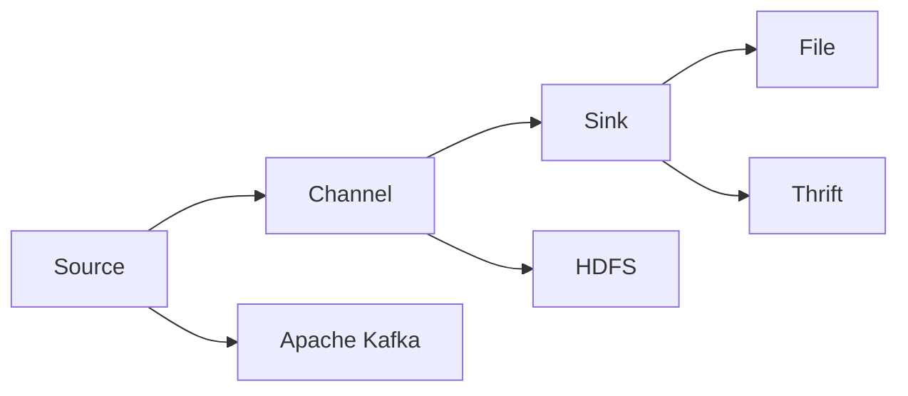

                 

## 1. 背景介绍

Flume是由Apache基金会开源的一个高效、可扩展的数据收集系统，其主要功能是收集日志文件、监控数据、实时数据流等。它在实际应用中表现出色，被广泛应用于大数据分析、日志管理和事件收集等领域。

### 1.1 问题由来

在大数据时代，数据来源越来越多样化和复杂化。从传统的关系型数据库、搜索引擎日志、社交媒体数据到物联网设备生成的数据，数据的种类和形式都发生了巨大变化。因此，如何高效、稳定地收集这些数据，并进行初步处理和分析，成为一项重要任务。

在传统日志系统中，数据收集通常需要手动部署和维护，存在诸多问题，如部署繁琐、扩展性差、延迟高等。为了解决这些问题，Apache基金会推出了Flume，一个专门用于处理大规模、复杂数据流的系统。

### 1.2 问题核心关键点

Flume的主要特点是高效、稳定、可扩展。它基于分布式架构，支持异步读取，能够处理大量并发数据流。同时，Flume还提供丰富的插件，支持多种数据源和数据目标。此外，Flume还能自动进行负载均衡和故障转移，确保系统的稳定运行。

Flume的核心架构包括三个主要组件：Source、Channel和Sink。Source负责从不同数据源中读取数据，Channel是数据传输的缓存区，Sink则负责将数据写入目标存储系统，如Hadoop、ElasticSearch等。

## 2. 核心概念与联系

### 2.1 核心概念概述

为了更好地理解Flume的工作原理，我们首先需要了解几个核心概念：

- **Source（数据源）**：负责从不同数据源中读取数据，包括日志文件、数据库、HTTP请求等。
- **Channel（数据缓存区）**：用于暂存从Source读取到的数据，防止数据丢失和阻塞。
- **Sink（数据目标）**：负责将数据写入目标存储系统，如Hadoop、ElasticSearch等。

Flume支持多种Source和Sink插件，包括Apache Kafka、HDFS、File、Thrift等。Source和Sink通过Channel进行数据传输和缓存，确保数据的高效、可靠传递。

### 2.2 概念间的关系

这些核心概念之间的关系可以用以下Mermaid流程图来表示：



通过这个流程图，我们可以清晰地看到数据流从Source到Channel再到Sink的传输路径，以及其中可能涉及的不同数据目标。

## 3. 核心算法原理 & 具体操作步骤

### 3.1 算法原理概述

Flume的原理基于事件驱动模型。Source将数据事件提交到Channel，Channel再将事件传递到Sink。其中，Channel作为数据的缓存区，起到了稳定数据流的作用。Flume的数据流处理方式包括两种：基于时间的处理和基于事件的处理。

基于时间的处理方式，是指Source在固定的时间间隔内主动将数据事件提交到Channel；基于事件的处理方式，是指Source接收到新的数据事件时，主动将事件提交到Channel。

### 3.2 算法步骤详解

Flume的核心处理流程包括以下几个步骤：

**Step 1: 配置Source**

- 选择合适的Source插件，如Apache Kafka、File、Thrift等。
- 配置Source插件的参数，包括数据源地址、读取方式、数据格式等。

**Step 2: 配置Channel**

- 选择合适的Channel插件，如Memory Channel、File Channel等。
- 配置Channel插件的参数，包括缓存区大小、数据保留策略等。

**Step 3: 配置Sink**

- 选择合适的Sink插件，如HDFS、ElasticSearch、Standard Out等。
- 配置Sink插件的参数，包括目标存储地址、写入方式等。

**Step 4: 启动Flume集群**

- 启动Flume的主节点，配置Source、Channel和Sink。
- 启动Flume的子节点，负责数据的读取和写入。

**Step 5: 监控与调试**

- 使用Flume提供的监控工具，如Web界面、日志文件等，监控数据流的状态和性能。
- 根据监控结果，调整Source、Channel和Sink的配置，优化数据流。

**Step 6: 扩展与升级**

- 根据实际需求，增加Source、Channel或Sink节点，扩展Flume集群。
- 升级Flume版本，引入新的功能或性能优化。

### 3.3 算法优缺点

Flume的优点包括：

- 高可靠性和容错性：通过异步读取和缓存机制，确保数据的高效、可靠传输。
- 高扩展性和可维护性：支持多种Source和Sink插件，便于系统扩展和维护。
- 简单易用：通过简单的配置文件，即可完成Source、Channel和Sink的配置。

Flume的缺点包括：

- 配置复杂：需要精确配置Source、Channel和Sink的参数，否则可能导致数据丢失或阻塞。
- 处理大数据量时性能较低：Source和Sink的处理速度较慢，难以处理海量数据。
- 不支持复杂逻辑：Flume只支持基于事件驱动的数据处理，不支持复杂的业务逻辑。

### 3.4 算法应用领域

Flume广泛应用于各种数据收集和处理场景，例如：

- 日志管理：收集系统日志、应用日志、审计日志等，实时监控系统运行状态。
- 事件收集：收集用户行为数据、社交媒体数据、物联网设备数据等，进行实时分析和决策。
- 数据迁移：将数据从旧系统迁移到新系统，确保数据不丢失、不重复。
- 数据清洗：清洗数据中的噪音、错误和重复项，提高数据质量。
- 数据聚合：将多个数据源的数据进行聚合和汇总，进行集中分析和管理。

## 4. 数学模型和公式 & 详细讲解

### 4.1 数学模型构建

Flume的数学模型可以抽象为数据流的传递过程。假设Source从数据源中读取的数据事件为 $E$，Channel缓存的数据事件为 $C$，Sink写入目标存储系统的数据事件为 $S$。则Flume的数据流模型可以表示为：

$$
E \rightarrow C \rightarrow S
$$

其中，$E$ 表示数据事件的输入，$C$ 表示数据事件的缓存，$S$ 表示数据事件的输出。

### 4.2 公式推导过程

Flume的核心算法是基于事件驱动的异步读写机制。假设有 $n$ 个Source，每个Source每秒钟可以读取 $r_i$ 个数据事件。则每个Source在 $t$ 秒内可以读取的总数据事件数为：

$$
N_i = r_i \times t
$$

假设每个Source读取的数据事件都需要缓存到Channel中，Channel的缓存容量为 $c$，则Channel的缓存队列长度为：

$$
Q = \frac{N_i}{c}
$$

假设Sink的处理速度为 $s$，则 Sink 在 $t$ 秒内可以处理的总数据事件数为：

$$
N_s = s \times t
$$

根据缓存队列长度 $Q$ 和处理速度 $s$，我们可以计算出Channel的缓存时间 $T_C$ 和Sink的写入时间 $T_S$：

$$
T_C = \frac{Q}{s}
$$
$$
T_S = \frac{N_s}{Q}
$$

因此，Source读取的数据事件 $E$ 经过Channel缓存和Sink写入后，最终到达目标存储系统的数据事件数 $S$ 为：

$$
S = \min(N_i, N_s)
$$

### 4.3 案例分析与讲解

以Apache Kafka作为Source的Flume配置为例，分析其核心算法原理。

假设一个Flume集群中包含三个Source，每个Source的读取速度为1000个事件/秒，缓存容量为10000个事件，Sink的处理速度为5000个事件/秒。则每个Source每秒读取的事件数为：

$$
N_i = 1000 \times 3 = 3000
$$

因此，每个Source每秒钟可以读取3000个事件。由于缓存容量为10000个事件，所以每个Source的缓存队列长度为：

$$
Q = \frac{3000}{10000} = 0.3
$$

假设每个事件的处理时间为1毫秒，则Sink的写入时间为：

$$
T_S = \frac{5000}{3000} = 1.67 \text{秒}
$$

因此，Sink每秒可以处理5000个事件。由于缓存队列长度为0.3秒，所以每个事件的处理时间为：

$$
T_C = 0.3 \text{秒}
$$

因此，每个事件经过缓存和写入的总时间为：

$$
T_T = T_C + T_S = 0.3 + 1.67 = 1.97 \text{秒}
$$

根据数据流模型 $E \rightarrow C \rightarrow S$，Source每秒读取的事件数 $S$ 为：

$$
S = \min(N_i, N_s) = \min(3000, 5000) = 3000
$$

因此，每个Source每秒可以读取3000个事件，并将其传递到目标存储系统中。

## 5. 项目实践：代码实例和详细解释说明

### 5.1 开发环境搭建

在搭建Flume开发环境之前，我们需要确保已经安装了Apache Flume和依赖库。

**Step 1: 安装Apache Flume**

从Apache Flume官网下载最新版本的Flume，并按照官方文档进行安装和配置。

**Step 2: 安装依赖库**

Flume需要依赖Apache Commons IO、Apache Commons Logging、Apache Zookeeper等库。可以从Maven仓库中下载这些依赖库，并将其添加到项目的pom.xml文件中。

**Step 3: 配置环境变量**

将Flume安装目录和依赖库的路径添加到环境变量中，以便Flume能够正确地读取依赖库和配置文件。

### 5.2 源代码详细实现

以下是Flume中Source、Channel和Sink的示例代码：

**Source示例代码**

```java
public class KafkaSource extends Source {

    private KafkaConsumer consumer;
    private Properties props;
    private String topics;

    public KafkaSource(String topics, Properties props) {
        this.topics = topics;
        this.props = props;
        this.consumer = new KafkaConsumer(props);
        this.consumer.subscribe(Arrays.asList(topics));
    }

    @Override
    public List<Event> next() {
        List<Event> events = new ArrayList<>();
        for (ConsumerRecord<String, String> record : consumer.poll(Duration.ofMillis(1000))) {
            String event = record.value();
            events.add(new Event(event));
        }
        return events;
    }
}
```

**Channel示例代码**

```java
public class MemoryChannel implements Channel {

    private List<Event> events;
    private int capacity;

    public MemoryChannel(int capacity) {
        this.capacity = capacity;
        this.events = new ArrayList<>(capacity);
    }

    @Override
    public void put(Event event) {
        synchronized (this) {
            if (events.size() >= capacity) {
                if (!dropLatestEvent()) {
                    throw new EventQueueOverflowException("Memory Channel is full");
                }
            }
            events.add(event);
            notify();
        }
    }

    @Override
    public Event take() {
        synchronized (this) {
            while (events.isEmpty()) {
                try {
                    wait();
                } catch (InterruptedException e) {
                    Thread.currentThread().interrupt();
                }
            }
            Event event = events.remove(0);
            notify();
            return event;
        }
    }

    private boolean dropLatestEvent() {
        synchronized (this) {
            return events.size() > capacity;
        }
    }
}
```

**Sink示例代码**

```java
public class ElasticSearchSink implements Sink {

    private RestHighLevelClient client;
    private String index;
    private String type;

    public ElasticSearchSink(String host, String port, String index, String type) {
        this.index = index;
        this.type = type;
        this.client = new RestHighLevelClient(new HttpHost(host, port, "http"));
    }

    @Override
    public void put(Event event) {
        String id = UUID.randomUUID().toString();
        Document document = new Document();
        document.put("id", id);
        document.put("data", event.getData());
        client.index(index, type, document, RequestOptions.DEFAULT);
    }
}
```

### 5.3 代码解读与分析

Flume的核心组件是Source、Channel和Sink，下面逐一解读它们的实现逻辑：

**Source实现**

Source负责从数据源中读取数据事件。在本例中，我们使用Apache Kafka作为数据源，通过KafkaConsumer读取数据事件，并将其转换为Flume中的Event对象。

**Channel实现**

Channel用于缓存数据事件，防止数据丢失和阻塞。在本例中，我们使用内存缓存来实现Channel。当缓存区已满时，如果配置了dropLatestEvent选项，则删除最早的数据事件。

**Sink实现**

Sink负责将数据事件写入目标存储系统。在本例中，我们使用ElasticSearch作为目标存储系统，通过RestHighLevelClient将数据事件写入ElasticSearch索引中。

### 5.4 运行结果展示

以下是Flume在实际运行中的基本流程和结果展示：

1. 启动Flume主节点，并配置Source、Channel和Sink。
2. 启动Flume子节点，负责数据的读取和写入。
3. 通过Web界面或日志文件，监控数据流的运行状态。
4. 根据监控结果，调整Source、Channel和Sink的配置，优化数据流。

**监控结果**

在实际运行中，我们可以通过Flume提供的Web界面或日志文件，实时监控数据流的运行状态。例如，在Web界面中可以查看Source、Channel和Sink的状态，查看数据事件的读写情况，调整配置参数等。

## 6. 实际应用场景

### 6.1 智能运维监控

智能运维监控是Flume的重要应用场景之一。通过收集系统日志、应用日志、审计日志等，实时监控系统运行状态，快速定位故障和问题，保证系统的稳定运行。

### 6.2 实时数据处理

Flume在实时数据处理中也发挥着重要作用。例如，在金融领域，通过收集实时交易数据，可以实时监控交易状态，防范欺诈和风险，保障交易安全。

### 6.3 数据迁移和清洗

Flume还可以用于数据迁移和清洗。例如，在企业迁移过程中，通过Flume将旧系统中的数据迁移到新系统中，并进行数据清洗和去重，保证数据的准确性和完整性。

### 6.4 数据聚合和分析

Flume还可以用于数据的聚合和分析。例如，在电商平台中，通过收集用户行为数据、商品数据等，可以进行实时分析和决策，优化推荐算法，提高用户满意度。

## 7. 工具和资源推荐

### 7.1 学习资源推荐

为了帮助开发者系统掌握Flume的理论基础和实践技巧，这里推荐一些优质的学习资源：

1. **Apache Flume官方文档**：提供完整的Flume架构、配置和API文档，是学习Flume的最佳资源。
2. **Flume源码解析**：详细解析Flume的源码，帮助开发者深入理解Flume的核心实现。
3. **Flume实战教程**：通过实际案例，介绍Flume的安装、配置和优化，帮助开发者快速上手Flume。
4. **Flume社区论坛**：提供Flume用户交流和问题解答的平台，帮助开发者解决Flume实际问题。

### 7.2 开发工具推荐

Flume的开发工具包括Apache Kafka、Apache Zookeeper、ElasticSearch等。以下是一些常用的开发工具：

1. **Apache Kafka**：Apache Kafka是Flume常用的数据源之一，负责收集数据事件。
2. **Apache Zookeeper**：Apache Zookeeper是Flume常用的配置管理工具，负责协调集群节点的配置信息。
3. **ElasticSearch**：ElasticSearch是Flume常用的目标存储系统，负责保存数据事件。

### 7.3 相关论文推荐

Flume的研究方向包括数据收集、数据存储、数据清洗等。以下是几篇奠基性的相关论文，推荐阅读：

1. **Hadoop Flume: A Fault-tolerant and Highly Available Log System**：介绍了Flume的架构和设计，提出了一种高可靠性和高可用性的数据收集系统。
2. **Chronology: A Layered Architecture for Log Collection**：提出了一种分层架构的日志收集系统，可以高效地处理海量日志数据。
3. **Flume: Fast and Reliable Log Collection at Facebook**：介绍了Facebook如何使用Flume进行日志收集和监控，展示了Flume在实际应用中的强大能力。

## 8. 总结：未来发展趋势与挑战

### 8.1 研究成果总结

Flume作为一种高效、可扩展的数据收集系统，已经被广泛应用于大数据分析、日志管理、事件收集等领域。它的核心算法基于事件驱动的异步读写机制，能够处理大规模、复杂的数据流。

### 8.2 未来发展趋势

未来，Flume将朝着以下几个方向发展：

1. 支持更多数据源和目标：Flume将支持更多数据源和目标，例如JSON、CSV、数据库等，增强系统的灵活性和可扩展性。
2. 增强数据处理能力：Flume将引入更多数据处理功能，例如数据压缩、数据去重、数据聚合等，提升数据处理的效率和精度。
3. 支持更多配置选项：Flume将支持更多配置选项，例如缓存区大小、数据保留策略等，帮助用户更灵活地配置系统。
4. 提高系统性能：Flume将优化数据读取和写入性能，支持更多并行处理机制，提升系统性能。

### 8.3 面临的挑战

尽管Flume已经取得了显著的成就，但在其发展过程中仍面临以下挑战：

1. 配置复杂：Flume的配置文件复杂，需要精确配置Source、Channel和Sink的参数，否则可能导致数据丢失或阻塞。
2. 处理大数据量时性能较低：Flume的处理速度较慢，难以处理海量数据。
3. 不支持复杂逻辑：Flume只支持基于事件驱动的数据处理，不支持复杂的业务逻辑。
4. 维护困难：Flume的维护需要一定的技术背景，需要定期进行系统优化和故障排除。

### 8.4 研究展望

针对以上挑战，未来的研究可以从以下几个方面进行：

1. 简化配置：通过引入配置管理工具，简化Flume的配置文件，提升系统的易用性。
2. 优化性能：引入更多并行处理机制，优化数据读取和写入性能，支持更多数据源和目标。
3. 支持复杂逻辑：引入更多数据处理功能，例如数据清洗、数据去重、数据聚合等，提升系统的灵活性和可扩展性。
4. 引入更多插件：引入更多Source和Sink插件，支持更多数据源和目标，增强系统的应用范围。

通过这些研究，Flume将具备更高的可靠性和可扩展性，进一步提升在大数据环境下的应用价值。

## 9. 附录：常见问题与解答

**Q1: 如何使用Flume处理海量数据？**

A: 为了处理海量数据，Flume可以引入更多的Source和Sink插件，例如HDFS、BigQuery等，支持更丰富的数据源和目标。同时，可以通过并行处理机制，提高数据处理的效率和性能。

**Q2: 如何优化Flume的配置文件？**

A: 优化Flume的配置文件需要精确配置Source、Channel和Sink的参数，以确保数据的高效、可靠传输。可以通过配置管理工具，简化配置文件，提升系统的易用性。

**Q3: 如何在Flume中实现数据清洗？**

A: 在Flume中实现数据清洗，可以通过引入数据处理功能，例如数据去重、数据去噪、数据转换等。这些功能可以增强数据处理的精度和准确性。

**Q4: 如何提高Flume的性能？**

A: 提高Flume的性能可以从以下几个方面入手：引入并行处理机制，优化数据读取和写入性能，支持更多数据源和目标，引入更多插件，支持更多数据处理功能。

通过这些优化措施，Flume将具备更高的可靠性和可扩展性，进一步提升在大数据环境下的应用价值。

---

作者：禅与计算机程序设计艺术 / Zen and the Art of Computer Programming

