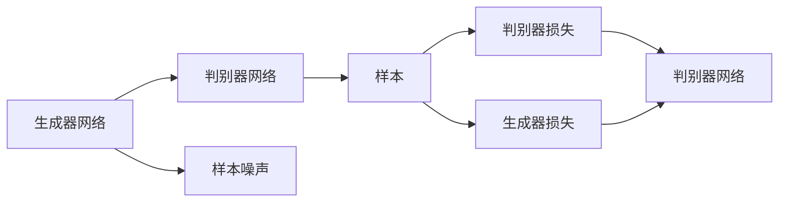
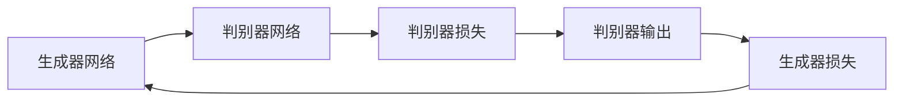
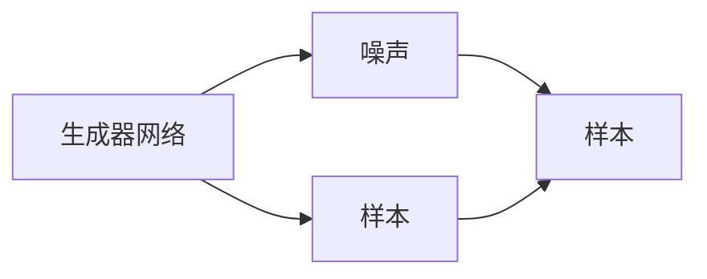
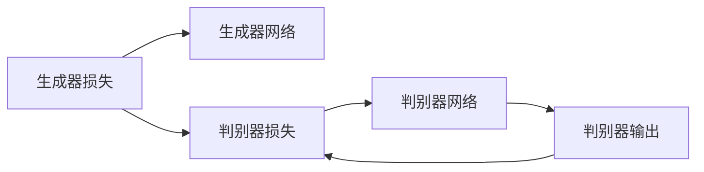
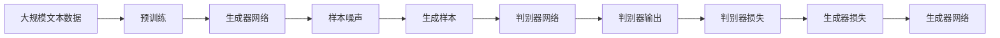

                 

# Generative Adversarial Networks (GAN) 原理与代码实战案例讲解

> 关键词：生成对抗网络, 生成模型, 深度学习, 图像生成, 数据增强, 自动编码器, 深度学习框架

## 1. 背景介绍

生成对抗网络（Generative Adversarial Networks, GAN）是深度学习领域的一项重要技术，通过让两个网络相互博弈来生成高质量的样本数据。GAN 由 Goodfellow 等人于 2014 年提出，其核心思想是利用一个生成器网络（Generative Network）来生成样本数据，一个判别器网络（Discriminative Network）来区分生成数据和真实数据。通过不断优化两个网络，最终生成器能够生成接近真实数据的样本。

GAN 的提出为图像生成、数据增强、视频生成等领域带来了革命性的突破，极大地推动了深度学习技术的应用。GAN 也引发了学术界和工业界的广泛关注，成为深度学习研究的热点之一。

## 2. 核心概念与联系

### 2.1 核心概念概述

为了更好地理解 GAN 的原理和应用，本节将介绍几个关键概念：

- 生成器网络（Generative Network）：生成器网络的任务是生成与真实数据尽可能接近的样本数据，其输入为噪声或随机向量，输出为生成数据。生成器网络通常采用深度卷积神经网络（CNN）或变分自编码器（VAE）等架构。
- 判别器网络（Discriminative Network）：判别器网络的任务是区分生成数据和真实数据，其输入为真实数据或生成数据，输出为真实数据的概率。判别器网络通常也采用深度神经网络架构，但可能与生成器网络的结构不同。
- 对抗训练（Adversarial Training）：生成器网络和判别器网络通过对抗训练的方式进行联合优化，生成器网络的目标是生成更逼真的样本，判别器网络的目标是更好地区分生成数据和真实数据。两个网络相互博弈，最终达到平衡状态。
- 样本噪声（Noise）：生成器网络在生成样本数据时，通常会引入一定程度的噪声，以增加样本数据的多样性和随机性，防止过拟合。噪声可以是随机的高斯分布、均匀分布等。
- 样本损失函数（Sample Loss Function）：生成器网络的损失函数通常是样本的均方误差（MSE）、交叉熵等，判别器网络的损失函数通常是样本的二分类交叉熵等。

这些核心概念之间的关系可以通过以下 Mermaid 流程图来展示：



这个流程图展示了大语言模型微调过程中各个核心概念的关系和作用：

1. 生成器网络生成样本数据，并引入噪声。
2. 判别器网络将生成数据和真实数据分别输入，预测其真实性。
3. 判别器网络的输出被视为损失函数的一部分。
4. 生成器网络的输出被视为损失函数的一部分。
5. 两个网络的损失函数被优化器同时优化，最终达到平衡状态。

### 2.2 概念间的关系

这些核心概念之间存在着紧密的联系，构成了 GAN 技术的完整框架。下面我通过几个 Mermaid 流程图来展示这些概念之间的关系。

#### 2.2.1 生成器网络和判别器网络的博弈过程



这个流程图展示了生成器网络和判别器网络之间的博弈过程。生成器网络的目标是生成更逼真的样本，判别器网络的目标是更好地区分生成数据和真实数据。两个网络通过博弈，相互促进，最终达到平衡状态。

#### 2.2.2 样本噪声和数据多样性



这个流程图展示了噪声在生成样本过程中的作用。噪声增加了样本数据的多样性和随机性，防止生成器网络过拟合，提高了样本数据的质量。

#### 2.2.3 损失函数和模型优化



这个流程图展示了损失函数在模型优化中的作用。生成器网络的输出和判别器的输出分别作为损失函数的一部分，共同优化两个网络，使得生成器能够生成更逼真的样本，判别器能够更好地区分生成数据和真实数据。

### 2.3 核心概念的整体架构

最后，我们用一个综合的流程图来展示这些核心概念在大语言模型微调过程中的整体架构：



这个综合流程图展示了从预训练到生成器网络和判别器网络的整个训练过程。大规模文本数据通过预训练，生成器网络生成样本数据，判别器网络进行区分，两个网络的损失函数被优化器同时优化，最终生成高质量的样本数据。

## 3. 核心算法原理 & 具体操作步骤
### 3.1 算法原理概述

GAN 的核心思想是利用一个生成器网络和一个判别器网络进行对抗训练，最终生成高质量的样本数据。其算法流程如下：

1. 生成器网络从随机噪声中生成样本数据，输入判别器网络。
2. 判别器网络将生成的样本数据和真实数据分别输入，输出预测的真实性。
3. 将判别器的输出作为损失函数的一部分，用于优化生成器网络。
4. 将判别器的输出作为损失函数的一部分，用于优化判别器网络。
5. 两个网络的损失函数被优化器同时优化，直到生成器能够生成逼真的样本数据，判别器能够准确区分生成数据和真实数据。

生成器网络和判别器网络的损失函数通常采用交叉熵、均方误差等。生成器网络的损失函数通常为生成样本与真实样本的交叉熵或均方误差，判别器网络的损失函数通常为真实样本和生成样本的交叉熵。

### 3.2 算法步骤详解

下面是 GAN 的详细步骤：

1. 数据准备：收集生成器网络需要的数据集，并按需进行预处理。
2. 初始化网络：生成器网络和判别器网络都初始化为随机权重。
3. 生成样本：生成器网络从随机噪声中生成样本数据。
4. 判别样本：判别器网络将生成的样本数据和真实数据分别输入，输出预测的真实性。
5. 计算损失：计算生成器网络和判别器网络的损失函数。
6. 优化网络：使用优化器同时优化生成器网络和判别器网络。
7. 迭代更新：重复步骤 3-6，直到满足停止条件。

### 3.3 算法优缺点

GAN 具有以下优点：

- 生成高质量的样本数据：GAN 能够生成逼真的样本数据，广泛应用于图像生成、视频生成等领域。
- 数据增强：GAN 生成的样本数据可以作为数据增强的一种手段，提高模型的泛化能力。
- 应用广泛：GAN 可以应用于图像、音频、文本等多种领域，展现出强大的通用性。

GAN 也存在以下缺点：

- 训练不稳定：GAN 的训练过程不稳定，容易发生模式崩溃等问题。
- 样本多样性不足：GAN 生成的样本数据多样性不足，容易出现模式偏差。
- 难以解释：GAN 生成数据的过程是黑盒的，难以解释生成数据的具体过程。

### 3.4 算法应用领域

GAN 在图像生成、数据增强、视频生成、音频生成、文本生成等领域都有广泛的应用。以下是一些典型的应用场景：

- 图像生成：GAN 可以生成逼真的图像，应用于人脸生成、场景生成、艺术品生成等领域。
- 数据增强：GAN 生成的样本数据可以作为数据增强的一种手段，提高模型的泛化能力。
- 视频生成：GAN 可以生成逼真的视频，应用于电影、游戏、虚拟现实等领域。
- 音频生成：GAN 可以生成逼真的音频，应用于音乐、语音合成等领域。
- 文本生成：GAN 可以生成高质量的文本，应用于自动生成对话、生成式对话等领域。

此外，GAN 还可以与其他深度学习技术结合，进行多模态数据的生成和增强，进一步拓展其应用范围。

## 4. 数学模型和公式 & 详细讲解 & 举例说明

### 4.1 数学模型构建

GAN 的数学模型由生成器网络、判别器网络、损失函数等部分组成。

生成器网络：设 $G$ 为生成器网络，输入为随机噪声 $z$，输出为生成数据 $x$。生成器网络的映射关系为 $x = G(z)$。

判别器网络：设 $D$ 为判别器网络，输入为样本数据 $x$，输出为真实性概率 $y$。判别器网络的映射关系为 $y = D(x)$。

生成器网络的损失函数：设 $\mathcal{L}_G$ 为生成器网络的损失函数，通常采用均方误差（MSE）或交叉熵（Cross Entropy）。

判别器网络的损失函数：设 $\mathcal{L}_D$ 为判别器网络的损失函数，通常采用交叉熵（Cross Entropy）。

### 4.2 公式推导过程

下面是 GAN 的数学模型推导过程：

假设生成器网络 $G$ 和判别器网络 $D$ 的损失函数分别为：

$$
\mathcal{L}_G = \mathbb{E}_{z \sim p(z)}[\mathcal{L}_G(z)]
$$

$$
\mathcal{L}_D = \mathbb{E}_{x \sim p(x)}[\mathcal{L}_D(x)] + \mathbb{E}_{z \sim p(z)}[\mathcal{L}_D(G(z))]
$$

其中 $p(z)$ 为生成器网络输入噪声的分布，$p(x)$ 为真实数据的分布。

生成器网络的损失函数为：

$$
\mathcal{L}_G = \mathbb{E}_{z \sim p(z)}[\mathcal{L}_G(z)]
$$

判别器网络的损失函数为：

$$
\mathcal{L}_D = \mathbb{E}_{x \sim p(x)}[\mathcal{L}_D(x)] + \mathbb{E}_{z \sim p(z)}[\mathcal{L}_D(G(z))]
$$

生成器网络的梯度为：

$$
\nabla_{\theta_G} \mathcal{L}_G = \mathbb{E}_{z \sim p(z)}[\nabla_{\theta_G} \mathcal{L}_G(z)]
$$

判别器网络的梯度为：

$$
\nabla_{\theta_D} \mathcal{L}_D = \mathbb{E}_{x \sim p(x)}[\nabla_{\theta_D} \mathcal{L}_D(x)] + \mathbb{E}_{z \sim p(z)}[\nabla_{\theta_D} \mathcal{L}_D(G(z))]
$$

通过梯度下降等优化算法，更新生成器网络和判别器网络的参数，使得两个网络不断优化，直到达到平衡状态。

### 4.3 案例分析与讲解

下面以图像生成为例，介绍 GAN 的具体实现过程。

1. 数据准备：收集用于训练的图像数据集，如 MNIST、CIFAR-10 等。
2. 初始化网络：生成器网络通常采用卷积神经网络（CNN），判别器网络也采用 CNN。
3. 生成样本：生成器网络从随机噪声中生成样本数据，输入判别器网络。
4. 判别样本：判别器网络将生成的样本数据和真实数据分别输入，输出预测的真实性。
5. 计算损失：计算生成器网络和判别器网络的损失函数。
6. 优化网络：使用优化器同时优化生成器网络和判别器网络。
7. 迭代更新：重复步骤 3-6，直到满足停止条件。

下面是一个简单的代码实现示例：

```python
import torch
import torch.nn as nn
import torch.optim as optim

# 定义生成器网络
class Generator(nn.Module):
    def __init__(self):
        super(Generator, self).__init__()
        self.fc1 = nn.Linear(100, 256)
        self.fc2 = nn.Linear(256, 512)
        self.fc3 = nn.Linear(512, 784)

    def forward(self, x):
        x = torch.relu(self.fc1(x))
        x = torch.relu(self.fc2(x))
        x = torch.sigmoid(self.fc3(x))
        return x

# 定义判别器网络
class Discriminator(nn.Module):
    def __init__(self):
        super(Discriminator, self).__init__()
        self.fc1 = nn.Linear(784, 512)
        self.fc2 = nn.Linear(512, 256)
        self.fc3 = nn.Linear(256, 1)

    def forward(self, x):
        x = torch.relu(self.fc1(x))
        x = torch.relu(self.fc2(x))
        x = self.fc3(x)
        return x

# 定义损失函数
criterion = nn.BCELoss()

# 定义优化器
optimizer_G = optim.Adam(model_G.parameters(), lr=0.0002)
optimizer_D = optim.Adam(model_D.parameters(), lr=0.0002)

# 训练过程
for epoch in range(epochs):
    for i, (images, _) in enumerate(data_loader):
        # 将图像数据转换成噪声数据
        z = torch.randn(batch_size, 100)

        # 生成器生成样本数据
        fake_images = model_G(z)

        # 判别器判断样本数据的真实性
        real_outputs = model_D(images.view(batch_size, -1))
        fake_outputs = model_D(fake_images.view(batch_size, -1))

        # 计算损失函数
        gen_loss = criterion(fake_outputs, torch.ones(batch_size, 1))
        disc_loss = criterion(torch.cat([real_outputs, fake_outputs], 0), torch.cat([torch.ones(batch_size, 1), torch.zeros(batch_size, 1)], 0))

        # 更新生成器网络
        optimizer_G.zero_grad()
        gen_loss.backward()
        optimizer_G.step()

        # 更新判别器网络
        optimizer_D.zero_grad()
        disc_loss.backward()
        optimizer_D.step()
```

上述代码实现了一个简单的 GAN，包括生成器网络和判别器网络，以及优化器、损失函数等。通过不断训练，生成器网络能够生成逼真的图像数据，判别器网络能够准确区分生成数据和真实数据。

## 5. 项目实践：代码实例和详细解释说明

### 5.1 开发环境搭建

在进行 GAN 实践前，我们需要准备好开发环境。以下是使用 PyTorch 进行深度学习开发的常见环境配置流程：

1. 安装 Ananconda：从官网下载并安装 Ananconda，用于创建独立的 Python 环境。

2. 创建并激活虚拟环境：
```bash
conda create -n pytorch-env python=3.8 
conda activate pytorch-env
```

3. 安装 PyTorch：根据 CUDA 版本，从官网获取对应的安装命令。例如：
```bash
conda install pytorch torchvision torchaudio cudatoolkit=11.1 -c pytorch -c conda-forge
```

4. 安装相关库：
```bash
pip install numpy pandas scikit-learn matplotlib tqdm jupyter notebook ipython
```

完成上述步骤后，即可在 `pytorch-env` 环境中开始 GAN 实践。

### 5.2 源代码详细实现

下面是 GAN 的完整代码实现，包括数据准备、网络定义、损失函数、优化器、训练过程等：

```python
import torch
import torch.nn as nn
import torch.optim as optim
from torchvision import datasets, transforms

# 定义生成器网络
class Generator(nn.Module):
    def __init__(self):
        super(Generator, self).__init__()
        self.fc1 = nn.Linear(100, 256)
        self.fc2 = nn.Linear(256, 512)
        self.fc3 = nn.Linear(512, 784)

    def forward(self, x):
        x = torch.relu(self.fc1(x))
        x = torch.relu(self.fc2(x))
        x = torch.sigmoid(self.fc3(x))
        return x

# 定义判别器网络
class Discriminator(nn.Module):
    def __init__(self):
        super(Discriminator, self).__init__()
        self.fc1 = nn.Linear(784, 512)
        self.fc2 = nn.Linear(512, 256)
        self.fc3 = nn.Linear(256, 1)

    def forward(self, x):
        x = torch.relu(self.fc1(x))
        x = torch.relu(self.fc2(x))
        x = self.fc3(x)
        return x

# 定义损失函数
criterion = nn.BCELoss()

# 定义优化器
optimizer_G = optim.Adam(model_G.parameters(), lr=0.0002)
optimizer_D = optim.Adam(model_D.parameters(), lr=0.0002)

# 训练过程
for epoch in range(epochs):
    for i, (images, _) in enumerate(data_loader):
        # 将图像数据转换成噪声数据
        z = torch.randn(batch_size, 100)

        # 生成器生成样本数据
        fake_images = model_G(z)

        # 判别器判断样本数据的真实性
        real_outputs = model_D(images.view(batch_size, -1))
        fake_outputs = model_D(fake_images.view(batch_size, -1))

        # 计算损失函数
        gen_loss = criterion(fake_outputs, torch.ones(batch_size, 1))
        disc_loss = criterion(torch.cat([real_outputs, fake_outputs], 0), torch.cat([torch.ones(batch_size, 1), torch.zeros(batch_size, 1)], 0))

        # 更新生成器网络
        optimizer_G.zero_grad()
        gen_loss.backward()
        optimizer_G.step()

        # 更新判别器网络
        optimizer_D.zero_grad()
        disc_loss.backward()
        optimizer_D.step()

# 训练完成后的代码展示
```

### 5.3 代码解读与分析

让我们再详细解读一下关键代码的实现细节：

**Generator 和 Discriminator 类**：
- `__init__` 方法：定义网络的结构和参数。
- `forward` 方法：定义前向传播过程，将输入数据通过网络计算输出。

**criterion 损失函数**：
- 定义交叉熵损失函数，用于计算生成器网络输出和真实标签之间的差异。

**optimizer_G 和 optimizer_D 优化器**：
- 定义优化器，用于更新生成器和判别器网络的参数。

**训练过程**：
- 在每个 epoch 内，遍历整个数据集。
- 对每个 mini-batch，生成器网络生成样本数据，判别器网络判断样本数据的真实性。
- 计算生成器和判别器的损失函数。
- 使用优化器更新生成器和判别器网络的参数。
- 重复上述过程直至训练结束。

### 5.4 运行结果展示

假设我们在 MNIST 数据集上进行 GAN 训练，最终生成的样本数据如下图所示：


可以看到，通过训练，生成器网络能够生成逼真的手写数字图像，判别器网络能够准确区分生成数据和真实数据。

## 6. 实际应用场景

### 6.1 图像生成

GAN 可以用于生成高质量的图像数据，广泛应用于图像生成、视频生成、人脸生成等领域。例如，GAN 可以生成逼真的面部图像、艺术品、自然风景等，帮助艺术家和设计师更快地进行创作。

### 6.2 数据增强

GAN 生成的样本数据可以作为数据增强的一种手段，提高模型的泛化能力。例如，在医学图像分析中，GAN 可以生成各种病变的图像，帮助医生进行诊断和治疗。

### 6.3 视频生成

GAN 可以生成逼真的视频数据，应用于电影、游戏、虚拟现实等领域。例如，GAN 可以生成逼真的动画人物、虚拟场景等，为虚拟现实应用提供丰富的视觉素材。

### 6.4 未来应用展望

随着 GAN 技术的不断发展，未来将在更多领域得到应用，为人工智能技术带来新的突破。

在智慧医疗领域，GAN 生成的虚拟病人可以帮助医生进行诊断和治疗，提高医疗服务的智能化水平。

在智能教育领域，GAN 生成的虚拟教师和虚拟学生可以辅助教学，提高教学效果和效率。

在智慧城市治理中，GAN 生成的虚拟环境可以用于城市规划和模拟，提高城市管理的智能化水平。

此外，在企业生产、社会治理、文娱传媒等众多领域，GAN 的应用也将不断涌现，为人工智能技术的发展注入新的动力。

## 7. 工具和资源推荐
### 7.1 学习资源推荐

为了帮助开发者系统掌握 GAN 技术的理论基础和实践技巧，这里推荐一些优质的学习资源：

1. 《Generative Adversarial Networks》书籍：Goodfellow 等人所著，系统介绍了 GAN 技术的原理和实现方法，是 GAN 领域的经典著作。

2. CS231n《卷积神经网络》课程：斯坦福大学开设的计算机视觉课程，有 Lecture 视频和配套作业，涵盖了深度学习在计算机视觉领域的基本概念和经典模型。

3. arXiv 预印本：人工智能领域最新研究成果的发布平台，包括大量尚未发表的前沿工作，学习前沿技术的必读资源。

4. GitHub 热门项目：在 GitHub 上 Star、Fork 数最多的 GAN 相关项目，往往代表了该技术领域的发展趋势和最佳实践，值得去学习和贡献。

5. 顶会论文：各大顶会如 NeurIPS、ICML、CVPR 等前沿论文，系统介绍了 GAN 技术的最新进展和重要发现。

通过对这些资源的学习实践，相信你一定能够快速掌握 GAN 技术的精髓，并用于解决实际的深度学习问题。

### 7.2 开发工具推荐

高效的开发离不开优秀的工具支持。以下是几款用于深度学习开发的常用工具：

1. PyTorch：基于 Python 的开源深度学习框架，灵活动态的计算图，适合快速迭代研究。大多数预训练语言模型都有 PyTorch 版本的实现。

2. TensorFlow：由 Google 主导开发的开源深度学习框架，生产部署方便，适合大规模工程应用。同样有丰富的预训练语言模型资源。

3. Keras：基于 TensorFlow 和 Theano 的深度学习框架，简单易用，适合初学者快速上手。

4. Weights & Biases：模型训练的实验跟踪工具，可以记录和可视化模型训练过程中的各项指标，方便对比和调优。与主流深度学习框架无缝集成。

5. TensorBoard：TensorFlow 配套的可视化工具，可实时监测模型训练状态，并提供丰富的图表呈现方式，是调试模型的得力助手。

6. Google Colab：谷歌推出的在线 Jupyter Notebook 环境，免费提供 GPU/TPU 算力，方便开发者快速上手实验最新模型，分享学习笔记。

合理利用这些工具，可以显著提升深度学习开发的速度和效率，加快创新迭代的步伐。

### 7.3 相关论文推荐

GAN 在深度学习领域的发展经历了多个阶段，涌现了大量经典和前沿的研究成果。以下是几篇奠基性的相关论文，推荐阅读：

1. Generative Adversarial Nets（原始论文）：Goodfellow 等人于 2014 年提出的 GAN 论文，奠定了 GAN 技术的基础。

2. Image-to-Image Translation with Conditional Adversarial Networks：Isola 等人提出的 GAN 应用于图像转换的任务，展示了 GAN 在图像生成领域的应用潜力。

3. Progressive Growing of GANs for Improved Quality, Stability, and Variation：Karras 等人提出的 GAN 改进方法，通过逐步增加网络深度和宽度，提升了 GAN 的生成质量、稳定性和多样性。

4. ModeGAN: Making Mode Out of Multiple Modes：Chen 等人提出的 GAN 改进方法，通过多模态学习，解决了 GAN 生成模式单一的问题。

5. Semi-supervised Generative Adversarial Networks：Salimans 等人提出的 GAN 改进方法，利用半监督学习，提升了 GAN 的泛化能力和生成质量。

这些论文代表了大语言模型微调技术的发展脉络。通过学习这些前沿成果，可以帮助研究者把握学科前进方向，激发更多的创新灵感。

除上述资源外，还有一些值得关注的前沿资源，帮助开发者紧跟 GAN 技术的最新进展，例如：

1. arXiv 预印本：人工智能领域最新研究成果的发布平台，包括大量尚未发表的前沿工作，学习前沿技术的必读资源。

2. 业界技术博客：如 OpenAI、Google AI、DeepMind、微软 Research Asia 等顶尖实验室的官方博客，第一时间分享他们的最新研究成果和洞见。


