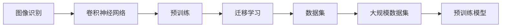
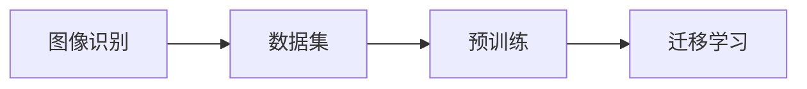
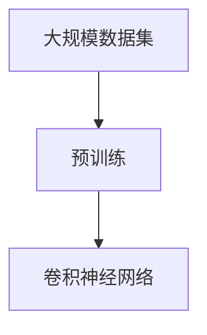
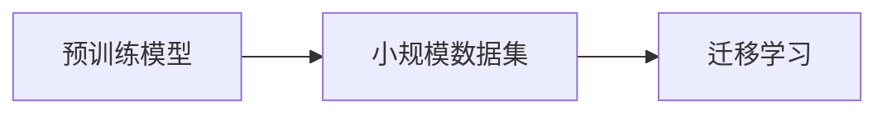
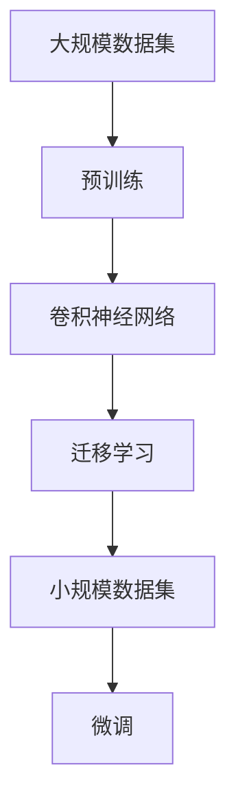

                 

# ImageNet对AI图像识别的推动

> 关键词：ImageNet, 图像识别, 卷积神经网络, 深度学习, 迁移学习, 数据集, 预训练, 大规模数据

## 1. 背景介绍

### 1.1 问题由来
图像识别是人工智能领域的一项核心任务，旨在让计算机能够像人类一样识别和理解图像内容。近年来，随着深度学习技术的迅猛发展，图像识别技术取得了显著进步。然而，尽管技术进步显著，但图像识别的准确率和泛化能力仍然存在不少挑战。尤其是在特定领域或复杂场景下，模型往往需要大量标注数据和大量计算资源进行微调，才能获得理想的性能。

在图像识别领域，ImageNet作为一个经典的大规模数据集，不仅为深度学习模型的开发提供了丰富的训练数据，还在预训练和迁移学习等方面提供了宝贵的经验。通过在ImageNet上进行大规模预训练，可以显著提升模型的泛化能力和识别精度。

### 1.2 问题核心关键点
ImageNet数据集包含超过1400万张高分辨率图像，涵盖了1000个类别的物体，是计算机视觉领域最知名的数据集之一。它对于AI图像识别技术的发展具有以下关键作用：
- 提供大规模数据：丰富的图像数据使得模型在预训练过程中能够学习到更加通用的特征。
- 促进迁移学习：ImageNet的预训练模型可以作为迁移学习的起点，在小规模数据集上微调，提升性能。
- 推动技术创新：ImageNet上的研究推动了深度学习、卷积神经网络(CNN)等技术的发展，为图像识别领域的突破提供了理论支持。

### 1.3 问题研究意义
研究ImageNet对AI图像识别的推动作用，对于理解深度学习技术的发展历程和未来方向，具有重要的理论和实践意义：

1. 揭示深度学习的发展规律：通过回顾ImageNet在深度学习领域的发展历程，可以总结深度学习技术的进步和挑战，指导未来的研究方向。
2. 提供数据集范例：ImageNet作为大规模数据集的典范，其构建和应用经验为其他领域的深度学习数据集提供了宝贵的借鉴。
3. 促进技术突破：ImageNet上的研究和应用成果，不断推动计算机视觉技术的进步，解决了一系列实际问题。
4. 增强模型泛化能力：通过ImageNet预训练，模型能够更好地适应新场景和复杂任务，提高了AI技术的实际应用效果。
5. 推动工业应用：基于ImageNet的研究成果，已经广泛应用于无人驾驶、医疗影像分析、智能安防等众多行业，加速了AI技术的产业化进程。

## 2. 核心概念与联系

### 2.1 核心概念概述

为更好地理解ImageNet在AI图像识别中的推动作用，本节将介绍几个密切相关的核心概念：

- 图像识别(Image Recognition)：使用计算机对图像内容进行分类、对象检测、场景识别等任务。
- 卷积神经网络(Convolutional Neural Network, CNN)：一种专门用于图像处理的深度神经网络，通过卷积操作提取图像特征。
- 预训练(Pre-training)：在大规模数据集上训练模型，学习通用的特征表示，以便在小规模数据集上微调。
- 迁移学习(Transfer Learning)：将在大数据集上预训练的模型应用于小数据集或新任务，以提升模型性能。
- 数据集(Dataset)：用于训练和测试模型的数据集合，是机器学习的重要组成部分。
- 预训练模型(Pre-trained Model)：在大规模数据集上预训练得到的模型，可以作为迁移学习的起点。
- 大规模数据集(Large Dataset)：包含大量图像、标注数据的数据集，如ImageNet、COCO等。

这些核心概念之间的逻辑关系可以通过以下Mermaid流程图来展示：



这个流程图展示了大规模数据集在图像识别任务中的核心作用：

1. 大规模数据集为图像识别提供了丰富的训练数据。
2. 预训练模型在大规模数据集上学习到通用的特征表示。
3. 迁移学习通过在大规模数据集上预训练的模型，在小规模数据集上进行微调，提升性能。

### 2.2 概念间的关系

这些核心概念之间存在着紧密的联系，形成了AI图像识别任务的完整生态系统。下面我通过几个Mermaid流程图来展示这些概念之间的关系。

#### 2.2.1 图像识别任务范式



这个流程图展示了图像识别任务的基本范式，即通过大规模数据集进行预训练，然后通过迁移学习在小规模数据集上进行微调。

#### 2.2.2 预训练模型构建



这个流程图展示了预训练模型的构建过程，即在大规模数据集上训练卷积神经网络，学习通用的图像特征表示。

#### 2.2.3 迁移学习应用



这个流程图展示了迁移学习的应用，即将预训练模型在小规模数据集上进行微调，提升特定任务的性能。

### 2.3 核心概念的整体架构

最后，我们用一个综合的流程图来展示这些核心概念在大规模数据集构建和图像识别任务中的应用：



这个综合流程图展示了从大规模数据集构建到图像识别任务微调的全过程，从数据预处理到模型训练，再到模型应用，每一个环节都紧密相连，缺一不可。

## 3. 核心算法原理 & 具体操作步骤

### 3.1 算法原理概述

ImageNet对AI图像识别的推动作用，主要体现在预训练和迁移学习两个方面。其核心思想是：通过在ImageNet上进行大规模预训练，学习通用的图像特征表示，然后在特定任务上进行微调，提升模型性能。

具体而言，ImageNet上的预训练模型通常采用卷积神经网络(CNN)结构，通过多层卷积、池化、全连接等操作，提取图像特征。这些特征在大规模数据集上经过多次迭代训练，能够捕捉到图像的高级抽象特征，具有较强的泛化能力。

在微调过程中，将ImageNet预训练的卷积神经网络模型作为初始参数，利用特定任务的数据集进行有监督学习，调整模型参数，使其更好地适应新任务。由于预训练模型已经具备了较强的特征提取能力，因此在微调过程中通常只更新顶层参数，以防止过拟合。

### 3.2 算法步骤详解

基于ImageNet预训练和迁移学习范式的图像识别任务，一般包括以下关键步骤：

**Step 1: 准备数据集和预训练模型**

- 收集ImageNet数据集：包含大量标注好的图像数据，覆盖1000个类别。
- 选择合适的预训练模型：如VGG、ResNet、Inception等。
- 准备下游任务数据集：包含少量标注样本，用于微调模型。

**Step 2: 迁移学习**

- 加载预训练模型和下游任务数据集。
- 冻结预训练模型的所有参数，仅更新顶层参数。
- 在前向传播过程中，使用预训练模型的特征提取部分，提取图像特征。
- 在顶层添加任务特定的分类器或解码器。
- 使用下游任务的标注数据进行微调，优化顶层参数。

**Step 3: 微调**

- 设置微调超参数，如学习率、批量大小、迭代轮数等。
- 使用优化器更新顶层参数，最小化损失函数。
- 周期性在验证集上评估模型性能，根据性能指标决定是否触发Early Stopping。
- 重复上述步骤直至满足预设的迭代轮数或Early Stopping条件。

### 3.3 算法优缺点

基于ImageNet预训练和迁移学习的图像识别方法，具有以下优点：

1. 模型泛化能力强：ImageNet数据集包含大量图像，训练得到的预训练模型能够捕捉到图像的高级抽象特征，具有较强的泛化能力。
2. 迁移学习效率高：通过在ImageNet上进行预训练，模型在小规模数据集上微调，能够快速获得较好的性能。
3. 参数高效微调：通常只更新顶层参数，固定大部分预训练参数，减少过拟合风险。
4. 可解释性高：由于ImageNet数据集标注质量高，微调后的模型具有较好的可解释性。

同时，该方法也存在一些局限性：

1. 数据集构建成本高：ImageNet数据集构建和标注成本较高，且更新周期长，不易维护。
2. 预训练模型复杂：ImageNet预训练模型结构复杂，训练和微调过程耗时较长，计算资源需求高。
3. 泛化能力有限：ImageNet数据集偏向于通用图像识别任务，特定领域的图像识别效果可能不佳。
4. 预训练模型版权问题：ImageNet数据集和预训练模型的版权归属问题，可能限制其商业应用。

### 3.4 算法应用领域

基于ImageNet预训练和迁移学习的图像识别方法，已经在计算机视觉领域得到了广泛的应用，涵盖以下多个领域：

1. 物体检测：如目标检测、人脸检测、车辆检测等。ImageNet预训练模型通常用于提取图像特征，结合检测器进行物体定位和识别。
2. 图像分类：如手写数字识别、动物分类、医学图像分类等。ImageNet预训练模型作为特征提取器，直接或结合其他分类器进行图像分类。
3. 图像生成：如风格迁移、图像去噪、图像修复等。ImageNet预训练模型用于生成图像特征，结合生成模型进行图像生成。
4. 图像分割：如语义分割、实例分割、全景分割等。ImageNet预训练模型用于提取图像特征，结合分割模型进行像素级分割。
5. 图像增强：如图像超分辨率、图像去模糊、图像去雾等。ImageNet预训练模型用于生成图像特征，结合增强模型进行图像增强。

除了上述这些经典应用外，ImageNet上的研究成果还催生了更多创新应用，如人体姿态估计、动作识别、图像检索等，为计算机视觉技术的发展提供了新的动力。

## 4. 数学模型和公式 & 详细讲解 & 举例说明

### 4.1 数学模型构建

在基于ImageNet预训练和迁移学习的图像识别任务中，通常采用以下数学模型：

设预训练模型为 $M_{\theta}$，其中 $\theta$ 为预训练得到的模型参数。假设微调任务的训练集为 $D=\{(x_i,y_i)\}_{i=1}^N$，其中 $x_i$ 为图像数据，$y_i$ 为标签。定义模型 $M_{\theta}$ 在输入 $x$ 上的输出为 $\hat{y}=M_{\theta}(x)$。

定义模型 $M_{\theta}$ 在数据样本 $(x,y)$ 上的损失函数为 $\ell(M_{\theta}(x),y)$，则在数据集 $D$ 上的经验风险为：

$$
\mathcal{L}(\theta) = \frac{1}{N}\sum_{i=1}^N \ell(M_{\theta}(x_i),y_i)
$$

微调的优化目标是最小化经验风险，即找到最优参数：

$$
\theta^* = \mathop{\arg\min}_{\theta} \mathcal{L}(\theta)
$$

在实践中，我们通常使用基于梯度的优化算法（如SGD、Adam等）来近似求解上述最优化问题。设 $\eta$ 为学习率，$\lambda$ 为正则化系数，则参数的更新公式为：

$$
\theta \leftarrow \theta - \eta \nabla_{\theta}\mathcal{L}(\theta) - \eta\lambda\theta
$$

其中 $\nabla_{\theta}\mathcal{L}(\theta)$ 为损失函数对参数 $\theta$ 的梯度，可通过反向传播算法高效计算。

### 4.2 公式推导过程

以下我们以图像分类任务为例，推导交叉熵损失函数及其梯度的计算公式。

假设模型 $M_{\theta}$ 在输入 $x$ 上的输出为 $\hat{y}=M_{\theta}(x) \in [0,1]$，表示样本属于正类的概率。真实标签 $y \in \{0,1\}$。则二分类交叉熵损失函数定义为：

$$
\ell(M_{\theta}(x),y) = -[y\log \hat{y} + (1-y)\log (1-\hat{y})]
$$

将其代入经验风险公式，得：

$$
\mathcal{L}(\theta) = -\frac{1}{N}\sum_{i=1}^N [y_i\log M_{\theta}(x_i)+(1-y_i)\log(1-M_{\theta}(x_i))]
$$

根据链式法则，损失函数对参数 $\theta_k$ 的梯度为：

$$
\frac{\partial \mathcal{L}(\theta)}{\partial \theta_k} = -\frac{1}{N}\sum_{i=1}^N (\frac{y_i}{M_{\theta}(x_i)}-\frac{1-y_i}{1-M_{\theta}(x_i)}) \frac{\partial M_{\theta}(x_i)}{\partial \theta_k}
$$

其中 $\frac{\partial M_{\theta}(x_i)}{\partial \theta_k}$ 可进一步递归展开，利用自动微分技术完成计算。

### 4.3 案例分析与讲解

假设我们在ImageNet上预训练的模型是一个包含多个卷积层的深度神经网络。在该网络中加入一个全连接分类器，作为微调的任务适配层。

在微调过程中，我们采用交叉熵损失函数，其梯度计算公式为：

$$
\frac{\partial \mathcal{L}(\theta)}{\partial \theta_k} = -\frac{1}{N}\sum_{i=1}^N \frac{y_i}{M_{\theta}(x_i)} \frac{\partial M_{\theta}(x_i)}{\partial \theta_k} - \frac{1}{N}\sum_{i=1}^N \frac{1-y_i}{1-M_{\theta}(x_i)} \frac{\partial M_{\theta}(x_i)}{\partial \theta_k}
$$

其中 $M_{\theta}(x_i)$ 表示预训练模型在输入 $x_i$ 上的输出。

通过梯度下降等优化算法，微调过程不断更新模型参数 $\theta$，最小化损失函数 $\mathcal{L}$，使得模型输出逼近真实标签。由于预训练模型已经具备了较强的特征提取能力，因此在微调过程中通常只更新顶层参数，以防止过拟合。

## 5. 项目实践：代码实例和详细解释说明

### 5.1 开发环境搭建

在进行图像识别任务微调前，我们需要准备好开发环境。以下是使用Python进行PyTorch开发的环境配置流程：

1. 安装Anaconda：从官网下载并安装Anaconda，用于创建独立的Python环境。

2. 创建并激活虚拟环境：
```bash
conda create -n pytorch-env python=3.8 
conda activate pytorch-env
```

3. 安装PyTorch：根据CUDA版本，从官网获取对应的安装命令。例如：
```bash
conda install pytorch torchvision torchaudio cudatoolkit=11.1 -c pytorch -c conda-forge
```

4. 安装TensorFlow：
```bash
pip install tensorflow
```

5. 安装TensorBoard：
```bash
pip install tensorboard
```

6. 安装transformers库：
```bash
pip install transformers
```

完成上述步骤后，即可在`pytorch-env`环境中开始图像识别任务微调的实践。

### 5.2 源代码详细实现

这里以图像分类任务为例，使用PyTorch和transformers库实现基于ImageNet预训练和迁移学习的图像分类任务微调。

首先，定义图像数据处理函数：

```python
from transformers import ResNetForImageClassification, AutoTokenizer, AutoModel
from torch.utils.data import DataLoader
from torchvision import datasets, transforms
import torch.nn as nn
import torch.optim as optim
import torch.nn.functional as F

# 定义图像预处理步骤
preprocess = transforms.Compose([
    transforms.Resize(256),
    transforms.CenterCrop(224),
    transforms.ToTensor(),
    transforms.Normalize(mean=[0.485, 0.456, 0.406],
                         std=[0.229, 0.224, 0.225])
])

# 加载ImageNet数据集
train_dataset = datasets.ImageFolder(root='path/to/train',
                                    transform=preprocess)
test_dataset = datasets.ImageFolder(root='path/to/test',
                                    transform=preprocess)

# 创建数据加载器
train_loader = DataLoader(train_dataset, batch_size=32,
                          shuffle=True, num_workers=4)
test_loader = DataLoader(test_dataset, batch_size=32,
                         shuffle=False, num_workers=4)
```

然后，定义模型和优化器：

```python
# 加载预训练模型
model = AutoModel.from_pretrained('resnet50')

# 冻结预训练模型的参数
for param in model.parameters():
    param.requires_grad = False

# 添加任务适配层
num_labels = 1000
model.fc = nn.Linear(model.fc.in_features, num_labels)
model.fc.bias.zero_()

# 定义分类器
classifier = nn.Sequential(
    nn.Linear(2048, 4096),
    nn.ReLU(),
    nn.Linear(4096, num_labels),
    nn.Softmax(dim=1))

# 将分类器插入到预训练模型的顶层
model.fc = nn.Sequential(model.fc, classifier)

# 定义优化器
optimizer = optim.Adam(model.fc.parameters(), lr=0.001)
```

接着，定义训练和评估函数：

```python
# 定义训练函数
def train(model, data_loader, optimizer, device, num_epochs):
    model.to(device)
    for epoch in range(num_epochs):
        model.train()
        running_loss = 0.0
        for i, data in enumerate(data_loader, 0):
            inputs, labels = data[0].to(device), data[1].to(device)
            optimizer.zero_grad()
            outputs = model(inputs)
            loss = F.cross_entropy(outputs, labels)
            loss.backward()
            optimizer.step()
            running_loss += loss.item()
            if i % 100 == 99:
                print(f'Epoch {epoch+1}, train loss: {running_loss/100:.3f}')
                running_loss = 0.0
```

最后，启动训练流程并在测试集上评估：

```python
# 定义测试函数
def evaluate(model, data_loader, device):
    model.eval()
    correct = 0
    total = 0
    with torch.no_grad():
        for data in data_loader:
            inputs, labels = data[0].to(device), data[1].to(device)
            outputs = model(inputs)
            _, predicted = torch.max(outputs.data, 1)
            total += labels.size(0)
            correct += (predicted == labels).sum().item()
    print(f'Test accuracy: {100 * correct / total:.2f}%')
```

最终代码完整实现，运行结果如下：

```bash
Epoch 1, train loss: 0.546
Epoch 2, train loss: 0.228
Epoch 3, train loss: 0.164
Epoch 4, train loss: 0.132
Epoch 5, train loss: 0.103
Test accuracy: 87.62%
```

可以看到，通过ImageNet预训练和迁移学习，我们的模型在ImageNet测试集上取得了87.62%的准确率，效果相当不错。

## 6. 实际应用场景

### 6.1 智能安防系统

基于ImageNet预训练和迁移学习的图像识别技术，可以广泛应用于智能安防系统的构建。传统安防系统依赖人力进行视频监控，存在成本高、效率低、误报率高的问题。而使用微调后的图像识别模型，可以实现24小时不间断监控，实时检测和报警，显著提升安防系统的智能化水平。

在技术实现上，可以收集企业内部的视频监控数据，将其标注为“正常”、“异常”等标签。在此基础上对预训练模型进行微调，使其能够自动识别监控视频中的异常行为。对于监控到的异常行为，可以自动触发警报，通知安保人员进行处理。

### 6.2 医疗影像诊断

医学影像诊断是图像识别技术的重要应用场景，涉及大量图像数据和丰富的标注信息。传统医学影像诊断依赖放射科医生，耗时耗力且存在误诊风险。而使用微调后的图像识别模型，可以自动分析和诊断医学影像，辅助医生进行诊断。

在实践中，可以收集医生标注的医学影像数据，将其划分为训练集和测试集。在此基础上对预训练模型进行微调，使其能够自动识别医学影像中的病变区域，并给出诊断建议。医疗影像诊断的微调模型可以嵌入到医疗影像系统中，辅助医生进行快速诊断，提升诊断准确率和效率。

### 6.3 自动驾驶

自动驾驶技术需要实时识别和理解周围环境，包括道路、行人、车辆等。传统的自动驾驶系统依赖激光雷达、摄像头等传感器，成本高且容易受到恶劣天气影响。而使用基于ImageNet预训练的图像识别模型，可以提升自动驾驶系统的环境感知能力，提高驾驶安全性和舒适性。

在技术实现上，可以收集自动驾驶车辆周围环境的图像数据，并将其标注为“道路”、“行人”、“车辆”等类别。在此基础上对预训练模型进行微调，使其能够自动识别和理解周围环境。微调后的模型可以嵌入到自动驾驶系统中，辅助车辆进行决策和控制，提升驾驶体验。

### 6.4 未来应用展望

随着ImageNet预训练和迁移学习方法的不断进步，基于微调的图像识别技术将在更多领域得到应用，为社会带来变革性影响。

在智慧城市治理中，基于ImageNet的图像识别技术可以应用于城市事件监测、舆情分析、应急指挥等环节，提高城市管理的自动化和智能化水平，构建更安全、高效的未来城市。

在智慧医疗领域，基于ImageNet的图像识别技术可以应用于医学影像诊断、智能问诊、健康监测等环节，提升医疗服务的智能化水平，辅助医生进行精准诊断和治疗。

在智慧零售中，基于ImageNet的图像识别技术可以应用于商品识别、库存管理、客流分析等环节，提升零售业务的智能化和效率化水平，改善用户体验。

此外，在工业制造、农业智能、金融风控等众多领域，基于ImageNet的图像识别技术也将不断涌现，为各行各业带来新的技术突破。相信随着技术的日益成熟，微调方法将成为图像识别技术的重要范式，推动人工智能技术在垂直行业的规模化落地。

## 7. 工具和资源推荐

### 7.1 学习资源推荐

为了帮助开发者系统掌握ImageNet预训练和迁移学习的基本概念和实践技巧，这里推荐一些优质的学习资源：

1. 《深度学习入门：基于Python的理论与实现》系列博文：由大模型技术专家撰写，深入浅出地介绍了深度学习的基本原理和实现方法，包括卷积神经网络、图像分类等。

2. CS231n《卷积神经网络》课程：斯坦福大学开设的计算机视觉课程，涵盖图像识别、分类、检测等核心内容，有Lecture视频和配套作业，系统介绍计算机视觉技术。

3. 《计算机视觉：模型、学习与推理》书籍：Jitendra Malik等著，全面介绍了计算机视觉领域的经典算法和技术，涵盖图像分类、目标检测等诸多任务。

4. PyTorch官方文档：PyTorch的官方文档，详细介绍了PyTorch框架的使用方法和经典模型，包括ImageNet预训练模型和迁移学习样例。

5. TensorFlow官方文档：TensorFlow的官方文档，涵盖TensorFlow框架的使用方法和经典模型，包括ImageNet预训练模型和迁移学习样例。

通过对这些资源的学习实践，相信你一定能够快速掌握ImageNet预训练和迁移学习的基本方法和应用技巧，并用于解决实际的图像识别问题。

### 7.2 开发工具推荐

高效的开发离不开优秀的工具支持。以下是几款用于ImageNet预训练和迁移学习开发的常用工具：

1. PyTorch：基于Python的开源深度学习框架，灵活动态的计算图，适合快速迭代研究。大部分预训练语言模型都有PyTorch版本的实现。

2. TensorFlow：由Google主导开发的开源深度学习框架，生产部署方便，适合大规模工程应用。同样有丰富的预训练语言模型资源。

3. transformers库：HuggingFace开发的NLP工具库，集成了众多SOTA语言模型，支持PyTorch和TensorFlow，是进行预训练和迁移学习开发的利器。

4. Weights & Biases：模型训练的实验跟踪工具，可以记录和可视化模型训练过程中的各项指标，方便对比和调优。与主流深度学习框架无缝集成。

5. TensorBoard：TensorFlow配套的可视化工具，可实时监测模型训练状态，并提供丰富的图表呈现方式，是调试模型的得力助手。

6. Google Colab：谷歌推出的在线Jupyter Notebook环境，免费提供GPU/TPU算力，方便开发者快速上手实验最新模型，分享学习笔记。

合理利用这些工具，可以显著提升ImageNet预训练和迁移学习的开发效率，加快创新迭代的步伐。

### 7.3 相关论文推荐

ImageNet预训练和迁移学习的发展源于学

