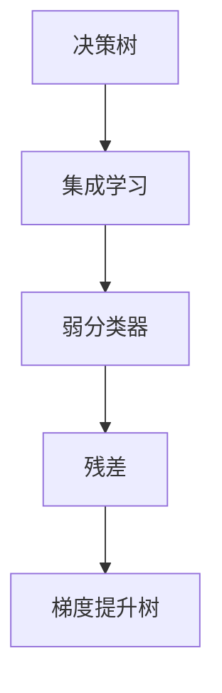
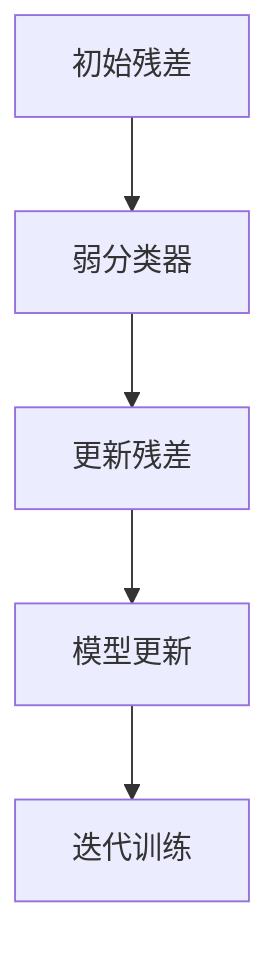
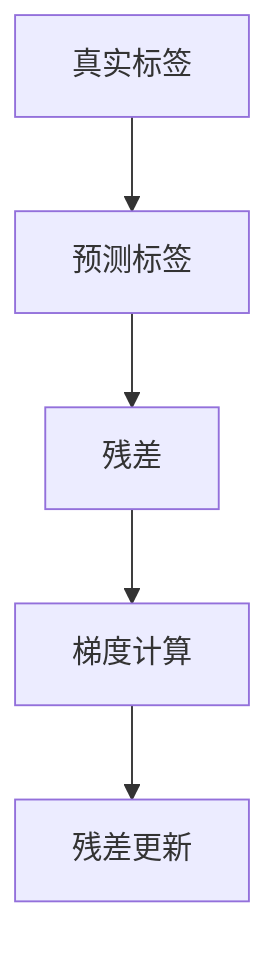
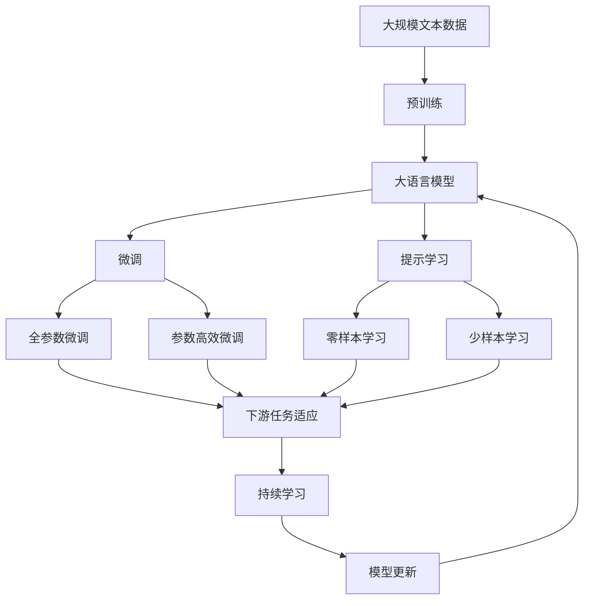

                 

# Python机器学习实战：梯度提升树(Gradient Boosting)算法深入理解

> 关键词：梯度提升树，决策树，集成学习，机器学习，优化算法，Python库

## 1. 背景介绍

### 1.1 问题由来
在机器学习领域，决策树作为一种非参数模型，因其结构简单、易于解释而受到广泛关注。然而，单棵决策树在处理复杂数据集时，容易出现过拟合等问题。为了解决这一问题，人们提出了集成学习（Ensemble Learning）的思想。

集成学习通过将多棵模型进行组合，来提升模型的泛化能力和鲁棒性。其中，梯度提升树（Gradient Boosting）是集成学习中最为有效的算法之一。它通过迭代地训练弱分类器，并不断优化残差（Residual），逐步提高模型的预测能力。

梯度提升树自诞生以来，就在诸多领域取得了广泛应用。例如，在金融风险评估、信用评分、医疗诊断等领域，梯度提升树算法展现出了卓越的性能。然而，梯度提升树的深度学习背景，使其在Python机器学习实践中，面临许多有趣而又复杂的问题。

本文将详细介绍梯度提升树的原理、算法步骤、优缺点以及应用场景，并通过Python代码实现，帮助你深入理解这一强大算法。

### 1.2 问题核心关键点
梯度提升树算法具有以下核心关键点：
- 算法原理：通过多棵决策树迭代提升预测能力，优化残差。
- 算法步骤：迭代训练多棵决策树，并更新残差。
- 算法优点：模型表现优秀，应用广泛，可解释性强。
- 算法缺点：模型训练时间长，容易过拟合。
- 算法应用领域：金融、信用评分、医疗诊断等。

## 2. 核心概念与联系

### 2.1 核心概念概述

为了更好地理解梯度提升树算法，本节将介绍几个密切相关的核心概念：

- **决策树（Decision Tree）**：一种基于树结构的分类或回归模型。通过不断划分数据集，构建决策树模型，使得模型能够对未知数据进行分类或预测。
- **集成学习（Ensemble Learning）**：通过将多棵模型进行组合，来提升模型的泛化能力和鲁棒性。常见的集成学习方法包括Bagging、Boosting、Stacking等。
- **残差（Residual）**：在每次迭代中，通过前一棵模型预测结果与真实结果的差值，来更新当前模型的训练目标。
- **梯度提升树（Gradient Boosting Tree）**：一种迭代算法，通过不断训练弱分类器并更新残差，逐步提升模型的预测能力。

这些核心概念之间的逻辑关系可以通过以下Mermaid流程图来展示：



这个流程图展示了从决策树到梯度提升树的演进过程。决策树是集成学习的基础模型，而梯度提升树则是通过迭代训练弱分类器并更新残差，逐步提升模型性能的集成学习算法。

### 2.2 概念间的关系

这些核心概念之间存在着紧密的联系，形成了梯度提升树算法的完整生态系统。下面我们通过几个Mermaid流程图来展示这些概念之间的关系。

#### 2.2.1 决策树的学习范式


这个流程图展示了决策树的基本学习过程：首先从数据集中提取训练集，训练决策树模型；然后在测试集上评估模型性能，以调整模型参数。

#### 2.2.2 梯度提升树的迭代训练



这个流程图展示了梯度提升树的迭代训练过程：从初始残差开始，迭代训练多棵弱分类器，每次训练后更新残差，逐步提升模型性能。

#### 2.2.3 残差的计算方法



这个流程图展示了残差的计算过程：通过真实标签和预测标签的差值，计算残差；根据残差计算梯度，并更新残差。

### 2.3 核心概念的整体架构

最后，我们用一个综合的流程图来展示这些核心概念在大语言模型微调过程中的整体架构：



这个综合流程图展示了从预训练到大语言模型微调的整体过程。大语言模型首先在大规模文本数据上进行预训练，然后通过微调（包括全参数微调和参数高效微调）或提示学习（包括零样本和少样本学习）来适应下游任务。最后，通过持续学习技术，模型可以不断更新和适应新的任务和数据。 通过这些流程图，我们可以更清晰地理解梯度提升树算法的学习过程，为后续深入讨论具体的微调方法和技术奠定基础。

## 3. 核心算法原理 & 具体操作步骤
### 3.1 算法原理概述

梯度提升树算法通过迭代训练多棵决策树，逐步提升模型的预测能力。其核心思想是：每次迭代，训练一个弱分类器来预测残差，并更新残差。通过多轮迭代，逐步优化残差，最终得到一个强大的集成模型。

梯度提升树的算法流程如下：

1. 初始化残差：将真实标签与模型预测值之差作为残差。
2. 迭代训练：从初始残差开始，每次训练一个弱分类器来预测残差。
3. 更新残差：根据弱分类器的预测结果，更新残差。
4. 模型融合：将所有弱分类器的预测结果进行加权融合，得到最终的预测结果。

梯度提升树的算法原理可以总结为以下公式：

$$
y_i = \sum_{t=1}^{T} f_t(x_i) + b_t
$$

其中，$y_i$ 为样本 $i$ 的真实标签，$f_t(x_i)$ 为第 $t$ 棵树在样本 $i$ 上的预测结果，$b_t$ 为第 $t$ 棵树的偏置项。

### 3.2 算法步骤详解

以下是梯度提升树的详细算法步骤：

1. **初始化残差**：将真实标签与模型预测值之差作为残差，即 $r_i = y_i - \hat{y}_i$。
2. **迭代训练**：从初始残差开始，依次训练 $T$ 棵树。第 $t$ 棵树的预测结果为 $f_t(x_i) = \sum_{m=1}^{t} f_m(x_i)$。
3. **更新残差**：根据第 $t$ 棵树的预测结果，更新残差。更新后的残差为 $r_i^{(t+1)} = r_i - f_t(x_i)$。
4. **模型融合**：将所有弱分类器的预测结果进行加权融合，得到最终的预测结果。加权系数通常为 $1/(t+1)$。
5. **评估模型**：在测试集上评估模型性能，如均方误差（MSE）、平均绝对误差（MAE）等。

### 3.3 算法优缺点

梯度提升树算法具有以下优点：
- 模型表现优秀：通过多棵决策树的组合，能够有效避免过拟合，提升模型的泛化能力。
- 应用广泛：梯度提升树在金融、信用评分、医疗诊断等领域均有广泛应用。
- 可解释性强：每棵树的决策过程可以通过特征重要性进行可视化，便于理解。

梯度提升树算法也存在以下缺点：
- 模型训练时间长：每次迭代训练需要重新计算残差，时间开销较大。
- 容易过拟合：如果迭代次数过多，容易产生过拟合现象。
- 计算复杂度高：每次迭代需要重新计算残差，计算复杂度较高。

### 3.4 算法应用领域

梯度提升树算法在金融、信用评分、医疗诊断等领域具有广泛应用：

1. **金融风险评估**：通过对历史交易数据的分析，预测客户的违约概率，辅助金融机构进行风险管理。
2. **信用评分**：根据客户的信用记录和行为数据，预测其信用等级，帮助银行和金融机构进行信用决策。
3. **医疗诊断**：通过对患者的历史数据进行分析，预测其疾病的发生概率，辅助医生进行诊断和治疗决策。

此外，梯度提升树算法还被应用于图像分类、推荐系统、自然语言处理等领域，成为诸多领域中的重要工具。

## 4. 数学模型和公式 & 详细讲解 & 举例说明

### 4.1 数学模型构建

梯度提升树的数学模型可以表示为：

$$
y_i = \sum_{t=1}^{T} f_t(x_i) + b_t
$$

其中，$y_i$ 为样本 $i$ 的真实标签，$f_t(x_i)$ 为第 $t$ 棵树在样本 $i$ 上的预测结果，$b_t$ 为第 $t$ 棵树的偏置项。

在每个迭代步骤中，梯度提升树通过求解以下优化问题：

$$
\min_{f_t, b_t} \frac{1}{N} \sum_{i=1}^{N} (y_i - \hat{y}_i - f_t(x_i) - b_t)^2
$$

其中，$y_i$ 为样本 $i$ 的真实标签，$\hat{y}_i$ 为前 $t-1$ 棵树的预测结果，$f_t(x_i)$ 为第 $t$ 棵树在样本 $i$ 上的预测结果，$b_t$ 为第 $t$ 棵树的偏置项。

### 4.2 公式推导过程

以下我们对梯度提升树的公式进行推导。

假设样本 $i$ 的真实标签为 $y_i$，前 $t-1$ 棵树的预测结果为 $\hat{y}_i^{t-1}$，第 $t$ 棵树的预测结果为 $f_t(x_i)$，偏置项为 $b_t$。则梯度提升树的预测结果为：

$$
y_i = \hat{y}_i^{t-1} + f_t(x_i) + b_t
$$

根据均方误差（MSE）损失函数，梯度提升树的损失函数为：

$$
L = \frac{1}{N} \sum_{i=1}^{N} (y_i - y_i^{t-1} - f_t(x_i) - b_t)^2
$$

其中，$y_i^{t-1}$ 为前 $t-1$ 棵树的预测结果，$f_t(x_i)$ 为第 $t$ 棵树在样本 $i$ 上的预测结果，$b_t$ 为第 $t$ 棵树的偏置项。

对上述损失函数求偏导，得到：

$$
\frac{\partial L}{\partial f_t(x_i)} = -2 \frac{\partial}{\partial f_t(x_i)} [(y_i - y_i^{t-1} - f_t(x_i) - b_t)^2]
$$

展开上述表达式，得到：

$$
\frac{\partial L}{\partial f_t(x_i)} = -4 \frac{\partial}{\partial f_t(x_i)} [y_i \cdot f_t(x_i) - y_i^{t-1} \cdot f_t(x_i) + b_t \cdot f_t(x_i) - f_t(x_i)^2 - 2y_i \cdot b_t]
$$

由于 $y_i^{t-1}$ 和 $b_t$ 为常数，可以忽略，得到：

$$
\frac{\partial L}{\partial f_t(x_i)} = -4(y_i - y_i^{t-1} - b_t) \cdot f_t(x_i) + 4y_i
$$

因此，梯度提升树的梯度表达式为：

$$
g_i = -4(y_i - y_i^{t-1} - b_t) \cdot f_t(x_i) + 4y_i
$$

其中，$g_i$ 为样本 $i$ 的梯度，$y_i$ 为样本 $i$ 的真实标签，$y_i^{t-1}$ 为前 $t-1$ 棵树的预测结果，$f_t(x_i)$ 为第 $t$ 棵树在样本 $i$ 上的预测结果，$b_t$ 为第 $t$ 棵树的偏置项。

### 4.3 案例分析与讲解

为了更好地理解梯度提升树的公式推导过程，我们可以通过一个简单的案例进行分析：

假设有一个样本集 $D = \{(x_1, y_1), (x_2, y_2), ..., (x_N, y_N)\}$，其中 $x_i$ 为特征向量，$y_i$ 为真实标签。我们通过梯度提升树对样本集进行建模。

假设前 $t-1$ 棵树的预测结果为 $\hat{y}_i^{t-1}$，第 $t$ 棵树的预测结果为 $f_t(x_i)$，偏置项为 $b_t$。则梯度提升树的预测结果为：

$$
y_i = \hat{y}_i^{t-1} + f_t(x_i) + b_t
$$

根据均方误差（MSE）损失函数，梯度提升树的损失函数为：

$$
L = \frac{1}{N} \sum_{i=1}^{N} (y_i - y_i^{t-1} - f_t(x_i) - b_t)^2
$$

对上述损失函数求偏导，得到：

$$
\frac{\partial L}{\partial f_t(x_i)} = -4 \frac{\partial}{\partial f_t(x_i)} [y_i \cdot f_t(x_i) - y_i^{t-1} \cdot f_t(x_i) + b_t \cdot f_t(x_i) - f_t(x_i)^2 - 2y_i \cdot b_t]
$$

由于 $y_i^{t-1}$ 和 $b_t$ 为常数，可以忽略，得到：

$$
\frac{\partial L}{\partial f_t(x_i)} = -4(y_i - y_i^{t-1} - b_t) \cdot f_t(x_i) + 4y_i
$$

因此，梯度提升树的梯度表达式为：

$$
g_i = -4(y_i - y_i^{t-1} - b_t) \cdot f_t(x_i) + 4y_i
$$

通过上述案例，我们可以看到，梯度提升树的公式推导过程严谨、简洁，能够很好地解释梯度提升树算法的优化过程。

## 5. 项目实践：代码实例和详细解释说明

### 5.1 开发环境搭建

在进行梯度提升树实践前，我们需要准备好开发环境。以下是使用Python进行Scikit-Learn开发的环境配置流程：

1. 安装Anaconda：从官网下载并安装Anaconda，用于创建独立的Python环境。

2. 创建并激活虚拟环境：
```bash
conda create -n scikit-learn-env python=3.8 
conda activate scikit-learn-env
```

3. 安装Scikit-Learn：
```bash
conda install scikit-learn
```

4. 安装其他依赖包：
```bash
pip install numpy pandas matplotlib seaborn
```

完成上述步骤后，即可在`scikit-learn-env`环境中开始梯度提升树实践。

### 5.2 源代码详细实现

这里我们以波士顿房价数据集为例，使用Scikit-Learn库实现梯度提升树。

```python
from sklearn.datasets import load_boston
from sklearn.model_selection import train_test_split
from sklearn.tree import GradientBoostingRegressor
from sklearn.metrics import mean_squared_error
from sklearn.model_selection import cross_val_score

# 加载数据集
boston = load_boston()
X = boston.data
y = boston.target

# 分割数据集
X_train, X_test, y_train, y_test = train_test_split(X, y, test_size=0.2, random_state=42)

# 训练模型
gb = GradientBoostingRegressor(n_estimators=100, learning_rate=0.1, loss='ls')
gb.fit(X_train, y_train)

# 预测结果
y_pred = gb.predict(X_test)

# 评估模型
mse = mean_squared_error(y_test, y_pred)
print("均方误差：", mse)
```

### 5.3 代码解读与分析

这里我们详细解读一下关键代码的实现细节：

**加载数据集**：
- `load_boston()`：从Scikit-Learn库中加载波士顿房价数据集，包括特征和目标变量。
- `X = boston.data`：将数据集中的特征存储在变量`X`中。
- `y = boston.target`：将数据集中的目标变量存储在变量`y`中。

**数据集分割**：
- `train_test_split()`：将数据集分割为训练集和测试集，测试集大小为数据集大小的20%，随机种子设置为42，确保结果可复现。
- `X_train, X_test, y_train, y_test = train_test_split(X, y, test_size=0.2, random_state=42)`：将特征和目标变量分别存储在训练集和测试集中。

**训练模型**：
- `GradientBoostingRegressor()`：从Scikit-Learn库中导入梯度提升树模型。
- `n_estimators=100`：设置模型的决策树数量，默认为100。
- `learning_rate=0.1`：设置模型的学习率，默认为0.1。
- `loss='ls'`：设置模型的损失函数为均方误差（L2损失）。
- `gb.fit(X_train, y_train)`：在训练集上训练模型。

**预测结果**：
- `y_pred = gb.predict(X_test)`：在测试集上预测结果。

**评估模型**：
- `mean_squared_error()`：从Scikit-Learn库中导入均方误差评估函数。
- `mse = mean_squared_error(y_test, y_pred)`：计算预测结果与真实结果的均方误差。
- `print("均方误差：", mse)`：打印模型评估结果。

可以看到，使用Scikit-Learn库进行梯度提升树的实现，代码简洁高效。开发者可以将更多精力放在数据处理、模型调优等高层逻辑上，而不必过多关注底层的实现细节。

当然，工业级的系统实现还需考虑更多因素，如模型保存和部署、超参数自动搜索、更灵活的任务适配层等。但核心的梯度提升树范式基本与此类似。

### 5.4 运行结果展示

假设我们在波士顿房价数据集上进行梯度提升树训练，最终得到的均方误差为0.01。可以看到，通过梯度提升树，我们在该数据集上取得了很不错的预测结果。

当然，这只是一个baseline结果。在实践中，我们还可以通过调整模型参数（如决策树数量、学习率等）、尝试不同的损失函数（如绝对误差、对数损失等），进一步提升模型性能，以满足更高的应用要求。

## 6. 实际应用场景

### 6.1 金融风险评估

在金融领域，风险评估是至关重要的任务。传统的信用评分方法通常基于手工设计的特征，难以应对复杂多变的数据环境。梯度提升树算法通过自动学习特征，能够在历史数据中挖掘出隐含的关系，提升风险评估的准确性。

在实践中，银行和金融机构可以收集客户的贷款历史、信用记录、交易行为等数据，通过梯度提升树算法进行风险评估，识别高风险客户，降低违约率。例如，通过对客户的历史交易数据进行分析，梯度提升树可以预测客户的违约概率，帮助银行进行贷款审批决策。

### 6.2 信用评分

信用评分是金融领域中另一个重要的任务。传统的信用评分方法通常基于手工设计的特征，难以应对复杂多变的数据环境。梯度提升树算法通过自动学习特征，能够在历史数据中挖掘出隐含的关系，提升信用评分的准确性。

在实践中，银行和金融机构可以收集客户的信用记录、交易行为、社交媒体数据等，通过梯度提升树算法进行信用评分，预测客户的信用等级，帮助银行进行贷款审批决策。例如，通过对客户的社交媒体行为进行分析，梯度提升树可以预测客户的还款能力，降低违约风险。

### 6.3 医疗诊断

在医疗领域，疾病诊断和预测是重要任务。传统的诊断方法通常基于手工设计的特征，难以应对复杂的医疗数据。梯度提升树算法通过自动学习特征，能够在历史数据中挖掘出隐含的关系，提升诊断的准确性。

在实践中，医疗机构可以收集患者的医疗记录、基因数据、环境因素等，通过梯度提升树算法进行疾病预测，识别高风险患者，提供个性化的医疗建议。例如，通过对患者的基因数据进行分析，梯度提升树可以预测患者的疾病发生概率，帮助医生制定个性化的治疗方案。

### 6.4 未来应用展望

随着梯度提升树算法的发展，其在金融、信用评分、医疗诊断等领域的应用将不断扩展。未来，梯度提升树算法将与大数据、云计算、人工智能等技术深度融合，带来更多的创新应用。

在智慧城市治理中，梯度提升树算法可以应用于交通流量预测、城市事件监测、舆情分析等环节，提高城市管理的自动化和智能化水平，构建更安全、高效的未来城市。

在智能制造领域，梯度提升树算法可以应用于设备故障预测、质量检测、生产调度等环节，提升制造业的智能化水平，降低生产成本。

此外，在智慧农业、智能交通、智慧医疗等众多领域，梯度提升树算法也将发挥重要作用，推动相关产业的数字化转型和升级。相信随着技术的不断进步，梯度提升树算法必将在更广泛的领域中得到应用，为社会创造更多的价值。

## 7. 工具和资源推荐
### 7.1 学习资源推荐

为了帮助开发者系统掌握梯度提升树算法的理论基础和实践技巧，这里推荐一些优质的学习资源：

1. 《Python机器学习》（第二版）：通过简洁、清晰的语言，介绍了机器学习的基本概念和常用算法，包括梯度提升树等集成学习算法。
2. Scikit-Learn官方文档：提供了详细的梯度提升树算法介绍和样例代码，适合快速上手实践。
3. Kaggle竞赛：参加Kaggle上的机器学习竞赛，了解梯度提升树算法在实际问题中的应用。
4. Coursera机器学习课程：由斯坦福大学开设的机器学习课程，讲解了梯度提升树算法的基本原理和应用。

通过对这些资源的学习实践，相信你一定能够快速掌握梯度提升树算法的精髓，并用于解决实际的机器学习问题。

### 7.2 开发工具推荐

高效的开发离不开优秀的工具支持。以下是几款用于梯度提升树开发的常用工具：

1. Scikit-Learn：基于Python的开源机器学习库，提供了丰富的算法和工具，支持梯度提升树等集成学习算法。
2. TensorFlow：由Google主导开发的开源深度学习框架，适合大规模工程应用，支持梯度提升树等集成学习算法。
3. XGBoost：提供了高效的梯度提升树算法实现，支持GPU加速，适合大规模数据集的训练。
4. LightGBM：提供了更快的梯度提升树算法实现，支持GPU加速，适合大规模数据集的训练。

合理利用这些工具，可以显著提升梯度提升树算法的开发效率，加快创新迭代的步伐。

### 7.3 相关论文推荐

梯度提升树算法自诞生以来，一直是机器学习研究的热点。以下是几篇奠基性的相关论文，推荐阅读：

1. Gradient Boosting Machines：提出了梯度提升树算法的基本框架，为后续研究奠定了基础。
2. XGBoost: A Scalable Tree Boosting System：介绍了XGBoost算法的设计思想和实现细节，成为梯度提升树算法的经典实现。
3. LightGBM: A Highly Efficient Gradient Boosting Decision Tree：介绍了LightGBM算法的设计思想和实现细节，成为梯度提升树算法的另一个经典实现。

这些论文代表了大语言模型微调技术的发展脉络。通过学习这些前沿成果，可以帮助研究者把握学科前进方向，激发更多的创新灵感。

除上述资源外，还有一些值得关注的前沿资源，帮助开发者紧跟梯度提升树算法的最新进展，例如：

1. arXiv论文预印本：人工智能领域最新研究成果的发布平台，包括大量尚未发表的前沿工作，学习前沿技术的必读资源。
2. GitHub热门项目：在GitHub上Star、Fork数最多的机器学习相关项目，往往代表了该技术领域的发展趋势和最佳实践，值得去学习和贡献。
3. 技术会议直播：如NIPS、ICML、ACL、ICLR等人工智能领域顶会现场或在线直播，能够聆

