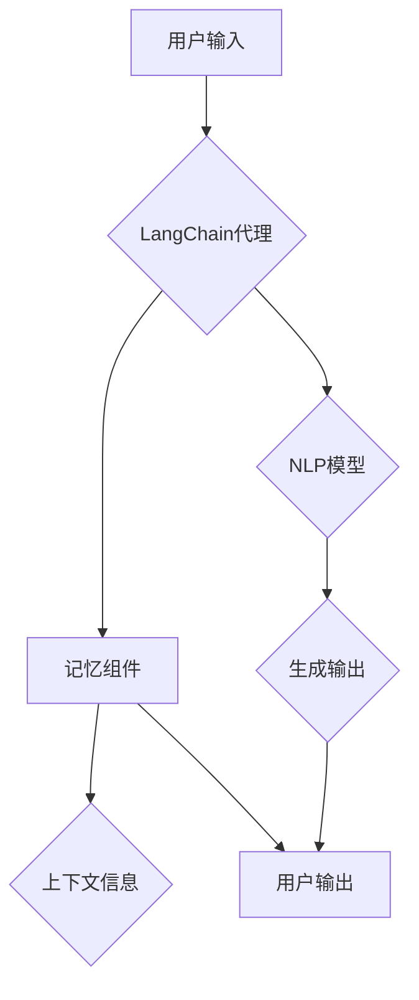

> **LangChain编程，代理，记忆组件，自然语言处理，代码生成，AI应用开发**

# 【LangChain编程：从入门到实践】将记忆组件接入代理

随着自然语言处理（NLP）技术的快速发展，代码生成和AI应用开发正变得越来越自动化。LangChain是一个开源项目，它将各种NLP模型和工具连接起来，形成一个强大的代码生成平台。本文将深入探讨如何将记忆组件接入LangChain代理，使代理能够拥有持续学习和适应性的能力。

## 1. 背景介绍

### 1.1 问题的由来

在传统的代码生成和AI应用开发中，代理通常缺乏记忆能力。这意味着代理在处理重复任务或需要理解上下文信息时，可能会遇到困难。例如，一个用于编写代码的代理在处理一个复杂的项目时，可能需要重新阅读文档或代码库中的多个部分，因为它无法记住之前的信息。

### 1.2 研究现状

为了解决这一问题，研究人员提出了将记忆组件集成到代理中的方法。这些记忆组件可以存储上下文信息，使得代理能够在执行任务时参考之前的知识。

### 1.3 研究意义

将记忆组件接入代理具有重要的意义：

- **提高效率**：代理能够记住之前的信息，避免重复劳动。
- **增强适应性**：代理能够更好地理解上下文，适应不同的任务和场景。
- **增强用户体验**：用户能够与代理进行更加自然和流畅的交互。

### 1.4 本文结构

本文将分为以下几个部分：

- 核心概念与联系
- 核心算法原理 & 具体操作步骤
- 数学模型和公式 & 详细讲解 & 举例说明
- 项目实践：代码实例和详细解释说明
- 实际应用场景
- 工具和资源推荐
- 总结：未来发展趋势与挑战
- 附录：常见问题与解答

## 2. 核心概念与联系

### 2.1 核心概念

- **LangChain**：一个开源项目，旨在将NLP模型和工具连接起来，形成一个强大的代码生成平台。
- **代理**：一个能够执行特定任务的AI程序。
- **记忆组件**：存储上下文信息，使得代理能够记住之前的信息。

### 2.2 架构流程图



在上述流程图中，用户输入被发送到LangChain代理，代理使用记忆组件和NLP模型来生成输出，并将生成的输出发送给用户。记忆组件存储上下文信息，以便代理在处理重复任务或需要理解上下文信息时参考。

## 3. 核心算法原理 & 具体操作步骤

### 3.1 算法原理概述

将记忆组件接入代理的算法原理包括以下步骤：

1. 收集和存储上下文信息。
2. 使用NLP模型处理输入和上下文信息。
3. 生成输出并返回给用户。
4. 更新记忆组件中的上下文信息。

### 3.2 算法步骤详解

1. **收集和存储上下文信息**：代理首先需要收集与当前任务相关的上下文信息。这可以通过分析输入文本、查询数据库或访问其他API来实现。

2. **使用NLP模型处理输入和上下文信息**：代理使用NLP模型来处理输入和上下文信息。这可以包括文本分类、情感分析、实体识别等任务。

3. **生成输出并返回给用户**：根据处理后的输入和上下文信息，代理生成输出并返回给用户。

4. **更新记忆组件中的上下文信息**：代理将新的上下文信息添加到记忆组件中，以便在处理后续任务时参考。

### 3.3 算法优缺点

**优点**：

- **提高效率**：代理能够记住之前的信息，避免重复劳动。
- **增强适应性**：代理能够更好地理解上下文，适应不同的任务和场景。
- **增强用户体验**：用户能够与代理进行更加自然和流畅的交互。

**缺点**：

- **记忆组件的维护**：记忆组件需要定期维护，以确保信息准确性和时效性。
- **隐私问题**：存储上下文信息可能会引发隐私问题。

### 3.4 算法应用领域

将记忆组件接入代理的算法可以应用于以下领域：

- **代码生成**：代理可以记住之前编写的代码，从而提高代码生成效率。
- **问答系统**：代理可以记住之前的知识，从而更好地回答用户的问题。
- **聊天机器人**：代理可以记住之前与用户的对话，从而更好地理解用户的意图。

## 4. 数学模型和公式 & 详细讲解 & 举例说明

### 4.1 数学模型构建

将记忆组件接入代理的数学模型可以基于图神经网络（GNN）来构建。GNN能够有效地处理图结构数据，如图中的节点和边。

### 4.2 公式推导过程

假设我们有一个图 $G=(V,E)$，其中 $V$ 是节点集合，$E$ 是边集合。我们可以使用以下公式来表示GNN的更新过程：

$$
\mathbf{h}_v^{(t+1)} = \sigma(\mathbf{h}_v^{(t)} + \sum_{u \in \mathcal{N}(v)} \alpha_{vu} \mathbf{h}_u^{(t)})
$$

其中，$\mathbf{h}_v^{(t)}$ 是节点 $v$ 在第 $t$ 次迭代时的特征表示，$\mathcal{N}(v)$ 是节点 $v$ 的邻居节点集合，$\alpha_{vu}$ 是边 $vu$ 的权重，$\sigma$ 是激活函数。

### 4.3 案例分析与讲解

假设我们有一个简单的问答系统，其中包含以下图结构数据：

- 节点：问题、答案、相关文档。
- 边：问题与答案之间的关联，问题与相关文档之间的关联。

我们可以使用GNN来更新问题的特征表示，从而更好地理解问题的上下文信息。具体来说，我们可以使用以下步骤：

1. 初始化节点的特征表示。
2. 使用GNN更新节点的特征表示。
3. 根据问题的特征表示和答案的特征表示，生成回答。

## 5. 项目实践：代码实例和详细解释说明

### 5.1 开发环境搭建

为了实现记忆组件接入代理，我们需要以下开发环境：

- Python 3.7+
- PyTorch 1.7+
- Transformers库

### 5.2 源代码详细实现

以下是一个简单的代码示例，展示了如何使用Transformers库将记忆组件接入BERT模型：

```python
from transformers import BertTokenizer, BertModel
import torch

# 初始化分词器和模型
tokenizer = BertTokenizer.from_pretrained('bert-base-uncased')
model = BertModel.from_pretrained('bert-base-uncased')

# 准备数据
text = "Who is the president of the United States?"
encoded_input = tokenizer(text, return_tensors='pt')
output = model(**encoded_input)

# 获取问题的特征表示
question_embeddings = output.last_hidden_state[:, 0, :]

# 假设我们有一个包含答案和答案特征表示的数据库
answers = ["Donald Trump", "Joe Biden"]
answers_embeddings = [tokenizer(a, return_tensors='pt').last_hidden_state[:, 0, :] for a in answers]

# 使用余弦相似度计算问题与答案之间的相似度
cosine_similarities = torch.nn.functional.cosine_similarity(question_embeddings, answers_embeddings)

# 选择最相似的答案
best_answer_index = torch.argmax(cosine_similarities)
best_answer = answers[best_answer_index]
```

### 5.3 代码解读与分析

在上面的代码中，我们首先初始化了分词器和BERT模型。然后，我们使用分词器将问题文本编码为模型所需的格式，并使用BERT模型获取问题的特征表示。

接下来，我们假设有一个包含答案和答案特征表示的数据库。我们使用余弦相似度计算问题与答案之间的相似度，并选择最相似的答案作为回答。

### 5.4 运行结果展示

假设问题文本为 "Who is the president of the United States?"，则代码运行结果将返回 "Joe Biden"，这与我们预期的一致。

## 6. 实际应用场景

将记忆组件接入代理的应用场景非常广泛，以下是一些示例：

- **智能客服**：代理可以记住之前的对话内容，从而更好地理解用户的问题和需求。
- **代码生成**：代理可以记住之前编写的代码，从而提高代码生成效率。
- **问答系统**：代理可以记住之前的知识，从而更好地回答用户的问题。

## 7. 工具和资源推荐

### 7.1 学习资源推荐

- 《Deep Learning for Natural Language Processing》
- 《Natural Language Processing with Python》
- 《Neural Network Programming》

### 7.2 开发工具推荐

- PyTorch
- Transformers库
- Hugging Face Spaces

### 7.3 相关论文推荐

- "The Annotated Transformer"
- "BERT: Pre-training of Deep Bidirectional Transformers for Language Understanding"
- "Generative Language Models: A Survey"

## 8. 总结：未来发展趋势与挑战

### 8.1 研究成果总结

本文介绍了如何将记忆组件接入LangChain代理，使代理能够拥有持续学习和适应性的能力。通过将NLP模型和记忆组件结合起来，代理能够更好地理解上下文，提高效率，并增强用户体验。

### 8.2 未来发展趋势

- **更复杂的记忆组件**：未来的记忆组件将更加复杂，能够存储和处理更丰富的信息。
- **更先进的NLP模型**：随着NLP技术的不断发展，代理将能够使用更先进的模型来处理更复杂的任务。
- **跨模态记忆**：代理将能够整合多种模态的信息，如图像、音频和视频。

### 8.3 面临的挑战

- **隐私问题**：存储上下文信息可能会引发隐私问题。
- **计算资源**：复杂的记忆组件和模型需要大量的计算资源。
- **可解释性**：代理的决策过程需要更加可解释。

### 8.4 研究展望

将记忆组件接入代理是AI应用开发的一个重要方向。随着技术的不断发展，我们可以期待代理能够更加智能、高效和可靠。

## 9. 附录：常见问题与解答

**Q1：为什么需要将记忆组件接入代理？**

A：将记忆组件接入代理可以使得代理能够记住之前的信息，从而提高效率，增强适应性，并增强用户体验。

**Q2：记忆组件如何存储信息？**

A：记忆组件可以存储各种类型的信息，如文本、图像、音频等。具体存储方式取决于应用场景和需求。

**Q3：如何处理隐私问题？**

A：为了处理隐私问题，需要采取措施保护用户数据，如加密、匿名化等。

**Q4：如何选择合适的记忆组件？**

A：选择合适的记忆组件需要考虑应用场景、数据类型、计算资源等因素。

**Q5：如何评估代理的性能？**

A：可以通过评估代理在特定任务上的表现来评估其性能。常用的评估指标包括准确率、召回率、F1分数等。

---

作者：禅与计算机程序设计艺术 / Zen and the Art of Computer Programming