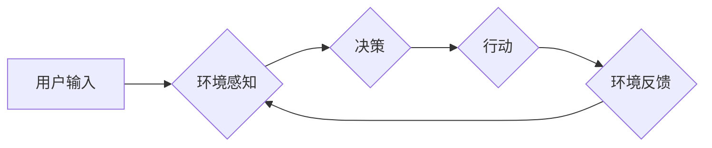

# 【大模型应用开发 动手做AI Agent】具身智能的实现

> 关键词：具身智能，大模型，AI Agent，强化学习，环境感知，自然交互，人机协作

## 1. 背景介绍

随着深度学习、自然语言处理等人工智能技术的快速发展，大模型（Large Language Model，LLM）在各个领域展现出了惊人的能力。从GPT到BERT，再到GPT-3，大模型在语言理解、文本生成、机器翻译等方面取得了显著的成果。然而，这些模型大多局限于符号处理，缺乏对物理世界的感知和交互能力。具身智能（Embodied AI）作为人工智能领域的新兴方向，旨在赋予机器感知、移动、操作等能力，使其能够与物理世界进行交互，从而实现更加真实、智能的AI Agent。

本文将探讨具身智能的实现，重点介绍如何利用大模型开发AI Agent，使其具备环境感知、自然交互和人机协作的能力。

## 2. 核心概念与联系

### 2.1 核心概念

- **具身智能**：指机器能够在物理世界中感知、移动、操作，并与人或环境进行交互的智能。
- **大模型**：通过在大量数据上训练得到的模型，具有强大的特征提取和表示学习能力。
- **AI Agent**：具有自主意识和目标，能够自主感知环境、做出决策并采取行动的智能体。
- **强化学习**：一种机器学习方法，通过与环境交互，学习如何在环境中获取最大奖励。

### 2.2 架构流程图



在这个流程图中，用户输入是AI Agent的输入信号，通过环境感知模块获取环境信息，决策模块根据感知到的环境和用户输入做出决策，行动模块执行决策，并得到环境反馈，然后反馈信息再次输入环境感知模块，形成一个闭环。

## 3. 核心算法原理 & 具体操作步骤

### 3.1 算法原理概述

具身智能的实现主要基于强化学习算法。强化学习通过智能体与环境交互，学习如何获得最大奖励。在这个过程中，智能体需要具备以下几个关键能力：

- **环境感知**：智能体需要能够感知到环境中的各种信息，如物体的位置、颜色、形状等。
- **决策**：智能体需要根据感知到的环境和目标，选择合适的行动。
- **行动**：智能体需要能够执行决策，与环境进行交互。
- **奖励**：环境会根据智能体的行动给出奖励，智能体会根据奖励调整自己的决策策略。

### 3.2 算法步骤详解

1. **环境搭建**：构建虚拟环境或真实环境，为智能体提供交互平台。
2. **状态表示**：将环境信息转换为智能体可以理解和处理的表示形式。
3. **动作空间定义**：定义智能体可以执行的动作集合。
4. **奖励函数设计**：设计合理的奖励函数，引导智能体学习正确的行为。
5. **强化学习算法选择**：选择合适的强化学习算法，如深度Q网络（DQN）、策略梯度（PG）等。
6. **训练与评估**：使用训练数据对智能体进行训练，并在测试环境中评估其性能。

### 3.3 算法优缺点

#### 优点：

- **通用性强**：强化学习算法适用于各种复杂环境，能够解决传统机器学习难以解决的问题。
- **自适应性强**：智能体可以自主学习，适应不同的环境变化。
- **灵活性强**：可以根据不同的任务需求，设计不同的状态表示、动作空间和奖励函数。

#### 缺点：

- **训练时间长**：强化学习算法需要大量的训练数据，训练过程可能非常耗时。
- **需要大量计算资源**：强化学习算法的计算复杂度高，需要大量的计算资源。
- **难以解释**：强化学习算法的决策过程难以解释，难以理解其背后的原因。

### 3.4 算法应用领域

强化学习算法在具身智能领域有着广泛的应用，如：

- **机器人导航**：机器人需要根据环境信息进行路径规划，避免碰撞，到达目标位置。
- **自动驾驶**：自动驾驶汽车需要根据道路情况、交通状况等进行决策，保证行车安全。
- **游戏AI**：游戏AI可以根据游戏环境进行决策，实现人机对战。

## 4. 数学模型和公式 & 详细讲解 & 举例说明

### 4.1 数学模型构建

强化学习的基本数学模型如下：

- **状态空间**：$S$
- **动作空间**：$A$
- **奖励函数**：$R$
- **策略**：$\pi(s)$，表示在状态$s$下选择动作$a$的概率。
- **价值函数**：$V(s)$，表示在状态$s$下长期收益的期望。
- **Q值函数**：$Q(s,a)$，表示在状态$s$下执行动作$a$，然后按照策略$\pi$进行动作，得到长期收益的期望。

### 4.2 公式推导过程

价值函数和Q值函数的关系如下：

$$
V(s) = \mathbb{E}_\pi[R + \gamma V(s')] 
$$

其中，$R$为奖励，$s'$为下一个状态，$\gamma$为折扣因子。

Q值函数的定义如下：

$$
Q(s,a) = \mathbb{E}_\pi[R + \gamma \max_{a'} Q(s',a')|s,a] 
$$

### 4.3 案例分析与讲解

以机器人导航为例，介绍如何构建强化学习模型。

- **状态表示**：状态可以表示为机器人的位置、速度、方向等信息。
- **动作空间**：动作可以表示为移动方向、速度等信息。
- **奖励函数**：奖励函数可以设计为距离目标位置的远近、是否发生碰撞等因素。
- **策略**：策略可以设计为基于Q值函数的贪心策略。
- **价值函数**：价值函数可以设计为基于Q值函数的平均值。
- **Q值函数**：Q值函数可以通过Q-Learning算法进行迭代更新。

## 5. 项目实践：代码实例和详细解释说明

### 5.1 开发环境搭建

1. 安装Python环境。
2. 安装TensorFlow或PyTorch库。
3. 安装OpenAI的Gym库，用于构建虚拟环境。

### 5.2 源代码详细实现

以下是一个简单的机器人导航案例的代码实现：

```python
import gym
import numpy as np
import tensorflow as tf

# 创建虚拟环境
env = gym.make("CartPole-v1")

# 定义策略网络
class PolicyNetwork(tf.keras.Model):
    def __init__(self):
        super(PolicyNetwork, self).__init__()
        self.fc1 = tf.keras.layers.Dense(24, activation=tf.nn.relu)
        self.fc2 = tf.keras.layers.Dense(24, activation=tf.nn.relu)
        self.fc3 = tf.keras.layers.Dense(2, activation=tf.nn.softmax)

    def call(self, x):
        x = self.fc1(x)
        x = self.fc2(x)
        return self.fc3(x)

# 定义损失函数和优化器
optimizer = tf.keras.optimizers.Adam(learning_rate=0.001)
loss_fn = tf.keras.losses.categorical_crossentropy

# 训练策略网络
def train_policy_network(model, optimizer, loss_fn, env, epochs=100):
    for epoch in range(epochs):
        state = env.reset()
        done = False
        while not done:
            action = np.random.choice([0, 1], p=model(state).numpy())
            next_state, reward, done, _ = env.step(action)
            with tf.GradientTape() as tape:
                logits = model(state)
                loss = loss_fn(tf.one_hot([action], depth=2), logits)
            gradients = tape.gradient(loss, model.trainable_variables)
            optimizer.apply_gradients(zip(gradients, model.trainable_variables))
            state = next_state

# 训练
train_policy_network(PolicyNetwork(), optimizer, loss_fn, env)
```

### 5.3 代码解读与分析

- 创建虚拟环境和策略网络。
- 定义损失函数和优化器。
- 训练策略网络，使机器人能够在虚拟环境中稳定地完成导航任务。

### 5.4 运行结果展示

运行代码后，可以看到机器人在虚拟环境中完成导航的过程。这只是一个简单的案例，实际应用中，需要根据具体任务进行模型的调整和优化。

## 6. 实际应用场景

具身智能技术在以下领域具有广泛的应用前景：

- **机器人领域**：机器人可以在家庭、工业等领域进行服务、维护和搬运等工作。
- **自动驾驶领域**：自动驾驶汽车可以在道路上安全行驶，提高交通效率。
- **游戏领域**：游戏AI可以与人类玩家进行对战，提高游戏体验。
- **虚拟现实领域**：虚拟现实中的AI角色可以与玩家进行交互，提供更加沉浸式的体验。

## 7. 工具和资源推荐

### 7.1 学习资源推荐

- 《深度学习》
- 《强化学习：原理与实践》
- 《人工智能：一种现代的方法》

### 7.2 开发工具推荐

- TensorFlow
- PyTorch
- OpenAI Gym

### 7.3 相关论文推荐

- Deep Reinforcement Learning: An Overview
- Human-Level Control through Deep Reinforcement Learning

## 8. 总结：未来发展趋势与挑战

### 8.1 研究成果总结

本文介绍了具身智能的概念、核心算法原理、具体操作步骤，并给出一个简单的代码实例。通过这些内容，读者可以初步了解具身智能技术。

### 8.2 未来发展趋势

- **多模态感知**：将视觉、听觉、触觉等多模态信息融合，使智能体能够更加全面地感知环境。
- **强化学习算法的改进**：设计更加高效、鲁棒的强化学习算法，提高智能体的学习效率和决策质量。
- **人机协作**：设计智能体与人类协作的场景，实现人机协同工作。

### 8.3 面临的挑战

- **数据获取**：具身智能需要大量的数据来训练模型，数据获取成本高。
- **计算资源**：强化学习算法的计算复杂度高，需要大量的计算资源。
- **可解释性**：强化学习算法的决策过程难以解释，难以理解其背后的原因。

### 8.4 研究展望

随着技术的不断发展，具身智能技术将在更多领域得到应用，为人类社会带来更多便利。未来，我们需要继续探索更加高效、鲁棒的具身智能技术，实现更加智能的AI Agent。

---

作者：禅与计算机程序设计艺术 / Zen and the Art of Computer Programming