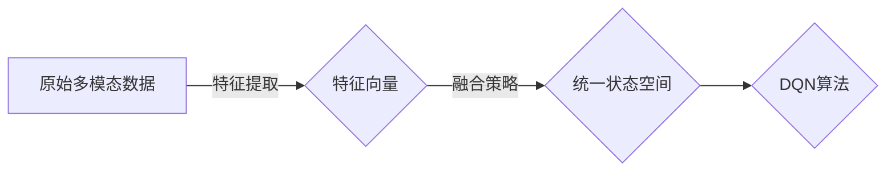

# 一切皆是映射：DQN算法的多模态输入处理策略

> 关键词：深度强化学习，DQN，多模态输入，状态空间，特征提取，融合策略，应用领域

## 1. 背景介绍

随着人工智能技术的不断发展，深度强化学习（Deep Reinforcement Learning，DRL）在各个领域得到了广泛的应用。DQN（Deep Q-Network）作为一种经典的深度强化学习算法，因其简单、高效、易于实现而备受关注。然而，在实际应用中，很多任务往往涉及多模态输入，如图像、声音、文本等，如何有效地处理多模态输入成为DQN算法在实际应用中的一个关键问题。

本文旨在探讨DQN算法在处理多模态输入时的策略，包括状态空间的构建、特征提取、融合策略等，并结合实际案例进行分析和讲解，以期为DQN算法在多模态领域的应用提供参考。

## 2. 核心概念与联系

### 2.1 核心概念原理

在多模态输入的DQN算法中，我们需要关注以下几个核心概念：

- **状态空间（State Space）**：DQN算法中的状态空间由多个模态的数据组成，每个模态的数据可以通过特征提取方法转化为固定长度的向量。
- **特征提取（Feature Extraction）**：特征提取是将原始多模态数据转化为适合DQN算法的状态空间的过程。常见的特征提取方法包括卷积神经网络（CNN）用于图像处理，循环神经网络（RNN）用于序列数据，以及传统的机器学习方法如主成分分析（PCA）等。
- **融合策略（Fusion Strategy）**：融合策略是将多个模态的特征向量进行融合，生成一个统一的状态向量供DQN算法使用。常见的融合策略包括线性组合、神经网络融合等。

### 2.2 架构的 Mermaid 流程图



## 3. 核心算法原理 & 具体操作步骤

### 3.1 算法原理概述

DQN算法是一种基于Q值优化的深度强化学习算法。它通过学习一个近似Q函数，预测在给定状态下采取某个动作的期望收益，并选择最优动作以最大化累积奖励。

在处理多模态输入时，DQN算法需要以下几个步骤：

1. 构建状态空间，将多个模态的特征向量进行融合。
2. 利用深度神经网络学习近似Q函数。
3. 根据近似Q函数选择最优动作。
4. 根据采取的动作和环境反馈更新近似Q函数。

### 3.2 算法步骤详解

1. **状态空间构建**：根据任务需求，选择合适的特征提取方法对每个模态的数据进行处理，得到多个特征向量。然后，根据选择的融合策略，将这些特征向量进行融合，生成一个统一的状态向量。

2. **近似Q函数学习**：使用深度神经网络（如卷积神经网络、循环神经网络等）学习近似Q函数。神经网络输入为状态向量，输出为动作空间的Q值。

3. **动作选择**：根据近似Q函数选择最优动作。常用的策略包括epsilon-greedy策略、softmax策略等。

4. **Q值更新**：根据采取的动作和环境反馈更新近似Q函数。具体来说，使用Bellman方程更新Q值。

### 3.3 算法优缺点

**优点**：

- 简单易实现，易于理解。
- 能够处理高维、非线性状态空间。
- 可以应用于各种强化学习任务。

**缺点**：

- 需要大量数据进行训练。
- 容易陷入局部最优。
- 难以解释模型的决策过程。

### 3.4 算法应用领域

DQN算法及其多模态输入处理策略可以应用于以下领域：

- 机器人控制
- 自动驾驶
- 游戏AI
- 语音识别
- 视觉识别

## 4. 数学模型和公式 & 详细讲解 & 举例说明

### 4.1 数学模型构建

DQN算法的核心是Q值函数，其数学模型如下：

$$
Q(s, a) = r + \gamma \max_{a'} Q(s', a')
$$

其中：

- $Q(s, a)$ 表示在状态 $s$ 下采取动作 $a$ 的Q值。
- $r$ 表示采取动作 $a$ 后获得的即时奖励。
- $\gamma$ 表示折扣因子，用于平衡即时奖励和未来奖励之间的关系。
- $s'$ 表示采取动作 $a$ 后的下一个状态。
- $\max_{a'}$ 表示在下一个状态 $s'$ 下，选择使 $Q(s', a')$ 最大的动作 $a'$。

### 4.2 公式推导过程

DQN算法的推导过程如下：

1. 根据环境反馈，计算当前状态的Q值：

$$
Q(s, a) = r
$$

2. 根据下一个状态和采取的动作，计算下一个状态的Q值：

$$
Q(s', a') = \max_{a'} Q(s', a')
$$

3. 根据Bellman方程更新当前状态的Q值：

$$
Q(s, a) = r + \gamma \max_{a'} Q(s', a')
$$

4. 重复步骤1-3，直至收敛。

### 4.3 案例分析与讲解

以下以自动驾驶场景为例，说明多模态输入的DQN算法实现。

1. **状态空间构建**：将车辆的速度、加速度、方向盘角度、周围车辆的速度和距离等数据作为特征向量，使用线性组合的方式融合这些特征向量，生成统一的状态向量。

2. **近似Q函数学习**：使用卷积神经网络（CNN）学习近似Q函数，输入为状态向量，输出为动作空间的Q值。

3. **动作选择**：使用epsilon-greedy策略选择最优动作。

4. **Q值更新**：根据采取的动作和环境反馈更新近似Q函数。

通过以上步骤，DQN算法可以学习到自动驾驶的驾驶策略，实现自动驾驶车辆的控制。

## 5. 项目实践：代码实例和详细解释说明

### 5.1 开发环境搭建

1. 安装Python环境，版本要求为Python 3.5及以上。
2. 安装TensorFlow和gym库，用于深度学习和强化学习实验。

```bash
pip install tensorflow-gpu gym
```

### 5.2 源代码详细实现

以下是一个简单的多模态输入DQN算法的Python代码示例：

```python
import gym
import tensorflow as tf
import numpy as np

class DQN:
    def __init__(self, state_dim, action_dim, learning_rate, discount_factor):
        self.state_dim = state_dim
        self.action_dim = action_dim
        self.learning_rate = learning_rate
        self.discount_factor = discount_factor

        # 创建DQN网络
        self.model = tf.keras.Sequential([
            tf.keras.layers.Dense(24, activation='relu', input_shape=(state_dim,)),
            tf.keras.layers.Dense(24, activation='relu'),
            tf.keras.layers.Dense(action_dim)
        ])

    def predict(self, state):
        return self.model.predict(state)

    def train(self, state, action, reward, next_state, done):
        next_state_value = 0
        if not done:
            next_state_value = np.amax(self.predict(next_state))
        td_target = reward + self.discount_factor * next_state_value
        td_error = td_target - self.predict(state)[action]
        self.model.fit(state, td_target, epochs=1, verbose=0)

# 创建环境
env = gym.make('CartPole-v0')

# 初始化DQN
dqn = DQN(state_dim=4, action_dim=2, learning_rate=0.001, discount_factor=0.99)

# 训练DQN
for episode in range(1000):
    state = env.reset()
    state = np.reshape(state, [1, 4])

    for time in range(500):
        action = np.argmax(dqn.predict(state))
        next_state, reward, done, _ = env.step(action)
        next_state = np.reshape(next_state, [1, 4])

        dqn.train(state, action, reward, next_state, done)

        state = next_state

# 关闭环境
env.close()
```

### 5.3 代码解读与分析

以上代码展示了如何使用TensorFlow和gym库实现一个简单的多模态输入DQN算法。代码中定义了DQN类，该类包含预测和训练方法。在训练过程中，我们使用epsilon-greedy策略选择动作，并根据Bellman方程更新Q值。

### 5.4 运行结果展示

运行以上代码，DQN算法将在CartPole-v0环境中进行训练。经过多次迭代，DQN算法将学习到稳定的控制策略，使CartPole保持平衡。

## 6. 实际应用场景

多模态输入的DQN算法在以下领域具有广泛的应用：

- **自动驾驶**：将摄像头、雷达、激光雷达等传感器数据作为输入，实现对周围环境的感知和驾驶决策。
- **机器人控制**：将机器人的视觉、触觉、听觉等多模态传感器数据作为输入，实现对机器人的控制。
- **游戏AI**：将游戏画面、游戏状态等多模态数据作为输入，实现对游戏角色的控制。
- **语音识别**：将语音信号、文字等多模态数据作为输入，实现对语音的识别和翻译。

## 7. 工具和资源推荐

### 7.1 学习资源推荐

- 《深度学习与强化学习》
- 《深度学习：入门、进阶与实战》
- 《深度强化学习》
- TensorFlow官方文档

### 7.2 开发工具推荐

- TensorFlow
- Keras
- PyTorch
- OpenAI Gym

### 7.3 相关论文推荐

- "Playing Atari with Deep Reinforcement Learning"
- "Human-level control through deep reinforcement learning"
- "Deep Reinforcement Learning with Double Q-learning"

## 8. 总结：未来发展趋势与挑战

### 8.1 研究成果总结

本文对DQN算法在处理多模态输入时的策略进行了探讨，包括状态空间构建、特征提取、融合策略等。通过实际案例分析和代码示例，展示了多模态输入DQN算法的应用前景。

### 8.2 未来发展趋势

- **多模态特征融合**：探索更加有效的多模态特征融合方法，提高模型的感知能力。
- **注意力机制**：引入注意力机制，让模型更加关注重要信息。
- **元学习**：研究元学习，让模型能够快速适应新的任务。

### 8.3 面临的挑战

- **数据标注**：多模态数据标注成本高，难以获取高质量数据。
- **计算资源**：多模态输入的处理需要大量计算资源。
- **模型可解释性**：多模态DQN模型的可解释性较差。

### 8.4 研究展望

随着深度学习和多模态技术的发展，DQN算法在处理多模态输入方面具有广阔的应用前景。未来，我们需要关注数据标注、计算资源和模型可解释性等挑战，推动多模态输入DQN算法的进一步发展。

---

作者：禅与计算机程序设计艺术 / Zen and the Art of Computer Programming