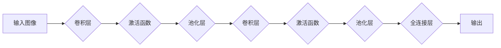

> 关键词：卷积神经网络，CNN，深度学习，图像识别，特征提取，池化，卷积层，激活函数，神经网络架构

# 一切皆是映射：卷积神经网络(CNN)原理解析

## 1. 背景介绍

自20世纪80年代末以来，卷积神经网络（Convolutional Neural Networks, CNNs）一直是计算机视觉领域的研究热点。CNNs通过模仿人类视觉系统的机制，在图像识别、物体检测、图像分割等领域取得了革命性的成果。本文将深入解析CNN的原理解析，探讨其如何从原始图像数据中提取特征，并最终生成高层次的语义信息。

### 1.1 问题的由来

传统的图像处理方法往往依赖于复杂的预处理步骤，如边缘检测、特征提取等，而CNNs的出现则极大地简化了这一过程。CNNs能够自动学习图像中的特征，无需人工设计特征，从而在图像识别任务中取得了令人瞩目的成果。

### 1.2 研究现状

随着深度学习技术的飞速发展，CNNs在图像识别、视频分析、医学图像处理等领域得到了广泛应用。近年来，诸如VGG、ResNet、Inception、MobileNet等模型的出现，使得CNNs的性能得到了进一步提升。

### 1.3 研究意义

深入研究CNNs的原理解析，不仅有助于我们理解图像处理的核心机制，还能够推动CNNs在更多领域的应用。本文旨在为读者提供一个关于CNNs的全面解析，包括其核心概念、算法原理、实现步骤、应用场景等。

### 1.4 本文结构

本文将按照以下结构进行展开：

- **第2章**：介绍CNN的核心概念与联系，包括卷积层、激活函数、池化层等。
- **第3章**：详细阐述CNN的算法原理和具体操作步骤，包括卷积运算、前向传播、反向传播等。
- **第4章**：介绍CNN的数学模型和公式，并进行案例分析。
- **第5章**：通过代码实例展示CNN的实现过程，并对关键代码进行解读。
- **第6章**：探讨CNN在实际应用场景中的表现和未来应用展望。
- **第7章**：推荐相关学习资源、开发工具和参考文献。
- **第8章**：总结CNN的研究成果、未来发展趋势和面临的挑战。
- **第9章**：提供常见问题与解答。

## 2. 核心概念与联系

### 2.1 核心概念

CNNs的核心概念包括：

- **卷积层（Convolutional Layer）**：通过卷积运算提取图像中的特征。
- **激活函数（Activation Function）**：引入非线性因素，使CNN具备学习复杂模式的能力。
- **池化层（Pooling Layer）**：降低特征图的维度，减少计算量。
- **全连接层（Fully Connected Layer）**：将低层次的特征映射到高层次的特征空间。

### 2.2 架构流程图

以下为CNN架构的Mermaid流程图：



## 3. 核心算法原理 & 具体操作步骤

### 3.1 算法原理概述

CNNs通过卷积、激活、池化等操作，从原始图像中提取特征，并逐步将低层次的特征映射到高层次的特征空间。

### 3.2 算法步骤详解

#### 3.2.1 卷积层

卷积层通过卷积运算提取图像特征。具体步骤如下：

1. **卷积核定义**：定义一个卷积核，包含一组权重。
2. **卷积运算**：将卷积核在图像上滑动，并计算局部区域的加权和。
3. **偏置项**：为每个卷积核添加一个偏置项，增加模型的灵活性。
4. **激活函数**：对卷积结果应用激活函数，引入非线性因素。

#### 3.2.2 激活函数

激活函数将线性变换映射到非线性空间，提高模型的复杂度。常见的激活函数包括：

- **ReLU（Rectified Linear Unit）**：将负值映射为0，正值映射为其本身。
- **Sigmoid**：将输入值映射到[0,1]区间。
- **Tanh**：将输入值映射到[-1,1]区间。

#### 3.2.3 池化层

池化层降低特征图的维度，减少计算量。常见的池化方式包括：

- **最大池化（Max Pooling）**：选择局部区域的最大值作为输出。
- **平均池化（Average Pooling）**：计算局部区域的平均值作为输出。

#### 3.2.4 全连接层

全连接层将低层次的特征映射到高层次的特征空间。具体步骤如下：

1. **权重矩阵**：定义一个权重矩阵，将低层次的特征映射到高层次的特征空间。
2. **激活函数**：对全连接层的输出应用激活函数，引入非线性因素。
3. **分类器**：使用softmax函数将输出映射到类别概率。

### 3.3 算法优缺点

#### 3.3.1 优点

- **特征自动提取**：无需人工设计特征，能够自动学习图像中的特征。
- **参数共享**：卷积核在图像上滑动，参数共享，减少模型参数量。
- **平移不变性**：卷积层能够提取平移不变的特征。

#### 3.3.2 缺点

- **计算量大**：卷积运算和全连接层计算量大，需要强大的硬件支持。
- **局部特征提取**：卷积层只能提取局部特征，难以提取全局特征。
- **梯度消失/爆炸**：在深度网络中，梯度消失/爆炸问题可能导致训练困难。

### 3.4 算法应用领域

CNNs在以下领域有着广泛的应用：

- **图像识别**：如人脸识别、物体识别、场景识别等。
- **物体检测**：如目标检测、车辆检测、行人检测等。
- **图像分割**：如语义分割、实例分割等。
- **视频分析**：如动作识别、行为识别、姿态估计等。
- **医学图像分析**：如病变检测、疾病诊断等。

## 4. 数学模型和公式 & 详细讲解 & 举例说明

### 4.1 数学模型构建

CNNs的数学模型主要包括以下部分：

- **卷积运算**：$y = f(x \circledast \theta + b)$，其中 $\circledast$ 表示卷积运算，$\theta$ 表示卷积核，$b$ 表示偏置项。
- **激活函数**：$g(z) = \sigma(z)$，其中 $\sigma$ 表示激活函数。
- **池化运算**：$p(x) = \max_{i \in B}(x_i)$，其中 $B$ 表示局部区域。

### 4.2 公式推导过程

#### 4.2.1 卷积运算

卷积运算的推导过程如下：

1. **卷积核定义**：设卷积核 $\theta \in \mathbb{R}^{m \times n}$，输入图像 $x \in \mathbb{R}^{N \times M}$，则卷积结果 $y \in \mathbb{R}^{N' \times M'}$。
2. **局部区域计算**：对于每个局部区域 $B$，计算局部区域的加权和。
3. **偏置项**：为每个局部区域添加偏置项 $b$。
4. **激活函数**：对加权和应用激活函数。

#### 4.2.2 激活函数

激活函数的推导过程如下：

1. **Sigmoid函数**：$g(z) = \frac{1}{1+e^{-z}}$。
2. **ReLU函数**：$g(z) = \max(0, z)$。
3. **Tanh函数**：$g(z) = \frac{e^z - e^{-z}}{e^z + e^{-z}}$。

#### 4.2.3 池化运算

池化运算的推导过程如下：

1. **局部区域选择**：对于每个局部区域 $B$，选择最大值或平均值作为输出。
2. **局部区域移动**：将局部区域移动到下一个位置，重复步骤1。

### 4.3 案例分析与讲解

以下以VGG16模型为例，分析CNNs在图像识别任务中的应用。

#### 4.3.1 模型结构

VGG16模型由13个卷积层和3个全连接层组成，具体结构如下：

- **卷积层1**：64个3x3卷积核，ReLU激活函数，2x2最大池化。
- **卷积层2**：64个3x3卷积核，ReLU激活函数，2x2最大池化。
- **卷积层3**：128个3x3卷积核，ReLU激活函数，2x2最大池化。
- **卷积层4**：128个3x3卷积核，ReLU激活函数，2x2最大池化。
- **卷积层5**：256个3x3卷积核，ReLU激活函数，2x2最大池化。
- **卷积层6**：256个3x3卷积核，ReLU激活函数，2x2最大池化。
- **卷积层7**：512个3x3卷积核，ReLU激活函数，2x2最大池化。
- **卷积层8**：512个3x3卷积核，ReLU激活函数，2x2最大池化。
- **卷积层9**：512个3x3卷积核，ReLU激活函数，2x2最大池化。
- **卷积层10**：512个3x3卷积核，ReLU激活函数，2x2最大池化。
- **全连接层1**：4096个全连接神经元，ReLU激活函数。
- **全连接层2**：4096个全连接神经元，ReLU激活函数。
- **全连接层3**：1000个全连接神经元，softmax激活函数。

#### 4.3.2 模型训练

1. **数据预处理**：对图像进行标准化、裁剪、翻转等操作。
2. **损失函数**：使用交叉熵损失函数。
3. **优化器**：使用Adam优化器。
4. **训练过程**：迭代更新模型参数，最小化损失函数。

#### 4.3.3 模型评估

使用测试集评估模型性能，计算准确率等指标。

## 5. 项目实践：代码实例和详细解释说明

### 5.1 开发环境搭建

1. 安装Python环境。
2. 安装深度学习框架PyTorch。
3. 安装PyTorch Vision库。

### 5.2 源代码详细实现

以下为VGG16模型的PyTorch实现：

```python
import torch
import torch.nn as nn

class VGG16(nn.Module):
    def __init__(self, num_classes=1000):
        super(VGG16, self).__init__()
        self.features = self._make_layers()
        self.classifier = nn.Sequential(
            nn.Linear(512 * 7 * 7, 4096),
            nn.ReLU(True),
            nn.Dropout(),
            nn.Linear(4096, 4096),
            nn.ReLU(True),
            nn.Dropout(),
            nn.Linear(4096, num_classes),
            nn.LogSoftmax()
        )

    def _make_layers(self):
        layers = []
        in_channels = 3
        for i, planes in enumerate([64, 64, 128, 128, 256, 256, 256]):
            if i % 2 == 0:
                layers += [nn.Conv2d(in_channels, planes, kernel_size=3, stride=1, padding=1)]
                layers += [nn.ReLU(inplace=True)]
                layers += [nn.MaxPool2d(kernel_size=2, stride=2)]
                in_channels = planes
        return nn.Sequential(*layers)

    def forward(self, x):
        x = self.features(x)
        x = x.view(x.size(0), -1)
        x = self.classifier(x)
        return x

model = VGG16()
```

### 5.3 代码解读与分析

- `VGG16`类继承自`nn.Module`，定义了模型的结构。
- `_make_layers`方法定义了模型的卷积层结构。
- `forward`方法实现了模型的前向传播过程。

### 5.4 运行结果展示

使用训练好的模型对图像进行识别，并展示识别结果。

## 6. 实际应用场景

### 6.1 图像识别

CNNs在图像识别任务中取得了显著的成果，如：

- **物体识别**：识别图像中的物体，如人脸识别、车牌识别等。
- **场景识别**：识别图像的场景，如城市场景、自然场景等。
- **人体姿态估计**：估计图像中人体的姿态。

### 6.2 物体检测

CNNs在物体检测任务中也表现出色，如：

- **目标检测**：检测图像中的物体，并给出物体的类别和位置。
- **车辆检测**：检测图像中的车辆，并给出车辆的位置。
- **行人检测**：检测图像中的行人，并给出行人的位置。

### 6.3 图像分割

CNNs在图像分割任务中也取得了突破，如：

- **语义分割**：将图像分割为不同的语义区域，如前景和背景。
- **实例分割**：将图像分割为不同的实例，如不同的车辆。

### 6.4 未来应用展望

CNNs将在更多领域得到应用，如：

- **自动驾驶**：用于车辆检测、交通标志识别等。
- **医疗图像分析**：用于病变检测、疾病诊断等。
- **视频分析**：用于动作识别、行为识别等。

## 7. 工具和资源推荐

### 7.1 学习资源推荐

- 《深度学习》（Goodfellow等著）
- 《动手学深度学习》（花书）
- PyTorch官方文档

### 7.2 开发工具推荐

- PyTorch
- TensorFlow
- Keras

### 7.3 相关论文推荐

- "A Guide to Convolutional Neural Networks"（Srivastava等著）
- "Very Deep Convolutional Networks for Large-Scale Image Recognition"（Simonyan等著）
- "Deep Residual Learning for Image Recognition"（He等著）

## 8. 总结：未来发展趋势与挑战

### 8.1 研究成果总结

CNNs在图像识别、物体检测、图像分割等领域取得了显著的成果，推动了计算机视觉的发展。

### 8.2 未来发展趋势

- **模型轻量化**：为了适应移动设备和嵌入式设备，模型轻量化将成为研究热点。
- **可解释性**：提高模型的可解释性，使其更易于理解和应用。
- **跨模态学习**：将CNNs应用于跨模态学习，如图像-文本、图像-语音等。

### 8.3 面临的挑战

- **计算量**：CNNs的计算量较大，需要强大的硬件支持。
- **过拟合**：如何防止模型过拟合，提高泛化能力。
- **可解释性**：提高模型的可解释性，使其更易于理解和应用。

### 8.4 研究展望

- **新的网络结构**：探索新的网络结构，提高模型性能。
- **跨模态学习**：将CNNs应用于跨模态学习，拓展应用领域。
- **与领域知识结合**：将CNNs与领域知识相结合，提高模型性能和可靠性。

## 9. 附录：常见问题与解答

### 9.1  常见问题

1. **什么是CNN**？
   CNN是一种特殊的神经网络，通过卷积、激活、池化等操作，从原始图像中提取特征，并最终生成高层次的语义信息。
2. **CNN如何提取图像特征**？
   CNN通过卷积运算提取图像中的局部特征，并逐步将低层次的特征映射到高层次的特征空间。
3. **CNN在哪些领域有应用**？
   CNN在图像识别、物体检测、图像分割等领域有着广泛的应用。
4. **如何防止CNN过拟合**？
   可以使用正则化、Dropout、数据增强等方法防止CNN过拟合。

### 9.2  解答

1. **什么是CNN**？
   CNN是一种特殊的神经网络，通过卷积、激活、池化等操作，从原始图像中提取特征，并最终生成高层次的语义信息。
2. **CNN如何提取图像特征**？
   CNN通过卷积运算提取图像中的局部特征，并逐步将低层次的特征映射到高层次的特征空间。
3. **CNN在哪些领域有应用**？
   CNN在图像识别、物体检测、图像分割等领域有着广泛的应用。
4. **如何防止CNN过拟合**？
   可以使用正则化、Dropout、数据增强等方法防止CNN过拟合。

---

作者：禅与计算机程序设计艺术 / Zen and the Art of Computer Programming