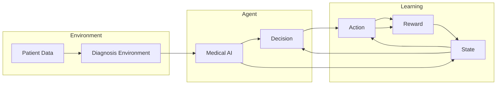

# 一切皆是映射：强化学习在医疗诊断中的应用：挑战与机遇

> 关键词：强化学习，医疗诊断，深度学习，决策过程，医疗图像分析，自然语言处理，个性化治疗，伦理挑战

## 1. 背景介绍

医疗诊断是医疗保健的核心环节，它直接影响到患者的治疗和康复。随着深度学习技术的迅猛发展，医疗图像分析和自然语言处理等领域取得了显著的进展。然而，医疗诊断不仅依赖于数据的解析，还需要医生的专业知识和经验。这里，强化学习（Reinforcement Learning，RL）作为一种能够模拟人类决策过程的人工智能技术，逐渐成为医疗诊断领域的研究热点。

### 1.1 问题的由来

传统医疗诊断方法主要依赖于医生的经验和直觉，这种方法在处理复杂病例时往往效率低下，且存在主观性。而随着医疗数据的爆炸式增长，如何从海量数据中快速、准确地提取有用信息，成为了一个重要问题。强化学习通过模拟人类决策过程，为医疗诊断提供了一种新的解决方案。

### 1.2 研究现状

近年来，强化学习在医疗诊断中的应用主要集中在以下几个方面：

- **医疗图像分析**：利用强化学习对医学影像进行自动分析，如癌症检测、病理切片分析等。
- **自然语言处理**：通过强化学习从电子健康记录（EHR）中提取关键信息，辅助临床决策。
- **个性化治疗**：根据患者的病历和基因信息，为患者制定个性化的治疗方案。

### 1.3 研究意义

强化学习在医疗诊断中的应用具有重要的研究意义：

- **提高诊断效率**：通过自动化诊断流程，可以显著提高诊断效率，减轻医生的工作负担。
- **减少误诊率**：强化学习模型可以基于大量数据学习，减少误诊率，提高诊断的准确性。
- **个性化治疗**：根据患者的具体情况进行个性化治疗，提高治疗效果。

### 1.4 本文结构

本文将围绕强化学习在医疗诊断中的应用展开，主要包括以下内容：

- 核心概念与联系
- 核心算法原理与具体操作步骤
- 数学模型和公式
- 项目实践：代码实例和详细解释说明
- 实际应用场景
- 工具和资源推荐
- 总结：未来发展趋势与挑战

## 2. 核心概念与联系

### 2.1 核心概念原理

强化学习是一种通过奖励和惩罚来引导智能体（Agent）学习在给定环境中做出最佳决策的方法。在医疗诊断中，智能体可以是计算机程序，也可以是机器人。

- **智能体**：在医疗诊断中，智能体可以是医生或诊断程序。
- **环境**：医疗诊断的环境包括患者的病历、影像资料、实验室检查结果等。
- **状态**：智能体所处的环境状态，如患者的当前病情。
- **动作**：智能体可以采取的行动，如诊断步骤或治疗建议。
- **奖励**：智能体采取动作后，根据动作的结果获得奖励或惩罚。

### 2.2 架构的 Mermaid 流程图



### 2.3 核心概念联系

强化学习在医疗诊断中的应用涉及多个核心概念。智能体在诊断环境中通过接收患者数据（环境），根据当前状态（状态）采取行动（动作），并从环境获得奖励（奖励），从而不断学习和优化其决策过程。

## 3. 核心算法原理 & 具体操作步骤

### 3.1 算法原理概述

强化学习算法通过最大化累积奖励来指导智能体学习。常见的强化学习算法包括：

- **Q-Learning**：通过学习Q值（动作在给定状态下的预期奖励）来选择最佳动作。
- **Deep Q-Network（DQN）**：结合了深度神经网络和Q-Learning，能够处理高维状态空间。
- **Policy Gradient Methods**：直接学习最优策略，而不是Q值。

### 3.2 算法步骤详解

强化学习在医疗诊断中的应用步骤如下：

1. **定义环境**：明确智能体可以采取的动作和奖励函数。
2. **设计智能体**：选择合适的强化学习算法和神经网络架构。
3. **收集数据**：收集患者的病历、影像资料、实验室检查结果等数据。
4. **训练智能体**：使用收集到的数据训练智能体，使其学习最佳策略。
5. **评估智能体**：在测试集上评估智能体的诊断能力。

### 3.3 算法优缺点

**优点**：

- **自适应性强**：强化学习模型可以根据新数据不断学习和优化。
- **泛化能力强**：强化学习模型可以应用于不同的医疗诊断任务。

**缺点**：

- **训练复杂度高**：强化学习模型的训练通常需要大量的数据和计算资源。
- **解释性差**：强化学习模型的决策过程往往难以解释。

### 3.4 算法应用领域

强化学习在医疗诊断中的应用领域包括：

- **癌症诊断**：利用强化学习对医学影像进行自动分析，识别肿瘤。
- **病理切片分析**：通过强化学习分析病理切片，识别细胞类型和病变。
- **药物推荐**：根据患者的病情和基因信息，推荐合适的药物。
- **个性化治疗**：根据患者的具体情况进行个性化治疗。

## 4. 数学模型和公式 & 详细讲解 & 举例说明

### 4.1 数学模型构建

强化学习的数学模型主要包括：

- **状态空间**：$S = \{s_1, s_2, ..., s_N\}$，表示所有可能的状态。
- **动作空间**：$A = \{a_1, a_2, ..., a_M\}$，表示所有可能的动作。
- **奖励函数**：$R(s, a)$，表示在状态 $s$ 采取动作 $a$ 后获得的奖励。
- **策略函数**：$\pi(s) = P(a|s)$，表示在状态 $s$ 下采取动作 $a$ 的概率。

### 4.2 公式推导过程

强化学习的基本公式如下：

$$
Q(s, a) = \mathbb{E}[R(s, a) + \gamma \max_{a'} Q(s', a')]
$$

其中，$Q(s, a)$ 表示在状态 $s$ 下采取动作 $a$ 的Q值，$\gamma$ 是折扣因子，$s'$ 是采取动作 $a$ 后的状态。

### 4.3 案例分析与讲解

以下是一个简单的医疗诊断强化学习案例：

假设我们有一个智能体，其任务是诊断是否患有某种疾病。状态空间包括患者的年龄、性别、症状等，动作空间包括建议进行进一步的检查或开始治疗。奖励函数可以根据治疗结果设置，如治愈患者获得正奖励，误诊或漏诊获得负奖励。

通过训练，智能体可以学习到在给定状态下采取的最佳动作，从而提高诊断的准确性。

## 5. 项目实践：代码实例和详细解释说明

### 5.1 开发环境搭建

为了实现上述案例，我们需要搭建以下开发环境：

- **编程语言**：Python
- **深度学习框架**：TensorFlow或PyTorch
- **强化学习库**：Deep Q Network (DQN)

### 5.2 源代码详细实现

以下是一个简单的DQN模型实现：

```python
import tensorflow as tf
import numpy as np
import random
from collections import deque

class DQN:
    def __init__(self, state_size, action_size, learning_rate, gamma):
        self.state_size = state_size
        self.action_size = action_size
        self.gamma = gamma
        self.learning_rate = learning_rate

        self.model = self._build_model()

    def _build_model(self):
        model = tf.keras.Sequential([
            tf.keras.layers.Dense(24, input_dim=self.state_size, activation='relu'),
            tf.keras.layers.Dense(24, activation='relu'),
            tf.keras.layers.Dense(self.action_size, activation='linear')
        ])
        model.compile(loss='mse', optimizer=tf.keras.optimizers.Adam(lr=self.learning_rate))
        return model

    def remember(self, state, action, reward, next_state, done):
        self.memory.append((state, action, reward, next_state, done))

    def act(self, state):
        if np.random.rand() <= 0.1:
            return random.randrange(self.action_size)
        act_values = self.model.predict(state)
        return np.argmax(act_values[0])

    def replay(self, batch_size):
        minibatch = random.sample(self.memory, batch_size)
        for state, action, reward, next_state, done in minibatch:
            target = reward
            if not done:
                target = (reward + self.gamma * np.amax(self.model.predict(next_state)[0]))
            target_f = self.model.predict(state)
            target_f[0][action] = target
            self.model.fit(state, target_f, epochs=1, verbose=0)
```

### 5.3 代码解读与分析

上述代码定义了一个DQN模型，包括初始化模型、记忆存储、执行动作和回放策略等函数。

- `__init__`：初始化DQN模型，包括状态空间大小、动作空间大小、折扣因子和学习率等。
- `_build_model`：构建DQN模型，包括两个隐藏层和一个输出层。
- `remember`：将状态、动作、奖励、下一个状态和是否结束存储到记忆中。
- `act`：根据当前状态选择动作。
- `replay`：从记忆中随机抽取一批数据，更新模型参数。

### 5.4 运行结果展示

在实际应用中，需要根据具体任务和数据集对模型进行训练和评估。以下是一个简单的训练过程：

```python
# 训练DQN模型
def train_dqn():
    model = DQN(state_size, action_size, learning_rate, gamma)
    for episode in range(total_episodes):
        state = env.reset()
        state = np.reshape(state, [1, state_size])
        for time in range(max_time):
            action = model.act(state)
            next_state, reward, done = env.step(action)
            next_state = np.reshape(next_state, [1, state_size])
            model.remember(state, action, reward, next_state, done)
            state = next_state
            if done:
                break
        if len(model.memory) > batch_size:
            model.replay(batch_size)

# 运行训练过程
train_dqn()
```

## 6. 实际应用场景

### 6.1 癌症诊断

强化学习可以应用于癌症诊断，如肺癌、乳腺癌等。通过训练模型识别医学影像中的异常特征，可以辅助医生进行诊断。

### 6.2 病理切片分析

强化学习可以应用于病理切片分析，如识别细胞类型、病变等。通过分析病理切片图像，可以辅助医生进行疾病分类和预后评估。

### 6.3 药物推荐

强化学习可以应用于药物推荐，如根据患者的病情和基因信息推荐合适的药物。通过学习药物与疾病之间的关系，可以优化治疗方案。

### 6.4 个性化治疗

强化学习可以应用于个性化治疗，如根据患者的具体情况进行治疗方案的设计。通过学习患者的病历和基因信息，可以制定个性化的治疗方案。

## 7. 工具和资源推荐

### 7.1 学习资源推荐

- 《Reinforcement Learning: An Introduction》
- 《Deep Reinforcement Learning》
- 《深度学习与强化学习在医疗领域的应用》

### 7.2 开发工具推荐

- TensorFlow
- PyTorch
- OpenAI Gym

### 7.3 相关论文推荐

- "Deep Reinforcement Learning for Healthcare: A Systematic Review"
- "Reinforcement Learning for Health: A Review"
- "Deep Reinforcement Learning in Medicine"

## 8. 总结：未来发展趋势与挑战

### 8.1 研究成果总结

强化学习在医疗诊断中的应用取得了一定的成果，但仍存在许多挑战。

### 8.2 未来发展趋势

- **数据驱动**：利用更多医疗数据，提高模型的准确性和泛化能力。
- **多模态学习**：结合文本、图像、语音等多模态信息，提高模型的诊断能力。
- **可解释性**：提高模型的可解释性，增强医生对模型的信任。

### 8.3 面临的挑战

- **数据隐私**：医疗数据涉及患者隐私，需要确保数据安全。
- **伦理问题**：强化学习模型在医疗诊断中的应用需要遵循伦理规范。
- **技术限制**：强化学习模型的训练需要大量计算资源。

### 8.4 研究展望

未来，强化学习在医疗诊断中的应用将更加广泛，为医疗保健领域带来更多创新和突破。

## 9. 附录：常见问题与解答

**Q1：强化学习在医疗诊断中有什么优势？**

A：强化学习可以模拟人类决策过程，从海量数据中学习，提高诊断的准确性和效率。

**Q2：强化学习在医疗诊断中面临哪些挑战？**

A：强化学习在医疗诊断中面临的挑战包括数据隐私、伦理问题和技术限制等。

**Q3：如何确保强化学习模型在医疗诊断中的安全性？**

A：确保强化学习模型在医疗诊断中的安全性需要遵循以下原则：
- **数据安全**：确保医疗数据的安全性和隐私性。
- **算法透明**：提高算法的透明度和可解释性。
- **伦理规范**：遵循伦理规范，确保模型的决策符合伦理要求。

**Q4：强化学习在医疗诊断中的应用前景如何？**

A：强化学习在医疗诊断中的应用前景广阔，有望成为未来医疗保健领域的重要技术。

---

作者：禅与计算机程序设计艺术 / Zen and the Art of Computer Programming