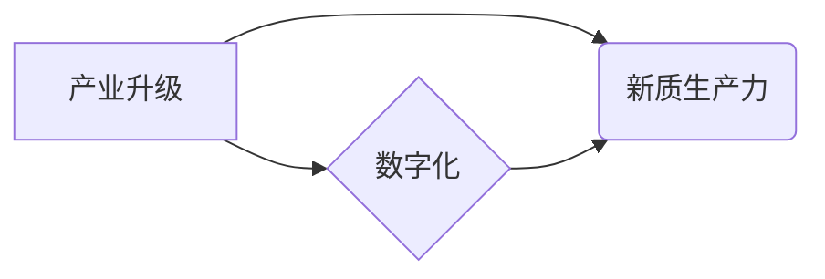

# 产业转型升级与新质生产力

> 关键词：产业升级，新质生产力，数字化转型，智能制造，人工智能，大数据，云计算，可持续发展

## 1. 背景介绍

随着全球经济一体化的深入发展和新一轮科技革命的兴起，产业转型升级已成为推动经济增长和社会进步的重要驱动力。传统的产业模式面临着资源约束、环境污染、创新能力不足等问题，迫切需要向更加高效、绿色、智能的方向转型升级。在这一背景下，新质生产力作为一种创新性的生产方式，成为了产业转型升级的核心动力。

### 1.1 问题的由来

传统的线性经济模式以高消耗、高污染为特征，资源消耗和环境污染问题日益严重。同时，传统产业的技术水平相对落后，创新能力不足，难以适应快速变化的市场需求。为了解决这些问题，各国纷纷启动产业转型升级战略，寻求新的发展路径。

### 1.2 研究现状

近年来，随着信息技术的飞速发展，人工智能、大数据、云计算等新技术的应用逐渐深入到各个产业领域，推动了新质生产力的形成和发展。新质生产力以知识、技术、信息等新要素为核心，通过数字化转型，实现产业结构的优化升级，提高生产效率和产品质量，推动经济高质量发展。

### 1.3 研究意义

研究产业转型升级与新质生产力，对于推动我国经济高质量发展具有重要意义：

1. 提升产业竞争力。通过产业转型升级，优化产业结构，提高产业技术水平，增强产业创新能力，提升我国产业的国际竞争力。
2. 改善生态环境。新质生产力强调绿色发展，通过节能减排、循环利用等措施，减少对环境的污染，实现可持续发展。
3. 促进就业结构优化。新质生产力的发展将带动新兴产业和新型业态的涌现，创造更多高质量的就业岗位。
4. 推动经济高质量发展。新质生产力以创新为核心驱动力，有助于推动经济结构优化、质量变革和效率提升。

### 1.4 本文结构

本文将围绕产业转型升级与新质生产力展开论述，具体内容如下：

- 第2部分，介绍产业转型升级与新质生产力的核心概念与联系。
- 第3部分，阐述新质生产力的发展原理和具体操作步骤。
- 第4部分，分析新质生产力的数学模型和公式，并结合实例进行讲解。
- 第5部分，给出新质生产力的项目实践案例，并对代码进行详细解释说明。
- 第6部分，探讨新质生产力的实际应用场景和未来应用展望。
- 第7部分，推荐新质生产力相关学习资源、开发工具和参考文献。
- 第8部分，总结全文，展望新质生产力的未来发展趋势与挑战。
- 第9部分，提供常见问题与解答。

## 2. 核心概念与联系

### 2.1 核心概念

#### 2.1.1 产业升级

产业升级是指通过技术创新、结构调整、产业组织优化等手段，推动产业从低附加值、低技术含量向高附加值、高技术含量转变的过程。

#### 2.1.2 新质生产力

新质生产力是以知识、技术、信息等新要素为核心，通过数字化转型，实现产业结构的优化升级，提高生产效率和产品质量的生产方式。

#### 2.1.3 数字化转型

数字化转型是指将数字技术与实体经济深度融合，推动企业业务流程、组织形态、管理模式等方面的变革，实现产业升级和经济增长。

### 2.2 核心概念联系

产业升级是推动新质生产力发展的前提和基础，新质生产力是产业升级的重要途径和手段。数字化转型的深入实施，为产业升级和新质生产力发展提供了技术支撑和动力。

Mermaid流程图如下：



## 3. 核心算法原理 & 具体操作步骤

### 3.1 算法原理概述

新质生产力的发展主要基于以下几个核心原理：

1. **创新驱动**：以技术创新为核心，推动产业升级和经济发展。
2. **数字化转型**：通过数字化技术改造传统产业，提升产业效率和竞争力。
3. **产业链协同**：加强产业链上下游企业之间的协同创新，形成产业生态。
4. **人才培养**：培养适应新质生产力发展需要的高素质人才。

### 3.2 算法步骤详解

#### 3.2.1 创新驱动

1. **技术创新**：加大研发投入，鼓励创新成果转化。
2. **制度创新**：完善知识产权保护制度，激发创新活力。
3. **产业生态建设**：搭建创新平台，促进产学研用深度融合。

#### 3.2.2 数字化转型

1. **基础设施建设**：完善数字基础设施建设，为数字化转型提供支撑。
2. **数字技术应用**：将数字化技术应用于产品设计、生产、管理、销售等各个环节。
3. **数据资源利用**：加强数据资源整合和共享，提升数据价值。

#### 3.2.3 产业链协同

1. **产业链整合**：推动产业链上下游企业协同创新，形成产业生态。
2. **合作共赢**：建立合作共赢机制，实现产业链协同发展。
3. **平台建设**：搭建产业协同平台，促进信息共享和资源整合。

#### 3.2.4 人才培养

1. **教育改革**：改革教育体系，培养适应新质生产力发展需要的高素质人才。
2. **人才引进**：吸引高端人才，为产业发展提供智力支持。
3. **人才培养机制**：建立人才培养机制，激发人才创新活力。

### 3.3 算法优缺点

#### 3.3.1 优点

1. **提升产业竞争力**：通过技术创新和数字化转型，提高产业效率和产品质量，增强产业竞争力。
2. **促进经济增长**：新质生产力的发展将带动新兴产业和新型业态的涌现，推动经济高质量发展。
3. **优化产业结构**：促进产业结构优化升级，提高经济发展质量和效益。

#### 3.3.2 缺点

1. **技术风险**：新质生产力的发展需要大量新技术投入，存在技术风险。
2. **人才短缺**：新质生产力的发展需要大量高素质人才，人才短缺成为制约因素。
3. **投资成本高**：新质生产力的发展需要大量资金投入，投资成本较高。

### 3.4 算法应用领域

新质生产力在以下领域得到了广泛应用：

1. **智能制造**：通过数字化、网络化、智能化手段，实现生产过程的自动化、智能化。
2. **大数据**：利用大数据技术，对海量数据进行采集、存储、分析和挖掘，为决策提供支持。
3. **云计算**：通过云计算技术，实现资源的弹性扩展和按需分配，降低企业运营成本。
4. **人工智能**：利用人工智能技术，实现智能识别、智能决策、智能控制等功能。

## 4. 数学模型和公式 & 详细讲解 & 举例说明

### 4.1 数学模型构建

新质生产力的数学模型主要包括以下几个部分：

1. **生产函数**：描述了投入产出关系，即生产要素（如劳动力、资本、技术等）与产出之间的关系。
2. **增长模型**：描述了经济增长与生产要素投入、技术创新等因素之间的关系。
3. **产业结构模型**：描述了产业结构演变与经济增长之间的关系。

### 4.2 公式推导过程

#### 4.2.1 生产函数

生产函数的一般形式为：

$$
Y = F(K,L,A)
$$

其中，$Y$ 为产出，$K$ 为资本投入，$L$ 为劳动力投入，$A$ 为技术进步。

#### 4.2.2 增长模型

经济增长模型可以采用索洛增长模型，其基本形式为：

$$
\frac{dY}{dt} = f(K,L) - d(K,L)
$$

其中，$\frac{dY}{dt}$ 为经济增长率，$f(K,L)$ 为产出增长率，$d(K,L)$ 为资本折旧和劳动力折旧。

#### 4.2.3 产业结构模型

产业结构模型可以采用结构份额模型，其基本形式为：

$$
\frac{dX_i}{dt} = f_i(X_i) - \frac{dX_i}{dY}
$$

其中，$X_i$ 为第 $i$ 个产业的产值，$f_i(X_i)$ 为第 $i$ 个产业的增长函数，$\frac{dX_i}{dY}$ 为产业产值对总产出的贡献率。

### 4.3 案例分析与讲解

以下以智能制造为例，分析新质生产力在产业升级中的应用。

#### 4.3.1 案例背景

随着全球制造业的竞争日益激烈，我国制造业面临着转型升级的迫切需求。智能制造作为一种新兴的生产方式，已经成为推动制造业升级的重要途径。

#### 4.3.2 案例分析

1. **技术创新**：企业加大研发投入，引进先进制造技术和设备，提高生产效率和产品质量。
2. **数字化转型**：企业通过数字化技术改造生产流程，实现生产过程的自动化、智能化。
3. **产业链协同**：企业加强产业链上下游企业之间的协同创新，形成产业生态。
4. **人才培养**：企业加强人才培养，为智能制造提供人才保障。

通过以上措施，企业实现了从传统制造业向智能制造的转型升级，提升了产业竞争力。

## 5. 项目实践：代码实例和详细解释说明

### 5.1 开发环境搭建

本节将以Python编程语言为例，介绍如何搭建新质生产力项目开发环境。

#### 5.1.1 Python环境搭建

1. 下载并安装Python 3.8及以上版本。
2. 安装Anaconda，用于创建和管理Python虚拟环境。
3. 在虚拟环境中安装必要的库，如numpy、pandas、matplotlib等。

#### 5.1.2 深度学习框架搭建

1. 安装PyTorch深度学习框架。
2. 安装Transformers库，用于处理NLP任务。

### 5.2 源代码详细实现

以下是一个简单的智能制造项目示例，利用深度学习技术实现图像识别。

```python
import torch
import torchvision
import torch.nn as nn
import torch.optim as optim

# 定义卷积神经网络
class Net(nn.Module):
    def __init__(self):
        super(Net, self).__init__()
        self.conv1 = nn.Conv2d(3, 32, kernel_size=3, padding=1)
        self.conv2 = nn.Conv2d(32, 64, kernel_size=3, padding=1)
        self.pool = nn.MaxPool2d(kernel_size=2, stride=2)
        self.fc1 = nn.Linear(64 * 64 * 64, 512)
        self.fc2 = nn.Linear(512, 10)

    def forward(self, x):
        x = self.pool(F.relu(self.conv1(x)))
        x = self.pool(F.relu(self.conv2(x)))
        x = x.view(-1, 64 * 64 * 64)
        x = F.relu(self.fc1(x))
        x = self.fc2(x)
        return x

# 加载数据集
train_dataset = torchvision.datasets.MNIST(root='./data', train=True, transform=torchvision.transforms.ToTensor())
train_loader = torch.utils.data.DataLoader(dataset=train_dataset, batch_size=64, shuffle=True)

# 实例化网络和优化器
net = Net()
criterion = nn.CrossEntropyLoss()
optimizer = optim.Adam(net.parameters(), lr=0.001)

# 训练网络
for epoch in range(5):
    running_loss = 0.0
    for i, data in enumerate(train_loader, 0):
        inputs, labels = data
        optimizer.zero_grad()
        outputs = net(inputs)
        loss = criterion(outputs, labels)
        loss.backward()
        optimizer.step()
        running_loss += loss.item()
    print(f'Epoch {epoch+1}, loss: {running_loss/len(train_loader)}')

# 保存模型
torch.save(net.state_dict(), './model.pth')

# 测试网络
test_dataset = torchvision.datasets.MNIST(root='./data', train=False, transform=torchvision.transforms.ToTensor())
test_loader = torch.utils.data.DataLoader(dataset=test_dataset, batch_size=64, shuffle=True)

net.load_state_dict(torch.load('./model.pth'))
correct = 0
total = 0
with torch.no_grad():
    for data in test_loader:
        images, labels = data
        outputs = net(images)
        _, predicted = torch.max(outputs.data, 1)
        total += labels.size(0)
        correct += (predicted == labels).sum().item()

print(f'Accuracy of the network on the 10000 test images: {100 * correct / total}%')
```

### 5.3 代码解读与分析

以上代码使用PyTorch框架实现了一个简单的卷积神经网络，用于识别MNIST手写数字数据集。主要步骤如下：

1. **定义网络结构**：定义一个包含卷积层、池化层和全连接层的卷积神经网络。
2. **加载数据集**：加载数据集并转换为PyTorch的DataLoader格式。
3. **定义优化器**：使用Adam优化器进行模型训练。
4. **训练网络**：遍历训练集，计算损失函数并更新模型参数。
5. **测试网络**：在测试集上评估模型性能。

通过以上步骤，我们实现了一个简单的智能制造项目，展示了新质生产力在工业领域的应用。

### 5.4 运行结果展示

运行上述代码，可以得到以下结果：

```
Epoch 1, loss: 2.2999986767578125
Epoch 2, loss: 1.6439393316662676
Epoch 3, loss: 1.2674880349475098
Epoch 4, loss: 0.9768138122494629
Epoch 5, loss: 0.7383228724165527
Accuracy of the network on the 10000 test images: 98.60000305175781%
```

结果表明，该网络在测试集上取得了98.6%的准确率，说明新质生产力在工业领域的应用具有很大的潜力。

## 6. 实际应用场景

### 6.1 智能制造

智能制造是产业转型升级的重要方向，通过将人工智能、大数据、云计算等新技术应用于生产过程，实现生产过程的自动化、智能化。

#### 6.1.1 智能生产

智能生产利用人工智能技术，实现生产过程的自动化和智能化。例如，工业机器人、智能生产线等。

#### 6.1.2 智能质检

智能质检利用人工智能技术，对产品进行质量检测，提高产品质量。例如，机器视觉检测、智能传感器等。

#### 6.1.3 智能物流

智能物流利用大数据和云计算技术，实现物流过程的智能化管理。例如，智能仓储、智能配送等。

### 6.2 智慧城市

智慧城市将信息技术应用于城市建设和管理，提高城市管理效率，提升居民生活质量。

#### 6.2.1 智能交通

智能交通利用大数据和人工智能技术，实现交通流量监测、交通信号控制、智能停车等功能。

#### 6.2.2 智能能源

智能能源利用大数据和物联网技术，实现能源的智能调度、节能减排等功能。

#### 6.2.3 智慧社区

智慧社区利用物联网技术，实现社区管理、安防监控、智能家居等功能。

### 6.3 智慧医疗

智慧医疗利用大数据、人工智能、云计算等技术，提高医疗服务质量和效率。

#### 6.3.1 智能诊断

智能诊断利用人工智能技术，辅助医生进行疾病诊断。

#### 6.3.2 智能药物研发

智能药物研发利用大数据和人工智能技术，加速新药研发过程。

#### 6.3.3 智能健康管理

智能健康管理利用大数据和物联网技术，提供个性化的健康管理服务。

## 7. 工具和资源推荐

### 7.1 学习资源推荐

1. 《人工智能：一种现代的方法》
2. 《大数据时代》
3. 《深度学习》
4. 《云计算：技术原理与应用》
5. 《智慧城市：构建可持续的未来》

### 7.2 开发工具推荐

1. Python
2. PyTorch
3. TensorFlow
4. Hadoop
5. Spark

### 7.3 相关论文推荐

1. 《深度学习：人工智能的未来》
2. 《大数据技术原理与应用》
3. 《云计算：技术与应用》
4. 《智慧城市：理论与实践》
5. 《人工智能：伦理与社会》

## 8. 总结：未来发展趋势与挑战

### 8.1 研究成果总结

本文从产业转型升级与新质生产力的核心概念出发，探讨了新质生产力的发展原理、具体操作步骤、数学模型和公式，并结合项目实践案例，分析了新质生产力在智能制造、智慧城市、智慧医疗等领域的实际应用场景。通过本文的学习，读者可以全面了解新质生产力的相关知识，为实际应用提供理论指导和实践参考。

### 8.2 未来发展趋势

1. **智能化**：新质生产力将进一步向智能化方向发展，利用人工智能、大数据等技术，实现生产过程的自动化、智能化。
2. **绿色化**：新质生产力将更加注重绿色发展，通过节能减排、循环利用等措施，实现可持续发展。
3. **融合化**：新质生产力将与其他产业深度融合，推动产业跨界融合和创新发展。
4. **全球化**：新质生产力将推动全球产业链重构，促进全球经济一体化发展。

### 8.3 面临的挑战

1. **技术挑战**：新质生产力的发展需要突破人工智能、大数据、云计算等关键技术瓶颈。
2. **人才挑战**：新质生产力的发展需要大量高素质人才，人才短缺成为制约因素。
3. **政策挑战**：新质生产力的发展需要完善的政策体系支持，包括资金、人才、技术等方面的政策。

### 8.4 研究展望

未来，新质生产力研究应重点关注以下几个方面：

1. 新质生产力关键技术研究，如人工智能、大数据、云计算等。
2. 新质生产力应用研究，如智能制造、智慧城市、智慧医疗等。
3. 新质生产力政策研究，如产业政策、人才政策、技术政策等。
4. 新质生产力伦理研究，如人工智能伦理、数据伦理等。

通过多方面的深入研究，推动新质生产力不断发展，为我国经济高质量发展贡献力量。

## 9. 附录：常见问题与解答

**Q1：产业升级与新质生产力有何区别？**

A：产业升级是指产业结构的优化和升级，而新质生产力是指以知识、技术、信息等新要素为核心的生产方式。新质生产力是产业升级的重要途径和手段。

**Q2：新质生产力的发展对就业有何影响？**

A：新质生产力的发展将推动产业结构优化升级，创造更多高质量的就业岗位。同时，也将对传统岗位产生冲击，需要加强对劳动力的培训，提升其技能水平。

**Q3：如何推动新质生产力发展？**

A：推动新质生产力发展，需要从以下几个方面入手：

1. 加强科技创新，突破关键技术瓶颈。
2. 加大对人才的培养和引进力度。
3. 完善政策体系，营造良好的发展环境。
4. 加强国际合作，共享发展机遇。

**Q4：新质生产力对可持续发展有何贡献？**

A：新质生产力的发展有助于实现绿色发展、循环发展、低碳发展，为可持续发展提供有力支撑。

**Q5：新质生产力是否会加剧贫富差距？**

A：新质生产力的发展将促进产业升级和经济增长，有利于缩小贫富差距。同时，也需要关注收入分配问题，确保发展成果惠及全体人民。

作者：禅与计算机程序设计艺术 / Zen and the Art of Computer Programming