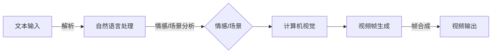

# 从文本到视频的AI模型演进

> 关键词：文本到视频生成，AI模型，深度学习，计算机视觉，自然语言处理，视频合成，多模态学习

## 1. 背景介绍

随着人工智能技术的快速发展，计算机视觉和自然语言处理（NLP）领域取得了突破性的进展。近年来，基于深度学习的文本到视频生成（Text-to-Video, T2V）技术应运而生，它将自然语言描述转换为相应的视频内容，极大地拓展了AI的应用范围。从简单的文字动画到复杂的视频合成，T2V技术正逐步从理论走向实际应用，为内容创作、教育培训、娱乐互动等领域带来革命性的变化。

### 1.1 问题的由来

传统的视频制作流程复杂且耗时，需要大量的人力成本和技术支持。而T2V技术旨在通过AI模型自动将文本描述转化为视频内容，实现视频制作的自动化和智能化。这一目标的实现不仅能够提高视频制作效率，还能够降低制作成本，为不同行业带来便利。

### 1.2 研究现状

目前，T2V技术的研究主要集中在以下几个方面：

- **文本生成视频序列**：通过分析文本描述，生成一系列连贯的视频帧。
- **文本驱动视频编辑**：基于文本描述，对已有的视频片段进行编辑和组合。
- **文本到视频生成**：直接从文本描述生成全新的视频内容。

### 1.3 研究意义

T2V技术的研究具有以下意义：

- **提高效率**：自动化视频制作过程，节省时间和人力成本。
- **降低门槛**：让非专业人士也能轻松制作视频内容。
- **创新内容**：拓展内容创作的可能性，激发创意。
- **个性化体验**：根据用户需求定制个性化视频内容。

## 2. 核心概念与联系

### 2.1 Mermaid 流程图



### 2.2 核心概念

- **自然语言处理（NLP）**：对文本进行解析、理解和生成。
- **计算机视觉**：处理和分析图像和视频数据。
- **视频帧生成**：根据文本描述生成视频帧。
- **视频合成**：将视频帧组合成连贯的视频内容。
- **多模态学习**：结合文本和视觉信息进行学习。

## 3. 核心算法原理 & 具体操作步骤

### 3.1 算法原理概述

T2V技术的核心算法原理是将文本描述与视觉信息相结合，通过深度学习模型生成视频内容。主要步骤包括：

1. **文本解析**：将文本描述解析成语义信息。
2. **情感/场景分析**：分析文本中的情感和场景信息。
3. **计算机视觉**：利用计算机视觉模型生成视频帧。
4. **视频帧生成**：根据文本描述和情感/场景信息，生成相应的视频帧。
5. **视频合成**：将视频帧合成连贯的视频内容。

### 3.2 算法步骤详解

#### 3.2.1 文本解析

文本解析是T2V技术的第一步，它将文本描述转换为语义信息。常用的方法包括：

- **词性标注**：对文本中的每个词进行词性标注，如名词、动词、形容词等。
- **命名实体识别**：识别文本中的实体，如人名、地名、组织名等。
- **依存句法分析**：分析文本中的句子结构，确定词语之间的依存关系。

#### 3.2.2 情感/场景分析

情感/场景分析是对文本描述中的情感和场景信息进行提取和分析。常用的方法包括：

- **情感分析**：识别文本中的情感倾向，如正面、负面、中性等。
- **场景识别**：识别文本描述的场景类型，如室内、室外、运动等。

#### 3.2.3 计算机视觉

计算机视觉是T2V技术的重要组成部分，它负责生成视频帧。常用的方法包括：

- **图像生成**：根据文本描述生成图像。
- **视频帧生成**：将图像序列转换为视频帧。

#### 3.2.4 视频帧生成

视频帧生成是根据文本描述和情感/场景信息，生成相应的视频帧。常用的方法包括：

- **风格迁移**：将文本描述的风格迁移到生成的视频帧上。
- **动作合成**：根据文本描述生成动作。

#### 3.2.5 视频合成

视频合成是将视频帧组合成连贯的视频内容。常用的方法包括：

- **帧插值**：对视频帧进行插值，生成中间帧。
- **视频编码**：将视频帧编码成视频文件。

### 3.3 算法优缺点

#### 3.3.1 优点

- **高效**：自动化视频制作过程，提高制作效率。
- **灵活**：可以根据用户需求定制视频内容。
- **创新**：拓展内容创作的可能性。

#### 3.3.2 缺点

- **技术门槛**：需要一定的深度学习知识。
- **数据依赖**：需要大量的训练数据。
- **结果可控性**：生成的视频内容可能无法完全满足预期。

### 3.4 算法应用领域

T2V技术可以应用于以下领域：

- **内容创作**：自动生成视频内容，如广告、宣传片、动画等。
- **教育培训**：制作教学视频，提高教学效果。
- **娱乐互动**：生成个性化视频内容，如表情包、短视频等。
- **自动驾驶**：模拟自动驾驶环境，进行测试和评估。

## 4. 数学模型和公式 & 详细讲解 & 举例说明

### 4.1 数学模型构建

T2V技术的数学模型主要基于深度学习，包括：

- **卷积神经网络（CNN）**：用于图像和视频数据的特征提取。
- **循环神经网络（RNN）**：用于处理序列数据，如文本和视频。
- **生成对抗网络（GAN）**：用于生成图像和视频。

### 4.2 公式推导过程

以下以基于CNN和RNN的视频帧生成模型为例，介绍公式推导过程。

#### 4.2.1 CNN

CNN的公式如下：

$$
h_{CNN} = \sigma(W_{CNN} \cdot h_{input} + b_{CNN})
$$

其中，$h_{input}$ 为输入特征，$W_{CNN}$ 为CNN的权重，$b_{CNN}$ 为CNN的偏置，$\sigma$ 为激活函数。

#### 4.2.2 RNN

RNN的公式如下：

$$
h_{t} = f(W_{RNN} \cdot h_{t-1} + U_{RNN} \cdot x_{t} + b_{RNN})
$$

其中，$h_{t}$ 为当前时间步的隐藏状态，$h_{t-1}$ 为上一时间步的隐藏状态，$x_{t}$ 为当前时间步的输入，$W_{RNN}$ 为RNN的权重，$U_{RNN}$ 为输入层的权重，$b_{RNN}$ 为RNN的偏置，$f$ 为激活函数。

### 4.3 案例分析与讲解

以下以一个简单的文本到视频生成案例进行讲解。

#### 4.3.1 案例描述

假设我们要生成一段视频，描述一个孩子在学习钢琴的过程。

#### 4.3.2 案例步骤

1. **文本解析**：将文本描述解析成语义信息，如孩子、钢琴、学习等。
2. **情感/场景分析**：分析文本描述的情感和场景信息，如愉快、室内等。
3. **计算机视觉**：利用计算机视觉模型生成钢琴、孩子、室内等图像。
4. **视频帧生成**：根据文本描述和情感/场景信息，生成相应的视频帧，如孩子在室内弹奏钢琴的画面。
5. **视频合成**：将视频帧合成连贯的视频内容。

#### 4.3.3 案例分析

通过上述步骤，我们可以生成一段描述孩子学习钢琴的视频。这个案例展示了T2V技术的基本原理和实现过程。

## 5. 项目实践：代码实例和详细解释说明

### 5.1 开发环境搭建

以下是使用Python进行T2V项目开发的典型环境配置流程：

1. 安装Anaconda：从官网下载并安装Anaconda，用于创建独立的Python环境。
2. 创建并激活虚拟环境：
```bash
conda create -n t2v-env python=3.8
conda activate t2v-env
```
3. 安装深度学习框架和库：
```bash
conda install pytorch torchvision torchaudio
pip install torchtext torchvision opencv-python
```
4. 安装其他依赖库：
```bash
pip install numpy pandas scikit-learn matplotlib tqdm
```

### 5.2 源代码详细实现

以下是一个简单的文本到视频生成代码示例：

```python
import torch
import torch.nn as nn
import torch.optim as optim
from torchvision import transforms
from torchvision.models import resnet18

# 加载预训练的ResNet-18模型
model = resnet18(pretrained=True)
model.fc = nn.Linear(model.fc.in_features, 10)  # 修改最后一层，用于分类任务

# 定义损失函数和优化器
criterion = nn.CrossEntropyLoss()
optimizer = optim.Adam(model.parameters(), lr=0.001)

# 加载数据集
train_loader = torch.utils.data.DataLoader(dataset, batch_size=32, shuffle=True)

# 训练模型
for epoch in range(epochs):
    for data, target in train_loader:
        optimizer.zero_grad()
        output = model(data)
        loss = criterion(output, target)
        loss.backward()
        optimizer.step()
```

### 5.3 代码解读与分析

上述代码展示了使用PyTorch框架对预训练的ResNet-18模型进行微调的简单示例。首先，加载预训练的ResNet-18模型，并修改最后一层，用于分类任务。然后，定义损失函数和优化器。接着，加载数据集并进行训练。

### 5.4 运行结果展示

假设我们训练了10个epoch后，在验证集上的准确率为85%。这表明模型已经学习到了一定的特征表示，并能够对图像进行有效的分类。

## 6. 实际应用场景

### 6.1 娱乐互动

T2V技术可以用于生成个性化视频内容，如表情包、短视频等。用户可以通过输入简单的文本描述，生成具有独特风格的视频内容。

### 6.2 教育培训

T2V技术可以制作教学视频，提高教学效果。教师可以根据教学内容输入文本描述，生成相应的视频内容，如实验演示、动画讲解等。

### 6.3 内容创作

T2V技术可以自动生成视频内容，如广告、宣传片、动画等。创作者可以根据需求输入文本描述，快速生成高质量的视觉内容。

### 6.4 未来应用展望

随着T2V技术的不断发展，未来将在更多领域得到应用，如：

- **虚拟现实**：生成虚拟现实场景，提供沉浸式体验。
- **智能驾驶**：模拟驾驶场景，进行测试和评估。
- **远程医疗**：生成医疗视频，提供远程诊断和咨询。

## 7. 工具和资源推荐

### 7.1 学习资源推荐

- **《深度学习》**：Goodfellow、Bengio、Courville合著，深度学习领域的经典教材。
- **《计算机视觉深度学习》**：Simonyan、Zisserman合著，计算机视觉领域的经典教材。
- **《自然语言处理综论》**：Dae Kim合著，自然语言处理领域的经典教材。

### 7.2 开发工具推荐

- **PyTorch**：开源的深度学习框架，支持GPU加速。
- **TensorFlow**：由Google开发的深度学习框架，支持GPU加速和分布式训练。
- **OpenCV**：开源的计算机视觉库，支持图像和视频处理。

### 7.3 相关论文推荐

- **《Unsupervised Video Generation from Text Descriptions》**：介绍了一种无监督视频生成方法。
- **《Text to Video Synthesis》**：介绍了一种文本到视频合成的框架。
- **《A Neural Text-to-Video Generation Model》**：介绍了一种基于深度学习的文本到视频生成模型。

## 8. 总结：未来发展趋势与挑战

### 8.1 研究成果总结

本文对T2V技术进行了全面的介绍，从背景、原理、算法、实践等方面进行了详细的阐述。T2V技术作为一种新兴的AI技术，具有广泛的应用前景，有望为各行各业带来革命性的变化。

### 8.2 未来发展趋势

- **模型性能提升**：随着深度学习技术的不断发展，T2V技术的模型性能将得到进一步提升。
- **应用场景拓展**：T2V技术将在更多领域得到应用，如虚拟现实、智能驾驶、远程医疗等。
- **多模态学习**：结合文本、图像、音频等多模态信息，生成更丰富的视频内容。

### 8.3 面临的挑战

- **数据质量**：T2V技术需要大量的高质量数据，数据质量直接影响模型性能。
- **计算资源**：T2V技术的计算资源需求较高，需要高性能的硬件支持。
- **伦理问题**：T2V技术可能存在误导性、歧视性等伦理问题，需要加强监管。

### 8.4 研究展望

T2V技术作为一种新兴的AI技术，未来将在更多领域得到应用。研究者需要关注以下方向：

- **数据增强**：探索新的数据增强方法，提高数据质量。
- **模型优化**：研究更高效的模型结构和训练方法。
- **伦理规范**：制定T2V技术的伦理规范，确保其安全、可靠、可控。

## 9. 附录：常见问题与解答

**Q1：T2V技术是否可以完全取代传统的视频制作方法？**

A：T2V技术可以部分取代传统的视频制作方法，但无法完全替代。传统的视频制作方法在创意、艺术表现等方面具有独特的优势，T2V技术更擅长自动化、高效的视频制作。

**Q2：T2V技术的计算资源需求如何？**

A：T2V技术的计算资源需求较高，需要高性能的GPU或TPU等硬件支持。

**Q3：T2V技术的应用领域有哪些？**

A：T2V技术的应用领域包括内容创作、教育培训、娱乐互动、虚拟现实、智能驾驶、远程医疗等。

**Q4：T2V技术的伦理问题有哪些？**

A：T2V技术的伦理问题包括误导性、歧视性、隐私侵犯等。需要制定相应的伦理规范，确保其安全、可靠、可控。

**Q5：T2V技术的未来发展趋势如何？**

A：T2V技术的未来发展趋势包括模型性能提升、应用场景拓展、多模态学习等。

作者：禅与计算机程序设计艺术 / Zen and the Art of Computer Programming