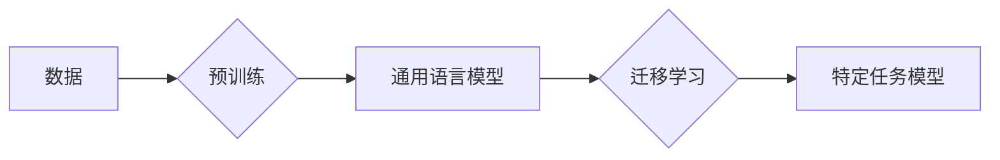

# 大语言模型原理与工程实践：大语言模型的缩放定律

> 关键词：大语言模型，缩放定律，预训练，迁移学习，模型效率，工程实践，Transformer，BERT，GPT

## 1. 背景介绍

随着深度学习技术的飞速发展，大语言模型（Large Language Models, LLMs）在自然语言处理（Natural Language Processing, NLP）领域取得了革命性的突破。这些模型通过在庞大的文本语料库上预训练，获得了丰富的语言知识和上下文理解能力，从而在多种NLP任务上展现出惊人的性能。然而，随着模型规模的不断扩大，其训练和推理的复杂性也随之增加，带来了巨大的计算和资源挑战。本文将深入探讨大语言模型的缩放定律，分析其原理、工程实践以及面临的挑战。

## 2. 核心概念与联系

### 2.1 核心概念

**大语言模型**：通过在大量文本数据上预训练，能够理解和生成自然语言的模型，如BERT、GPT等。

**预训练**：在大量无标签数据上训练模型，使其获得通用语言知识的过程。

**迁移学习**：将预训练模型的知识迁移到特定任务上，通过少量标注数据进一步训练，以获得更好的性能。

**缩放定律**：大语言模型的性能随着模型规模的增加而提升，但提升速度随着规模的增长而减缓。

### 2.2 Mermaid 流程图



**流程说明**：
- A（数据）：收集大量无标签和少量有标签数据。
- B（预训练）：在无标签数据上训练模型，学习通用语言知识。
- C（通用语言模型）：得到一个具备丰富语言知识的模型。
- D（迁移学习）：使用少量标注数据对通用语言模型进行微调。
- E（特定任务模型）：得到一个在特定任务上表现优异的模型。

## 3. 核心算法原理 & 具体操作步骤

### 3.1 算法原理概述

大语言模型的缩放定律源于模型性能与参数数量之间的正相关关系。随着模型参数数量的增加，模型能够学习到更加丰富的语言特征和上下文信息，从而在下游任务上取得更好的性能。然而，随着模型规模的扩大，其训练和推理的复杂度也会指数级增长。

### 3.2 算法步骤详解

1. **数据收集**：收集大量无标签和少量有标签数据。
2. **预训练**：在无标签数据上训练模型，学习通用语言知识。
3. **模型结构设计**：选择合适的模型结构，如Transformer。
4. **参数优化**：使用优化算法（如Adam）调整模型参数。
5. **迁移学习**：在少量标注数据上对模型进行微调。
6. **模型评估**：在测试集上评估模型性能。
7. **模型部署**：将模型部署到生产环境中。

### 3.3 算法优缺点

**优点**：

- 能够处理复杂的NLP任务。
- 减少了手动特征工程的工作量。
- 在多种任务上取得了优异的性能。

**缺点**：

- 训练和推理资源消耗巨大。
- 模型可解释性较差。
- 模型可能学习到有害的知识。

### 3.4 算法应用领域

- 文本分类
- 机器翻译
- 问答系统
- 语音识别
- 图像识别

## 4. 数学模型和公式 & 详细讲解 & 举例说明

### 4.1 数学模型构建

大语言模型通常基于神经网络架构，如Transformer。以下为Transformer模型的基本数学公式：

$$
\mathbf{h}_i = \text{softmax}\left(\mathbf{W}_Q \mathbf{h}_{i-1} + \mathbf{W}_K \mathbf{h}_{i-1} + \mathbf{W}_V \mathbf{h}_{i-1}\right)
$$

其中，$\mathbf{h}_i$ 表示第 $i$ 个隐藏状态，$\mathbf{W}_Q, \mathbf{W}_K, \mathbf{W}_V$ 分别表示查询、键、值矩阵。

### 4.2 公式推导过程

Transformer模型的核心思想是自注意力机制，其推导过程如下：

1. **计算查询-键相似度**：
   $$
   \text{similarity}(\mathbf{q}, \mathbf{k}) = \mathbf{q}^T \mathbf{k}
   $$
2. **计算注意力分数**：
   $$
   \text{score}(\mathbf{q}, \mathbf{k}) = \text{similarity}(\mathbf{q}, \mathbf{k}) \div \sqrt{d_k}
   $$
3. **应用softmax函数**：
   $$
   \mathbf{w}_i = \text{softmax}(\text{score}(\mathbf{q}, \mathbf{k}))
   $$
4. **计算输出**：
   $$
   \mathbf{h}_i = \sum_{j=1}^{N} \mathbf{w}_{ij} \mathbf{k}_j
   $$

### 4.3 案例分析与讲解

以下以BERT模型为例，分析其数学模型和计算过程。

BERT模型由Transformer编码器组成，其中包含多个编码层。每个编码层包含两个子层：自注意力子层和前馈神经网络子层。

1. **自注意力子层**：
   - 计算查询-键相似度。
   - 应用softmax函数。
   - 计算加权求和。

2. **前馈神经网络子层**：
   - 使用两层全连接神经网络。
   - 应用ReLU激活函数。

最终，每个编码层输出一个固定长度的向量，作为模型的输出。

## 5. 项目实践：代码实例和详细解释说明

### 5.1 开发环境搭建

以下以Python和TensorFlow为例，搭建开发环境：

```python
pip install tensorflow
```

### 5.2 源代码详细实现

以下为使用TensorFlow实现BERT模型的基本代码：

```python
import tensorflow as tf

class Transformer(tf.keras.Model):
    def __init__(self, num_layers, d_model, num_heads):
        super(Transformer, self).__init__()
        self.encoder_layers = [EncoderLayer(d_model, num_heads) for _ in range(num_layers)]

    def call(self, inputs):
        for layer in self.encoder_layers:
            inputs = layer(inputs)
        return inputs

class EncoderLayer(tf.keras.layers.Layer):
    def __init__(self, d_model, num_heads):
        super(EncoderLayer, self).__init__()
        self.multihead_attention = tf.keras.layers.MultiHeadAttention(num_heads=num_heads, key_dim=d_model)
        self.ffn = tf.keras.layers.Dense(d_model, activation='relu')
        self.layernorm1 = tf.keras.layers.LayerNormalization(epsilon=1e-6)
        self.layernorm2 = tf.keras.layers.LayerNormalization(epsilon=1e-6)

    def call(self, x, mask=None):
        attn_output = self.multihead_attention(x, x, x, attention_mask=mask)
        out1 = self.layernorm1(x + attn_output)
        ffn_output = self.ffn(out1)
        return self.layernorm2(out1 + ffn_output)

# 模型构建
transformer = Transformer(num_layers=12, d_model=768, num_heads=12)

# 模型训练
# ...
```

### 5.3 代码解读与分析

以上代码展示了如何使用TensorFlow构建Transformer模型。首先定义了Transformer类，包含多个编码层。每个编码层由自注意力层和前馈神经网络层组成。通过堆叠多个编码层，构建出完整的Transformer模型。

### 5.4 运行结果展示

由于篇幅限制，此处不展示具体的运行结果。在实际应用中，可以训练模型并在测试集上评估其性能。

## 6. 实际应用场景

大语言模型在NLP领域的应用场景非常广泛，以下列举几个典型应用：

- **文本分类**：对文本进行分类，如情感分析、主题分类等。
- **机器翻译**：将一种语言的文本翻译成另一种语言。
- **问答系统**：回答用户提出的问题。
- **文本摘要**：将长文本压缩成摘要。
- **对话系统**：与用户进行自然对话。

## 7. 工具和资源推荐

### 7.1 学习资源推荐

- 《深度学习自然语言处理》
- 《BERT: Pre-training of Deep Bidirectional Transformers for Language Understanding》
- 《Attention is All You Need》

### 7.2 开发工具推荐

- TensorFlow
- PyTorch
- Hugging Face Transformers

### 7.3 相关论文推荐

- 《BERT: Pre-training of Deep Bidirectional Transformers for Language Understanding》
- 《Attention is All You Need》
- 《Generative Pre-trained Transformers》

## 8. 总结：未来发展趋势与挑战

### 8.1 研究成果总结

大语言模型在NLP领域取得了显著的成果，但仍存在一些挑战和不足。

### 8.2 未来发展趋势

- 模型规模将不断扩大。
- 计算效率将进一步提高。
- 模型可解释性将得到改善。
- 模型将应用于更多领域。

### 8.3 面临的挑战

- 训练和推理资源消耗巨大。
- 模型可解释性较差。
- 模型可能学习到有害的知识。

### 8.4 研究展望

未来，大语言模型的研究将重点关注以下方向：

- 如何在保证性能的同时，降低模型复杂度和资源消耗。
- 如何提高模型的可解释性和透明度。
- 如何避免模型学习到有害的知识。

## 9. 附录：常见问题与解答

**Q1：大语言模型如何处理长文本？**

A：大语言模型通常采用分块处理的方式，将长文本分割成多个短文本块，然后分别进行编码和计算。

**Q2：大语言模型如何处理多语言文本？**

A：可以使用多语言预训练模型，如XLM、M2M等，或对模型进行多语言微调。

**Q3：如何评估大语言模型的效果？**

A：可以使用多种指标评估大语言模型的效果，如BLEU、ROUGE、F1等。

**Q4：大语言模型如何进行推理？**

A：将输入文本输入到模型中，通过解码器输出结果。

**Q5：如何防止大语言模型过拟合？**

A：可以使用正则化、Dropout、数据增强等方法防止模型过拟合。

作者：禅与计算机程序设计艺术 / Zen and the Art of Computer Programming