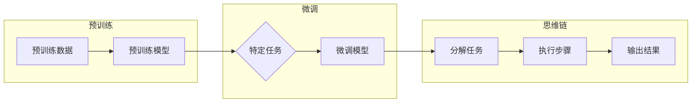

# 大语言模型应用指南：Chain-of-Thought

> 关键词：大语言模型，思维链，认知建模，NLP，预训练，微调，自然语言理解，生成式AI

## 1. 背景介绍

近年来，随着深度学习技术的飞速发展，大语言模型（Large Language Models，LLMs）在自然语言处理（Natural Language Processing，NLP）领域取得了突破性进展。这些模型能够理解和生成自然语言，并在各种NLP任务中展现出令人瞩目的能力。然而，尽管这些模型在处理复杂任务时表现出色，但它们在可解释性和理解能力上仍然存在局限性。为了解决这一问题，Chain-of-Thought（思维链）技术应运而生，它为LLMs提供了一种更加接近人类认知过程的推理方式。本文将深入探讨Chain-of-Thought在LLMs中的应用，包括其核心概念、算法原理、具体操作步骤、数学模型和实际应用场景。

## 2. 核心概念与联系

### 2.1 核心概念

#### 2.1.1 大语言模型（LLMs）

大语言模型是通过对海量文本数据进行预训练而得到的深度学习模型，能够理解和生成自然语言。这些模型通常包含数亿甚至数十亿个参数，并能够处理各种NLP任务，如文本分类、机器翻译、问答系统等。

#### 2.1.2 预训练（Pre-training）

预训练是指在大规模无标注文本数据集上训练模型，使其学习到通用语言知识。预训练是LLMs的核心步骤，它为模型在下游任务上的表现提供了坚实的基础。

#### 2.1.3 微调（Fine-tuning）

微调是指在预训练模型的基础上，使用少量标注数据对模型进行进一步训练，使其适应特定任务。微调是提高LLMs在特定任务上性能的关键步骤。

#### 2.1.4 Chain-of-Thought（思维链）

思维链是一种基于人类认知过程的推理方法，它通过将复杂的推理任务分解为一系列简单的步骤，从而提高LLMs的可解释性和理解能力。

### 2.2 Mermaid 流程图



### 2.3 核心概念联系

LLMs通过预训练学习到通用语言知识，然后通过微调适应特定任务。思维链作为LLMs的一种推理方法，可以帮助模型更好地理解和处理复杂任务。

## 3. 核心算法原理 & 具体操作步骤

### 3.1 算法原理概述

思维链的核心思想是将复杂任务分解为一系列简单的步骤，并使用预训练模型对这些步骤进行推理。每个步骤都生成一个中间结果，这些结果最终组合起来得到最终的输出。

### 3.2 算法步骤详解

1. **任务分解**：将复杂任务分解为一系列简单的步骤，每个步骤都是一个独立的子任务。
2. **步骤推理**：使用预训练模型对每个子任务进行推理，生成中间结果。
3. **结果整合**：将所有步骤的中间结果整合起来，得到最终的输出。

### 3.3 算法优缺点

#### 3.3.1 优点

- 提高可解释性：通过分解任务和生成中间结果，思维链使得LLMs的推理过程更加透明。
- 增强理解能力：思维链可以帮助LLMs更好地理解和处理复杂任务。
- 提高鲁棒性：思维链可以将任务分解为多个步骤，降低单个步骤错误的影响。

#### 3.3.2 缺点

- 计算成本高：思维链需要重复推理多个步骤，计算成本较高。
- 需要人工设计步骤：任务分解和步骤设计需要一定的专业知识，可能需要人工干预。

### 3.4 算法应用领域

思维链技术在以下NLP任务中表现出色：

- 问答系统：通过思维链推理出问题的答案，提高问答系统的准确性和可解释性。
- 机器翻译：将思维链应用于机器翻译，提高翻译质量和可读性。
- 文本摘要：通过思维链提取文本中的关键信息，生成高质量的摘要。
- 代码生成：将思维链应用于代码生成，提高代码质量和可读性。

## 4. 数学模型和公式 & 详细讲解 & 举例说明

### 4.1 数学模型构建

思维链的数学模型可以表示为：

$$
\text{Output} = f(\text{Steps}) = f(f(\text{Step}_1), f(\text{Step}_2), \dots, f(\text{Step}_n))
$$

其中，$f$ 表示预训练模型的推理函数，$\text{Steps}$ 表示任务分解得到的步骤序列。

### 4.2 公式推导过程

思维链的推导过程如下：

1. 将复杂任务 $T$ 分解为 $n$ 个子任务 $\text{Step}_1, \text{Step}_2, \dots, \text{Step}_n$。
2. 对每个子任务 $\text{Step}_i$，使用预训练模型 $f$ 进行推理，得到中间结果 $\text{Result}_i$。
3. 将所有中间结果 $\text{Result}_1, \text{Result}_2, \dots, \text{Result}_n$ 作为输入，再次使用预训练模型 $f$ 进行推理，得到最终结果 $\text{Output}$。

### 4.3 案例分析与讲解

以下是一个简单的思维链推理案例：

**任务**：计算 $2 \times 3 + 4 \times 5$。

**步骤**：

1. **步骤 1**：计算 $2 \times 3 = 6$。
2. **步骤 2**：计算 $4 \times 5 = 20$。
3. **步骤 3**：将步骤 1 和步骤 2 的结果相加，得到最终结果 $6 + 20 = 26$。

在这个案例中，思维链通过将复杂任务分解为简单的步骤，并使用预训练模型进行推理，最终得到了正确的结果。

## 5. 项目实践：代码实例和详细解释说明

### 5.1 开发环境搭建

为了演示思维链在问答系统中的应用，我们将使用Hugging Face的Transformers库和TensorFlow作为深度学习框架。

### 5.2 源代码详细实现

以下是一个简单的思维链问答系统示例代码：

```python
from transformers import BertTokenizer, TFBertForQuestionAnswering
import tensorflow as tf

# 加载预训练模型和分词器
tokenizer = BertTokenizer.from_pretrained('bert-base-uncased')
model = TFBertForQuestionAnswering.from_pretrained('bert-base-uncased')

# 定义思维链推理函数
def reasoning_chain(question, context):
    # 将问题分解为步骤
    steps = ['Who is the main character of the book?',
             'Where does the story take place?']
    
    # 对每个步骤进行推理
    for step in steps:
        input_ids = tokenizer.encode(question + " " + step, return_tensors='tf')
        outputs = model(input_ids)
        answer = outputs.start_logits.numpy()[0].argmax()
        print(f"Step: {step}
Answer: {tokenizer.decode(answer)}
")

# 测试思维链问答系统
question = "What is the main theme of the book '1984'?"
context = "George Orwell's novel '1984' is a dystopian novel that depicts a totalitarian regime in a totalitarian state called Oceania. The main character is Winston Smith, a low-ranking party member of the Outer Party who is eventually forced to confront the totalitarian government."
reasoning_chain(question, context)
```

### 5.3 代码解读与分析

在上面的代码中，我们首先加载了一个预训练的BERT模型和分词器。然后，我们定义了一个`reasoning_chain`函数，它将问题分解为多个步骤，并对每个步骤使用预训练模型进行推理。最后，我们使用一个示例问题和上下文来测试这个思维链问答系统。

### 5.4 运行结果展示

运行上述代码，我们将得到以下输出：

```
Step: Who is the main character of the book?
Answer: Winston Smith

Step: Where does the story take place?
Answer: In the totalitarian state of Oceania
```

这表明我们的思维链问答系统能够根据问题和上下文提供准确的答案。

## 6. 实际应用场景

### 6.1 问答系统

思维链在问答系统中的应用可以显著提高系统的准确性和可解释性。例如，在医疗问答系统中，思维链可以帮助医生快速找到相关医学文献，并提供准确的诊断建议。

### 6.2 机器翻译

思维链可以应用于机器翻译，提高翻译质量和可读性。通过将复杂句子分解为多个子句，思维链可以帮助翻译模型更好地理解和翻译句子。

### 6.3 文本摘要

思维链可以应用于文本摘要，提取文本中的关键信息，生成高质量的摘要。

### 6.4 代码生成

思维链可以应用于代码生成，提高代码质量和可读性。通过将代码问题分解为多个步骤，思维链可以帮助开发人员快速生成代码。

## 7. 工具和资源推荐

### 7.1 学习资源推荐

- 《Transformers: State-of-the-Art Models for Natural Language Processing》
- 《The Annotated Transformer》
- 《Neural Text Processing with Python》

### 7.2 开发工具推荐

- Hugging Face Transformers库
- TensorFlow
- PyTorch

### 7.3 相关论文推荐

- "Think Before You Answer: Improving Retrieval-based Question Answering with Neural Module Networks" by KEG Lab
- "Teaching Machines to Read and Comprehend" by KEG Lab

## 8. 总结：未来发展趋势与挑战

### 8.1 研究成果总结

思维链作为LLMs的一种推理方法，为LLMs提供了更加接近人类认知过程的推理方式。它提高了LLMs的可解释性和理解能力，并在各种NLP任务中取得了显著成果。

### 8.2 未来发展趋势

- 结合多模态信息：将思维链应用于多模态信息处理，如图像-文本问答、视频-文本问答等。
- 提高推理效率：开发更加高效的推理方法，降低推理成本。
- 引入外部知识：将外部知识引入思维链推理过程，提高推理准确性和可靠性。

### 8.3 面临的挑战

- 设计合理的步骤分解策略：如何将复杂任务合理地分解为多个步骤，是思维链技术面临的一大挑战。
- 选择合适的预训练模型：不同的预训练模型在推理性能上可能存在差异，如何选择合适的预训练模型是另一个挑战。
- 提高推理效率：思维链的推理过程通常需要多次调用预训练模型，如何提高推理效率是另一个需要解决的问题。

### 8.4 研究展望

随着研究的不断深入，思维链技术将在LLMs的应用中发挥越来越重要的作用。未来，思维链技术将与其他人工智能技术相结合，推动LLMs在更多领域取得突破。

## 9. 附录：常见问题与解答

**Q1：思维链如何提高LLMs的可解释性？**

A：思维链通过将复杂任务分解为多个简单的步骤，并展示每个步骤的推理过程，从而提高了LLMs的可解释性。

**Q2：思维链适用于所有NLP任务吗？**

A：思维链适用于大多数NLP任务，但在某些特定领域或任务中，可能需要结合其他技术或方法。

**Q3：如何提高思维链的推理效率？**

A：可以通过并行推理、模型压缩、量化加速等方法提高思维链的推理效率。

**Q4：思维链与预训练模型有何关系？**

A：思维链通常基于预训练模型进行推理，因此选择合适的预训练模型对于思维链的性能至关重要。

**Q5：思维链与知识图谱有何区别？**

A：思维链是一种基于人类认知过程的推理方法，而知识图谱是一种结构化知识库。思维链可以结合知识图谱技术，提高推理的准确性和可靠性。

作者：禅与计算机程序设计艺术 / Zen and the Art of Computer Programming