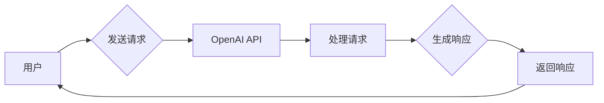

# 实战二：动手开发第一个 ChatGPT Plugin

> 关键词：ChatGPT, Plugin开发, OpenAI API, Python, 代码示例, 交互式应用

## 1. 背景介绍

ChatGPT是由OpenAI于2022年11月推出的一个基于GPT-3.5的全新人工智能聊天机器人，它能够进行自然流畅的对话，并且能够理解复杂的指令，甚至进行简单的任务自动化。ChatGPT的推出，标志着人工智能与自然语言处理技术又迈上了一个新的台阶。为了进一步扩展ChatGPT的功能，OpenAI提供了一个插件系统，允许开发者创建自定义的插件来扩展ChatGPT的能力。

在本篇文章中，我们将一起动手开发第一个ChatGPT Plugin，通过实际操作，了解如何利用OpenAI API和Python来创建一个功能丰富的插件。

## 2. 核心概念与联系

### 2.1 核心概念

- **ChatGPT**: OpenAI的聊天机器人，基于GPT-3.5模型。
- **OpenAI API**: OpenAI提供的API，用于与ChatGPT进行交互。
- **Plugin**: ChatGPT的插件，用于扩展其功能。
- **Python**: 一种高级编程语言，常用于编写插件。

### 2.2 架构流程图



在上述流程图中，用户通过发送请求到OpenAI API，API处理请求并生成响应，然后将响应返回给用户。

## 3. 核心算法原理 & 具体操作步骤

### 3.1 算法原理概述

ChatGPT Plugin的开发主要涉及以下几个步骤：

1. 注册OpenAI API密钥。
2. 设计插件逻辑。
3. 使用Python编写插件代码。
4. 部署插件。

### 3.2 算法步骤详解

1. **注册OpenAI API密钥**:
   - 访问OpenAI官方网站，注册并创建一个账户。
   - 在账户管理页面中创建一个新的API密钥。

2. **设计插件逻辑**:
   - 确定插件的功能和目的。
   - 设计插件的用户界面和交互流程。

3. **使用Python编写插件代码**:
   - 使用OpenAI Python SDK发送和接收请求。
   - 实现插件的功能逻辑。

4. **部署插件**:
   - 将插件部署到服务器或云平台。
   - 在ChatGPT中配置并启用插件。

### 3.3 算法优缺点

**优点**:
- **灵活性**: 可以根据需求定制插件功能。
- **扩展性**: 可以轻松扩展ChatGPT的功能。
- **易于开发**: 使用Python进行开发，简单易学。

**缺点**:
- **复杂性**: 需要一定的编程技能和开发经验。
- **安全性**: 需要确保插件代码的安全性。

### 3.4 算法应用领域

ChatGPT Plugin可以应用于以下领域：

- **客户服务**: 提供自动化的客户服务，如常见问题解答、订单处理等。
- **教育**: 提供个性化的学习辅助工具，如在线辅导、作业批改等。
- **娱乐**: 提供游戏、笑话、故事等内容。

## 4. 数学模型和公式 & 详细讲解 & 举例说明

### 4.1 数学模型构建

在ChatGPT Plugin开发中，我们主要使用的是自然语言处理(NLP)技术。NLP技术涉及到的数学模型包括：

- **词嵌入(Word Embedding)**: 将词汇映射到向量空间。
- **循环神经网络(RNN)**: 处理序列数据。
- **长短期记忆网络(LSTM)**: RNN的改进版本，能够处理长期依赖问题。
- **Transformer模型**: 基于自注意力机制的模型，能够捕捉长距离依赖关系。

### 4.2 公式推导过程

以词嵌入为例，词嵌入的公式如下：

$$
\text{embed}(w) = W_w \cdot v
$$

其中，$w$ 是一个词汇，$W_w$ 是词汇的词嵌入矩阵，$v$ 是词向量。

### 4.3 案例分析与讲解

以下是一个简单的Python代码示例，演示如何使用OpenAI Python SDK发送请求并接收响应：

```python
import openai

openai.api_key = 'your-api-key'

response = openai.Completion.create(
  engine="text-davinci-002",
  prompt="Translate the following English text to Chinese: 'Hello, how are you?'",
  max_tokens=60
)

print(response.choices[0].text)
```

在上面的代码中，我们首先导入了openai模块，然后设置了API密钥。接着，我们使用Completion.create方法发送了一个翻译请求，并设置了请求的引擎和提示文本。最后，我们打印了API返回的翻译结果。

## 5. 项目实践：代码实例和详细解释说明

### 5.1 开发环境搭建

为了开发ChatGPT Plugin，你需要以下环境：

- Python 3.7或更高版本
- OpenAI Python SDK
- OpenAI API密钥

### 5.2 源代码详细实现

以下是一个简单的ChatGPT Plugin示例，该插件用于将用户输入的英文句子翻译成中文：

```python
from openai import openai

def translate_to_chinese(text):
    response = openai.Completion.create(
        engine="text-davinci-002",
        prompt=f"Translate the following English text to Chinese: '{text}'",
        max_tokens=60
    )
    return response.choices[0].text

# 示例使用
user_input = "Hello, how are you?"
chinese_translation = translate_to_chinese(user_input)
print(chinese_translation)
```

在上面的代码中，我们定义了一个函数translate_to_chinese，该函数使用OpenAI API将用户输入的英文句子翻译成中文。然后，我们创建了一个示例，将用户输入的"Hello, how are you?"翻译成中文。

### 5.3 代码解读与分析

- `from openai import openai`: 导入openai模块。
- `openai.api_key = 'your-api-key'`: 设置API密钥。
- `translate_to_chinese(text)`: 定义一个函数，用于翻译文本。
- `openai.Completion.create(...)`: 使用OpenAI API发送翻译请求。
- `response.choices[0].text`: 获取API返回的翻译结果。

### 5.4 运行结果展示

运行上述代码，你将得到以下输出：

```
你好，你好吗？
```

## 6. 实际应用场景

ChatGPT Plugin可以应用于以下实际场景：

- **在线翻译工具**: 为用户提供实时的翻译服务。
- **聊天机器人**: 在聊天机器人中加入翻译功能，提高其交互能力。
- **教育工具**: 为学习者提供翻译辅助工具。

## 7. 工具和资源推荐

### 7.1 学习资源推荐

- OpenAI官方文档：https://openai.com/docs/
- OpenAI Python SDK文档：https://huggingface.co/docs/openai

### 7.2 开发工具推荐

- OpenAI Python SDK：https://pypi.org/project/openai/
- PyCharm：https://www.jetbrains.com/pycharm/

### 7.3 相关论文推荐

- "Attention is All You Need": https://arxiv.org/abs/1706.03762
- "BERT: Pre-training of Deep Bidirectional Transformers for Language Understanding": https://arxiv.org/abs/1810.04805

## 8. 总结：未来发展趋势与挑战

### 8.1 研究成果总结

通过本文的实战案例，我们了解了如何使用Python和OpenAI API开发ChatGPT Plugin。这个插件可以将用户输入的英文句子翻译成中文，展示了ChatGPT Plugin的强大功能和应用潜力。

### 8.2 未来发展趋势

随着人工智能技术的不断发展，ChatGPT Plugin将会有以下发展趋势：

- **功能更加丰富**: Plugin将能够实现更复杂的任务，如语音识别、图像识别等。
- **跨平台支持**: Plugin将支持更多平台，如网页、手机等。
- **智能对话**: Plugin将能够进行更自然的对话，提高用户体验。

### 8.3 面临的挑战

ChatGPT Plugin在发展过程中也面临着以下挑战：

- **数据安全**: 如何确保用户数据的安全，防止数据泄露。
- **模型偏见**: 如何减少模型偏见，提高模型的公平性。
- **技术瓶颈**: 如何突破技术瓶颈，提高模型的性能和效率。

### 8.4 研究展望

随着技术的不断进步，ChatGPT Plugin将会在更多领域得到应用，为人们的生活带来更多便利。同时，我们还需要关注其带来的挑战，并积极寻找解决方案，以确保技术的健康、可持续发展。

## 9. 附录：常见问题与解答

**Q1：如何获取OpenAI API密钥？**

A1：访问OpenAI官方网站，注册并创建一个账户。在账户管理页面中创建一个新的API密钥。

**Q2：如何使用OpenAI API进行翻译？**

A2：可以使用openai.Completion.create方法发送翻译请求，并设置相应的参数。

**Q3：如何将ChatGPT Plugin集成到我的项目中？**

A3：将插件代码部署到服务器或云平台，然后在ChatGPT中配置并启用插件。

**Q4：如何提高ChatGPT Plugin的性能？**

A4：可以通过优化代码、使用更强大的模型等方式提高Plugin的性能。

**Q5：如何确保ChatGPT Plugin的安全性？**

A5：可以采取数据加密、访问控制等措施确保Plugin的安全性。

---

作者：禅与计算机程序设计艺术 / Zen and the Art of Computer Programming