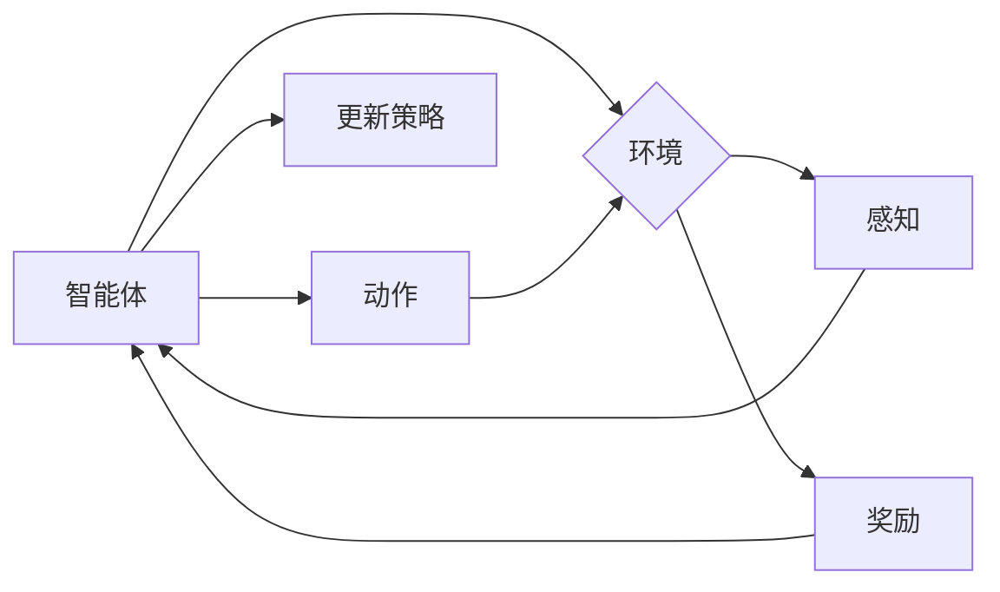

# 强化学习 原理与代码实例讲解

> 关键词：强化学习，Q-Learning，SARSA，策略梯度，深度强化学习，DQN，PPO，应用场景

## 1. 背景介绍

强化学习（Reinforcement Learning，RL）是机器学习的一个分支，它通过智能体（Agent）与环境的交互来学习最优策略，以实现目标函数的最优化。与监督学习和无监督学习不同，强化学习不依赖于大量的标注数据，而是通过智能体与环境之间的互动来获取经验和改进策略。

### 1.1 问题的由来

强化学习起源于20世纪50年代，最初在心理学和人工智能领域进行研究。随着深度学习技术的快速发展，强化学习在游戏、机器人、自动驾驶、推荐系统等众多领域取得了显著的成果。

### 1.2 研究现状

目前，强化学习已经形成了多种不同的算法和理论框架，主要包括：

- 基于值函数的强化学习，如Q-Learning、Sarsa。
- 基于策略梯度的强化学习，如REINFORCE、PPO、A3C。
- 基于深度学习的强化学习，如DQN、DDPG、PPO。

### 1.3 研究意义

强化学习在解决复杂决策问题时具有独特的优势，如：

- 不依赖于大量标注数据，适用于数据稀缺的场景。
- 能够处理连续动作空间，适用于机器人、自动驾驶等场景。
- 能够学习到复杂决策策略，适用于游戏、推荐系统等场景。

### 1.4 本文结构

本文将围绕强化学习这一主题，从基本概念、核心算法、代码实现、应用场景等方面进行详细介绍。具体内容安排如下：

- 第2部分，介绍强化学习的基本概念和核心原理。
- 第3部分，详细讲解Q-Learning、Sarsa、策略梯度、DQN等核心算法。
- 第4部分，给出强化学习代码实例，并对关键代码进行解读。
- 第5部分，探讨强化学习的实际应用场景。
- 第6部分，展望强化学习的未来发展趋势与挑战。
- 第7部分，推荐强化学习相关的学习资源、开发工具和参考文献。
- 第8部分，总结全文，并对未来研究方向进行展望。

## 2. 核心概念与联系

### 2.1 Mermaid 流程图

以下是一个简化的强化学习流程图：



### 2.2 核心概念

- 智能体（Agent）：强化学习中的决策主体，负责选择动作并学习最优策略。
- 环境（Environment）：智能体交互的外部世界，能够提供状态、动作和奖励。
- 状态（State）：环境中的一个特定状态，通常表示为状态空间中的一个点。
- 动作（Action）：智能体可以采取的动作，通常表示为动作空间中的一个点。
- 奖励（Reward）：智能体在环境中采取动作后获得的奖励，用于指导智能体学习。
- 策略（Policy）：智能体在给定状态下的动作选择规则。
- 值函数（Value Function）：表示智能体在特定状态或状态序列上的期望回报。
- Q值（Q-Value）：表示智能体在特定状态下采取特定动作的期望回报。

## 3. 核心算法原理 & 具体操作步骤

### 3.1 算法原理概述

强化学习算法主要分为两大类：基于值函数的强化学习和基于策略梯度的强化学习。

#### 3.1.1 基于值函数的强化学习

基于值函数的强化学习算法旨在学习状态值函数或动作值函数，以指导智能体选择最优动作。常见的算法包括Q-Learning和Sarsa。

#### 3.1.2 基于策略梯度的强化学习

基于策略梯度的强化学习算法直接学习策略函数，以指导智能体选择最优动作。常见的算法包括REINFORCE、PPO、A3C。

### 3.2 算法步骤详解

#### 3.2.1 Q-Learning

Q-Learning是一种基于值函数的强化学习算法，其核心思想是学习状态-动作值函数 $Q(s,a)$，并使用贪心策略选择动作。

1. 初始化 $Q(s,a)$。
2. 在状态 $s$ 下选择动作 $a$。
3. 执行动作 $a$，得到新的状态 $s'$ 和奖励 $R$。
4. 更新 $Q(s,a) = Q(s,a) + \alpha [R + \gamma \max_{a'} Q(s',a') - Q(s,a)]$。
5. 返回步骤2。

#### 3.2.2 Sarsa

Sarsa是一种基于值函数的强化学习算法，与Q-Learning类似，但使用回合回报而非单步回报来更新值函数。

1. 初始化 $Q(s,a)$。
2. 在状态 $s$ 下选择动作 $a$。
3. 执行动作 $a$，得到新的状态 $s'$ 和奖励 $R$。
4. 在状态 $s'$ 下选择动作 $a'$。
5. 更新 $Q(s,a) = Q(s,a) + \alpha [R + \gamma Q(s',a') - Q(s,a)]$。
6. 返回步骤2。

#### 3.2.3 REINFORCE

REINFORCE是一种基于策略梯度的强化学习算法，直接学习策略函数 $\pi(a|s)$。

1. 初始化策略函数 $\pi(a|s)$。
2. 在状态 $s$ 下根据策略函数选择动作 $a$。
3. 执行动作 $a$，得到新的状态 $s'$ 和奖励 $R$。
4. 使用策略梯度更新策略函数 $\pi(a|s)$。
5. 返回步骤2。

#### 3.2.4 PPO

PPO（Proximal Policy Optimization）是一种基于策略梯度的强化学习算法，具有高效的收敛速度和稳定性。

1. 初始化策略函数 $\pi(a|s)$ 和价值函数 $v(s)$。
2. 在状态 $s$ 下根据策略函数选择动作 $a$。
3. 执行动作 $a$，得到新的状态 $s'$ 和奖励 $R$。
4. 根据策略函数和值函数计算优势函数 $A(s,a)$。
5. 使用策略梯度更新策略函数和值函数。
6. 返回步骤2。

### 3.3 算法优缺点

#### 3.3.1 Q-Learning

**优点**：

- 简单易懂，易于实现。
- 在某些场景下收敛速度较快。

**缺点**：

- 可能陷入局部最优。
- 需要存储大量的Q值，对内存消耗较大。

#### 3.3.2 Sarsa

**优点**：

- 避免了Q-Learning的局部最优问题。
- 更好地利用了回合回报。

**缺点**：

- 收敛速度可能不如Q-Learning。

#### 3.3.3 REINFORCE

**优点**：

- 直接学习策略函数，不需要存储大量的Q值。
- 理论上收敛速度较快。

**缺点**：

- 实际收敛速度较慢，容易发生震荡。
- 难以处理非平稳环境。

#### 3.3.4 PPO

**优点**：

- 收敛速度快，稳定性好。
- 能够处理非平稳环境。

**缺点**：

- 算法较为复杂，参数较多。

### 3.4 算法应用领域

基于值函数的强化学习算法和基于策略梯度的强化学习算法在多个领域都有广泛应用，如下：

- 游戏：如Atari游戏、棋类游戏、体育游戏等。
- 机器人：如自动驾驶、无人机控制、机器人路径规划等。
- 电子商务：如推荐系统、广告投放等。
- 金融：如股票交易、风险管理等。

## 4. 数学模型和公式 & 详细讲解 & 举例说明

### 4.1 数学模型构建

强化学习中的数学模型主要包括状态空间、动作空间、策略函数、值函数和Q值。

#### 4.1.1 状态空间

状态空间 $S$ 是所有可能状态集合的集合。对于不同任务，状态空间可以有不同的表示方式，如离散状态空间、连续状态空间等。

#### 4.1.2 动作空间

动作空间 $A$ 是所有可能动作集合的集合。同样，动作空间也可以有不同的表示方式，如离散动作空间、连续动作空间等。

#### 4.1.3 策略函数

策略函数 $\pi(a|s)$ 表示在给定状态下选择动作的概率分布。对于离散动作空间，策略函数可以表示为一个概率分布；对于连续动作空间，策略函数可以表示为一个概率密度函数。

#### 4.1.4 值函数

值函数 $V(s)$ 表示在状态 $s$ 下采取最优策略的期望回报。

#### 4.1.5 Q值

Q值 $Q(s,a)$ 表示在状态 $s$ 下采取动作 $a$ 的期望回报。

### 4.2 公式推导过程

以下以Q-Learning算法为例，介绍公式推导过程。

#### 4.2.1 Q值更新公式

Q值更新公式如下：

$$
Q(s,a) = Q(s,a) + \alpha [R + \gamma \max_{a'} Q(s',a') - Q(s,a)]
$$

其中，$\alpha$ 为学习率，$\gamma$ 为折扣因子，$R$ 为奖励，$s'$ 为新状态，$a'$ 为新动作。

#### 4.2.2 策略更新公式

策略更新公式如下：

$$
\pi(a|s) = \frac{\exp(Q(s,a))}{\sum_{a' \in A} \exp(Q(s,a'))}
$$

其中，$\pi(a|s)$ 为在状态 $s$ 下选择动作 $a$ 的概率。

### 4.3 案例分析与讲解

以下以Atari游戏《Pong》为例，介绍强化学习的应用。

#### 4.3.1 状态空间

状态空间由游戏的屏幕截图表示，包括球的位置、速度、得分等。

#### 4.3.2 动作空间

动作空间包括“左移动”、“右移动”和“不移动”三种动作。

#### 4.3.3 策略函数

策略函数使用Q-Learning算法进行学习，根据Q值选择动作。

#### 4.3.4 值函数和Q值

值函数和Q值用于评估策略的好坏，并指导策略的更新。

## 5. 项目实践：代码实例和详细解释说明

### 5.1 开发环境搭建

以下是使用Python和PyTorch进行强化学习项目实践的环境搭建步骤：

1. 安装Python和PyTorch：从官网下载并安装Python 3.6及以上版本和PyTorch。
2. 安装OpenAI Gym：使用pip安装OpenAI Gym，用于提供游戏环境。

### 5.2 源代码详细实现

以下是一个简单的Q-Learning算法实现示例：

```python
import numpy as np
import random
import gym

env = gym.make("CartPole-v1")

def q_learning(env, episodes, alpha, gamma):
    Q = np.zeros([env.observation_space.n, env.action_space.n])
    for episode in range(episodes):
        state = env.reset()
        done = False
        while not done:
            action = np.argmax(Q[state])
            next_state, reward, done, _ = env.step(action)
            Q[state, action] = Q[state, action] + alpha * (reward + gamma * np.max(Q[next_state]) - Q[state, action])
            state = next_state
    return Q

Q = q_learning(env, episodes=1000, alpha=0.1, gamma=0.95)
```

### 5.3 代码解读与分析

上述代码使用Q-Learning算法训练一个智能体玩CartPole游戏。以下是代码的关键部分：

- `gym.make("CartPole-v1")`：创建CartPole游戏环境。
- `Q = np.zeros([env.observation_space.n, env.action_space.n])`：初始化Q值矩阵。
- `for episode in range(episodes)`：进行指定数量的回合训练。
- `state = env.reset()`：重置环境并获取初始状态。
- `while not done`：在当前回合中不断执行动作。
- `action = np.argmax(Q[state])`：根据当前状态选择动作。
- `Q[state, action] = Q[state, action] + alpha * (reward + gamma * np.max(Q[next_state]) - Q[state, action])`：更新Q值。

### 5.4 运行结果展示

运行上述代码后，智能体将在CartPole游戏环境中不断学习，并逐渐提高游戏的得分。

## 6. 实际应用场景

强化学习在多个领域都有广泛的应用，以下是一些典型的应用场景：

- 游戏：如Atari游戏、棋类游戏、体育游戏等。
- 机器人：如自动驾驶、无人机控制、机器人路径规划等。
- 电子商务：如推荐系统、广告投放等。
- 金融：如股票交易、风险管理等。
- 医疗：如疾病诊断、药物研发等。

## 7. 工具和资源推荐

### 7.1 学习资源推荐

- 《Reinforcement Learning: An Introduction》
- 《Reinforcement Learning: A Survey》
- 《Reinforcement Learning and Optimal Control》
- 《深度强化学习》

### 7.2 开发工具推荐

- OpenAI Gym：提供各种强化学习环境的平台。
- Stable Baselines：提供预训练的强化学习算法和工具。
- TensorFlow：提供深度学习框架，可用于实现强化学习算法。

### 7.3 相关论文推荐

- Q-Learning："Learning from Human Demonstrations" by Richard S. Sutton and Andrew G. Barto
- Deep Q-Networks (DQN)："Playing Atari with Deep Reinforcement Learning" by Volodymyr Mnih et al.
- Policy Gradient Methods："Reinforcement Learning: An Introduction" by Richard S. Sutton and Andrew G. Barto
- Proximal Policy Optimization (PPO)："Proximal Policy Optimization Algorithms" by John Schulman et al.

## 8. 总结：未来发展趋势与挑战

### 8.1 研究成果总结

本文对强化学习的基本概念、核心算法、代码实现、应用场景等方面进行了详细介绍。强化学习在解决复杂决策问题时具有独特的优势，在多个领域都取得了显著的成果。

### 8.2 未来发展趋势

- 深度强化学习算法的进一步发展，如基于图神经网络的强化学习、基于强化学习的多智能体系统等。
- 强化学习与深度学习、无监督学习等机器学习技术的深度融合。
- 强化学习在更多领域的应用，如医疗、教育、能源等。

### 8.3 面临的挑战

- 算法复杂度：随着模型规模的增加，算法的复杂度也随之增加，对计算资源的需求也不断提高。
- 可解释性：强化学习算法的决策过程通常缺乏可解释性，难以理解其内部工作机制。
- 伦理和安全性：强化学习算法在应用过程中可能存在伦理和安全性问题，如偏见、歧视等。

### 8.4 研究展望

未来，强化学习将在解决复杂决策问题、推动人工智能技术发展等方面发挥重要作用。随着算法的不断完善和计算资源的不断丰富，强化学习将在更多领域得到应用，为人类社会带来更多价值。

## 9. 附录：常见问题与解答

**Q1：强化学习与监督学习、无监督学习有什么区别？**

A：强化学习、监督学习和无监督学习是三种不同的机器学习方法。

- 强化学习：通过智能体与环境交互学习最优策略，以实现目标函数的最优化。
- 监督学习：通过学习输入输出映射关系，以预测未知输入的输出。
- 无监督学习：通过学习输入数据的内在结构，以发现数据中的规律和特征。

**Q2：如何选择合适的强化学习算法？**

A：选择合适的强化学习算法需要考虑以下因素：

- 任务类型：对于离散动作空间的任务，可以选择Q-Learning、Sarsa等算法；对于连续动作空间的任务，可以选择A3C、PPO等算法。
- 计算资源：不同的强化学习算法对计算资源的需求不同，需要根据实际情况进行选择。
- 环境特性：不同的强化学习算法对环境特性有不同的要求，需要根据环境特点进行选择。

**Q3：强化学习在现实世界中有哪些应用？**

A：强化学习在多个领域都有广泛应用，如下：

- 游戏：如Atari游戏、棋类游戏、体育游戏等。
- 机器人：如自动驾驶、无人机控制、机器人路径规划等。
- 电子商务：如推荐系统、广告投放等。
- 金融：如股票交易、风险管理等。
- 医疗：如疾病诊断、药物研发等。

**Q4：如何解决强化学习中的过拟合问题？**

A：解决强化学习中的过拟合问题可以从以下几个方面着手：

- 数据增强：通过数据增强技术扩充训练数据，提高模型的泛化能力。
- 正则化：使用正则化技术，如Dropout、L2正则化等，降低模型复杂度。
- Early Stopping：在训练过程中，当验证集性能不再提升时停止训练，防止过拟合。
- 贝叶斯方法：使用贝叶斯方法对模型进行概率建模，提高模型的鲁棒性。

**Q5：强化学习在应用过程中存在哪些挑战？**

A：强化学习在应用过程中存在以下挑战：

- 算法复杂度：随着模型规模的增加，算法的复杂度也随之增加，对计算资源的需求也不断提高。
- 可解释性：强化学习算法的决策过程通常缺乏可解释性，难以理解其内部工作机制。
- 伦理和安全性：强化学习算法在应用过程中可能存在伦理和安全性问题，如偏见、歧视等。

作者：禅与计算机程序设计艺术 / Zen and the Art of Computer Programming