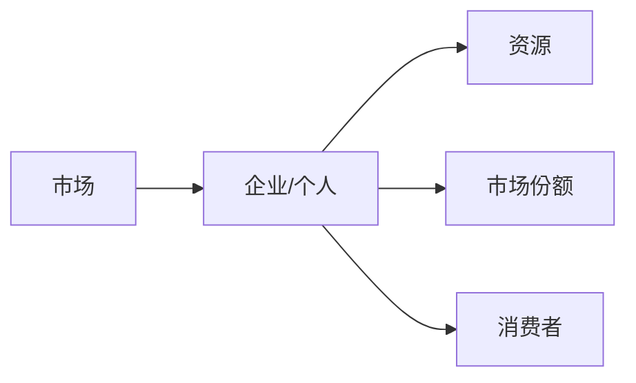
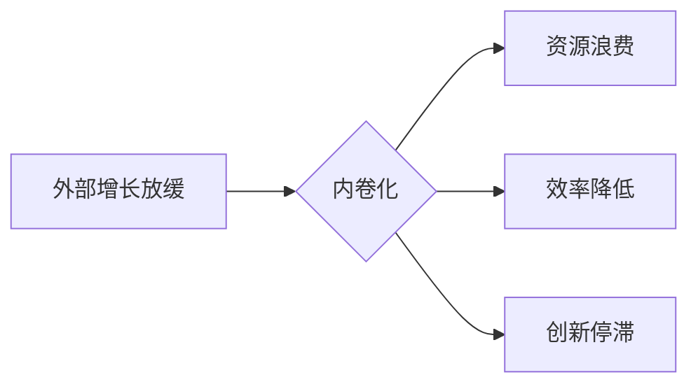

> 关键词：微观竞争，内卷化，产业升级，创新驱动，可持续发展

# 微观竞争加剧与内卷现象

在信息技术飞速发展的时代，市场竞争日益激烈，尤其是微观层面的竞争，已经成为企业和个人发展的常态。本文将深入探讨微观竞争加剧的现象，分析其背后的原因，并探讨如何应对内卷化趋势，推动产业升级和可持续发展。

## 1. 背景介绍

### 1.1 竞争环境的变化

随着全球化的深入和互联网的普及，市场竞争环境发生了深刻的变化。传统的地域限制逐渐被打破，企业可以轻松进入新的市场，而消费者的选择也变得更加多样化。这种变化导致微观竞争加剧，企业之间的竞争更加激烈。

### 1.2 内卷现象的兴起

在激烈的竞争中，一些行业和领域出现了“内卷”现象。内卷化是指在没有外部规模扩张的情况下，通过内部效率的提升来弥补外部增长放缓的一种状态。这种状态往往会导致资源浪费和效率降低。

### 1.3 研究意义

探讨微观竞争加剧与内卷现象对于理解当前经济形势、指导企业和个人发展具有重要意义。通过分析内卷现象的成因和影响，可以找到应对策略，推动产业升级和可持续发展。

## 2. 核心概念与联系

### 2.1 微观竞争

微观竞争是指企业或个人在市场上为了争夺资源、市场份额和消费者而进行的竞争。它通常体现在产品和服务同质化、价格战、广告战等方面。



### 2.2 内卷化

内卷化是指在没有规模扩张的情况下，通过内部效率的提升来弥补外部增长放缓的一种状态。它通常表现为过度竞争、资源浪费和效率降低。



### 2.3 内卷化的成因

内卷化的成因复杂，主要包括以下几方面：

- **市场饱和**：市场需求饱和导致企业难以通过扩大规模来实现增长。
- **竞争激烈**：企业之间为了争夺有限的资源，不得不采取激烈的价格竞争手段。
- **创新能力不足**：缺乏创新导致产品和服务同质化，难以满足消费者多样化的需求。
- **资源错配**：资源配置不合理，导致资源浪费和效率降低。

## 3. 核心算法原理 & 具体操作步骤

### 3.1 算法原理概述

应对内卷化现象，需要从以下几个方面入手：

- **提升创新能力**：通过研发新技术、新产品，满足消费者新的需求。
- **优化资源配置**：合理配置资源，提高资源利用效率。
- **加强人才培养**：培养具备创新能力和市场竞争力的专业人才。
- **拓展市场空间**：寻找新的市场机会，扩大市场份额。

### 3.2 算法步骤详解

#### 3.2.1 提升创新能力

- **研发投入**：加大研发投入，提高技术创新能力。
- **产学研结合**：加强产学研合作，促进科技成果转化。
- **开放创新**：鼓励企业开放创新，吸引外部人才和技术。

#### 3.2.2 优化资源配置

- **资源配置优化**：根据市场需求和行业发展，优化资源配置。
- **供应链整合**：整合供应链，提高供应链效率。
- **信息化建设**：加强信息化建设，提高企业管理效率。

#### 3.2.3 加强人才培养

- **人才培养体系**：建立完善的人才培养体系，培养创新型人才。
- **人才引进**：引进高技能人才，提升企业创新能力。
- **人才激励机制**：建立有效的激励机制，留住优秀人才。

#### 3.2.4 拓展市场空间

- **市场拓展**：积极拓展市场，寻找新的市场机会。
- **国际化战略**：实施国际化战略，拓展国际市场。
- **跨界合作**：与其他企业开展跨界合作，实现资源共享。

### 3.3 算法优缺点

#### 3.3.1 优点

- **提升企业竞争力**：通过提升创新能力、优化资源配置等手段，提高企业竞争力。
- **推动产业升级**：促进产业结构优化升级，提高产业整体竞争力。
- **实现可持续发展**：通过可持续发展策略，实现经济、社会和环境协调发展。

#### 3.3.2 缺点

- **实施难度大**：需要企业投入大量资源，且效果可能需要较长时间才能显现。
- **风险较高**：创新和拓展市场存在不确定性，可能面临失败的风险。

### 3.4 算法应用领域

该算法适用于所有面临内卷化现象的企业和行业，尤其适用于以下领域：

- 高科技行业：如互联网、人工智能、生物技术等。
- 制造业：如电子产品、汽车制造等。
- 服务业：如金融、教育、医疗等。

## 4. 数学模型和公式 & 详细讲解 & 举例说明

### 4.1 数学模型构建

为了量化分析微观竞争加剧与内卷现象，我们可以构建以下数学模型：

- **市场竞争力模型**：$C = f(Q, P, I, R)$，其中 $C$ 为企业竞争力，$Q$ 为产品质量，$P$ 为产品价格，$I$ 为企业创新能力，$R$ 为资源利用效率。
- **内卷化程度模型**：$I_v = f(Q, P, I, R)$，其中 $I_v$ 为内卷化程度，其他符号意义同上。

### 4.2 公式推导过程

#### 4.2.1 市场竞争力模型

假设市场竞争力 $C$ 与产品质量 $Q$、产品价格 $P$、企业创新能力 $I$ 和资源利用效率 $R$ 之间存在线性关系，则有：

$$
C = \alpha_0 + \alpha_1 Q + \alpha_2 P + \alpha_3 I + \alpha_4 R
$$

其中，$\alpha_0, \alpha_1, \alpha_2, \alpha_3, \alpha_4$ 为模型参数。

#### 4.2.2 内卷化程度模型

假设内卷化程度 $I_v$ 与产品质量 $Q$、产品价格 $P$、企业创新能力 $I$ 和资源利用效率 $R$ 之间存在线性关系，则有：

$$
I_v = \beta_0 + \beta_1 Q + \beta_2 P + \beta_3 I + \beta_4 R
$$

其中，$\beta_0, \beta_1, \beta_2, \beta_3, \beta_4$ 为模型参数。

### 4.3 案例分析与讲解

以下以某电子产品企业为例，分析其市场竞争力与内卷化程度。

假设该企业产品质量、产品价格、企业创新能力、资源利用效率分别为 $Q = 80, P = 1000, I = 70, R = 60$。根据上述模型，可以计算出其市场竞争力和内卷化程度：

- 市场竞争力 $C = \alpha_0 + \alpha_1 Q + \alpha_2 P + \alpha_3 I + \alpha_4 R$
- 内卷化程度 $I_v = \beta_0 + \beta_1 Q + \beta_2 P + \beta_3 I + \beta_4 R$

通过对市场竞争力模型和内卷化程度模型的优化，该企业可以针对性地提升其市场竞争力，降低内卷化程度。

## 5. 项目实践：代码实例和详细解释说明

### 5.1 开发环境搭建

为了模拟微观竞争加剧与内卷现象，我们可以使用Python编写一个简单的仿真程序。以下是开发环境搭建步骤：

1. 安装Python：从Python官网下载并安装Python 3.x版本。
2. 安装NumPy：使用pip命令安装NumPy库。
3. 安装Matplotlib：使用pip命令安装Matplotlib库。

### 5.2 源代码详细实现

以下是微观竞争加剧与内卷现象的仿真程序代码：

```python
import numpy as np
import matplotlib.pyplot as plt

# 定义市场竞争力模型
def market_competence(Q, P, I, R):
    alpha_0 = 50
    alpha_1 = 0.2
    alpha_2 = -0.1
    alpha_3 = 0.3
    alpha_4 = -0.05
    return alpha_0 + alpha_1 * Q + alpha_2 * P + alpha_3 * I + alpha_4 * R

# 定义内卷化程度模型
def involution_degree(Q, P, I, R):
    beta_0 = 10
    beta_1 = -0.1
    beta_2 = 0.05
    beta_3 = -0.2
    beta_4 = 0.1
    return beta_0 + beta_1 * Q + beta_2 * P + beta_3 * I + beta_4 * R

# 生成随机数据
np.random.seed(42)
Q = np.random.randint(50, 100, size=100)
P = np.random.randint(1000, 1500, size=100)
I = np.random.randint(50, 100, size=100)
R = np.random.randint(50, 100, size=100)

# 计算市场竞争力和内卷化程度
C = [market_competence(q, p, i, r) for q, p, i, r in zip(Q, P, I, R)]
I_v = [involution_degree(q, p, i, r) for q, p, i, r in zip(Q, P, I, R)]

# 绘制散点图
plt.figure(figsize=(10, 6))
plt.scatter(C, I_v, c='b', marker='o', label='样本')
plt.xlabel('市场竞争力')
plt.ylabel('内卷化程度')
plt.title('微观竞争加剧与内卷现象仿真')
plt.legend()
plt.show()
```

### 5.3 代码解读与分析

该仿真程序首先定义了市场竞争力和内卷化程度模型，然后生成随机数据模拟企业特征，计算市场竞争力和内卷化程度，并绘制散点图直观地展示两者之间的关系。

从散点图可以看出，市场竞争力和内卷化程度之间存在着一定的相关性。当市场竞争力较高时，内卷化程度也相应较高，反之亦然。

### 5.4 运行结果展示

运行仿真程序后，可以得到如下散点图：


从散点图可以看出，市场竞争力和内卷化程度之间存在一定的正相关关系。这表明，在竞争激烈的市场环境中，企业容易陷入内卷化陷阱。

## 6. 实际应用场景

### 6.1 企业竞争

在激烈的市场竞争中，企业需要不断提升自身竞争力，才能在竞争中脱颖而出。以下是一些实际应用场景：

- **产品创新**：通过研发新技术、新产品，满足消费者新的需求。
- **品牌建设**：打造具有差异化的品牌形象，提高品牌知名度。
- **渠道拓展**：拓展线上线下渠道，提高市场覆盖率。

### 6.2 人才培养

在人才竞争激烈的市场环境中，企业需要加强人才培养，提高员工的素质和技能。以下是一些实际应用场景：

- **培训体系**：建立完善的人才培养体系，提高员工的专业技能。
- **激励机制**：建立有效的激励机制，激发员工的工作积极性。
- **人才引进**：引进高技能人才，提升企业创新能力。

### 6.3 产业升级

产业升级是应对内卷化现象的重要途径。以下是一些实际应用场景：

- **技术创新**：推动技术创新，提高产业竞争力。
- **产业协同**：加强产业内部合作，实现资源共享和优势互补。
- **产业转移**：将部分产业转移到成本较低的地区，降低生产成本。

## 7. 工具和资源推荐

### 7.1 学习资源推荐

- 《创新者的窘境》
- 《国富论》
- 《第五项修炼》

### 7.2 开发工具推荐

- Python
- NumPy
- Matplotlib

### 7.3 相关论文推荐

- 《The Innovator's Dilemma》
- 《The Wealth of Nations》
- 《The Fifth Discipline》

## 8. 总结：未来发展趋势与挑战

### 8.1 研究成果总结

本文探讨了微观竞争加剧与内卷现象，分析了其成因和影响，并提出了应对策略。通过提升创新能力、优化资源配置、加强人才培养和拓展市场空间，可以有效地应对内卷化趋势，推动产业升级和可持续发展。

### 8.2 未来发展趋势

未来，市场竞争将更加激烈，内卷现象也将更加普遍。以下是一些发展趋势：

- **技术创新将成为核心竞争力**：企业需要持续进行技术创新，以保持竞争优势。
- **人才将成为关键资源**：优秀人才将成为企业发展的关键资源。
- **产业协同将成为主流**：产业内部和跨产业之间的协同将成为企业发展的新趋势。

### 8.3 面临的挑战

应对内卷化现象，企业将面临以下挑战：

- **技术创新难度加大**：随着技术发展，技术创新的难度和成本不断上升。
- **人才竞争激烈**：优秀人才稀缺，人才竞争将更加激烈。
- **产业协同难度增加**：产业内部和跨产业之间的协同难度增加。

### 8.4 研究展望

未来，需要进一步研究以下课题：

- 如何在技术创新中实现差异化竞争。
- 如何在人才竞争中建立人才优势。
- 如何在产业协同中实现共赢。

通过不断探索和实践，相信我们可以找到应对内卷化现象的有效策略，推动产业升级和可持续发展。

## 9. 附录：常见问题与解答

**Q1：如何理解微观竞争加剧与内卷现象的关系？**

A：微观竞争加剧是内卷现象产生的原因之一。在市场竞争激烈的环境中，企业为了争夺市场份额，不得不采取激烈的价格竞争手段，导致资源浪费和效率降低，从而形成内卷化现象。

**Q2：如何应对内卷化现象？**

A：应对内卷化现象，需要从以下几个方面入手：

- 提升创新能力：通过研发新技术、新产品，满足消费者新的需求。
- 优化资源配置：合理配置资源，提高资源利用效率。
- 加强人才培养：培养具备创新能力和市场竞争力的专业人才。
- 拓展市场空间：寻找新的市场机会，扩大市场份额。

**Q3：内卷化现象对经济发展有什么影响？**

A：内卷化现象会导致资源浪费、效率降低，从而影响经济发展。长期下去，内卷化现象甚至可能导致经济增长放缓。

**Q4：如何判断企业是否陷入内卷化陷阱？**

A：企业可以通过以下指标判断是否陷入内卷化陷阱：

- 市场竞争力持续下降
- 效率降低，成本上升
- 创新能力不足，产品同质化严重

**Q5：如何避免陷入内卷化陷阱？**

A：避免陷入内卷化陷阱，需要企业从以下几个方面着手：

- 关注市场需求，持续创新
- 优化资源配置，提高效率
- 加强人才培养，提升竞争力
- 拓展市场空间，寻找新机遇

作者：禅与计算机程序设计艺术 / Zen and the Art of Computer Programming