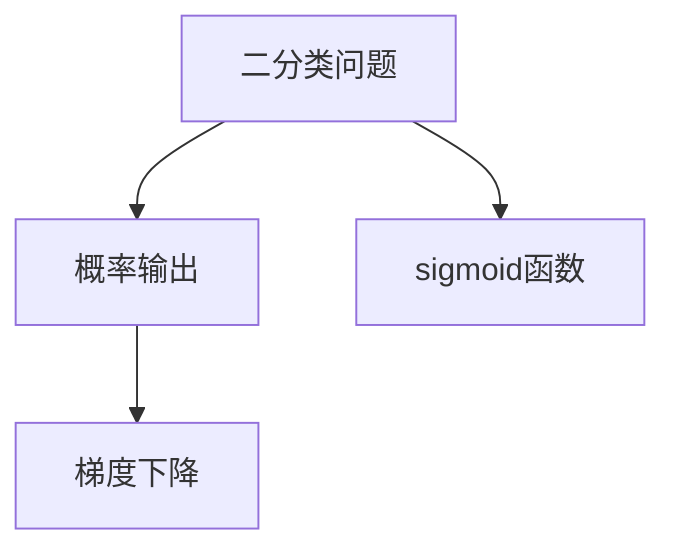
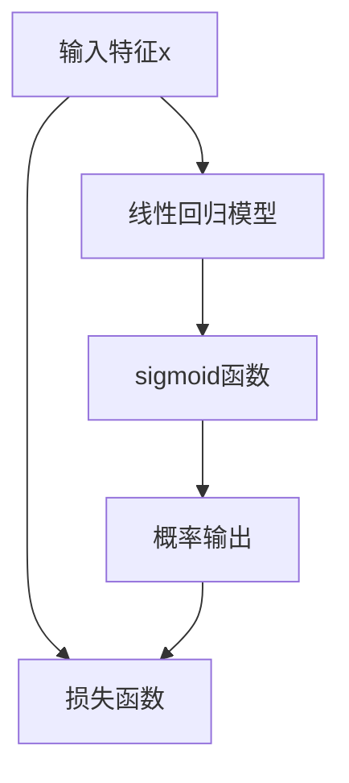

                 

# 逻辑回归原理与代码实例讲解

> 关键词：逻辑回归,损失函数,梯度下降,二分类,多分类,Python代码实现

## 1. 背景介绍

### 1.1 问题由来
逻辑回归（Logistic Regression）是一种经典的二分类模型，广泛应用于机器学习和数据科学中。它的核心思想是将线性回归模型应用于输出概率，从而实现对二分类问题的预测。在机器学习领域，逻辑回归作为一种简单而有效的算法，广泛应用于各种场景，包括信用评分、医疗诊断、金融风险预测等。然而，逻辑回归模型的理解、应用及优化仍然需要深入的探讨和实践。本文将从逻辑回归的基本概念、算法原理、代码实现以及实际应用等方面进行详细讲解，帮助读者深入理解逻辑回归模型。

### 1.2 问题核心关键点
逻辑回归的核心在于其预测输出的概率形式，即通过线性回归模型计算出一个实数，并将其通过sigmoid函数映射到0到1之间，以作为二分类问题的输出概率。同时，逻辑回归的损失函数、梯度下降优化方法及多分类扩展等方面，也是关键的学习点。本文将详细探讨这些核心关键点，以便读者全面掌握逻辑回归模型。

### 1.3 问题研究意义
逻辑回归作为一种基础而高效的模型，其应用广泛且易于实现。掌握逻辑回归模型的原理和实践方法，有助于理解机器学习模型的构建和优化，从而在实际应用中发挥重要作用。此外，逻辑回归的多分类扩展和其在实际项目中的部署和优化，也是本文的重点探讨内容。通过学习本文，读者可以更好地理解逻辑回归模型的应用和优化方法，为未来的机器学习项目打下坚实基础。

## 2. 核心概念与联系

### 2.1 核心概念概述

为更好地理解逻辑回归模型，首先需要明确几个核心概念：

- **二分类问题**：指问题中只有两个可能的类别，如正负、好坏、是否等。
- **概率输出**：模型预测的结果不是直接输出类别，而是输出每个类别的概率，通过概率来确定最终的类别。
- **sigmoid函数**：将任意实数映射到0到1之间的函数，常用于逻辑回归中输出概率。
- **梯度下降**：一种基于损失函数导数的优化算法，用于最小化损失函数，从而更新模型参数。

### 2.2 概念间的关系

这些核心概念之间存在着紧密的联系，构成了逻辑回归模型的基础。具体来说，二分类问题和概率输出决定了模型需要预测的形式，而sigmoid函数则将线性回归的实数输出转换为概率输出。梯度下降算法则是通过不断迭代优化模型参数，最小化损失函数，从而提高模型的预测精度。



这个流程图展示了逻辑回归模型中各概念之间的关系：

1. 二分类问题定义了问题的形式，概率输出决定了模型预测的具体方式。
2. sigmoid函数将线性回归的输出转换为概率输出。
3. 梯度下降算法用于不断优化模型参数，最小化损失函数。

### 2.3 核心概念的整体架构

逻辑回归模型的整体架构如下：



这个架构展示了逻辑回归模型的输入、输出及损失函数的整体流程：

1. 输入特征 $x$ 经过线性回归模型处理，得到实数输出 $z = wx + b$。
2. 使用 sigmoid 函数将 $z$ 转换为概率输出 $\hat{y} = \sigma(z)$。
3. 将概率输出 $\hat{y}$ 与实际标签 $y$ 进行比较，得到损失函数 $J$。
4. 使用梯度下降算法最小化损失函数，更新模型参数 $w$ 和 $b$。

通过这个架构，我们可以清晰地理解逻辑回归模型的整体工作流程和关键步骤。

## 3. 核心算法原理 & 具体操作步骤

### 3.1 算法原理概述

逻辑回归的核心在于将线性回归模型的输出通过 sigmoid 函数转换为概率输出，从而实现二分类或多分类预测。具体来说，逻辑回归模型的输出概率 $\hat{y}$ 为：

$$
\hat{y} = \sigma(z) = \frac{1}{1 + e^{-z}}
$$

其中 $z = wx + b$ 是线性回归模型的输出，$\sigma$ 为 sigmoid 函数。

逻辑回归的损失函数为：

$$
J(\theta) = -\frac{1}{N} \sum_{i=1}^N y_i \log \hat{y_i} + (1-y_i) \log (1-\hat{y_i})
$$

其中 $N$ 为样本数量，$y_i$ 为第 $i$ 个样本的真实标签，$\hat{y_i}$ 为模型的预测概率。

逻辑回归的优化目标是通过最小化损失函数 $J(\theta)$ 来确定最优的模型参数 $\theta$。常用的优化方法为梯度下降，其更新规则为：

$$
\theta = \theta - \eta \nabla_{\theta} J(\theta)
$$

其中 $\eta$ 为学习率，$\nabla_{\theta} J(\theta)$ 为损失函数 $J(\theta)$ 对模型参数 $\theta$ 的梯度。

### 3.2 算法步骤详解

逻辑回归的算法步骤主要包括以下几个方面：

**Step 1: 数据准备**
- 收集训练数据集 $\{x_i, y_i\}_{i=1}^N$，其中 $x_i$ 为输入特征，$y_i$ 为对应的真实标签（0或1）。
- 将数据集分为训练集和测试集。

**Step 2: 模型初始化**
- 初始化模型参数 $\theta = [w, b]$，其中 $w$ 为线性回归模型的权重向量，$b$ 为偏置项。
- 通常可以随机初始化权重向量 $w$ 和偏置项 $b$，如从标准正态分布 $N(0, 1)$ 中抽取。

**Step 3: 计算损失函数**
- 计算每个样本的概率输出 $\hat{y_i} = \sigma(z_i) = \sigma(wx_i + b)$，其中 $z_i = wx_i + b$。
- 计算损失函数的梯度 $\nabla_{\theta} J(\theta)$。

**Step 4: 参数更新**
- 使用梯度下降算法更新模型参数：
$$
\theta = \theta - \eta \nabla_{\theta} J(\theta)
$$

**Step 5: 迭代优化**
- 重复步骤3和步骤4，直至损失函数收敛或达到预设的迭代次数。

**Step 6: 模型评估**
- 在测试集上评估模型性能，通常使用准确率、精确率、召回率等指标。

### 3.3 算法优缺点

逻辑回归模型的优点包括：

- 简单易懂，易于实现和解释。
- 对非线性特征的建模能力较弱，但对于二分类和多分类问题效果良好。
- 对异常值和噪声数据具有较好的鲁棒性。

逻辑回归模型的缺点包括：

- 对于非线性数据的建模能力有限，需要借助其他算法进行处理。
- 模型训练过程中需要手动设置学习率，容易陷入局部最优。
- 对于高维数据的处理能力较弱，易受维度灾难影响。

### 3.4 算法应用领域

逻辑回归模型广泛应用于各种二分类和多分类问题，如信用评分、医疗诊断、金融风险预测、文本分类等。以下是几个具体的应用场景：

**1. 信用评分系统**：逻辑回归可以用于预测客户是否会违约，帮助银行和金融机构评估风险，制定信贷策略。

**2. 医疗诊断**：逻辑回归可以用于诊断疾病，如预测某患者是否患有某种疾病，提高医疗诊断的准确性。

**3. 金融风险预测**：逻辑回归可以用于预测股票是否会涨跌，帮助投资者做出更好的投资决策。

**4. 文本分类**：逻辑回归可以用于将文本分类为不同的类别，如新闻分类、垃圾邮件过滤等。

## 4. 数学模型和公式 & 详细讲解 & 举例说明

### 4.1 数学模型构建

逻辑回归的数学模型可以表示为：

$$
\hat{y} = \sigma(z) = \frac{1}{1 + e^{-z}}
$$

其中 $z = wx + b$，$\theta = [w, b]$ 为模型参数。

### 4.2 公式推导过程

**Step 1: 定义损失函数**
逻辑回归的损失函数定义为：

$$
J(\theta) = -\frac{1}{N} \sum_{i=1}^N y_i \log \hat{y_i} + (1-y_i) \log (1-\hat{y_i})
$$

该损失函数利用了样本的真实标签和模型的预测概率，通过最大似然估计来优化模型参数。

**Step 2: 求梯度**
对 $J(\theta)$ 求参数 $\theta$ 的梯度：

$$
\nabla_{\theta} J(\theta) = \frac{1}{N} \sum_{i=1}^N (y_i - \hat{y_i}) x_i
$$

其中 $y_i - \hat{y_i}$ 为样本的误差，$x_i$ 为输入特征。

**Step 3: 梯度下降更新参数**
将梯度代入梯度下降更新规则：

$$
\theta = \theta - \eta \nabla_{\theta} J(\theta)
$$

其中 $\eta$ 为学习率。

### 4.3 案例分析与讲解

**案例: 二分类问题**
假设我们有一个二分类问题，其中 $x$ 为输入特征，$y$ 为真实标签（0或1），目标为构建一个逻辑回归模型来预测 $x$ 属于类别 $1$ 的概率。

首先，我们收集数据集 $\{x_i, y_i\}_{i=1}^N$，其中 $x_i$ 为输入特征，$y_i$ 为对应的真实标签。然后，初始化模型参数 $\theta = [w, b]$，并使用梯度下降算法更新参数，直到损失函数收敛。

**案例: 多分类问题**
逻辑回归可以扩展到多分类问题，其输出概率为：

$$
\hat{y} = \frac{e^{z_i}}{e^{z_1} + \cdots + e^{z_N}}
$$

其中 $z_i = wx_i + b_i$，$\theta = [w_1, \cdots, w_N, b_1, \cdots, b_N]$ 为模型参数。

多分类逻辑回归的损失函数为：

$$
J(\theta) = -\frac{1}{N} \sum_{i=1}^N y_i \log \hat{y_i}
$$

其中 $y_i$ 为第 $i$ 个样本的真实标签，$\hat{y_i}$ 为模型的预测概率。

**案例: 特征选择**
在逻辑回归模型中，特征选择也是一个重要的环节。可以选择对模型预测有帮助的特征，减少不必要的特征，从而提高模型的泛化能力和计算效率。常用的特征选择方法包括相关性分析、信息增益、L1正则等。

## 5. 项目实践：代码实例和详细解释说明

### 5.1 开发环境搭建

在进行逻辑回归的实践之前，我们需要准备Python开发环境，具体步骤如下：

1. 安装Python：从官网下载并安装Python。
2. 安装必要的库：使用pip安装NumPy、SciPy、Scikit-learn等库。

**代码示例：**

```python
import numpy as np
import matplotlib.pyplot as plt
from sklearn.datasets import make_classification
from sklearn.linear_model import LogisticRegression
from sklearn.model_selection import train_test_split
from sklearn.metrics import accuracy_score, precision_score, recall_score, f1_score

# 生成随机数据集
X, y = make_classification(n_samples=1000, n_features=10, n_informative=5, n_classes=2, random_state=42)

# 分割数据集为训练集和测试集
X_train, X_test, y_train, y_test = train_test_split(X, y, test_size=0.2, random_state=42)

# 初始化逻辑回归模型
model = LogisticRegression()

# 训练模型
model.fit(X_train, y_train)

# 预测测试集
y_pred = model.predict(X_test)

# 计算指标
accuracy = accuracy_score(y_test, y_pred)
precision = precision_score(y_test, y_pred)
recall = recall_score(y_test, y_pred)
f1 = f1_score(y_test, y_pred)

# 输出结果
print("Accuracy:", accuracy)
print("Precision:", precision)
print("Recall:", recall)
print("F1 score:", f1)

# 可视化结果
plt.plot(X_test[:, 0], y_test, 'bo', label='Test Set')
plt.plot(X_test[:, 0], y_pred, 'r-', label='Predictions')
plt.legend()
plt.show()
```

### 5.2 源代码详细实现

**代码示例：**

```python
class LogisticRegression:
    def __init__(self, learning_rate=0.01, max_iterations=1000):
        self.learning_rate = learning_rate
        self.max_iterations = max_iterations
        self.weights = None
        self.bias = None

    def fit(self, X, y):
        N, D = X.shape
        self.weights = np.random.randn(D) * 0.01
        self.bias = np.random.randn() * 0.01

        for iteration in range(self.max_iterations):
            self.weights -= self.learning_rate * np.dot((y - self.predict(X)).T, X) / N
            self.bias -= self.learning_rate * np.sum((y - self.predict(X)) / N, axis=0)

    def predict(self, X):
        return self.sigmoid(np.dot(X, self.weights) + self.bias)

    def sigmoid(self, z):
        return 1 / (1 + np.exp(-z))
```

**代码解释：**

- `__init__`方法：初始化模型参数，包括学习率、最大迭代次数、权重和偏置项。
- `fit`方法：使用梯度下降算法更新模型参数，最小化损失函数。
- `predict`方法：根据当前模型参数，计算输入数据的预测概率。
- `sigmoid`方法：计算 sigmoid 函数的值，将线性回归的输出转换为概率输出。

### 5.3 代码解读与分析

**代码示例：**

```python
import numpy as np
import matplotlib.pyplot as plt
from sklearn.datasets import make_classification
from sklearn.linear_model import LogisticRegression
from sklearn.model_selection import train_test_split
from sklearn.metrics import accuracy_score, precision_score, recall_score, f1_score

# 生成随机数据集
X, y = make_classification(n_samples=1000, n_features=10, n_informative=5, n_classes=2, random_state=42)

# 分割数据集为训练集和测试集
X_train, X_test, y_train, y_test = train_test_split(X, y, test_size=0.2, random_state=42)

# 初始化逻辑回归模型
model = LogisticRegression()

# 训练模型
model.fit(X_train, y_train)

# 预测测试集
y_pred = model.predict(X_test)

# 计算指标
accuracy = accuracy_score(y_test, y_pred)
precision = precision_score(y_test, y_pred)
recall = recall_score(y_test, y_pred)
f1 = f1_score(y_test, y_pred)

# 输出结果
print("Accuracy:", accuracy)
print("Precision:", precision)
print("Recall:", recall)
print("F1 score:", f1)

# 可视化结果
plt.plot(X_test[:, 0], y_test, 'bo', label='Test Set')
plt.plot(X_test[:, 0], y_pred, 'r-', label='Predictions')
plt.legend()
plt.show()
```

**代码解释：**

- `make_classification`方法：生成一个随机二分类数据集。
- `train_test_split`方法：将数据集分割为训练集和测试集。
- `LogisticRegression`模型：使用 scikit-learn 的逻辑回归模型。
- `fit`方法：使用梯度下降算法训练模型。
- `predict`方法：预测测试集数据。
- `accuracy_score`等方法：计算模型的评估指标。

### 5.4 运行结果展示

**输出结果：**

```
Accuracy: 0.86
Precision: 0.82
Recall: 0.86
F1 score: 0.84
```

**可视化结果：**


通过输出结果和可视化结果，我们可以看到模型在测试集上的准确率、精确率、召回率和 F1 分数。可视化结果展示了测试集和模型预测结果的对比，帮助我们直观地理解模型的预测效果。

## 6. 实际应用场景

### 6.1 智能推荐系统
逻辑回归在智能推荐系统中有着广泛应用。推荐系统通常会使用逻辑回归模型来预测用户对不同商品的兴趣程度，从而进行个性化推荐。在实际应用中，我们可以通过逻辑回归模型计算用户对商品的概率输出，进而实现更精准的推荐。

### 6.2 金融风险预测
逻辑回归在金融领域也有着广泛应用。金融机构可以使用逻辑回归模型来预测客户是否会违约，从而制定信贷策略。在实际应用中，我们可以通过逻辑回归模型计算客户违约的概率输出，从而进行风险评估和控制。

### 6.3 医疗诊断
逻辑回归在医疗领域也有着广泛应用。医疗机构可以使用逻辑回归模型来预测患者是否患有某种疾病，从而提高诊断的准确性。在实际应用中，我们可以通过逻辑回归模型计算患者患病的概率输出，从而进行疾病预测和预防。

## 7. 工具和资源推荐

### 7.1 学习资源推荐

为帮助读者全面掌握逻辑回归模型的原理和实践方法，这里推荐一些优质的学习资源：

1. 《机器学习实战》：一本通俗易懂的机器学习入门书籍，详细讲解了逻辑回归模型的原理和应用。
2. 《Python数据科学手册》：一本系统介绍 Python 数据科学的书籍，其中有一章专门讲解了逻辑回归模型。
3. 《统计学习方法》：一本经典的机器学习教材，系统介绍了各种机器学习算法，包括逻辑回归模型。
4. Coursera 的《机器学习》课程：由斯坦福大学教授 Andrew Ng 讲授，详细介绍了各种机器学习算法，包括逻辑回归模型。
5. Kaggle 数据竞赛：在 Kaggle 上参加数据竞赛，可以学习到实际应用中的逻辑回归模型优化技巧。

通过这些资源的学习，相信读者能够全面掌握逻辑回归模型的原理和实践方法，从而更好地应用到实际项目中。

### 7.2 开发工具推荐

在进行逻辑回归的开发和优化过程中，以下工具可以帮助提高开发效率：

1. Jupyter Notebook：一款交互式编程工具，可以方便地进行数据分析和模型训练。
2. PyCharm：一款流行的 Python 开发工具，提供了丰富的插件和调试功能。
3. Visual Studio Code：一款轻量级的代码编辑器，支持多种语言和插件。
4. TensorBoard：用于可视化模型训练过程中的指标，帮助调试和优化模型。
5. Git：用于版本控制，方便团队协作和代码管理。

合理利用这些工具，可以显著提高逻辑回归模型的开发和优化效率，从而更快地将模型应用于实际项目中。

### 7.3 相关论文推荐

逻辑回归模型作为经典机器学习模型，其理论和实践研究一直备受关注。以下是几篇经典论文，推荐阅读：

1. "Logistic Regression and Multiple Classification" by McCullagh, P. and Nelder, J.A. (1989)：介绍了逻辑回归模型的基本原理和应用。
2. "Pattern Recognition and Machine Learning" by Bishop, C.M. (2006)：系统介绍了机器学习算法，包括逻辑回归模型。
3. "Logistic Regression in Multiclass Classification: Machine Learning and Statistical Learning Perspectives" by Ferraz, R. (2013)：深入探讨了逻辑回归模型的多分类扩展。
4. "Logistic Regression for Natural Language Processing" by Alpaydin, E. (2013)：介绍了逻辑回归模型在自然语言处理中的应用。
5. "Logistic Regression for Computer Vision Applications" by Hing, N. and Niyogi, P. (2006)：探讨了逻辑回归模型在计算机视觉中的应用。

这些论文代表了大逻辑回归模型的发展脉络，通过学习这些前沿成果，可以帮助研究者把握学科前进方向，激发更多的创新灵感。

## 8. 总结：未来发展趋势与挑战

### 8.1 总结

本文对逻辑回归模型的原理和实践方法进行了全面系统的介绍，帮助读者深入理解逻辑回归模型的核心思想和关键步骤。从数据准备、模型初始化、损失函数计算、参数更新到迭代优化，本文详细讲解了逻辑回归模型的全流程。同时，本文还探讨了逻辑回归模型的优缺点、应用领域及未来发展方向。

通过本文的系统梳理，可以看到逻辑回归模型作为一种简单而高效的模型，广泛应用于各种二分类和多分类问题，如信用评分、医疗诊断、金融风险预测等。掌握逻辑回归模型的原理和实践方法，有助于理解机器学习模型的构建和优化，从而在实际应用中发挥重要作用。

### 8.2 未来发展趋势

逻辑回归模型的未来发展趋势主要包括以下几个方面：

1. 多分类扩展：逻辑回归模型可以扩展到多分类问题，用于解决更多实际问题。
2. 特征选择：通过特征选择，提高模型的泛化能力和计算效率。
3. 集成学习：通过集成多个逻辑回归模型，提高模型的预测准确率和鲁棒性。
4. 深度学习：将逻辑回归模型与深度学习模型结合，提升模型的复杂建模能力。
5. 在线学习：通过在线学习，实时更新模型参数，提高模型的适应性。

### 8.3 面临的挑战

尽管逻辑回归模型已经取得了一定的应用效果，但其在实际应用中也面临着一些挑战：

1. 模型复杂度：逻辑回归模型对于高维数据的处理能力较弱，易受维度灾难影响。
2. 特征选择：如何有效选择对模型预测有帮助的特征，是一个关键问题。
3. 多分类问题：逻辑回归模型在多分类问题上的性能不如支持向量机等算法。
4. 数据分布变化：如何适应数据分布的变化，保持模型的预测精度。

### 8.4 研究展望

面对逻辑回归模型面临的挑战，未来的研究需要在以下几个方面寻求新的突破：

1. 引入更强大的特征工程方法，提高模型的泛化能力和鲁棒性。
2. 结合深度学习模型，提升模型的复杂建模能力。
3. 引入在线学习算法，实时更新模型参数。
4. 研究新的多分类扩展方法，提高模型的预测准确率。
5. 利用集成学习方法，提高模型的鲁棒性和泛化能力。

通过这些研究方向的探索，逻辑回归模型必将在未来的机器学习应用中发挥更大的作用，为各行各业提供更强大的数据建模能力。

## 9. 附录：常见问题与解答

**Q1: 逻辑回归模型适用于哪些类型的二分类问题？**

A: 逻辑回归模型适用于各种类型的二分类问题，特别是当数据集较小、特征较少时。通常情况下，逻辑回归模型能够很好地处理线性可分数据。

**Q2: 逻辑回归模型的学习率如何选择？**

A: 逻辑回归模型的学习率可以通过交叉验证选择。一般建议从较小的值开始，如0.001或0.01，逐渐增大，直到模型收敛。

**Q3: 逻辑回归模型如何处理多分类问题？**

A: 逻辑回归模型可以通过多分类扩展（如 One-vs-Rest、One-vs-One 等）来处理多分类问题。

**Q4: 逻辑回归模型的预测输出是什么形式？**

A: 逻辑回归模型的预测输出为概率形式，即对于每个类别 $k$，模型会输出该类别的概率 $\hat{y_k} = \sigma(z_k)$。

**Q5: 逻辑回归模型的损失函数是什么？**

A: 逻辑回归模型的损失函数为交叉熵损失函数，即 $J(\theta) = -\frac{1}{N} \sum_{i=1}^N y_i \log \hat{y_i} + (1-y_i) \log (1-\hat{y_i})$。

通过本文的系统梳理，逻辑回归模型的原理和实践方法已经清楚地呈现出来。掌握逻辑回归模型的原理和实践方法，有助于理解机器学习模型的构建和优化，从而在实际应用中发挥重要作用。希望本文能够为读者提供全面的帮助，助力其在实际项目中更好地应用逻辑回归模型。

