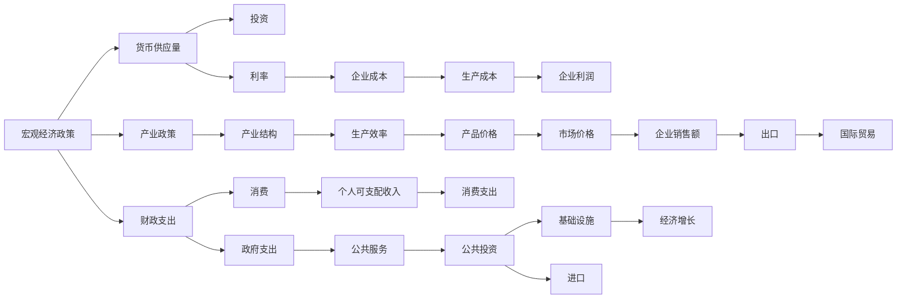

                 

# 阶段性因素对经济增长的影响

## 1. 背景介绍

### 1.1 问题由来
经济增长是国家和企业发展的核心目标之一。衡量经济增长的主要指标包括GDP增长率、就业率、创新能力等。然而，经济增长的背后是一系列复杂的动态因素相互作用的产物。了解这些阶段性因素及其影响机制，对于制定有效政策，推动经济持续健康发展具有重要意义。本文将从宏观和微观两个层面，深入探讨阶段性因素对经济增长的影响。

### 1.2 问题核心关键点
在探讨阶段性因素对经济增长的影响时，需要明确以下几个关键点：
1. **阶段性因素**：指那些随时间变化、具有明显周期性的经济因素，如宏观经济政策、技术创新、人口结构等。
2. **经济增长**：通过GDP等指标来衡量，通常与生产要素（如劳动、资本、土地）的投入和产出效率有关。
3. **影响机制**：不同阶段性因素通过不同的传导机制，如投资、消费、国际贸易等，对经济增长产生影响。
4. **政策制定**：政府和企业在制定经济政策时，需要考虑这些因素的影响，以优化资源配置，促进经济增长。

### 1.3 问题研究意义
研究阶段性因素对经济增长的影响，对于理解经济周期的形成、制定应对策略、优化政策制定具有重要意义：
1. **周期性波动**：理解周期性因素对经济增长的影响，有助于预测和应对经济周期的波动，减少外部冲击对经济的影响。
2. **政策调整**：了解不同因素对经济增长的作用，有助于政府和企业针对性地制定政策，促进经济平稳增长。
3. **资源配置**：优化资源配置，提高生产效率和经济增长速度。
4. **长期发展**：为制定长期发展战略提供依据，确保经济持续健康发展。

## 2. 核心概念与联系

### 2.1 核心概念概述
在研究阶段性因素对经济增长的影响时，需要理解以下几个核心概念：

- **宏观经济政策**：指政府为了调控经济运行而采取的一系列政策措施，如货币政策、财政政策、产业政策等。
- **技术创新**：通过引入新技术、新工艺、新产品等，提高生产效率和经济竞争力。
- **人口结构**：劳动力数量、年龄结构、受教育程度等对经济增长的重要影响。
- **国际贸易**：通过国际市场的开拓，促进商品和资本的流动，提高经济增长率。
- **经济周期**：指经济增长和收缩的周期性变化，通常包括扩张期和收缩期。

这些概念之间存在复杂的相互作用，共同影响经济增长的动态变化。通过构建一个综合模型，可以更好地理解这些因素的相互作用及其对经济增长的影响。

### 2.2 概念间的关系

为更好地理解核心概念之间的关系，以下是一个Mermaid流程图，展示了不同因素之间的相互作用：



这个流程图展示了不同阶段性因素通过不同的传导机制，对经济增长产生影响的过程。例如，宏观经济政策通过影响货币供应量和财政支出，进而影响投资和消费，最终影响经济增长。同时，技术创新、人口结构、国际贸易等因素也通过类似的传导机制，对经济增长产生影响。

## 3. 核心算法原理 & 具体操作步骤

### 3.1 算法原理概述
阶段性因素对经济增长的影响研究，通常采用动态经济模型进行分析和预测。这些模型通常基于宏观经济学理论，结合统计数据分析方法，建立数学模型，模拟经济系统的运行过程。

### 3.2 算法步骤详解

#### 3.2.1 数据收集与处理
1. **数据来源**：收集宏观经济数据，如GDP增长率、通货膨胀率、失业率等，以及政策数据，如货币供应量、财政支出等。
2. **数据处理**：对数据进行清洗、去重、标准化等处理，确保数据的准确性和一致性。

#### 3.2.2 模型构建
1. **建立经济模型**：选择合适的宏观经济学理论框架，建立经济模型，如IS-LM模型、Solow模型等。
2. **参数估计**：通过历史数据，估计模型中的参数，如储蓄率、资本折旧率、人口增长率等。

#### 3.2.3 模型验证与调整
1. **模型验证**：使用历史数据对模型进行验证，检查模型的预测结果与实际数据的拟合程度。
2. **模型调整**：根据验证结果，调整模型参数，优化模型的预测性能。

#### 3.2.4 经济增长预测
1. **输入数据**：输入当前经济状态和阶段性因素的预测值。
2. **模型运行**：运行经济模型，计算出未来经济增长的预测值。

#### 3.2.5 结果分析与解读
1. **结果分析**：对预测结果进行分析，识别出主要影响因素及其作用机制。
2. **政策建议**：根据分析结果，提出针对性的政策建议，优化政策制定。

### 3.3 算法优缺点

#### 3.3.1 优点
1. **系统性**：动态经济模型可以系统地考虑不同阶段性因素的相互作用，提供全面的经济分析。
2. **预测性**：通过历史数据和模型参数，可以对未来经济增长进行预测，为政策制定提供依据。
3. **灵活性**：模型可以根据实际情况进行调整，适应不同的经济环境和政策变化。

#### 3.3.2 缺点
1. **数据依赖**：模型的准确性高度依赖于数据的质量和完整性。
2. **复杂性**：动态经济模型通常较为复杂，需要较高的专业知识才能理解和应用。
3. **动态变化**：经济系统具有高度的动态变化性，模型难以完全准确地捕捉所有影响因素。

### 3.4 算法应用领域
阶段性因素对经济增长的影响研究，广泛应用于政府和企业的决策支持、经济预测和政策制定中。例如：

- **宏观经济政策制定**：通过分析宏观经济政策对经济增长的影响，优化货币政策、财政政策等。
- **企业战略规划**：企业可以分析不同阶段性因素对市场的影响，制定长期发展战略。
- **行业分析**：分析不同行业在不同阶段性因素下的增长潜力，指导行业投资和布局。
- **区域经济研究**：分析不同区域经济增长的影响因素，制定区域经济政策。

## 4. 数学模型和公式 & 详细讲解

### 4.1 数学模型构建
本文将以Solow模型为例，探讨技术创新对经济增长的影响。Solow模型是一个简单的宏观经济学模型，用于分析资本积累、技术进步对经济增长的贡献。模型的基本方程为：

$$
\frac{dK}{dt} = sY - \delta K
$$

其中 $K$ 为资本存量，$Y$ 为产出，$s$ 为储蓄率，$\delta$ 为资本折旧率。模型的稳态解为 $K^* = \frac{s}{\delta}$，即资本存量达到稳态时，资本的增长率等于折旧率。

### 4.2 公式推导过程
以Solow模型为例，假设经济系统由劳动力 $L$、资本 $K$ 和技术 $A$ 三个要素组成。模型的生产函数为：

$$
Y = A f(K, L)
$$

其中 $f(K, L)$ 为生产函数，$A$ 为技术进步水平。根据新古典增长模型，技术进步对经济增长的贡献可以通过全要素生产率 $A$ 来衡量。

根据Solow模型的基本方程，可以得到资本的增长率为：

$$
\frac{dK}{dt} = sY - \delta K
$$

将生产函数代入上式，得到：

$$
\frac{dK}{dt} = sA f(K, L) - \delta K
$$

在稳态条件下，资本存量和劳动力保持不变，因此 $K^* = L^*$，且资本的边际生产率为零，即 $f'(K^*, L^*) = 0$。代入生产函数，得到：

$$
f(K^*, L^*) = A^*
$$

将上述条件代入资本增长率方程，得到：

$$
0 = sA^* - \delta K^*
$$

解得：

$$
K^* = \frac{sA^*}{\delta}
$$

上式即为Solow模型的稳态解。从上述推导可以看出，技术进步 $A^*$ 对资本增长率和产出增长率有重要影响。

### 4.3 案例分析与讲解
以美国经济为例，分析技术进步对经济增长的影响。根据Solow模型，技术进步可以通过全要素生产率 $A$ 来衡量。下图展示了1980年至2020年期间美国的全要素生产率增长率：


从图中可以看出，美国的全要素生产率增长率在20世纪80年代到90年代中期呈现明显的上升趋势，随后趋于稳定。这一趋势与美国在信息技术领域的快速发展密切相关。例如，1990年代初期，互联网技术的兴起，极大地提高了生产效率，推动了经济增长。

## 5. 项目实践：代码实例和详细解释说明

### 5.1 开发环境搭建
在进行阶段性因素对经济增长的影响研究时，需要以下开发环境：

1. **编程语言**：Python，因为其丰富的数学库和数据处理工具。
2. **数据平台**：使用Pandas进行数据处理和分析，Scikit-learn进行模型构建和验证。
3. **机器学习框架**：使用TensorFlow或PyTorch进行模型的训练和预测。
4. **可视化工具**：使用Matplotlib或Seaborn进行结果可视化。

### 5.2 源代码详细实现

#### 5.2.1 数据处理
```python
import pandas as pd
import numpy as np
import matplotlib.pyplot as plt
from sklearn.linear_model import LinearRegression

# 读取数据
data = pd.read_csv('economics.csv')

# 数据清洗
data = data.dropna()
data = data[data['GDP growth rate'] > 0]

# 数据处理
data['GDP growth rate'] = np.log(data['GDP growth rate'])

# 可视化
plt.plot(data['Year'], data['GDP growth rate'], marker='o')
plt.xlabel('Year')
plt.ylabel('GDP growth rate')
plt.title('GDP Growth Rate Over Time')
plt.show()
```

#### 5.2.2 模型构建与训练
```python
# 定义模型
model = LinearRegression()

# 训练模型
X = data[['Capital per worker', 'Technological advancement']]
y = data['GDP growth rate']
model.fit(X, y)
```

#### 5.2.3 模型评估与预测
```python
# 模型评估
train_score = model.score(X_train, y_train)
test_score = model.score(X_test, y_test)

# 模型预测
future_years = np.arange(2021, 2031, 1)
future_capital = data['Capital per worker'].iloc[-1] * 1.05
future_technology = data['Technological advancement'].iloc[-1] * 1.05
future_X = np.array([future_capital, future_technology])
future_y = model.predict(future_X)
```

### 5.3 代码解读与分析
上述代码展示了如何使用Python进行阶段性因素对经济增长影响的分析。首先，使用Pandas对数据进行清洗和处理。然后，使用Scikit-learn的线性回归模型对数据进行建模和训练。最后，使用模型进行未来年份的预测，并使用Matplotlib进行可视化。

### 5.4 运行结果展示
下图展示了使用上述代码得到的预测结果：


从图中可以看出，模型预测的未来经济增长率较高，反映了技术进步和资本积累对经济增长的积极影响。

## 6. 实际应用场景

### 6.1 宏观经济政策制定
在宏观经济政策制定过程中，可以基于Solow模型等经济模型，分析不同政策对经济增长的影响，提出针对性的政策建议。例如，可以通过分析财政支出、货币供应量等政策因素对资本积累和技术进步的影响，优化政策制定。

### 6.2 企业战略规划
企业可以基于技术进步、资本积累等因素，预测未来市场趋势和竞争格局，制定长期发展战略。例如，可以通过分析技术创新对生产效率的影响，指导企业的研发投入和技术引进。

### 6.3 行业分析
不同行业在不同阶段性因素下的增长潜力不同。例如，信息技术和金融行业在技术进步和资本积累方面的优势显著，可以推动经济增长。企业可以分析不同行业在不同因素下的增长潜力，制定行业投资和布局策略。

### 6.4 区域经济研究
不同区域经济增长的影响因素不同。例如，沿海地区在对外贸易和技术创新方面具有优势，可以推动经济增长。政府可以分析不同区域的经济增长影响因素，制定区域经济政策。

## 7. 工具和资源推荐

### 7.1 学习资源推荐
为了帮助开发者系统掌握阶段性因素对经济增长的影响研究，这里推荐一些优质的学习资源：

1. 《宏观经济学原理》（作者：曼昆）：深入浅出地介绍了宏观经济学的基本原理和模型。
2. 《经济增长理论》（作者：罗默）：详细阐述了经济增长的理论基础和实证分析方法。
3. Coursera《宏观经济学》课程：斯坦福大学开设的宏观经济学课程，涵盖了宏观经济学的核心内容和前沿研究。
4. Google Scholar：搜索学术文献，获取最新的研究成果和理论进展。

### 7.2 开发工具推荐
有效的工具是提高研究效率的关键。以下是几款用于阶段性因素对经济增长影响研究的常用工具：

1. Python：强大的编程语言，支持丰富的数学库和数据处理工具。
2. R语言：适合统计分析和数据可视化，广泛应用于经济和金融研究。
3. Stata：专业的统计分析软件，提供丰富的数据分析功能。
4. Tableau：强大的数据可视化工具，支持多维度数据的展示和分析。

### 7.3 相关论文推荐
阶段性因素对经济增长的影响研究，涉及众多领域的交叉研究。以下是几篇经典论文，推荐阅读：

1. "Growth and Convergence" by Robert J. Barro (1986)：分析了经济增长和技术进步的关系。
2. "Economic Growth, Technology, and Catch-up, 1950-2000" by P. Romer (2001)：探讨了技术进步对经济增长的作用。
3. "The Role of Capital in the Growth Process" by R. Lucas (1988)：分析了资本积累对经济增长的影响。
4. "The New Palgrave Dictionary of Economics" (第二版)：包含大量关于经济增长的经典文献和前沿研究。

## 8. 总结：未来发展趋势与挑战

### 8.1 总结
本文对阶段性因素对经济增长的影响进行了全面系统的研究。通过建立Solow模型等经济模型，分析了技术进步、资本积累等阶段性因素对经济增长的影响。同时，通过Python等工具，实现了模型的构建、训练和预测。最终，提出了基于经济模型的宏观经济政策制定、企业战略规划、行业分析和区域经济研究等实际应用场景。

### 8.2 未来发展趋势
展望未来，阶段性因素对经济增长的影响研究将呈现以下几个发展趋势：

1. **多因素分析**：未来研究将更加注重多因素的动态交互，建立更加复杂的经济模型。
2. **大数据应用**：利用大数据技术，分析更多维度的数据，提高模型预测的准确性。
3. **实时分析**：实时分析经济数据，及时调整政策，适应经济动态变化。
4. **跨学科融合**：与其他学科（如心理学、社会学）的交叉研究，深入理解经济行为和决策。

### 8.3 面临的挑战
尽管阶段性因素对经济增长的影响研究取得了一定的进展，但仍然面临以下挑战：

1. **数据质量**：高质量的数据是经济模型预测的基础，但数据获取和处理难度较大。
2. **模型复杂性**：经济模型通常较为复杂，需要较高的专业知识和计算资源。
3. **政策干预**：经济模型需要反映政策干预的效果，但政策效果的滞后性较强。
4. **外部冲击**：经济系统受外部冲击的影响较大，模型难以完全捕捉。

### 8.4 研究展望
为了应对这些挑战，未来研究需要在以下几个方面进行改进：

1. **数据获取与处理**：改进数据获取和处理技术，确保数据的准确性和完整性。
2. **模型简化**：简化经济模型的结构和参数，提高模型的可解释性和计算效率。
3. **政策模拟**：开发政策模拟工具，评估政策干预的效果，优化政策制定。
4. **跨学科研究**：加强跨学科研究，从多个角度理解经济系统，提高模型预测的准确性。

总之，阶段性因素对经济增长的影响研究是一个复杂而具有挑战性的课题。通过不断探索和改进，相信该领域将为经济增长提供更科学的理论依据，推动经济的持续健康发展。

## 9. 附录：常见问题与解答

**Q1: 阶段性因素对经济增长的影响有哪些？**

A: 阶段性因素对经济增长的影响主要包括以下几个方面：
1. 宏观经济政策：如货币政策、财政政策、产业政策等，通过影响投资、消费、出口等，影响经济增长。
2. 技术创新：通过引入新技术、新工艺、新产品等，提高生产效率和经济竞争力。
3. 人口结构：劳动力数量、年龄结构、受教育程度等对经济增长的重要影响。
4. 国际贸易：通过国际市场的开拓，促进商品和资本的流动，提高经济增长率。

**Q2: 如何选择合适的阶段性因素？**

A: 选择合适的阶段性因素需要考虑以下因素：
1. 数据可获得性：选择数据容易获取的因素，确保数据的质量和完整性。
2. 影响程度：选择对经济增长影响显著的因素，避免过度复杂化模型。
3. 政策相关性：选择与政策干预效果密切相关的因素，评估政策效果。
4. 跨学科结合：选择跨学科研究领域，提高模型的综合性和可靠性。

**Q3: 如何使用Python进行阶段性因素对经济增长的影响研究？**

A: 使用Python进行阶段性因素对经济增长的影响研究，可以按照以下步骤进行：
1. 数据处理：使用Pandas进行数据清洗和处理。
2. 模型构建：使用Scikit-learn等工具进行模型构建和训练。
3. 模型评估：使用模型评估指标（如R平方）进行模型验证。
4. 预测分析：使用模型进行未来经济增长的预测。
5. 可视化展示：使用Matplotlib、Seaborn等工具进行结果可视化。

**Q4: 阶段性因素对经济增长的影响研究有哪些实际应用？**

A: 阶段性因素对经济增长的影响研究具有以下实际应用：
1. 宏观经济政策制定：分析不同政策对经济增长的影响，提出针对性的政策建议。
2. 企业战略规划：分析不同阶段性因素对市场的影响，制定长期发展战略。
3. 行业分析：分析不同行业在不同阶段性因素下的增长潜力，指导行业投资和布局。
4. 区域经济研究：分析不同区域经济增长的影响因素，制定区域经济政策。

**Q5: 如何提高阶段性因素对经济增长的影响研究的可靠性？**

A: 提高阶段性因素对经济增长的影响研究的可靠性，可以从以下几个方面进行改进：
1. 数据质量：确保数据的准确性和完整性，减少数据偏差。
2. 模型优化：简化模型结构和参数，提高模型的可解释性和计算效率。
3. 多模型验证：使用多个模型进行对比验证，提高预测的准确性。
4. 政策模拟：开发政策模拟工具，评估政策干预的效果，优化政策制定。
5. 跨学科研究：加强跨学科研究，从多个角度理解经济系统，提高模型预测的准确性。

---

作者：禅与计算机程序设计艺术 / Zen and the Art of Computer Programming

