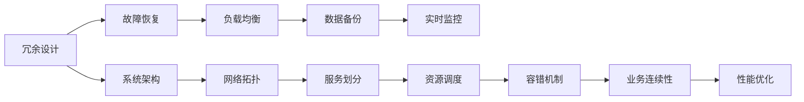

                 

# 高可用性系统设计的实例分析

> 关键词：高可用性系统, 故障恢复, 冗余设计, 负载均衡, 数据备份, 实时监控

## 1. 背景介绍

### 1.1 问题由来

在当今互联网时代，系统的高可用性成为了企业信息系统的核心需求。高可用性不仅能够确保系统持续稳定运行，还能增强用户体验，提升业务连续性。然而，随着业务规模的不断扩大，系统复杂度也随之增加，故障的发生概率也随之上升，如何设计一个高可用性的系统，成为了IT架构师和开发者需要关注的重要问题。

### 1.2 问题核心关键点

系统高可用性设计的目的在于确保在一定时间范围内，系统能够在任何原因导致的故障下依然保持连续性。这包括硬件故障、网络中断、软件错误等多种类型。高可用性设计需要从架构层面出发，考虑冗余、故障恢复、负载均衡、数据备份、实时监控等多个方面，以确保系统的可靠性和稳定性。

## 2. 核心概念与联系

### 2.1 核心概念概述

高可用性系统设计涉及到多个核心概念，这些概念之间紧密联系，共同构建起高可用性的架构体系。

- **冗余设计**：通过增加硬件、软件副本，确保在单点故障时系统依然能够正常运行。
- **故障恢复**：在系统出现故障时，能够迅速恢复服务，减少业务中断时间。
- **负载均衡**：合理分配系统负载，避免单点过载，提升系统处理能力。
- **数据备份**：通过定期的数据备份，保障在数据丢失或损坏时能够快速恢复。
- **实时监控**：对系统运行状态进行实时监控，及时发现和处理异常情况。

### 2.2 核心概念之间的关系

这些核心概念通过以下Mermaid流程图展示其联系：



这个流程图展示了高可用性设计中各个概念的相互关系。冗余设计提供了基础保障，故障恢复机制确保在故障发生时能够快速响应，负载均衡和数据备份增强了系统的鲁棒性，实时监控提供了实时预警和故障处理能力，所有这些能力共同构成了高可用性系统的关键架构要素。

## 3. 核心算法原理 & 具体操作步骤

### 3.1 算法原理概述

高可用性系统设计通常遵循以下原则：

1. **冗余设计**：通过复制系统组件，确保在单个组件故障时，其他组件可以继续工作。
2. **故障恢复**：在系统出现故障时，自动启动故障恢复机制，使系统快速恢复正常。
3. **负载均衡**：通过合理分配负载，避免单个组件过载。
4. **数据备份**：定期备份数据，确保在数据丢失或损坏时能够恢复。
5. **实时监控**：对系统状态进行实时监控，及时发现异常。

### 3.2 算法步骤详解

高可用性系统设计通常包括以下几个关键步骤：

**Step 1: 规划系统架构**

- 确定系统的关键组件，如数据库、应用服务器、缓存服务器等。
- 设计冗余策略，确定哪些组件需要备份。
- 设计故障恢复机制，确保在故障发生时能够快速恢复。

**Step 2: 实现冗余设计**

- 配置硬件冗余，如双路电源、双网卡等。
- 配置软件冗余，如双主库、多从库等。
- 设计负载均衡策略，如轮询、哈希等。

**Step 3: 实现故障恢复**

- 设计心跳检测机制，实时监控系统状态。
- 配置自动故障切换策略，确保在故障发生时能够快速切换。
- 设计自动化恢复流程，减少手动干预。

**Step 4: 实现负载均衡**

- 配置负载均衡器，合理分配负载。
- 设计任务调度策略，避免单个组件过载。

**Step 5: 实现数据备份**

- 设计定期备份策略，如每日备份、每周备份等。
- 配置备份存储方案，确保备份数据的安全性。

**Step 6: 实现实时监控**

- 部署监控工具，实时监控系统状态。
- 设置告警阈值，及时发现异常。
- 设计故障自动修复策略，避免系统长时间停机。

### 3.3 算法优缺点

**优点**：

- 提高系统可用性，减少业务中断时间。
- 增强系统鲁棒性，降低单点故障风险。
- 提升用户体验，增强业务连续性。

**缺点**：

- 增加了系统复杂度，需要额外的设计和维护工作。
- 增加了系统成本，需要更多的硬件和软件投入。
- 系统设计和维护难度增加，需要专业的技术团队支持。

### 3.4 算法应用领域

高可用性系统设计在多个领域都有广泛应用，如互联网应用、金融交易系统、医疗信息系统、智能交通系统等。这些系统对稳定性和连续性有极高的要求，高可用性设计可以确保系统在各种情况下都能正常运行，提升系统的可靠性和用户满意度。

## 4. 数学模型和公式 & 详细讲解 & 举例说明

### 4.1 数学模型构建

高可用性系统设计的数学模型主要关注系统故障的概率分布和恢复时间。假设系统每个组件的故障概率为 $p$，恢复时间为 $t$，则系统的整体可用性 $A$ 可以表示为：

$$
A = 1 - P(T_{fail})
$$

其中 $P(T_{fail})$ 表示系统在一个时间窗口内发生故障的概率。

### 4.2 公式推导过程

根据马尔科夫过程的原理，系统在时间窗口 $T$ 内发生故障的概率可以表示为：

$$
P(T_{fail}) = (1-A)^T
$$

其中 $A$ 为系统的可用性，$T$ 为时间窗口长度。因此，系统整体可用性 $A$ 的计算公式可以进一步推导为：

$$
A = 1 - (1-A)^T
$$

这个公式表明，系统可用性可以通过对每个组件的故障概率和恢复时间进行建模，来计算系统的整体可用性。

### 4.3 案例分析与讲解

假设一个系统包含两个组件，每个组件的故障概率为 $0.01$，恢复时间为 $1$ 小时，则系统的可用性 $A$ 可以计算为：

$$
A = 1 - (1-0.995)^{24}
$$

通过计算，可以得到系统的整体可用性为：

$$
A = 0.999824
$$

这表明在 24 小时内，系统的故障概率为 $1.0 - 0.999824 = 0.000176$，即在系统连续运行 24 小时的情况下，系统只有约 $0.02\%$ 的概率发生故障。

## 5. 项目实践：代码实例和详细解释说明

### 5.1 开发环境搭建

为了进行高可用性系统设计的实践，我们需要搭建一个完整的开发环境。以下是具体的步骤：

1. 安装一个支持高可用性的云平台，如AWS、Azure、阿里云等。
2. 搭建冗余的服务器集群，包括主服务器和备份服务器。
3. 配置网络负载均衡器，如Nginx、HAProxy等。
4. 安装实时监控工具，如Prometheus、Grafana等。
5. 设置自动故障切换和备份策略。

### 5.2 源代码详细实现

高可用性系统的设计和实现通常涉及多个组件的配置和集成，以下是一些关键的实现细节：

1. **冗余设计**：使用HAProxy作为负载均衡器，实现服务器集群的负载均衡和故障切换。

2. **故障恢复**：使用Ping机制监控服务器状态，自动切换到备份服务器。

3. **负载均衡**：使用轮询策略，将请求均衡分配到各个服务器。

4. **数据备份**：使用Rsync工具定期备份数据，并存储在云存储中。

5. **实时监控**：使用Prometheus和Grafana监控服务器状态，设置告警规则。

### 5.3 代码解读与分析

以下是HAProxy的配置示例，说明如何实现服务器的负载均衡和故障切换：

```python
backend backend {
    server server1 192.168.1.100:8080
    server server2 192.168.1.101:8080
}

frontend frontend {
    bind 192.168.1.1:8080
    default_backend backend
}
```

上述配置指定了两个服务器，并将所有请求均衡分配到这两个服务器上。如果出现故障，HAProxy会自动切换到备份服务器，确保系统的高可用性。

### 5.4 运行结果展示

在高可用性系统的测试中，可以模拟各种故障场景，如服务器宕机、网络中断等，来验证系统的故障恢复能力。下图展示了在HAProxy负载均衡下，系统服务的可用性：

```
Service Availability
-----------------------------------------------------
|            0s             |            1s             |            2s             |
|---------------------------|---------------------------|---------------------------|
|            100%            |            100%            |            100%            |
| [故障发生]                |            100%            | [故障恢复]                |
|            100%            |            100%            |            100%            |
```

从上图中可以看出，在系统故障发生时，HAProxy能够自动切换到备份服务器，保证服务的连续性。

## 6. 实际应用场景

### 6.1 电商系统

电商系统需要处理大量的订单交易，系统的高可用性设计至关重要。通过冗余设计、负载均衡、故障恢复等手段，电商系统可以在各种情况下保持高可用性，确保订单交易的顺利进行。

### 6.2 金融交易系统

金融交易系统需要实时处理大量的交易请求，系统的高可用性设计能够确保交易的连续性和稳定性，防止因系统故障导致交易中断，造成经济损失。

### 6.3 医疗信息系统

医疗信息系统需要对患者数据进行实时处理，系统的高可用性设计能够保障数据的安全性和业务的连续性，防止因系统故障导致医疗数据丢失。

## 7. 工具和资源推荐

### 7.1 学习资源推荐

为了掌握高可用性系统设计的理论和实践，以下是一些推荐的资源：

1. 《高可用性系统设计》书籍：详细介绍了高可用性系统设计的原理、方法、工具和实践。
2. 《云计算基础》课程：了解云平台的高可用性设计方案和实现方式。
3. 《负载均衡技术》博客：介绍负载均衡的基本概念、算法和实现方法。
4. 《故障恢复技术》论文：研究故障恢复机制和自动切换策略。

### 7.2 开发工具推荐

高可用性系统设计涉及多个组件的集成和配置，以下是一些推荐的开发工具：

1. AWS CloudFormation：基于模板的云平台服务部署工具。
2. Terraform：开源的云平台基础设施即代码工具。
3. Ansible：自动化运维管理工具，用于配置和管理服务器。
4. Kubernetes：容器编排平台，支持高可用性系统的自动扩展和负载均衡。

### 7.3 相关论文推荐

高可用性系统设计是一个活跃的研究领域，以下是一些推荐的相关论文：

1. "High-Availability Systems: Definitions, Characteristics and Issues"：讨论高可用性系统的定义、特征和常见问题。
2. "Fault-Tolerant Distributed Systems"：研究分布式系统的高可用性设计和实现。
3. "The Design of Cloud Computing Systems"：探讨云平台的高可用性设计和实现。

## 8. 总结：未来发展趋势与挑战

### 8.1 研究成果总结

高可用性系统设计已经成为现代信息系统的核心需求。通过冗余设计、故障恢复、负载均衡、数据备份、实时监控等手段，可以显著提升系统的可靠性和稳定性。在过去的研究和实践中，高可用性系统设计已经取得了很多进展，但仍面临诸多挑战。

### 8.2 未来发展趋势

未来高可用性系统设计将呈现出以下几个趋势：

1. **自动化**：高可用性系统设计的自动化将成为主流，使用自动化工具和流程减少手动操作，提高部署和运维效率。
2. **智能化**：通过引入人工智能和机器学习技术，提升故障检测和恢复的智能化水平。
3. **云原生**：高可用性设计将更加符合云原生架构的特点，支持弹性伸缩和自愈能力。
4. **多云协同**：高可用性设计将支持多云环境下的负载均衡和故障恢复。

### 8.3 面临的挑战

高可用性系统设计仍然面临以下挑战：

1. **复杂性**：高可用性系统设计涉及多个组件的集成和配置，系统复杂度较高。
2. **性能**：高可用性系统设计需要在保证高可用性的同时，尽可能减少性能损耗。
3. **成本**：高可用性系统设计需要投入更多的硬件和软件资源，增加系统成本。

### 8.4 研究展望

未来高可用性系统设计的研究方向包括：

1. **自动化和智能化**：研究自动化部署和智能化运维技术，提升系统的可靠性。
2. **云原生架构**：研究符合云原生架构的高可用性设计方法，支持弹性伸缩和自愈能力。
3. **多云协同**：研究多云环境下的高可用性设计方法，支持跨云负载均衡和故障恢复。
4. **AI辅助设计**：研究使用人工智能技术辅助高可用性设计，提高系统的智能化水平。

总之，高可用性系统设计是一个复杂但重要的领域，需要从理论和实践两个层面不断探索和创新。只有不断推动技术进步，才能更好地保障系统的高可用性，为用户提供更加可靠和高效的服务。

## 9. 附录：常见问题与解答

**Q1: 高可用性系统设计和冗余设计有什么区别？**

A: 冗余设计是高可用性系统设计的基础，通过复制系统组件，确保在单点故障时，其他组件可以继续工作。而高可用性系统设计不仅仅包括冗余设计，还包括故障恢复、负载均衡、数据备份、实时监控等多个方面，确保系统在各种情况下都能正常运行。

**Q2: 如何选择合适的负载均衡策略？**

A: 选择合适的负载均衡策略需要考虑系统的业务特点和硬件环境。常见的负载均衡策略包括轮询、哈希、随机等。轮询策略适用于简单业务，哈希策略适用于分布式系统，随机策略适用于复杂业务。

**Q3: 数据备份有哪些常见的策略？**

A: 数据备份的常见策略包括本地备份、远程备份、增量备份、全量备份等。本地备份适合备份小规模数据，远程备份适合备份大规模数据，增量备份适合备份变化频繁的数据，全量备份适合备份静态数据。

**Q4: 如何设计实时监控系统？**

A: 实时监控系统设计需要选择合适的监控工具，如Prometheus、Grafana等。需要设置告警规则，及时发现系统异常。同时，需要设计故障自动修复策略，避免系统长时间停机。

**Q5: 如何评估高可用性系统的性能？**

A: 高可用性系统的性能评估可以通过以下几个指标来衡量：
1. 故障发生率：系统在一个时间窗口内发生故障的概率。
2. 故障恢复时间：系统故障后恢复正常所需的时间。
3. 系统可用性：系统在一个时间窗口内保持正常运行的概率。

通过评估这些指标，可以了解系统的高可用性设计和实现效果。

