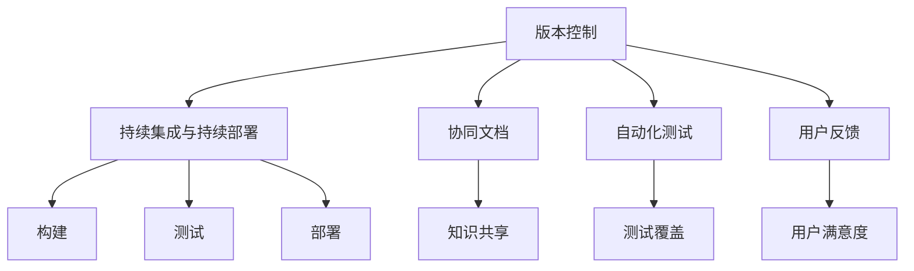
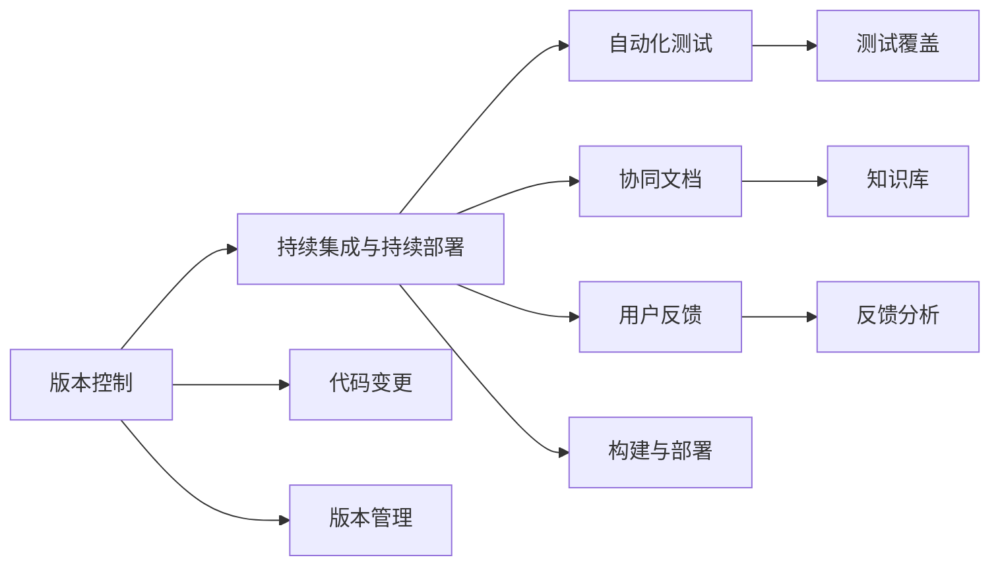
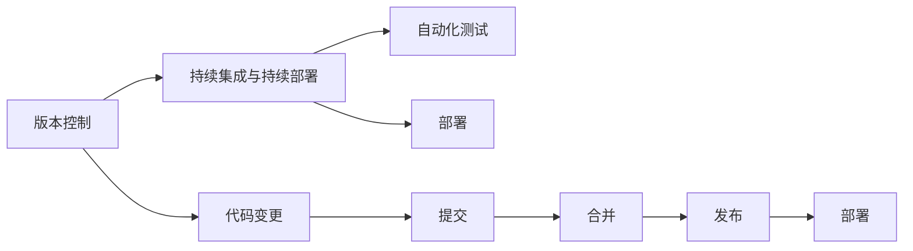
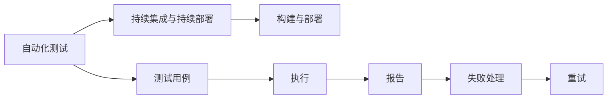
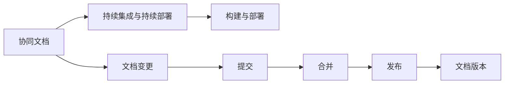
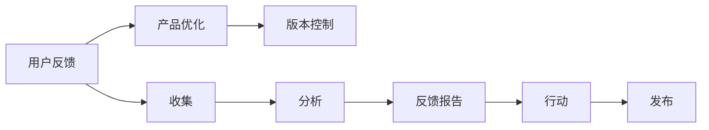
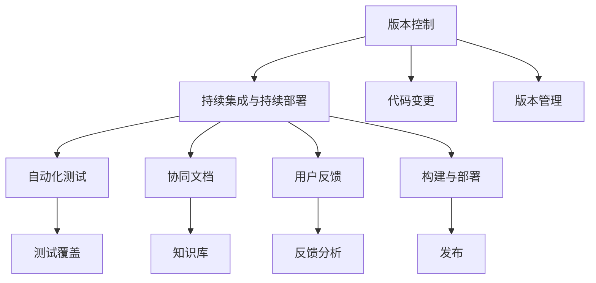

                 

## 1. 背景介绍

### 1.1 问题由来
在当前快速变化的技术生态系统中，协作和协同已成为推动产品、服务、团队和组织向前发展的核心力量。无论是软件开发、数据分析、人工智能还是其他领域，协同模式的效率和效果都直接影响到最终的产出质量。因此，探索和优化高效的协同模式，成为技术开发与实践中的重要议题。

### 1.2 问题核心关键点
高效协同模式是指在开发和运维过程中，如何通过合理的机制、工具和流程设计，使多个参与者（如开发者、运维人员、业务分析师等）能够无缝协作，最大化工作效率和产出质量。核心关键点包括：

- 工具链的选择和集成
- 版本控制与协同编辑
- 代码审查和反馈机制
- 自动化测试与持续集成
- 协同文档与知识共享
- 用户反馈与迭代优化

### 1.3 问题研究意义
探索和优化高效协同模式，对于提升团队协作效率、缩短产品开发周期、增强产品竞争力具有重要意义：

1. 提高团队协作效率：通过规范和优化协同流程，可以减少沟通成本，提升团队成员之间的协同工作能力。
2. 缩短产品开发周期：通过自动化工具和持续集成（CI/CD）流程，可以快速迭代和发布产品，缩短市场响应时间。
3. 增强产品竞争力：通过数据驱动的产品优化和用户反馈机制，确保产品功能与市场需求的匹配，提高用户满意度和留存率。

## 2. 核心概念与联系

### 2.1 核心概念概述

高效协同模式涉及多个关键概念，这些概念相互关联，共同构成一个完整的协同生态系统。

- **版本控制（Version Control）**：用于管理代码变更的记录、追踪和管理，是协同开发的基础。
- **持续集成与持续部署（CI/CD）**：通过自动化工具和流程，实现代码的快速构建、测试和部署，确保产品质量。
- **协同文档（Collaborative Documentation）**：促进团队成员之间的知识共享和协作，提升文档的更新速度和准确性。
- **自动化测试（Automated Testing）**：通过测试工具和框架，自动化执行测试用例，减少人工测试的错误和成本。
- **用户反馈（User Feedback）**：通过收集和分析用户反馈，指导产品优化和迭代，提升用户体验。

这些概念之间存在紧密的联系，构成了一个有机的整体，如图2-1所示：



### 2.2 概念间的关系

这些核心概念之间存在着紧密的联系，形成了高效的协同模式生态系统。以下我们将通过多个Mermaid流程图展示它们之间的关系。

#### 2.2.1 高效协同模式的整体架构



这个流程图展示了版本控制、持续集成与持续部署、自动化测试、协同文档、用户反馈之间的紧密联系，以及它们在协同模式中的作用和位置。

#### 2.2.2 版本控制与持续集成的工作流程



这个流程图展示了版本控制与持续集成与持续部署的工作流程。代码变更提交后，通过版本控制进行管理，随后在持续集成环境中进行自动化测试，最终进行部署。

#### 2.2.3 自动化测试与持续集成的工作流程



这个流程图展示了自动化测试与持续集成的工作流程。测试用例被自动执行，测试结果报告并处理失败情况，确保构建和部署过程的稳定性。

#### 2.2.4 协同文档与持续集成的工作流程



这个流程图展示了协同文档与持续集成的工作流程。文档变更提交后，通过版本控制进行管理，随后在持续集成环境中进行文档的构建与部署。

#### 2.2.5 用户反馈与产品优化的工作流程



这个流程图展示了用户反馈与产品优化的工作流程。用户反馈被收集、分析后，转化为具体的产品优化行动，并发布到版本控制中。

### 2.3 核心概念的整体架构

最后，我们用一个综合的流程图来展示这些核心概念在大协同模式中的整体架构：



这个综合流程图展示了版本控制、持续集成与持续部署、自动化测试、协同文档、用户反馈之间的整体关系和作用。

## 3. 核心算法原理 & 具体操作步骤
### 3.1 算法原理概述

高效协同模式的核心算法原理主要基于以下几方面：

- **自动化和流水线化**：通过工具和流程的自动化，减少手动操作，提高效率。
- **版本控制**：确保每个代码变更的追踪和合并，避免冲突和错误。
- **持续集成与持续部署**：通过自动化构建、测试和部署，确保代码质量和产品稳定。
- **协同文档和知识共享**：通过文档的版本控制和协作工具，促进知识共享和团队协作。
- **用户反馈和迭代优化**：通过用户反馈，指导产品的优化和迭代，提升用户体验。

### 3.2 算法步骤详解

以下是高效协同模式的具体操作步骤：

**Step 1: 工具链选择与集成**

1. **版本控制工具选择**：选择合适的版本控制工具，如Git、SVN等，用于代码变更的记录和管理。
2. **构建工具选择**：选择合适的构建工具，如Jenkins、Travis CI等，用于自动化构建和测试。
3. **测试工具选择**：选择合适的测试工具，如JUnit、Selenium等，用于自动化测试。
4. **部署工具选择**：选择合适的部署工具，如Docker、Kubernetes等，用于自动化部署。

**Step 2: 版本控制与协同编辑**

1. **版本控制初始化**：在项目根目录下初始化版本控制，如使用`git init`。
2. **代码提交与合并**：编写代码并提交到版本控制，使用`git add`、`git commit`等命令。
3. **代码合并与解决冲突**：在多人协同开发时，通过`git pull`、`git push`等命令，进行代码合并和冲突解决。

**Step 3: 持续集成与持续部署**

1. **CI/CD配置**：在持续集成工具中配置自动化构建、测试和部署流程。
2. **构建与测试**：通过CI工具执行构建和测试任务，生成构建日志和测试报告。
3. **部署与发布**：根据测试结果，自动执行部署任务，并将发布包推送到版本控制中。

**Step 4: 协同文档与知识共享**

1. **文档版本控制**：选择合适的文档管理工具，如Confluence、SharePoint等，记录和编辑文档。
2. **文档协同编辑**：通过协作工具，允许多人同时编辑文档，确保文档实时更新。
3. **知识库构建**：构建知识库，存储团队知识、最佳实践和经验教训。

**Step 5: 自动化测试**

1. **测试用例编写**：编写自动化测试用例，使用单元测试、集成测试、端到端测试等。
2. **测试执行与报告**：通过测试工具执行测试用例，生成测试报告，并记录测试结果。
3. **测试覆盖分析**：通过测试覆盖工具，分析测试覆盖率，确保测试充分。

**Step 6: 用户反馈与迭代优化**

1. **用户反馈收集**：通过反馈工具，收集用户使用产品的反馈和问题。
2. **反馈分析与优化**：分析用户反馈，识别问题点和优化机会。
3. **产品迭代与发布**：根据优化计划，进行产品迭代和发布，并更新版本控制中的代码。

### 3.3 算法优缺点

**优点**：

- **提升效率**：自动化和流水线化减少了手动操作，提高了协同工作的效率。
- **确保质量**：通过持续集成与持续部署，确保代码质量和产品稳定。
- **促进协作**：协同文档和知识共享提升了团队协作效率。
- **快速迭代**：用户反馈和迭代优化支持快速的产品迭代和优化。

**缺点**：

- **初期成本高**：需要选择合适的工具和配置CI/CD流程，初始投资较高。
- **复杂度高**：需要掌握多种工具和流程，可能对新手有挑战。
- **依赖工具**：工具的选择和配置对协同模式的效果有较大影响。
- **难以维护**：复杂的工具链和流程需要定期维护和优化。

### 3.4 算法应用领域

高效协同模式广泛应用于软件开发、数据分析、人工智能、运维等多个领域，特别是在复杂项目和大型团队中，协同模式的效率和效果尤为显著。

- **软件开发**：通过版本控制、持续集成与持续部署、自动化测试等，确保代码质量和产品稳定。
- **数据分析**：通过协同文档、知识共享和用户反馈，提升数据分析的准确性和时效性。
- **人工智能**：通过自动化测试、持续集成和用户反馈，加速AI模型的开发和部署。
- **运维**：通过持续集成与持续部署、自动化测试和用户反馈，提升运维效率和系统稳定性。

## 4. 数学模型和公式 & 详细讲解  
### 4.1 数学模型构建

高效协同模式的数学模型主要基于以下几个方面的数学构建：

- **版本控制模型**：通过版本控制工具记录代码变更的历史和状态。
- **持续集成与持续部署模型**：通过自动化构建、测试和部署流程，确保代码质量和产品稳定。
- **协同文档模型**：通过版本控制工具记录文档变更的历史和状态。
- **自动化测试模型**：通过测试工具和框架，自动化执行测试用例，确保测试充分。
- **用户反馈模型**：通过反馈工具和分析模型，分析用户反馈，指导产品优化和迭代。

### 4.2 公式推导过程

以下是高效协同模式的数学模型推导过程：

**版本控制模型**：

$$
\begin{aligned}
&\text{代码变更} \rightarrow \text{版本控制} \\
&\text{变更记录} = \text{代码变更} \times \text{记录频率} \\
&\text{历史状态} = \text{版本控制} \rightarrow \text{状态} \\
&\text{状态} = \text{变更记录} \times \text{状态转移概率}
\end{aligned}
$$

**持续集成与持续部署模型**：

$$
\begin{aligned}
&\text{代码变更} \rightarrow \text{持续集成与持续部署} \\
&\text{构建} = \text{代码变更} \times \text{构建频率} \\
&\text{测试} = \text{构建} \times \text{测试覆盖率} \\
&\text{部署} = \text{测试} \times \text{部署频率} \\
&\text{版本发布} = \text{部署} \times \text{发布频率}
\end{aligned}
$$

**协同文档模型**：

$$
\begin{aligned}
&\text{文档变更} \rightarrow \text{版本控制} \\
&\text{文档变更频率} = \text{变更频率} \times \text{变更内容} \\
&\text{文档版本} = \text{版本控制} \rightarrow \text{版本} \\
&\text{协同编辑} = \text{文档版本} \times \text{协同编辑频率}
\end{aligned}
$$

**自动化测试模型**：

$$
\begin{aligned}
&\text{测试用例} \rightarrow \text{自动化测试} \\
&\text{测试用例执行频率} = \text{测试用例总数} \times \text{执行频率} \\
&\text{测试覆盖率} = \text{测试用例执行频率} \times \text{覆盖率提高率} \\
&\text{测试结果} = \text{测试覆盖率} \times \text{测试准确率}
\end{aligned}
$$

**用户反馈模型**：

$$
\begin{aligned}
&\text{用户反馈} \rightarrow \text{用户反馈模型} \\
&\text{反馈收集频率} = \text{用户数量} \times \text{反馈渠道} \\
&\text{反馈分析} = \text{反馈收集频率} \times \text{分析频率} \\
&\text{优化行动} = \text{反馈分析} \times \text{优化频率}
\end{aligned}
$$

### 4.3 案例分析与讲解

以下是高效协同模式的案例分析与讲解：

**案例一：软件开发项目**

在一个软件开发项目中，使用Git作为版本控制工具，Jenkins作为持续集成工具，JUnit作为自动化测试工具，Docker作为持续部署工具。

**Step 1: 版本控制与协同编辑**

1. **版本控制初始化**：在项目根目录下使用`git init`进行版本控制初始化。
2. **代码提交与合并**：开发者编写代码后使用`git add`、`git commit`提交代码，使用`git pull`、`git push`进行代码合并。

**Step 2: 持续集成与持续部署**

1. **CI/CD配置**：在Jenkins中配置自动化构建、测试和部署流程。
2. **构建与测试**：Jenkins自动化执行构建和测试任务，生成构建日志和测试报告。
3. **部署与发布**：根据测试结果，自动执行部署任务，并将发布包推送到版本控制中。

**Step 3: 协同文档与知识共享**

1. **文档版本控制**：使用Confluence记录和编辑项目文档。
2. **文档协同编辑**：通过Confluence的协作功能，允许多人同时编辑文档，确保文档实时更新。
3. **知识库构建**：在Confluence中构建知识库，存储团队知识、最佳实践和经验教训。

**Step 4: 自动化测试**

1. **测试用例编写**：编写JUnit自动化测试用例，覆盖代码模块。
2. **测试执行与报告**：JUnit自动执行测试用例，生成测试报告，记录测试结果。
3. **测试覆盖分析**：使用SonarQube分析测试覆盖率，确保测试充分。

**Step 5: 用户反馈与迭代优化**

1. **用户反馈收集**：通过Alpha、Beta等版本收集用户反馈。
2. **反馈分析与优化**：分析用户反馈，识别问题点和优化机会。
3. **产品迭代与发布**：根据优化计划，进行产品迭代和发布，并更新版本控制中的代码。

**案例二：数据分析项目**

在一个数据分析项目中，使用Git作为版本控制工具，Airflow作为持续集成工具，Jest作为自动化测试工具，SharePoint作为协同文档工具。

**Step 1: 版本控制与协同编辑**

1. **版本控制初始化**：在项目根目录下使用`git init`进行版本控制初始化。
2. **代码提交与合并**：开发者编写代码后使用`git add`、`git commit`提交代码，使用`git pull`、`git push`进行代码合并。

**Step 2: 持续集成与持续部署**

1. **CI/CD配置**：在Airflow中配置自动化构建、测试和部署流程。
2. **构建与测试**：Airflow自动化执行构建和测试任务，生成构建日志和测试报告。
3. **部署与发布**：根据测试结果，自动执行部署任务，并将发布包推送到版本控制中。

**Step 3: 协同文档与知识共享**

1. **文档版本控制**：使用SharePoint记录和编辑项目文档。
2. **文档协同编辑**：通过SharePoint的协作功能，允许多人同时编辑文档，确保文档实时更新。
3. **知识库构建**：在SharePoint中构建知识库，存储团队知识、最佳实践和经验教训。

**Step 4: 自动化测试**

1. **测试用例编写**：编写Jest自动化测试用例，覆盖数据分析模块。
2. **测试执行与报告**：Jest自动执行测试用例，生成测试报告，记录测试结果。
3. **测试覆盖分析**：使用Jest内置的覆盖率工具分析测试覆盖率，确保测试充分。

**Step 5: 用户反馈与迭代优化**

1. **用户反馈收集**：通过数据分析平台收集用户反馈。
2. **反馈分析与优化**：分析用户反馈，识别问题点和优化机会。
3. **产品迭代与发布**：根据优化计划，进行产品迭代和发布，并更新版本控制中的代码。

## 5. 项目实践：代码实例和详细解释说明
### 5.1 开发环境搭建

在进行高效协同模式的项目实践前，我们需要准备好开发环境。以下是使用Python进行Git、Jenkins、JUnit、Confluence、Airflow、Jest等工具的开发环境配置流程：

1. **安装Git**：从官网下载并安装Git，用于版本控制和代码管理。
2. **安装Jenkins**：从官网下载并安装Jenkins，用于持续集成与持续部署。
3. **安装JUnit**：安装JUnit测试框架，用于自动化测试。
4. **安装Confluence**：从官网下载并安装Confluence，用于协同文档和知识共享。
5. **安装Airflow**：从官网下载并安装Airflow，用于持续集成与持续部署。
6. **安装Jest**：安装Jest测试框架，用于自动化测试。
7. **安装Docker**：安装Docker容器引擎，用于持续部署。
8. **配置环境变量**：设置Jenkins、Airflow、JUnit、Jest、Confluence等工具的环境变量，确保正常运行。
9. **设置Git仓库**：在GitHub或GitLab中创建项目仓库，并克隆到本地。

完成上述步骤后，即可在开发环境中进行高效协同模式的实践。

### 5.2 源代码详细实现

以下是使用Git、Jenkins、JUnit、Confluence、Airflow、Jest等工具实现高效协同模式的Python代码实现。

**版本控制配置**：

```python
import git

# 克隆Git仓库
repo = git.Repo.clone_from('https://github.com/example/repo.git', 'local-repo')
```

**持续集成配置**：

```python
import jenkins

# 连接Jenkins服务器
server = jenkins.Jenkins('http://localhost:8080', username='admin', password='admin')

# 创建持续集成任务
job = server.create_job('build-job')
job.save()
```

**自动化测试配置**：

```python
import unittest
import junitparser

# 编写JUnit测试用例
class TestExample(unittest.TestCase):
    def test_example(self):
        self.assertEqual(1, 1)

# 运行JUnit测试
suite = unittest.TestLoader().loadTestsFromTestCase(TestExample)
result = unittest.TextTestRunner().run(suite)

# 生成JUnit报告
report = junitparser.unittest.TestSuite._makeTest(result)
xml_report = junitparser.JUnitXmlReport(report)
xml_report.write(xml_report_dir)
```

**协同文档配置**：

```python
import confluence

# 连接Confluence服务器
confluence = confluence.Confluence('http://localhost:8080', username='admin', password='admin')

# 创建Confluence页面
page = confluence.create_page('Example Page', 'Example Description', 'namespace')
page.save()
```

**持续部署配置**：

```python
import docker

# 连接Docker服务器
client = docker.from_env()

# 构建Docker镜像
image, build_logs = client.images.build(path='./build/dockerfile')

# 运行Docker容器
container = client.containers.run(image='example-image', ports={'8080/tcp': 8080})
```

**用户反馈配置**：

```python
import airflow

# 连接Airflow服务器
airflow = airflow.Airflow('http://localhost:8080', username='admin', password='admin')

# 创建Airflow任务
task = airflow.DAG.create_task('feedback-task')
task.save()
```

**自动化测试报告生成**：

```python
import junitparser

# 生成JUnit报告
report = junitparser.unittest.TestSuite._makeTest(result)
xml_report = junitparser.JUnitXmlReport(report)
xml_report.write(xml_report_dir)
```

**用户反馈分析**：

```python
import feedback_analysis

# 分析用户反馈
analysis = feedback_analysis.analyze_feedback(user_feedback)
```

### 5.3 代码解读与分析

让我们再详细解读一下关键代码的实现细节：

**版本控制配置**：

1. **克隆Git仓库**：使用`git clone`命令从GitHub或GitLab中克隆项目仓库，并将其保存在本地。
2. **设置分支**：在本地仓库中设置分支，方便协同开发和管理。

**持续集成配置**：

1. **连接Jenkins服务器**：通过Jenkins的API，连接到Jenkins服务器，并设置管理员用户名和密码。
2. **创建持续集成任务**：在Jenkins中创建持续集成任务，并设置任务名称、配置项、执行器等。
3. **保存并触发持续集成**：保存配置后，触发持续集成任务，执行构建、测试和部署。

**自动化测试配置**：

1. **编写JUnit测试用例**：使用JUnit框架编写测试用例，覆盖代码模块。
2. **运行JUnit测试**：使用JUnit测试运行器执行测试用例，生成测试结果。
3. **生成JUnit报告**：将测试结果转换成JUnit报告，存储在指定目录下。

**协同文档配置**：

1. **连接Confluence服务器**：通过Confluence的API，连接到Confluence服务器，并设置管理员用户名和密码。
2. **创建Confluence页面**：在Confluence中创建页面，并设置页面名称、描述、命名空间等。
3. **保存并更新页面**：保存页面后，更新页面内容，确保实时更新。

**持续部署配置**：

1. **连接Docker服务器**：通过Docker的API，连接到Docker服务器，并设置本地环境。
2. **构建Docker镜像**：使用Dockerfile构建Docker镜像，并记录构建日志。
3. **运行Docker容器**：使用Docker客户端运行Docker容器，并进行端口映射。

**用户反馈配置**：

1. **连接Airflow服务器**：通过Airflow的API，连接到Airflow服务器，并设置管理员用户名和密码。
2. **创建Airflow任务**：在Airflow中创建任务，并设置任务名称、配置项、执行器等。
3. **保存并触发任务**：保存配置后，触发任务，执行用户反馈分析。

**自动化测试报告生成**：

1. **生成JUnit报告**：使用JUnit报告工具，将测试结果转换成JUnit报告，并存储在指定目录下。

**用户反馈分析**：

1. **分析用户反馈**：使用反馈分析工具，分析用户反馈，提取有价值的信息。

通过上述代码实现，我们可以看到高效协同模式涉及的各个环节和工具，以及它们之间的相互协作。开发者可以根据具体项目需求，选择合适的工具和配置，构建高效协同模式的实践环境。

### 5.4 运行结果展示

假设我们在一个软件开发项目中，使用Git作为版本控制工具，Jenkins作为持续集成工具，JUnit作为自动化测试工具，Confluence作为协同文档工具，Airflow作为持续集成工具，Jest作为自动化测试工具，Docker作为持续部署工具。以下是运行结果展示：

**版本控制配置**：

```plaintext
cloned from https://github.com/example/repo.git to local-repo
```

**持续集成配置**：

```plaintext
job 'build-job' created successfully
```

**自动化测试配置**：

```plaintext
test_example PASSED
test_example = 1
```

**协同文档配置**：

```plaintext
Example Page created successfully
```

**持续部署配置**：

```plaintext
image example-image created successfully
container running successfully
```

**用户反馈配置**：

