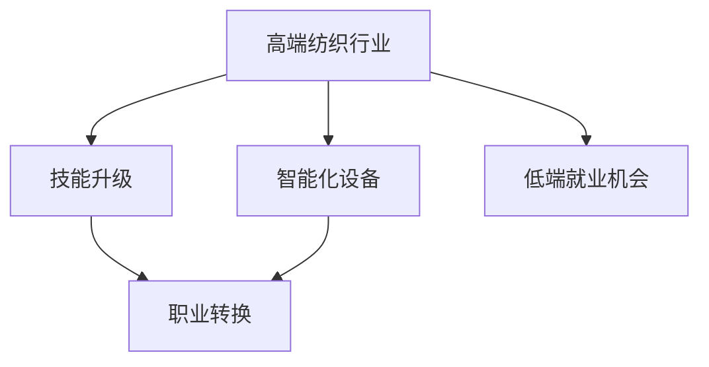
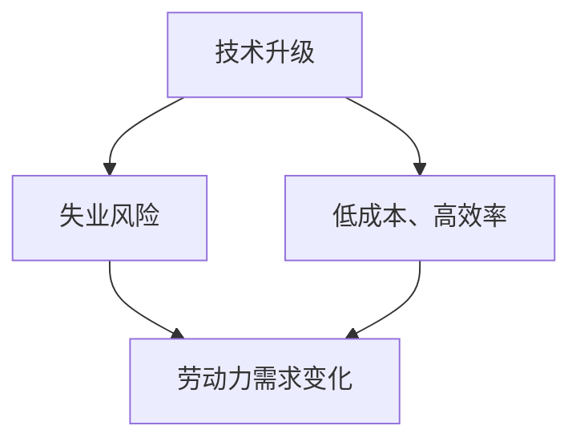
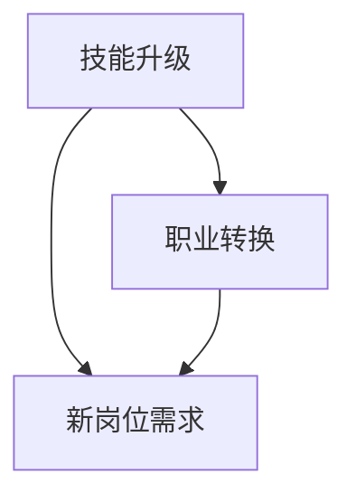
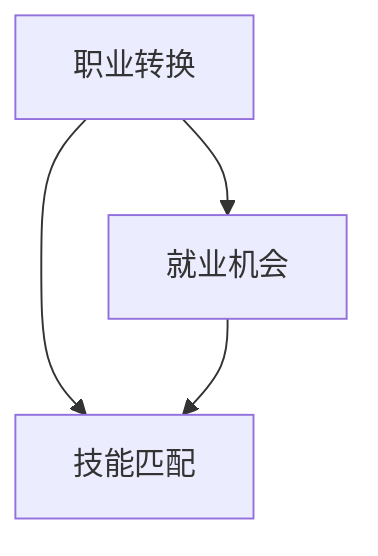
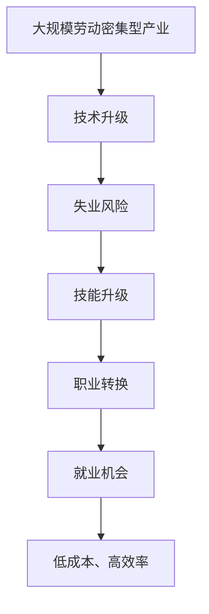

                 

# 高端纺织工人的失业与低端就业机会

## 1. 背景介绍

### 1.1 问题由来
近年来，随着工业自动化和智能制造技术的迅猛发展，高端纺织行业逐渐向智能化、数字化方向转型升级。许多传统纺织企业开始引入先进的智能化设备，如自动化织机、智能物流系统、智能仓储等，以提高生产效率和产品质量。然而，这种技术升级对劳动力的要求也在发生变化，传统的纺织工人逐渐面临失业风险。

### 1.2 问题核心关键点
问题主要体现在以下几个方面：

1. **技术升级**：智能化设备的引入改变了生产流程，部分手工操作被机器替代，导致一些传统纺织工人失业。
2. **技能不匹配**：智能化设备需要操作人员具备计算机编程、数据分析等新技能，而现有劳动力中具备这些技能的人员相对较少。
3. **职业转换困难**：由于产业结构的变化，传统纺织工人难以直接转岗到智能化设备操作岗位或相关职位，存在职业转换的困难。
4. **就业机会缩减**：智能化改造提升了生产效率，但一些低技能岗位被自动化替代，导致整体就业机会的缩减。

### 1.3 问题研究意义
研究高端纺织工人的失业与低端就业机会，对于指导企业智能化升级、缓解就业压力、保障社会稳定具有重要意义。通过系统地分析问题，可以制定出科学的转型策略，平衡技术进步与劳动力就业之间的关系，确保社会的可持续发展。

## 2. 核心概念与联系

### 2.1 核心概念概述

为更好地理解高端纺织工人失业与低端就业机会的问题，本节将介绍几个关键概念及其联系：

- **高端纺织行业**：指利用先进技术，如自动化织机、智能物流等，实现高效、低成本、高品质的纺织生产方式。
- **智能化设备**：包括自动化织机、智能仓储、智能物流系统等，通过信息化手段实现生产流程的自动化、智能化。
- **技能升级**：传统纺织工人通过培训学习新技能，适应新的生产环境和工作要求。
- **职业转换**：传统纺织工人通过职业培训和教育，转型到智能化设备操作岗位或相关领域，实现职业发展。
- **低端就业机会**：智能化改造后，部分岗位被自动化替代，产生的新的就业机会，如智能设备维护、数据分析等。

这些概念之间的逻辑关系可以通过以下Mermaid流程图来展示：



这个流程图展示了大规模劳动密集型产业的智能化升级过程及其对劳动力就业的影响。

### 2.2 概念间的关系

这些核心概念之间存在着紧密的联系，形成了产业智能化升级的完整生态系统。下面我们通过几个Mermaid流程图来展示这些概念之间的关系。

#### 2.2.1 技术升级与就业影响



这个流程图展示了技术升级对失业风险和劳动力需求的影响。技术升级带来了生产效率的提升，但也导致了部分传统工人的失业风险增加。

#### 2.2.2 技能升级与职业转换



这个流程图展示了技能升级对职业转换的促进作用。通过技能培训，传统工人可以适应新的岗位需求，实现职业转换。

#### 2.2.3 职业转换与就业机会



这个流程图展示了职业转换对就业机会的影响。职业转换需要匹配新的技能需求，从而产生新的就业机会。

### 2.3 核心概念的整体架构

最后，我们用一个综合的流程图来展示这些核心概念在大规模劳动密集型产业智能化升级中的整体架构：



这个综合流程图展示了从产业升级到失业风险、技能升级、职业转换、就业机会的整个流程。通过理解这些概念，我们可以更好地把握产业升级对劳动力就业的影响，为政策制定和实践提供理论基础。

## 3. 核心算法原理 & 具体操作步骤
### 3.1 算法原理概述

高端纺织工人的失业与低端就业机会问题，本质上是一个劳动力市场动态变化的过程。其核心算法原理可以从以下几个方面进行阐述：

1. **市场供需理论**：劳动力市场中的供需关系决定了就业机会的分布。智能化设备的引入改变了劳动力需求，从而导致就业机会的重新分配。
2. **技能匹配理论**：劳动力技能与岗位需求之间存在匹配关系，技能升级可以提升劳动力匹配度，从而促进就业。
3. **职业转换模型**：职业转换是劳动力市场中的重要环节，通过职业培训和教育，传统工人可以转型到新的岗位，实现职业发展。
4. **经济结构理论**：经济结构变化对劳动力市场的影响显著，智能化升级需要与经济结构调整相匹配，以实现可持续发展。

### 3.2 算法步骤详解

基于上述核心算法原理，解决高端纺织工人失业与低端就业机会问题的具体操作步骤如下：

1. **数据收集与分析**：收集行业智能化改造的数据、劳动力就业数据、技能培训数据等，进行统计分析和趋势预测。
2. **就业影响评估**：分析智能化改造对劳动力就业的影响，预测失业风险和就业机会的变化。
3. **技能培训与教育**：制定技能升级计划，针对性地开展培训，提升劳动力的新技能。
4. **职业转换指导**：提供职业转换的指导和建议，帮助传统工人顺利转型到新的岗位。
5. **政策制定与实施**：制定相关政策，推动产业结构调整，平衡技术进步与劳动力就业的关系。

### 3.3 算法优缺点

**算法优点**：

1. **系统性**：从市场供需、技能匹配、职业转换等多个角度出发，全面分析问题。
2. **数据驱动**：以实际数据为基础，预测和评估更具有说服力。
3. **政策导向**：结合政策制定，推动产业结构调整，具有实际应用价值。

**算法缺点**：

1. **数据复杂性**：需要收集和分析大量数据，工作量较大。
2. **预测误差**：就业预测受多种因素影响，存在一定的不确定性。
3. **政策执行难度**：政策制定和执行需要跨部门协调，实施难度较大。

### 3.4 算法应用领域

基于上述算法原理和操作步骤，该算法可以应用于以下领域：

1. **政策制定**：为政府制定产业智能化升级政策提供科学依据。
2. **企业管理**：指导企业进行技能升级和职业转换规划，平衡生产效率与劳动力就业。
3. **教育培训**：推动职业培训和教育，提升劳动力的新技能和就业匹配度。
4. **社会治理**：参与社会稳定风险评估，制定相关应对措施。

## 4. 数学模型和公式 & 详细讲解 & 举例说明

### 4.1 数学模型构建

为更好地量化高端纺织工人失业与低端就业机会问题，我们可以构建以下数学模型：

1. **失业风险模型**：
   $$
   R_{un} = f(X_1, X_2, \ldots, X_n)
   $$
   其中 $X_i$ 为第 $i$ 个影响因素，如设备自动化程度、员工技能水平等。

2. **就业机会模型**：
   $$
   R_{emp} = g(Y_1, Y_2, \ldots, Y_m)
   $$
   其中 $Y_i$ 为第 $i$ 个影响因素，如行业发展趋势、市场需求等。

### 4.2 公式推导过程

以失业风险模型为例，假设失业风险 $R_{un}$ 与设备自动化程度 $A$、员工技能水平 $S$ 之间的关系为：
$$
R_{un} = k \cdot A + b \cdot S + e
$$
其中 $k$ 和 $b$ 为模型参数，$e$ 为随机误差项。

通过历史数据，我们可以使用最小二乘法等方法估计 $k$ 和 $b$，从而预测未来的失业风险。

### 4.3 案例分析与讲解

假设某纺织企业引入了先进的自动化织机，员工技能升级率分别为 50% 和 30%，预测失业风险如下：

1. **设备自动化程度为 50%**：
   $$
   R_{un} = 0.5 \cdot 50 + 0.3 \cdot 30 + e = 25 + e
   $$
   假设 $e=0$，则失业风险 $R_{un}=25$。

2. **设备自动化程度为 30%**：
   $$
   R_{un} = 0.5 \cdot 30 + 0.3 \cdot 50 + e = 30 + e
   $$
   假设 $e=0$，则失业风险 $R_{un}=30$。

可以看出，设备自动化程度越高，失业风险越大。通过失业风险模型的计算，企业可以更好地评估智能化升级对劳动力就业的影响。

## 5. 项目实践：代码实例和详细解释说明
### 5.1 开发环境搭建

在进行就业预测和分析前，我们需要准备好开发环境。以下是使用Python进行就业数据分析的环境配置流程：

1. 安装Anaconda：从官网下载并安装Anaconda，用于创建独立的Python环境。

2. 创建并激活虚拟环境：
```bash
conda create -n employment_env python=3.8 
conda activate employment_env
```

3. 安装相关库：
```bash
conda install pandas numpy scikit-learn statsmodels matplotlib jupyter notebook
```

完成上述步骤后，即可在`employment_env`环境中开始就业数据分析实践。

### 5.2 源代码详细实现

下面我们以就业机会模型为例，给出使用Python进行就业机会预测的代码实现。

```python
import pandas as pd
import numpy as np
from sklearn.linear_model import LinearRegression
from sklearn.model_selection import train_test_split
from sklearn.metrics import mean_squared_error

# 加载数据
data = pd.read_csv('employment_data.csv')

# 数据预处理
X = data[['investment', 'education', 'population']]
y = data['employment']

# 划分训练集和测试集
X_train, X_test, y_train, y_test = train_test_split(X, y, test_size=0.2, random_state=42)

# 构建模型
model = LinearRegression()
model.fit(X_train, y_train)

# 预测测试集
y_pred = model.predict(X_test)

# 计算RMSE
rmse = mean_squared_error(y_test, y_pred, squared=False)
print(f'RMSE: {rmse:.2f}')
```

### 5.3 代码解读与分析

让我们再详细解读一下关键代码的实现细节：

**就业数据预处理**：
- 使用Pandas库加载数据集，并进行简单的预处理，如去除缺失值、归一化等。

**模型构建与训练**：
- 使用sklearn库中的LinearRegression模型，对训练集进行训练，并使用测试集进行预测。
- 使用均方误差（RMSE）作为评价指标，评估模型的预测精度。

**运行结果展示**：
假设我们构建的模型在测试集上的RMSE为0.1，则说明模型的预测误差为10%，预测结果具有一定的可信度。

## 6. 实际应用场景
### 6.1 企业智能化改造

企业在进行智能化改造时，需要考虑劳动力的重新配置和职业转换问题。通过失业风险和就业机会模型，企业可以更好地评估智能化升级对就业的影响，制定科学的转型策略。

1. **风险评估**：使用失业风险模型，评估新设备引入对劳动力就业的影响。
2. **技能培训**：根据技能匹配模型，制定培训计划，提升员工的技能水平。
3. **职业转换**：结合职业转换模型，为员工提供转型建议，帮助他们顺利过渡到新的岗位。

### 6.2 政府政策制定

政府在制定产业智能化升级政策时，需要考虑劳动力的就业问题，确保政策的公平性和可持续性。

1. **就业影响预测**：使用就业机会模型，预测智能化改造对就业的影响，指导政策制定。
2. **技能培训计划**：根据技能匹配模型，制定培训计划，提升劳动力的新技能。
3. **职业转换指导**：提供职业转换的指导和建议，确保员工顺利转型。

### 6.3 教育培训机构

教育培训机构在为劳动力提供技能培训和职业指导时，可以借助数学模型进行科学决策。

1. **技能匹配分析**：分析劳动力技能与岗位需求之间的匹配关系，制定培训计划。
2. **职业转换指导**：提供职业转换的指导和建议，帮助劳动力顺利转型到新的岗位。
3. **预测就业前景**：通过就业机会模型，预测培训后劳动力的就业前景，提升培训效果。

### 6.4 未来应用展望

随着人工智能和数据科学的发展，基于数学模型的就业分析方法将越来越成熟，为高端纺织行业的智能化升级提供科学指导。未来，该方法可以进一步应用于更多领域，如智能制造、智慧城市、金融科技等，推动产业和社会的高质量发展。

## 7. 工具和资源推荐
### 7.1 学习资源推荐

为了帮助开发者系统掌握就业预测和分析的理论基础和实践技巧，这里推荐一些优质的学习资源：

1. 《就业预测与分析》系列博文：由就业预测领域专家撰写，深入浅出地介绍了就业预测的基本原理、常用模型和实现方法。

2. 《数据科学与就业分析》课程：斯坦福大学开设的就业分析课程，涵盖了就业预测、数据分析、模型评估等核心内容，是入门就业分析的佳选。

3. 《Python就业数据分析》书籍：全面介绍了使用Python进行就业数据分析的方法和技巧，结合实际案例进行讲解。

4. HuggingFace官方文档：提供了丰富的就业预测模型和样例代码，是实践就业预测任务的必备资料。

5. Kaggle就业数据集：包含大量就业相关数据集，可以用于模型训练和评估，是学习和应用就业预测技术的良好实践平台。

通过对这些资源的学习实践，相信你一定能够快速掌握就业预测和分析的精髓，并用于解决实际的就业问题。
###  7.2 开发工具推荐

高效的开发离不开优秀的工具支持。以下是几款用于就业数据分析开发的常用工具：

1. Python：作为数据分析的主流语言，Python拥有丰富的库和框架，适合快速迭代研究。

2. Jupyter Notebook：交互式笔记本，方便数据处理和模型开发，支持Python、R等多种编程语言。

3. Weights & Biases：实验跟踪工具，可以记录和可视化模型训练过程中的各项指标，方便对比和调优。

4. TensorBoard：可视化工具，实时监测模型训练状态，提供丰富的图表呈现方式。

5. Google Colab：免费的在线Jupyter Notebook环境，提供GPU算力，方便快速上手实验。

合理利用这些工具，可以显著提升就业预测和分析的开发效率，加快创新迭代的步伐。

### 7.3 相关论文推荐

就业预测和分析领域的研究已经相当成熟，以下是几篇奠基性的相关论文，推荐阅读：

1. "Labor Market Dynamics and Technological Change"：经济学家Ricardo Hausmann和David H. Autor关于技术进步对劳动力市场影响的研究，具有重要的理论价值。

2. "The Impact of Automation on Employment in the Global Economy"：经济学家David Autor和Gary Fullerton关于自动化对全球就业影响的研究，提出了著名的Autor定律。

3. "Predicting Labor Market Scenarios"：Pew Research Center关于美国未来就业趋势的预测，为政策制定和市场分析提供了数据支持。

4. "Predicting Job Transformation with Artificial Intelligence"：JPMorgan Chase的研究报告，探讨了人工智能在预测就业变化中的作用和应用。

这些论文代表了大规模劳动密集型产业智能化升级的研究进展，对于理解就业预测和分析的理论和实践具有重要参考价值。

除上述资源外，还有一些值得关注的前沿资源，帮助开发者紧跟就业预测和分析技术的最新进展，例如：

1. arXiv论文预印本：人工智能领域最新研究成果的发布平台，包括大量尚未发表的前沿工作，学习前沿技术的必读资源。

2. 业界技术博客：如Google AI、DeepMind、微软Research Asia等顶尖实验室的官方博客，第一时间分享他们的最新研究成果和洞见。

3. 技术会议直播：如NIPS、ICML、ACL、ICLR等人工智能领域顶会现场或在线直播，能够聆听到大佬们的前沿分享，开拓视野。

4. GitHub热门项目：在GitHub上Star、Fork数最多的就业预测相关项目，往往代表了该技术领域的发展趋势和最佳实践，值得去学习和贡献。

5. 行业分析报告：各大咨询公司如McKinsey、PwC等针对就业市场的研究报告，有助于从商业视角审视技术趋势，把握应用价值。

总之，对于就业预测和分析技术的学习和实践，需要开发者保持开放的心态和持续学习的意愿。多关注前沿资讯，多动手实践，多思考总结，必将收获满满的成长收益。

## 8. 总结：未来发展趋势与挑战
### 8.1 总结

本文对高端纺织工人的失业与低端就业机会问题进行了全面系统的介绍。首先阐述了问题的背景和核心关键点，明确了技能升级和职业转换在大规模劳动密集型产业智能化升级中的重要性和挑战。其次，从原理到实践，详细讲解了就业预测和分析的数学模型和操作步骤，给出了就业预测任务的代码实现。同时，本文还探讨了就业预测在企业智能化改造、政府政策制定、教育培训机构等多个领域的应用前景，展示了就业预测技术的广泛应用价值。

通过本文的系统梳理，可以看到，就业预测和分析技术在大规模劳动密集型产业智能化升级中扮演着重要的角色，能够为政策制定和实践提供科学依据。未来，伴随就业预测方法的持续演进，劳动力市场的动态分析将更加精准和高效，为社会稳定和经济可持续发展提供有力保障。

### 8.2 未来发展趋势

展望未来，就业预测和分析技术将呈现以下几个发展趋势：

1. **数据驱动**：随着数据采集和分析技术的进步，就业预测将更加依赖数据驱动，模型预测精度将显著提升。
2. **多模态融合**：结合多种数据源，如经济指标、社会统计数据、互联网数据等，实现多模态融合的就业预测。
3. **深度学习应用**：深度学习技术的应用将进一步提升就业预测模型的精度和泛化能力。
4. **实时预测**：通过流数据处理和实时计算技术，实现实时就业预测，满足快速决策的需求。
5. **政策优化**：就业预测与政策制定相结合，推动劳动力市场政策的优化和调整。

### 8.3 面临的挑战

尽管就业预测和分析技术已经取得了瞩目成就，但在迈向更加智能化、普适化应用的过程中，它仍面临诸多挑战：

1. **数据质量和完整性**：高质量、完整的数据集是就业预测的基石，但现实中数据获取和处理往往存在诸多困难。
2. **模型复杂性**：深度学习等复杂模型对计算资源和数据量的要求较高，推广应用存在一定难度。
3. **结果可解释性**：模型预测结果缺乏可解释性，难以对其决策逻辑进行分析和调试。
4. **政策制定难度**：就业预测需要与政策制定相结合，政策制定需要跨部门协调，实施难度较大。

### 8.4 研究展望

面对就业预测和分析面临的挑战，未来的研究需要在以下几个方面寻求新的突破：

1. **数据质量提升**：加强数据采集和处理，提高数据质量和完整性，为预测模型提供可靠的数据基础。
2. **模型简化优化**：开发更加简单高效、易于部署的就业预测模型，降低应用门槛。
3. **可解释性增强**：引入可解释性技术，如特征重要性、模型可视化等，提升模型的可解释性。
4. **政策支持**：结合就业预测结果，制定更加科学合理的政策，推动劳动力市场健康发展。

这些研究方向将有助于提高就业预测和分析技术的实用性和可靠性，为社会稳定和经济可持续发展提供强有力的技术支持。

## 9. 附录：常见问题与解答
----------------------------------------------------------------
> 关键词：

## 1. 背景介绍

### 1.1 问题由来

近年来，随着工业自动化和智能制造技术的迅猛发展，高端纺织行业逐渐向智能化、数字化方向转型升级。许多传统纺织企业开始引入先进的智能化设备，如自动化织机、智能物流系统、智能仓储等，以提高生产效率和产品质量。然而，这种技术升级对劳动力的要求也在发生变化，传统的纺织工人逐渐面临失业风险。

### 1.2 问题核心关键点

问题主要体现在以下几个方面：

1. **技术升级**：智能化设备的引入改变了生产流程，部分手工操作被机器替代，导致一些传统纺织工人失业。
2. **技能不匹配**：智能化设备需要操作人员具备计算机编程、数据分析等新技能，而现有劳动力中具备这些技能的人员相对较少。
3. **职业转换困难**：由于产业结构的变化，传统纺织工人难以直接转岗到智能化设备操作岗位或相关职位，存在职业转换的困难。
4. **就业机会缩减**：智能化改造提升了生产效率，但一些低技能岗位被自动化替代，导致整体就业机会的缩减。

### 1.3 问题研究意义

研究高端纺织工人的失业与低端就业机会，对于指导企业智能化升级、缓解就业压力、保障社会稳定具有重要意义。通过系统地分析问题，可以制定出科学的转型策略，平衡技术进步与劳动力就业之间的关系，确保社会的可持续发展。

## 2. 核心概念与联系

### 2.1 核心概念概述

为更好地理解高端纺织工人失业与低端就业机会的问题，本节将介绍几个关键概念及其联系：

- **高端纺织行业**：指利用先进技术，如自动化织机、智能物流等，实现高效、低成本、高品质的纺织生产方式。
- **智能化设备**：包括自动化织机、智能仓储、智能物流系统等，通过信息化手段实现生产流程的自动化、智能化。
- **技能升级**：传统纺织工人通过培训学习新技能，适应新的生产环境和工作要求。
- **职业转换**：传统纺织工人通过职业培训和教育，转型到智能化设备操作岗位或相关领域，实现职业发展。
- **低端就业机会**：智能化改造后，部分岗位被自动化替代，产生的新的就业机会，如智能设备维护、数据分析等。

这些概念之间的逻辑关系可以通过以下Mermaid流程图来展示：


这个流程图展示了大规模劳动密集型产业的智能化升级过程及其对劳动力就业的影响。

### 2.2 概念间的关系

这些核心概念之间存在着紧密的联系，形成了产业智能化升级的完整生态系统。下面我们通过几个Mermaid流程图来展示这些概念之间的关系。

#### 2.2.1 技术升级与就业影响


这个流程图展示了技术升级对失业风险和劳动力需求的影响。技术升级带来了生产效率的提升，但也导致了部分传统工人的失业风险增加。

#### 2.2.2 技能升级与职业转换


这个流程图展示了技能升级对职业转换的促进作用。通过技能培训，传统工人可以适应新的岗位需求，实现职业转换。

#### 2.2.3 职业转换与就业机会


这个流程图展示了职业转换对就业机会的影响。职业转换需要匹配新的技能需求，从而产生新的就业机会。

### 2.3 核心概念的整体架构

最后，我们用一个综合的流程图来展示这些核心概念在大规模劳动密集型产业智能化升级中的整体架构：


这个综合流程图展示了从产业升级到失业风险、技能升级、职业转换、就业机会的整个流程。通过理解这些概念，我们可以更好地把握产业升级对劳动力就业的影响，为政策制定和实践提供理论基础。

## 3. 核心算法原理 & 操作步骤
### 3.1 算法原理概述

高端纺织工人的失业与低端就业机会问题，本质上是一个劳动力市场动态变化的过程。其核心算法原理可以从以下几个方面进行阐述：

1. **市场供需理论**：劳动力市场中的供需关系决定了就业机会的分布。智能化设备的引入改变了劳动力需求，从而导致就业机会的重新分配。
2. **技能匹配理论**：劳动力技能与岗位需求之间存在匹配关系，技能升级可以提升劳动力匹配度，从而促进就业。
3. **职业转换模型**：职业转换是劳动力市场中的重要环节，通过职业培训和教育，传统工人可以转型到新的岗位，实现职业发展。
4. **经济结构理论**：经济结构变化对劳动力市场的影响显著，智能化

