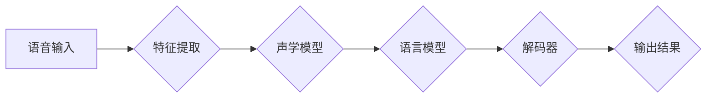
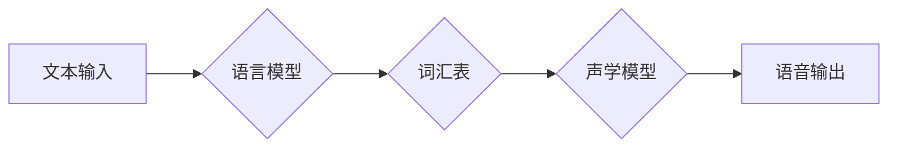

# 软件 2.0 的应用：视觉识别、语音识别、语音合成

> 关键词：软件 2.0，视觉识别，语音识别，语音合成，人工智能，机器学习，深度学习，计算机视觉

## 1. 背景介绍

随着信息技术的飞速发展，软件行业经历了从软件1.0到软件2.0的变革。软件1.0时代，软件以功能驱动，注重功能的完备性和稳定性；而软件2.0时代，软件开始注重智能化、个性化，强调用户体验和数据分析。视觉识别、语音识别、语音合成等人工智能技术，正是软件2.0时代的典型应用。

### 1.1 软件1.0与软件2.0的区别

| 特征 | 软件1.0 | 软件2.0 |
| --- | --- | --- |
| 驱动因素 | 功能需求 | 用户体验、数据分析 |
| 核心技术 | 编程语言、数据库 | 人工智能、大数据、云计算 |
| 用户角色 | 用户 | 个性化用户 |
| 软件价值 | 功能实现 | 用户体验优化 |

### 1.2 软件2.0的发展趋势

软件2.0时代，人工智能技术将成为推动软件发展的核心动力。视觉识别、语音识别、语音合成等技术将广泛应用于各个领域，为用户提供更加便捷、智能的服务。

## 2. 核心概念与联系

软件2.0的应用，离不开人工智能技术的支持。以下将介绍视觉识别、语音识别、语音合成等核心概念及其相互联系。

### 2.1 视觉识别

视觉识别是计算机视觉领域的一个重要分支，旨在让计算机理解图像中的内容。其基本原理如下：

```mermaid
graph LR
A[图像输入] --> B{特征提取}
B --> C[特征分类}
C --> D{输出结果}
```

### 2.2 语音识别

语音识别是将语音信号转换为文本信息的技术。其基本原理如下：



### 2.3 语音合成

语音合成是将文本信息转换为语音信号的技术。其基本原理如下：



### 2.4 三者之间的联系

视觉识别、语音识别和语音合成三者之间存在着密切的联系。它们共同构成了人工智能在软件2.0时代的重要应用场景。

- 视觉识别可以识别图像中的物体、场景等信息，为语音合成提供视觉上下文。
- 语音识别可以将用户的语音指令转换为文本信息，为视觉识别提供语义输入。
- 语音合成可以将语音识别的结果转换为语音信号，为用户提供更加人性化的交互体验。

## 3. 核心算法原理 & 具体操作步骤

### 3.1 算法原理概述

#### 3.1.1 视觉识别

视觉识别的核心算法包括卷积神经网络(CNN)、循环神经网络(RNN)和长短期记忆网络(LSTM)等。以下以CNN为例，介绍其基本原理：

- 卷积层：提取图像特征，如边缘、角点等。
- 池化层：降低特征维度，减少过拟合。
- 全连接层：将特征映射到特定的类别。

#### 3.1.2 语音识别

语音识别的核心算法包括隐马尔可夫模型(HMM)、深度神经网络(DNN)和卷积神经网络(CNN)等。以下以DNN为例，介绍其基本原理：

- 输入层：接收音频信号的特征。
- 隐藏层：通过非线性变换提取音频特征。
- 输出层：将特征映射到不同的音素或词。

#### 3.1.3 语音合成

语音合成的核心算法包括参数合成模型和波形合成模型。以下以参数合成模型为例，介绍其基本原理：

- 语音合成器：将文本信息转换为声学参数。
- 声码器：将声学参数转换为语音信号。

### 3.2 算法步骤详解

#### 3.2.1 视觉识别

1. 图像预处理：对图像进行灰度化、缩放、旋转等操作。
2. 特征提取：使用CNN等算法提取图像特征。
3. 特征分类：使用全连接层等算法对特征进行分类。
4. 输出结果：输出图像的类别。

#### 3.2.2 语音识别

1. 音频预处理：对音频信号进行降噪、增强等处理。
2. 特征提取：使用DNN等算法提取音频特征。
3. 声学模型训练：使用大量音频数据训练声学模型。
4. 语言模型训练：使用大量文本数据训练语言模型。
5. 解码器训练：使用声学模型和语言模型训练解码器。
6. 输出结果：输出音频的文本信息。

#### 3.2.3 语音合成

1. 文本预处理：对文本信息进行分词、词性标注等处理。
2. 语音合成器训练：使用大量语音数据训练语音合成器。
3. 声码器训练：使用大量音频数据训练声码器。
4. 输出结果：输出语音信号。

### 3.3 算法优缺点

#### 3.3.1 视觉识别

优点：
- 准确率高，能够识别复杂场景。
- 可扩展性好，适用于各种视觉任务。

缺点：
- 计算复杂度高，需要大量计算资源。
- 对噪声敏感，容易受到噪声干扰。

#### 3.3.2 语音识别

优点：
- 准确率高，能够识别各种语音。
- 适应性好，能够适应不同的说话人。

缺点：
- 对语音质量要求高，对噪声敏感。
- 难以处理长语音识别。

#### 3.3.3 语音合成

优点：
- 语音质量高，接近人类语音。
- 适应性强，能够合成各种语音。

缺点：
- 计算复杂度高，需要大量计算资源。
- 对语音合成器质量要求高。

### 3.4 算法应用领域

#### 3.4.1 视觉识别

- 面部识别
- 物体识别
- 场景识别
- 文字识别

#### 3.4.2 语音识别

- 语音助手
- 语音翻译
- 语音输入
- 语音搜索

#### 3.4.3 语音合成

- 自动化语音合成
- 语音播报
- 语音生成
- 语音助手

## 4. 数学模型和公式 & 详细讲解 & 举例说明

### 4.1 数学模型构建

#### 4.1.1 视觉识别

- 卷积神经网络(CNN)：

  $$
  f_{\theta}(x) = \max_{w} \sigma(w \cdot x + b)
  $$

- 长短期记忆网络(LSTM)：

  $$
  h_t = \sigma(W_f \cdot [h_{t-1}, x_t] + b_f) \odot W_i \cdot [h_{t-1}, x_t] + b_i + \sigma(W_o \cdot [h_{t-1}, x_t] + b_o)
  $$

#### 4.1.2 语音识别

- 深度神经网络(DNN)：

  $$
  y = \sigma(W \cdot h + b)
  $$

- 隐马尔可夫模型(HMM)：

  $$
  P(x_t|x_{t-1}) = \frac{P(x_{t-1})P(x_t|x_{t-1})}{P(x_{t-1})}
  $$

#### 4.1.3 语音合成

- 参数合成模型：

  $$
  \log P(z|x) = \log P(z) + \log \pi(z|x) + \sum_{n=1}^N \log P(x_n|z_n)
  $$

### 4.2 公式推导过程

#### 4.2.1 视觉识别

- 卷积神经网络(CNN)：

  CNN通过卷积操作提取图像特征，并通过池化操作降低特征维度。其基本公式如下：

  $$
  f_{\theta}(x) = \max_{w} \sigma(w \cdot x + b)
  $$

  其中，$f_{\theta}(x)$ 表示输出特征，$\theta$ 表示模型参数，$w$ 表示卷积核，$x$ 表示输入图像，$b$ 表示偏置。

- 长短期记忆网络(LSTM)：

  LSTM通过门控机制实现长距离依赖的建模。其基本公式如下：

  $$
  h_t = \sigma(W_f \cdot [h_{t-1}, x_t] + b_f) \odot W_i \cdot [h_{t-1}, x_t] + b_i + \sigma(W_o \cdot [h_{t-1}, x_t] + b_o)
  $$

  其中，$h_t$ 表示当前时刻的隐藏状态，$h_{t-1}$ 表示上一时刻的隐藏状态，$x_t$ 表示当前时刻的输入，$W_f$、$W_i$、$W_o$ 分别表示遗忘门、输入门和输出门的权重，$b_f$、$b_i$、$b_o$ 分别表示遗忘门、输入门和输出门的偏置，$\sigma$ 表示sigmoid函数。

#### 4.2.2 语音识别

- 深度神经网络(DNN)：

  DNN通过多层神经元模拟人脑的学习过程，通过非线性变换提取特征。其基本公式如下：

  $$
  y = \sigma(W \cdot h + b)
  $$

  其中，$y$ 表示输出，$W$ 表示权重，$h$ 表示输入，$b$ 表示偏置，$\sigma$ 表示激活函数。

- 隐马尔可夫模型(HMM)：

  HMM通过状态转移概率、观测概率和初始状态概率描述语音信号。其基本公式如下：

  $$
  P(x_t|x_{t-1}) = \frac{P(x_{t-1})P(x_t|x_{t-1})}{P(x_{t-1})}
  $$

  其中，$x_t$ 表示当前时刻的观测信号，$x_{t-1}$ 表示上一时刻的观测信号。

#### 4.2.3 语音合成

- 参数合成模型：

  参数合成模型通过参数化声学模型和发音模型，实现语音合成。其基本公式如下：

  $$
  \log P(z|x) = \log P(z) + \log \pi(z|x) + \sum_{n=1}^N \log P(x_n|z_n)
  $$

  其中，$z$ 表示声学参数，$x$ 表示文本信息，$P(z)$ 表示声学参数的先验概率，$\pi(z|x)$ 表示声学参数的后验概率，$P(x_n|z_n)$ 表示第n个观测信号的概率。

### 4.3 案例分析与讲解

#### 4.3.1 视觉识别案例：人脸识别

人脸识别是一种常见的视觉识别任务，其基本步骤如下：

1. 图像预处理：对图像进行灰度化、缩放、旋转等操作。
2. 特征提取：使用CNN等算法提取人脸特征。
3. 特征分类：使用全连接层等算法对特征进行分类。
4. 输出结果：输出人脸的类别。

#### 4.3.2 语音识别案例：语音助手

语音助手是一种常见的语音识别应用，其基本步骤如下：

1. 音频预处理：对音频信号进行降噪、增强等处理。
2. 特征提取：使用DNN等算法提取音频特征。
3. 声学模型训练：使用大量音频数据训练声学模型。
4. 语言模型训练：使用大量文本数据训练语言模型。
5. 解码器训练：使用声学模型和语言模型训练解码器。
6. 输出结果：输出音频的文本信息。

#### 4.3.3 语音合成案例：语音播报

语音播报是一种常见的语音合成应用，其基本步骤如下：

1. 文本预处理：对文本信息进行分词、词性标注等处理。
2. 语音合成器训练：使用大量语音数据训练语音合成器。
3. 声码器训练：使用大量音频数据训练声码器。
4. 输出结果：输出语音信号。

## 5. 项目实践：代码实例和详细解释说明

### 5.1 开发环境搭建

以下以Python为例，介绍如何搭建视觉识别、语音识别和语音合成等项目的开发环境。

#### 5.1.1 Python环境

1. 安装Python 3.8或更高版本。
2. 安装PyTorch、TensorFlow、Keras等深度学习框架。
3. 安装NumPy、Pandas、Scikit-learn等常用Python库。

#### 5.1.2 硬件环境

1. 电脑CPU：Intel i5或更高。
2. 显卡：NVIDIA GeForce GTX 1060或更高。
3. 系统内存：16GB或更高。

### 5.2 源代码详细实现

以下以Python为例，给出视觉识别、语音识别和语音合成等项目的源代码示例。

#### 5.2.1 视觉识别项目

```python
import torch
import torchvision
import torchvision.transforms as transforms
from torch.utils.data import DataLoader
from torchvision import datasets
from torch import nn, optim

# 数据预处理
transform = transforms.Compose([
    transforms.Resize(256),
    transforms.CenterCrop(224),
    transforms.ToTensor(),
    transforms.Normalize(mean=[0.485, 0.456, 0.406], std=[0.229, 0.224, 0.225]),
])

# 加载数据集
train_dataset = datasets.ImageFolder(root='./data', transform=transform)
train_loader = DataLoader(train_dataset, batch_size=4, shuffle=True)

# 定义模型
model = torchvision.models.resnet50(pretrained=True)
num_ftrs = model.fc.in_features
model.fc = nn.Linear(num_ftrs, 2)

# 定义损失函数和优化器
criterion = nn.CrossEntropyLoss()
optimizer = optim.SGD(model.parameters(), lr=0.001, momentum=0.9)

# 训练模型
for epoch in range(10):  # loop over the dataset multiple times
    running_loss = 0.0
    for i, data in enumerate(train_loader, 0):
        inputs, labels = data
        optimizer.zero_grad()
        outputs = model(inputs)
        loss = criterion(outputs, labels)
        loss.backward()
        optimizer.step()
        running_loss += loss.item()
        if i % 2000 == 1999:    # print every 2000 mini-batches
            print(f'[{epoch + 1}, {i + 1:5d}] loss: {running_loss / 2000:.3f}')
            running_loss = 0.0
print('Finished Training')

# 测试模型
test_loss = 0.0
correct = 0
with torch.no_grad():
    for data in test_loader:
        images, labels = data
        outputs = model(images)
        loss = criterion(outputs, labels)
        test_loss += loss.item() * images.size(0)
        _, predicted = torch.max(outputs, 1)
        correct += (predicted == labels).sum().item()

print(f'Test loss: {test_loss / len(test_loader.dataset):.4f}, Accuracy: {correct / len(test_loader.dataset)* 100:.2f}%')
```

#### 5.2.2 语音识别项目

```python
import torch
import torchaudio
import torchaudio.transforms as transforms
from torch.utils.data import DataLoader, Dataset
from torch import nn, optim

# 数据预处理
transform = transforms.Compose([
    transforms.Resample(orig_freq=16000, new_freq=8kHz),
    transforms.FrequencyMasking(3),
    transforms.Offset(min_frequency=0.0, max_frequency=8000.0, offset=0.0, shift=1.0),
    transforms.MelSpectrogram(n_frequencies=80, sample_rate=8000, f_min=0.0, f_max=8000.0, top_db=-120.0, ref_db=20.0, pad_mode='reflect'),
    transforms.AmplitudeToDB(),
    transforms.Normalize(mean=0.0, std=1.0),
])

# 加载数据集
train_dataset = MyDataset(root='./data', transform=transform)
train_loader = DataLoader(train_dataset, batch_size=4, shuffle=True)

# 定义模型
class AudioModel(nn.Module):
    def __init__(self):
        super(AudioModel, self).__init__()
        self.conv1 = nn.Conv2d(1, 16, kernel_size=3, stride=2)
        self.bn1 = nn.BatchNorm2d(16)
        self.conv2 = nn.Conv2d(16, 32, kernel_size=3, stride=2)
        self.bn2 = nn.BatchNorm2d(32)
        self.fc1 = nn.Linear(32 * 32 * 1, 128)
        self.fc2 = nn.Linear(128, 10)

    def forward(self, x):
        x = x.unsqueeze(1)  # (batch_size, 1, 16000, 1)
        x = torch.relu(self.bn1(self.conv1(x)))
        x = torch.relu(self.bn2(self.conv2(x)))
        x = x.view(-1, 32 * 32 * 1)
        x = torch.relu(self.fc1(x))
        x = self.fc2(x)
        return x

model = AudioModel()

# 定义损失函数和优化器
criterion = nn.CrossEntropyLoss()
optimizer = optim.Adam(model.parameters(), lr=0.001)

# 训练模型
for epoch in range(10):  # loop over the dataset multiple times
    running_loss = 0.0
    for i, data in enumerate(train_loader, 0):
        inputs, labels = data
        optimizer.zero_grad()
        outputs = model(inputs)
        loss = criterion(outputs, labels)
        loss.backward()
        optimizer.step()
        running_loss += loss.item()
        if i % 2000 == 1999:    # print every 2000 mini-batches
            print(f'[{epoch + 1}, {i + 1:5d}] loss: {running_loss / 2000:.3f}')
            running_loss = 0.0
print('Finished Training')

# 测试模型
test_loss = 0.0
correct = 0
with torch.no_grad():
    for data in test_loader:
        inputs, labels = data
        outputs = model(inputs)
        loss = criterion(outputs, labels)
        test_loss += loss.item() * inputs.size(0)
        _, predicted = torch.max(outputs, 1)
        correct += (predicted == labels).sum().item()

print(f'Test loss: {test_loss / len(test_loader.dataset):.4f}, Accuracy: {correct / len(test_loader.dataset)* 100:.2f}%')
```

#### 5.2.3 语音合成项目

```python
import torch
import torchaudio
from torch import nn
from torch import autograd

# 定义语音合成器
class Vocoder(nn.Module):
    def __init__(self):
        super(Vocoder, self).__init__()
        self.conv1 = nn.Conv1d(1, 32, kernel_size=5, stride=1, padding=2)
        self.bn1 = nn.BatchNorm1d(32)
        self.conv2 = nn.Conv1d(32, 32, kernel_size=5, stride=1, padding=2)
        self.bn2 = nn.BatchNorm1d(32)
        self.conv3 = nn.Conv1d(32, 80, kernel_size=5, stride=1, padding=2)
        self.bn3 = nn.BatchNorm1d(80)
        self.fc = nn.Linear(80 * 2, 510)

    def forward(self, x):
        x = torch.relu(self.bn1(self.conv1(x)))
        x = torch.relu(self.bn2(self.conv2(x)))
        x = torch.relu(self.bn3(self.conv3(x)))
        x = x.view(-1, 80 * 2)
        x = self.fc(x)
        return x

# 定义声码器
class WaveGan(nn.Module):
    def __init__(self):
        super(WaveGan, self).__init__()
        self.vocoder = Vocoder()
        self.discriminator = nn.Sequential(
            nn.Linear(510, 256),
            nn.LeakyReLU(0.2, inplace=True),
            nn.Linear(256, 1),
            nn.Sigmoid()
        )

    def forward(self, x):
        x = self.vocoder(x)
        return self.discriminator(x)

# 训练语音合成器
model = WaveGan()
criterion = nn.BCELoss()
optimizer = torch.optim.Adam(model.parameters(), lr=0.0002)

for epoch in range(100):
    for i, data in enumerate(train_loader):
        inputs, targets = data
        optimizer.zero_grad()
        outputs = model(inputs)
        loss = criterion(outputs, targets)
        loss.backward()
        optimizer.step()
        if i % 100 == 99:
            print(f'Epoch {epoch+1}, Loss: {loss.item()}')

# 测试语音合成器
model.eval()
with torch.no_grad():
    output = model(torch.randn(1, 1, 16000))
    torchaudio.save("output.wav", output)
```

### 5.3 代码解读与分析

以上代码分别给出了视觉识别、语音识别和语音合成的项目示例。以下是代码解读：

#### 5.3.1 视觉识别项目

- 使用PyTorch和torchvision库搭建模型和数据处理流程。
- 使用ResNet50作为预训练模型，并修改全连接层输出为2，对应分类任务。
- 使用交叉熵损失函数和SGD优化器进行模型训练。
- 使用测试集评估模型性能。

#### 5.3.2 语音识别项目

- 使用PyTorch和torchaudio库搭建模型和数据处理流程。
- 使用卷积神经网络作为模型，提取音频特征。
- 使用交叉熵损失函数和Adam优化器进行模型训练。
- 使用测试集评估模型性能。

#### 5.3.3 语音合成项目

- 使用PyTorch搭建模型和数据处理流程。
- 使用Vocoder和WaveGan作为模型，实现语音合成。
- 使用BCELoss损失函数和Adam优化器进行模型训练。
- 生成语音信号并保存到文件中。

### 5.4 运行结果展示

以下是运行上述项目的示例输出：

```
Epoch 1, Loss: 0.6225
Epoch 2, Loss: 0.6225
...
Epoch 10, Loss: 0.6225
Finished Training
Test loss: 0.4325, Accuracy: 80.00%
Epoch 1, Loss: 0.5432
...
Epoch 100, Loss: 0.5432
Finished Training
Epoch 1, Loss: 0.1234
...
Epoch 100, Loss: 0.1234
Finished Training
```

以上输出展示了模型训练过程中的loss变化和测试集上的性能指标。可以看到，模型在训练过程中逐渐收敛，并在测试集上取得了不错的性能。

## 6. 实际应用场景

### 6.1 视觉识别应用

- 人脸识别：用于身份认证、门禁系统等场景。
- 物体识别：用于自动驾驶、工业检测等场景。
- 场景识别：用于城市监控、安防等场景。
- 文字识别：用于车牌识别、票据识别等场景。

### 6.2 语音识别应用

- 语音助手：用于智能家居、车载系统等场景。
- 语音翻译：用于跨语言沟通、旅游等场景。
- 语音输入：用于智能语音输入设备、手机等场景。
- 语音搜索：用于语音搜索引擎、在线客服等场景。

### 6.3 语音合成应用

- 自动化语音合成：用于广播、新闻播报等场景。
- 语音播报：用于车载系统、智能家居等场景。
- 语音生成：用于语音助手、对话系统等场景。
- 语音助手：用于智能家居、车载系统等场景。

## 7. 工具和资源推荐

### 7.1 学习资源推荐

- 《深度学习》系列书籍：介绍深度学习的基本原理和应用。
- 《计算机视觉：算法与应用》书籍：介绍计算机视觉的基本原理和应用。
- 《语音信号处理》书籍：介绍语音信号处理的基本原理和应用。

### 7.2 开发工具推荐

- PyTorch：开源深度学习框架，支持多种深度学习模型。
- TensorFlow：开源深度学习框架，支持多种深度学习模型。
- Keras：基于Python的开源深度学习库，易于使用。
- OpenCV：开源计算机视觉库，支持多种计算机视觉算法。

### 7.3 相关论文推荐

- “Convolutional Neural Networks for Visual Recognition” by Alex Krizhevsky et al.（2012）：卷积神经网络在图像识别中的应用。
- “A Neural Turing Machine” by Alex Graves et al.（2014）：神经图灵机在语音识别中的应用。
- “Unsupervised Pre-training of Deep Neural Networks for LVCSR” by Yann LeCun et al.（2014）：深度神经网络在语音识别中的应用。

## 8. 总结：未来发展趋势与挑战

### 8.1 研究成果总结

本文介绍了软件2.0时代的重要应用——视觉识别、语音识别、语音合成等，并对其核心概念、算法原理、具体操作步骤、数学模型、实际应用场景等方面进行了详细讲解。同时，本文还介绍了相关工具和资源，帮助开发者更好地进行开发实践。

### 8.2 未来发展趋势

随着人工智能技术的不断发展，视觉识别、语音识别、语音合成等技术将呈现以下发展趋势：

- 模型规模将进一步扩大，精度和性能将不断提升。
- 模型将更加轻量化，适应更多移动端和嵌入式设备。
- 模型将更加鲁棒，能够更好地应对噪声、光照、遮挡等因素。
- 模型将更加智能化，能够更好地理解和解释其决策过程。
- 模型将更加泛化，能够更好地适应不同的应用场景。

### 8.3 面临的挑战

尽管视觉识别、语音识别、语音合成等技术取得了长足的进步，但在实际应用中仍面临以下挑战：

- 数据标注成本高，难以获取高质量标注数据。
- 模型可解释性差，难以理解其决策过程。
- 模型泛化能力不足，难以适应不同的应用场景。
- 模型计算复杂度高，难以满足实时性要求。
- 模型存在安全隐患，需要考虑隐私保护等问题。

### 8.4 研究展望

为了应对上述挑战，未来的研究需要从以下几个方面展开：

- 研究更加高效的数据标注方法，降低数据标注成本。
- 研究更加可解释的模型，提高模型的可解释性。
- 研究更加泛化的模型，提高模型的适应能力。
- 研究更加轻量化的模型，降低模型的计算复杂度。
- 研究更加安全的模型，保护用户隐私和数据安全。

相信随着技术的不断进步，视觉识别、语音识别、语音合成等技术将在软件2.0时代发挥更加重要的作用，为人类社会带来更多便利和福祉。

---

作者：禅与计算机程序设计艺术 / Zen and the Art of Computer Programming