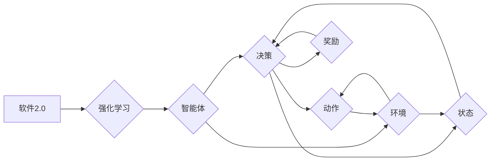

# 软件2.0遇上强化学习，智能体大显身手

> 关键词：软件2.0，强化学习，智能体，机器学习，自动化，优化，决策，人机协同

## 1. 背景介绍

随着信息技术的飞速发展，软件行业经历了从单体应用向服务化、平台化转型的过程，如今，软件2.0时代已经到来。软件2.0强调软件作为服务的理念，以用户为中心，通过互联网将软件功能模块化、服务化，实现软件的快速迭代和个性化定制。在这样的背景下，强化学习作为一种先进的机器学习方法，为软件的智能化和自动化提供了新的技术路径。

### 1.1 软件2.0的兴起

软件2.0时代，软件不再是一个静态的、孤立的系统，而是以服务的形式存在于互联网上，可以随时随地为用户提供个性化、定制化的服务。这种变化主要体现在以下几个方面：

- **服务化**：软件功能模块化，以服务的形式提供，用户可以根据需求选择不同的服务组合。
- **快速迭代**：软件通过敏捷开发、DevOps等理念，实现快速迭代和部署，满足用户不断变化的需求。
- **个性化**：通过大数据和机器学习技术，软件可以更好地了解用户行为，提供个性化的服务体验。

### 1.2 强化学习的兴起

强化学习（Reinforcement Learning，RL）是机器学习的一个分支，它通过智能体（Agent）在与环境的交互中学习最优策略，以实现目标最大化。强化学习在游戏、机器人、自动驾驶等领域取得了显著成果，为软件的智能化和自动化提供了新的思路。

## 2. 核心概念与联系

### 2.1 核心概念原理和架构的 Mermaid 流程图



### 2.2 核心概念解析

- **软件2.0**：以服务为中心，强调软件的模块化、服务化和快速迭代。
- **强化学习**：通过智能体与环境交互学习最优策略，以实现目标最大化。
- **智能体**：执行任务的实体，可以是软件、机器人或虚拟角色。
- **决策**：智能体根据当前状态选择动作的过程。
- **环境**：智能体执行动作的场所，可以是现实世界或模拟环境。
- **状态**：智能体在环境中的位置或当前的状态信息。
- **动作**：智能体可以执行的操作。
- **奖励**：智能体执行动作后获得的奖励信号，用于指导智能体学习最优策略。

## 3. 核心算法原理 & 具体操作步骤

### 3.1 算法原理概述

强化学习的基本原理是智能体通过与环境交互，不断学习最优策略。智能体在环境中执行动作，根据动作得到状态和奖励，并通过策略优化算法更新策略参数。

### 3.2 算法步骤详解

1. **初始化**：初始化智能体、环境、策略参数等。
2. **观察状态**：智能体观察环境中的状态。
3. **选择动作**：智能体根据当前状态和策略选择动作。
4. **执行动作**：智能体在环境中执行动作。
5. **获得奖励**：智能体根据动作获得奖励。
6. **更新策略**：根据奖励信号更新策略参数。
7. **重复步骤2-6**：重复执行以上步骤，直到达到目标状态或满足其他终止条件。

### 3.3 算法优缺点

**优点**：

- **自适应性强**：智能体可以根据环境的变化动态调整策略。
- **泛化能力强**：智能体可以在不同环境中学习到通用的策略。
- **无需标注数据**：与监督学习相比，强化学习不需要大量的标注数据。

**缺点**：

- **收敛速度慢**：强化学习需要大量的样本和计算资源。
- **策略难以解释**：强化学习的策略通常难以解释。
- **探索与利用的权衡**：在强化学习中，探索新策略和利用已知策略之间存在权衡。

### 3.4 算法应用领域

强化学习在软件领域有着广泛的应用，例如：

- **自动化测试**：智能体可以自动执行测试用例，并学习到最优的测试策略。
- **性能优化**：智能体可以自动调整系统参数，以实现性能优化。
- **异常检测**：智能体可以检测系统中的异常行为，并及时采取措施。
- **推荐系统**：智能体可以学习用户的兴趣，并推荐个性化的内容。

## 4. 数学模型和公式 & 详细讲解 & 举例说明

### 4.1 数学模型构建

强化学习的数学模型主要包括：

- **状态空间**：表示智能体可能处于的所有状态。
- **动作空间**：表示智能体可能执行的所有动作。
- **策略**：定义了智能体在给定状态下的动作选择。
- **价值函数**：表示智能体在某个状态下的期望回报。
- **策略梯度**：用于更新策略参数。

### 4.2 公式推导过程

强化学习中的价值函数可以用以下公式表示：

$$
V(s) = \sum_{a \in A} \gamma^{|s'|s|} R(s,a,s')
$$

其中，$s$ 表示当前状态，$a$ 表示当前动作，$s'$ 表示执行动作 $a$ 后的状态，$R(s,a,s')$ 表示执行动作 $a$ 后获得的奖励，$\gamma$ 表示折扣因子。

### 4.3 案例分析与讲解

以下是一个简单的强化学习案例：一个智能体在一个游戏中学习玩俄罗斯方块，目标是使游戏得分最大化。

- **状态空间**：当前游戏板的状态。
- **动作空间**：移动、旋转、放置方块等操作。
- **策略**：根据当前游戏板状态选择最优动作。
- **价值函数**：表示在当前游戏板状态下获得的最大得分。
- **奖励**：放置方块、消除行、游戏失败等。

通过强化学习，智能体可以学习到最优策略，实现游戏得分的最大化。

## 5. 项目实践：代码实例和详细解释说明

### 5.1 开发环境搭建

为了进行强化学习实践，我们需要搭建以下开发环境：

- Python 3.6+
- TensorFlow或PyTorch
- Gym环境库

### 5.2 源代码详细实现

以下是一个使用PyTorch实现的简单强化学习案例：

```python
import gym
import torch
import torch.nn as nn
import torch.optim as optim

# 定义环境
env = gym.make("CartPole-v1")

# 定义网络
class PolicyNet(nn.Module):
    def __init__(self):
        super(PolicyNet, self).__init__()
        self.fc1 = nn.Linear(4, 128)
        self.fc2 = nn.Linear(128, 2)

    def forward(self, x):
        x = torch.relu(self.fc1(x))
        x = self.fc2(x)
        return x

# 定义策略
def select_action(state, policy_net, epsilon=0.01):
    if torch.rand(1) < epsilon:
        action = env.action_space.sample()
    else:
        state = torch.from_numpy(state).float().unsqueeze(0)
        with torch.no_grad():
            action = policy_net(state).argmax()
    return action

# 训练
def train(policy_net, target_net, optimizer, device, episodes=1000):
    for episode in range(episodes):
        state = env.reset()
        done = False
        while not done:
            action = select_action(state, policy_net)
            next_state, reward, done, _ = env.step(action)
            target = reward + 0.99 * target_net(next_state).max()
            state = torch.from_numpy(state).float().unsqueeze(0)
            policy_loss = nn.MSELoss()(policy_net(state), target)
            optimizer.zero_grad()
            policy_loss.backward()
            optimizer.step()
            state = next_state

# 主函数
def main():
    device = torch.device("cuda" if torch.cuda.is_available() else "cpu")
    policy_net = PolicyNet().to(device)
    target_net = PolicyNet().to(device)
    target_net.load_state_dict(policy_net.state_dict())
    target_net.eval()
    optimizer = optim.Adam(policy_net.parameters(), lr=0.001)

    train(policy_net, target_net, optimizer, device)

if __name__ == "__main__":
    main()
```

### 5.3 代码解读与分析

以上代码定义了一个简单的强化学习环境，使用PyTorch实现了策略网络和目标网络，并通过梯度下降算法进行训练。代码主要分为以下几个部分：

1. **导入库**：导入必要的库，包括gym、torch、torch.nn和torch.optim。
2. **定义环境**：使用gym库定义CartPole-v1环境。
3. **定义网络**：定义策略网络，该网络由两个全连接层组成，用于预测动作概率。
4. **定义策略**：定义选择动作的策略，根据当前状态和策略选择动作。
5. **训练**：使用策略网络和目标网络进行训练，训练过程中使用梯度下降算法更新策略参数。
6. **主函数**：定义主函数，设置设备、网络、优化器等，并启动训练过程。

通过以上代码，我们可以看到强化学习的实现过程，以及PyTorch在强化学习中的应用。

### 5.4 运行结果展示

运行上述代码，可以在终端中看到训练过程和最终得分。通过训练，策略网络可以学习到最优策略，使得智能体能够在CartPole-v1环境中稳定地玩转游戏。

## 6. 实际应用场景

强化学习在软件领域的实际应用场景非常广泛，以下列举一些例子：

- **自动化测试**：智能体可以自动执行测试用例，并学习到最优的测试策略，提高测试效率和覆盖率。
- **性能优化**：智能体可以自动调整系统参数，如缓存大小、并发度等，以实现性能优化。
- **异常检测**：智能体可以检测系统中的异常行为，并及时采取措施，如报警、恢复等。
- **推荐系统**：智能体可以学习用户的兴趣，并推荐个性化的内容，提高用户体验。
- **人机协同**：智能体可以作为辅助工具，帮助人类完成复杂任务，提高工作效率。

## 7. 工具和资源推荐

### 7.1 学习资源推荐

- 《Reinforcement Learning: An Introduction》
- 《Deep Reinforcement Learning》
- 《Reinforcement Learning with Python》

### 7.2 开发工具推荐

- Gym环境库
- OpenAI Gym
- TensorFlow
- PyTorch

### 7.3 相关论文推荐

- "Deep Reinforcement Learning" by David Silver et al.
- "Human-level control through deep reinforcement learning" by DeepMind
- "Asynchronous Advantage Actor-Critic" by John Schulman et al.

## 8. 总结：未来发展趋势与挑战

### 8.1 研究成果总结

本文介绍了软件2.0时代和强化学习的兴起，探讨了强化学习在软件领域的应用，并给出了一个简单的强化学习案例。通过分析，我们可以看到强化学习在软件领域的巨大潜力。

### 8.2 未来发展趋势

未来，强化学习在软件领域的应用将呈现以下趋势：

- **多智能体强化学习**：多智能体强化学习可以解决复杂任务，提高系统的协同能力。
- **强化学习与深度学习的融合**：将强化学习与深度学习相结合，可以更好地学习复杂的环境和动作。
- **强化学习在云计算、物联网等领域的应用**：强化学习可以应用于云计算、物联网等领域，实现智能化的资源调度和管理。

### 8.3 面临的挑战

尽管强化学习在软件领域具有巨大的潜力，但同时也面临着一些挑战：

- **计算资源消耗**：强化学习需要大量的计算资源，这对于资源受限的环境来说是一个挑战。
- **数据获取**：强化学习需要大量的数据来训练模型，数据获取可能存在困难。
- **模型可解释性**：强化学习模型的决策过程通常难以解释，这可能会影响模型的信任度。

### 8.4 研究展望

为了解决上述挑战，未来的研究需要关注以下几个方面：

- **高效算法**：开发更加高效的强化学习算法，减少计算资源消耗。
- **数据高效方法**：开发数据高效的方法，降低数据获取成本。
- **可解释性方法**：开发可解释的强化学习模型，提高模型的信任度。

通过不断的研究和探索，相信强化学习将在软件领域发挥越来越重要的作用，推动软件的智能化和自动化发展。

## 9. 附录：常见问题与解答

**Q1：强化学习与监督学习的区别是什么？**

A：强化学习与监督学习的区别主要体现在数据获取、目标函数和学习方式上。强化学习不需要标注数据，通过智能体与环境交互学习最优策略；而监督学习需要大量的标注数据，通过学习输入和输出之间的映射关系。

**Q2：强化学习在软件领域的应用前景如何？**

A：强化学习在软件领域的应用前景非常广阔，可以应用于自动化测试、性能优化、异常检测、推荐系统、人机协同等领域，提高软件的智能化和自动化水平。

**Q3：如何解决强化学习中的探索与利用的权衡问题？**

A：解决探索与利用的权衡问题，可以通过以下方法：
- 使用ε-greedy策略，在探索和利用之间进行平衡。
- 使用UCB算法，优先选择具有高期望奖励的动作。
- 使用多智能体强化学习，通过多个智能体协同学习，提高探索和利用的效率。

**Q4：如何提高强化学习模型的可解释性？**

A：提高强化学习模型的可解释性，可以通过以下方法：
- 使用可解释的强化学习算法，如基于模型的强化学习。
- 使用注意力机制，分析模型在决策过程中的关注点。
- 使用可视化技术，展示模型的决策过程。

**Q5：强化学习在软件领域的实际应用案例有哪些？**

A：强化学习在软件领域的实际应用案例包括：
- 自动化测试：使用强化学习自动执行测试用例，并学习到最优的测试策略。
- 性能优化：使用强化学习自动调整系统参数，如缓存大小、并发度等，以实现性能优化。
- 异常检测：使用强化学习检测系统中的异常行为，并及时采取措施，如报警、恢复等。
- 推荐系统：使用强化学习学习用户的兴趣，并推荐个性化的内容，提高用户体验。
- 人机协同：使用强化学习作为辅助工具，帮助人类完成复杂任务，提高工作效率。

作者：禅与计算机程序设计艺术 / Zen and the Art of Computer Programming