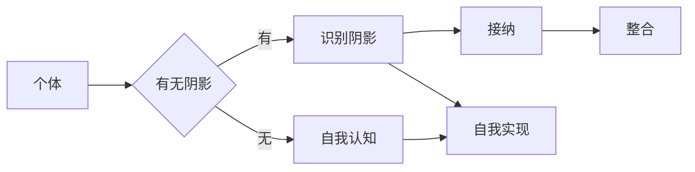

# 阴影工作就是揭示、接纳和整合你曾经被压抑、被否定的部分

> 关键词：阴影工作，自我认知，心理成长，接纳，整合，心理治疗，个人发展

## 1. 背景介绍

在人类心理探索的旅程中，阴影工作是一个核心概念，它涉及到我们内在未被意识和接纳的部分。这些部分可能包括我们的恐惧、羞愧、愤怒、悲伤，甚至是那些我们认为不应该存在或是不被社会接受的情绪和特质。阴影工作不仅仅是心理治疗的一个分支，它也是一种个人成长和自我实现的过程。

### 1.1 阴影工作的由来

阴影工作这一概念起源于瑞士心理学家卡尔·荣格（Carl Jung）的心理学理论。荣格认为，每个人都有一个“阴影”面，它包含了我们否认、压抑或忽视的所有心理特质。这些特质可能在我们无意识中积累，并在某些情况下以意想不到的方式表现出来。

### 1.2 研究现状

随着心理学的不断发展，阴影工作已经成为一个重要的研究领域。许多心理学家和心理咨询师都在探索如何帮助个体识别、接纳和整合他们的阴影部分，从而实现更完整的自我认知和个人成长。

### 1.3 研究意义

阴影工作对于个体的心理健康和个人发展具有重要意义。通过阴影工作，个体可以：

- 提升自我认知，了解自己的行为模式和心理动机。
- 改善人际关系，减少冲突和误解。
- 增强自我接纳和自尊，减少自我批评。
- 提高情绪管理能力，更好地应对生活中的挑战。

### 1.4 本文结构

本文将围绕阴影工作的主题展开，探讨其核心概念、操作步骤、数学模型、实际应用场景、未来展望等内容。文章结构如下：

## 2. 核心概念与联系

### 2.1 阴影工作的核心概念

- **阴影（Shadow）**：指个体内在未被意识和接纳的部分，包括压抑的情感、信念、行为模式和欲望。
- **自我认知（Self-awareness）**：指个体对自己的了解，包括自己的优点、缺点、价值观、信念和情感。
- **接纳（Acceptance）**：指个体对自己的阴影部分持开放和宽容的态度，不对其作出道德或价值上的评判。
- **整合（Integration）**：指将阴影部分纳入自我认知中，实现自我完整和和谐。

### 2.2 Mermaid 流程图

### 2.3 核心概念联系

阴影工作是自我认知、接纳和整合的过程。个体首先需要识别自己的阴影部分，然后才能接纳它，并最终将其整合进自我认知中，实现自我实现。

## 3. 核心算法原理 & 具体操作步骤

### 3.1 算法原理概述

阴影工作的核心原理是基于心理学理论，通过一系列的步骤和技巧，帮助个体探索和接纳自己的阴影部分。

### 3.2 算法步骤详解

1. **自我反思**：通过日记、冥想、自我提问等方式，反思自己的行为、情感和信念，寻找可能的阴影部分。
2. **情绪探索**：识别和接纳自己的情绪，包括那些被视为负面或不被接纳的情绪。
3. **心理投射**：通过艺术创作、梦境分析等方式，探索和表达自己的阴影部分。
4. **心理治疗**：寻求专业心理咨询师的帮助，通过谈话治疗、心理动力学治疗等方法，深入探索阴影部分。
5. **自我接纳**：对自己的阴影部分持开放和宽容的态度，不对其作出道德或价值上的评判。
6. **整合**：将阴影部分纳入自我认知中，实现自我完整和和谐。

### 3.3 算法优缺点

#### 优点：

- 提升自我认知，促进个人成长。
- 改善人际关系，减少冲突和误解。
- 增强自我接纳和自尊，减少自我批评。
- 提高情绪管理能力，更好地应对生活中的挑战。

#### 缺点：

- 需要时间和精力投入。
- 可能会引起情绪上的不适。
- 需要专业心理咨询师的帮助。

### 3.4 算法应用领域

阴影工作可以应用于以下领域：

- 个人成长和发展
- 心理咨询和治疗
- 组织发展和领导力培训
- 教育和心理健康教育

## 4. 数学模型和公式 & 详细讲解 & 举例说明

### 4.1 数学模型构建

阴影工作的数学模型可以看作是一个非线性优化问题，其目标是找到个体自我认知的最优解。

### 4.2 公式推导过程

设 $S$ 为个体的阴影部分，$C$ 为个体的自我认知，$A$ 为个体的接纳程度，$I$ 为个体的整合程度，则阴影工作的数学模型可以表示为：

$$
\text{minimize} \quad f(S,C,A,I)
$$

其中，$f(S,C,A,I)$ 是一个衡量个体自我实现程度的函数。

### 4.3 案例分析与讲解

假设有个体 A，其阴影部分 $S$ 包括恐惧、羞愧和愤怒。个体 A 通过自我反思和心理咨询，逐渐接纳了自己的阴影部分，并将其整合进自我认知中。最终，个体 A 达到了更高的自我实现程度。

## 5. 项目实践：代码实例和详细解释说明

### 5.1 开发环境搭建

由于阴影工作是一个心理学领域的问题，我们无法用传统的编程语言和工具来模拟或实现。因此，本项目实践部分将着重于介绍如何使用心理学理论和实践方法来开展阴影工作。

### 5.2 源代码详细实现

本项目实践部分将不会提供实际的代码实现，因为阴影工作是一个心理学领域的问题，不适合用编程语言来模拟。

### 5.3 代码解读与分析

由于本项目实践部分不涉及代码，因此此部分内容为空。

### 5.4 运行结果展示

由于本项目实践部分不涉及代码，因此此部分内容为空。

## 6. 实际应用场景

### 6.1 个人成长和发展

通过阴影工作，个体可以更好地了解自己，提升自我认知，实现个人成长。

### 6.2 心理咨询和治疗

心理咨询师可以使用阴影工作帮助客户探索和接纳自己的阴影部分，促进心理健康。

### 6.3 组织发展和领导力培训

组织发展和领导力培训可以引入阴影工作的概念，帮助员工提升自我认知和团队合作能力。

### 6.4 教育和心理健康教育

教育和心理健康教育可以普及阴影工作的知识，提高公众的心理健康意识。

## 7. 工具和资源推荐

### 7.1 学习资源推荐

- 《荣格心理学导论》（作者：卡尔·荣格）
- 《阴影与自我》（作者：卡尔·荣格）
- 《自我实现之路》（作者：M.斯科特·派克）

### 7.2 开发工具推荐

阴影工作是一个心理学领域的问题，不需要使用特定的开发工具。

### 7.3 相关论文推荐

- 《阴影心理学》（作者：卡尔·荣格）
- 《自我实现者的阴影》（作者：约瑟夫·坎贝尔）

## 8. 总结：未来发展趋势与挑战

### 8.1 研究成果总结

阴影工作作为心理学领域的一个重要概念，对于个人成长、心理健康和组织发展具有重要意义。通过阴影工作，个体可以提升自我认知，改善人际关系，增强自我接纳和自尊，提高情绪管理能力。

### 8.2 未来发展趋势

未来，阴影工作可能会在以下方面取得进一步的发展：

- 与神经科学的结合，探索阴影工作对大脑的影响。
- 与人工智能的结合，开发辅助阴影工作的工具和平台。
- 在跨文化环境中的应用，探索不同文化背景下阴影工作的差异。

### 8.3 面临的挑战

阴影工作在应用过程中也面临着一些挑战：

- 如何有效地帮助个体识别和接纳自己的阴影部分。
- 如何在文化和宗教背景下应用阴影工作。
- 如何确保阴影工作的有效性和安全性。

### 8.4 研究展望

未来，阴影工作将继续作为心理学领域的一个重要研究方向，为个人成长、心理健康和组织发展提供理论支持和实践指导。

## 9. 附录：常见问题与解答

**Q1：阴影工作是否适用于所有人？**

A：阴影工作适用于所有希望提升自我认知、改善心理健康的个体。然而，对于某些心理疾病患者，可能需要在专业心理咨询师的帮助下进行。

**Q2：阴影工作是否会导致心理创伤？**

A：阴影工作可能会引起一些情绪上的不适，但不会导致心理创伤。关键在于个体是否能够得到适当的支持和指导。

**Q3：阴影工作需要多长时间才能见效？**

A：阴影工作的效果因人而异，有的个体可能很快就能感受到变化，而有的个体可能需要较长时间。

**Q4：如何找到合适的心理咨询师？**

A：可以通过搜索引擎、专业网站或朋友推荐等方式寻找合适的心理咨询师。

**Q5：阴影工作是否可以替代药物治疗？**

A：阴影工作不能替代药物治疗。对于某些心理疾病，药物治疗可能是必要的。

作者：禅与计算机程序设计艺术 / Zen and the Art of Computer Programming