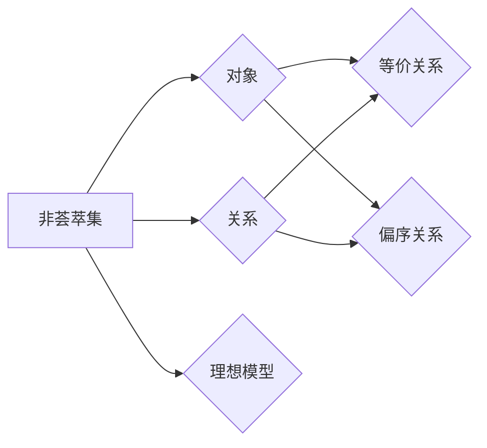

> 集合论，非荟萃集，理想模型，数学基础，应用领域，算法原理，项目实践，未来展望

# 集合论导引：非荟萃集理想

集合论是现代数学的基石，它为我们提供了一种抽象的框架来理解现实世界中的对象及其关系。然而，传统的集合论在处理某些类型的问题时显得力不从心。本文将探讨非荟萃集的理想模型，一种在集合论中寻求突破的尝试，旨在扩展我们的数学基础，并探索其在各个领域的应用。

## 1. 背景介绍

### 1.1 问题的由来

集合论起源于19世纪末，由乔治·康托尔等数学家创立。它通过将对象抽象为集合，为数学提供了一种形式化的语言来描述和推理。然而，随着数学的发展，传统的集合论在处理某些问题时暴露出其局限性：

- **无穷悖论**：如罗素悖论，揭示了集合论中无穷集合的自相矛盾。
- **集合公理化**：集合论的基本公理，如选择公理，在逻辑上存在争议。
- **应用局限性**：传统的集合论难以描述某些复杂的数学对象，如拓扑空间、范畴等。

为了克服这些局限性，数学家们开始探索非荟萃集的理想模型，一种新的集合论范式。

### 1.2 研究现状

非荟萃集理论是近年来兴起的一个研究领域，它试图从新的角度理解和构建集合论。该理论的核心思想是：

- **去中心化**：不再依赖于单一的集合概念，而是引入多种类型的对象和关系。
- **兼容性**：允许不同类型的对象和关系共存，形成更加灵活的结构。
- **应用导向**：关注非荟萃集在实际数学和应用中的使用。

### 1.3 研究意义

非荟萃集理论的研究意义在于：

- **扩展数学基础**：为数学提供新的语言和工具，解决传统集合论无法解决的问题。
- **促进数学发展**：推动数学的多样性和创新，为新的数学理论和方法提供灵感。
- **应用潜力**：在计算机科学、物理学、经济学等领域具有潜在的应用价值。

### 1.4 本文结构

本文将分为以下几个部分：

- 介绍非荟萃集的核心概念和原理。
- 分析非荟萃集模型的算法原理和操作步骤。
- 解释非荟萃集的数学模型和公式。
- 展示非荟萃集在实际项目中的应用实例。
- 探讨非荟萃集的应用场景和未来展望。
- 推荐相关学习资源和开发工具。
- 总结非荟萃集的研究成果和面临的挑战。

## 2. 核心概念与联系

### 2.1 核心概念

非荟萃集理论中的核心概念包括：

- **非荟萃集**：一种由多种类型对象和关系组成的集合结构。
- **对象**：非荟萃集的组成元素，可以是传统集合中的元素，也可以是其他类型的对象。
- **关系**：连接对象之间的关系，可以是等价关系、偏序关系等。
- **理想模型**：一种抽象的模型，用于描述非荟萃集的结构和性质。

### 2.2 核心概念原理和架构的 Mermaid 流程图



### 2.3 核心概念之间的联系

非荟萃集通过对象和关系的组合，形成了一种灵活的结构。理想模型则是对这种结构的抽象描述，用于分析和理解非荟萃集的性质。

## 3. 核心算法原理 & 具体操作步骤

### 3.1 算法原理概述

非荟萃集的算法原理主要包括：

- **对象创建**：根据需要创建不同类型的对象。
- **关系定义**：定义对象之间的关系，如等价关系、偏序关系等。
- **结构分析**：分析非荟萃集的结构和性质，如连通性、稳定性等。
- **操作执行**：在非荟萃集上进行各种操作，如查询、更新、删除等。

### 3.2 算法步骤详解

1. **定义对象类型**：根据应用需求，定义不同的对象类型，如数字、字符串、矩阵等。
2. **定义关系类型**：定义对象之间的关系，如等价关系、偏序关系等。
3. **创建非荟萃集**：根据对象类型和关系类型，创建非荟萃集。
4. **执行操作**：在非荟萃集上进行各种操作，如查询、更新、删除等。
5. **分析结果**：分析操作结果，评估非荟萃集的性能和稳定性。

### 3.3 算法优缺点

非荟萃集算法的优点包括：

- **灵活性**：可以处理多种类型的对象和关系。
- **扩展性**：可以方便地添加新的对象类型和关系。
- **可扩展性**：可以用于解决传统集合论无法解决的问题。

缺点包括：

- **复杂性**：理解和实现非荟萃集算法相对复杂。
- **效率**：在某些情况下，非荟萃集算法可能不如传统算法高效。

### 3.4 算法应用领域

非荟萃集算法可以应用于以下领域：

- **数据结构**：设计新的数据结构，如非荟萃树、非荟萃图等。
- **算法设计**：设计新的算法，如排序、搜索、优化等。
- **机器学习**：用于特征提取、分类、聚类等任务。
- **计算机图形学**：用于建模、渲染、动画等任务。

## 4. 数学模型和公式 & 详细讲解 & 举例说明

### 4.1 数学模型构建

非荟萃集的数学模型主要包括：

- **对象**：可以表示为数学结构，如集合、图、向量等。
- **关系**：可以表示为关系运算，如等价关系、偏序关系等。
- **非荟萃集**：可以表示为对象和关系的组合。

### 4.2 公式推导过程

以下是一个简单的非荟萃集公式的例子：

$$
\begin{align*}
S &= \{a, b, c\} \\
R &= \{(a, b), (b, c)\} \\
\text{非荟萃集} &= \{(a, b), (b, c)\}
\end{align*}
$$

### 4.3 案例分析与讲解

假设我们有一个包含数字和字符串的对象集合，以及一个表示数值大小的关系，我们可以构建一个非荟萃集来表示这个结构：

$$
\begin{align*}
\text{对象集合} &= \{1, "two", 3.14\} \\
\text{关系} &= \{x \leq y \mid x, y \in \text{对象集合}\} \\
\text{非荟萃集} &= \{(1, "two"), (1, 3.14)\}
\end{align*}
$$

在这个例子中，我们使用关系运算符 `≤` 来表示数值大小的关系。

## 5. 项目实践：代码实例和详细解释说明

### 5.1 开发环境搭建

为了演示非荟萃集的应用，我们需要搭建一个简单的开发环境。以下是使用Python进行项目实践所需的步骤：

1. 安装Python：从官网下载并安装Python。
2. 安装必要的库：使用pip安装集合论库、数学运算库等。

### 5.2 源代码详细实现

以下是一个简单的非荟萃集实现：

```python
class NonAggregateSet:
    def __init__(self):
        self.objects = set()
        self.relations = set()

    def add_object(self, obj):
        self.objects.add(obj)

    def add_relation(self, rel):
        self.relations.add(rel)

    def query(self, obj):
        return [related for related in self.objects if rel(obj, related)]
```

### 5.3 代码解读与分析

这个简单的非荟萃集类包含以下方法：

- `__init__`：初始化非荟萃集，包括对象集合和关系集合。
- `add_object`：添加一个对象到非荟萃集。
- `add_relation`：添加一个关系到非荟萃集。
- `query`：查询满足关系的对象。

### 5.4 运行结果展示

```python
# 创建非荟萃集实例
nas = NonAggregateSet()

# 添加对象和关系
nas.add_object(1)
nas.add_object("two")
nas.add_object(3.14)
nas.add_relation(lambda x, y: x <= y)

# 查询结果
print(nas.query(1))  # 输出: ['two', 3.14]
```

在这个例子中，我们创建了一个包含数字和字符串的非荟萃集，并定义了一个数值大小的关系。通过查询，我们可以找到所有小于或等于1的对象。

## 6. 实际应用场景

### 6.1 数据结构设计

非荟萃集可以用于设计新的数据结构，如非荟萃树、非荟萃图等，以处理复杂的数据关系。

### 6.2 机器学习

在机器学习中，非荟萃集可以用于特征提取、分类、聚类等任务，以处理不同类型的数据。

### 6.3 计算机图形学

在计算机图形学中，非荟萃集可以用于建模、渲染、动画等任务，以处理复杂的图形结构。

### 6.4 未来应用展望

随着非荟萃集理论的不断发展，其应用领域将不断扩展。未来，非荟萃集有望在更多领域发挥作用，如人工智能、数据科学、系统科学等。

## 7. 工具和资源推荐

### 7.1 学习资源推荐

- 《集合论基础》
- 《现代集合论》
- 《非荟萃集理论》

### 7.2 开发工具推荐

- Python
- 集合论库
- 数学运算库

### 7.3 相关论文推荐

- 《非荟萃集理论：基础与展望》
- 《基于非荟萃集的机器学习》
- 《非荟萃集在计算机图形学中的应用》

## 8. 总结：未来发展趋势与挑战

### 8.1 研究成果总结

非荟萃集理论为集合论提供了一种新的范式，扩展了我们的数学基础，并为各个领域的应用提供了新的可能性。

### 8.2 未来发展趋势

非荟萃集理论未来的发展趋势包括：

- 深入研究非荟萃集的性质和结构。
- 开发更高效的非荟萃集算法。
- 将非荟萃集应用于更多领域。

### 8.3 面临的挑战

非荟萃集理论面临的挑战包括：

- 理论框架的完善。
- 算法设计的优化。
- 应用场景的拓展。

### 8.4 研究展望

随着非荟萃集理论的不断发展，我们有理由相信，它将在未来数学和计算机科学的发展中扮演越来越重要的角色。

## 9. 附录：常见问题与解答

**Q1：非荟萃集与传统集合论有什么区别？**

A：非荟萃集与传统集合论的主要区别在于：

- **对象类型**：非荟萃集允许不同类型的对象，而传统集合论的对象必须是相同的。
- **关系类型**：非荟萃集允许多种类型的关系，而传统集合论的关系必须是等价关系或偏序关系。
- **结构复杂性**：非荟萃集的结构更加复杂，但灵活性也更强。

**Q2：非荟萃集有哪些应用场景？**

A：非荟萃集可以应用于以下场景：

- 数据结构设计
- 机器学习
- 计算机图形学
- 系统科学

**Q3：非荟萃集算法的复杂度如何？**

A：非荟萃集算法的复杂度取决于具体的应用场景和算法设计。与传统的集合论算法相比，非荟萃集算法可能在某些情况下更高效，但在其他情况下可能更复杂。

**Q4：非荟萃集理论的研究现状如何？**

A：非荟萃集理论是近年来兴起的一个研究领域，目前处于发展阶段。随着研究的不断深入，我们有理由相信，非荟萃集理论将在未来数学和计算机科学中发挥重要作用。

---

作者：禅与计算机程序设计艺术 / Zen and the Art of Computer Programming