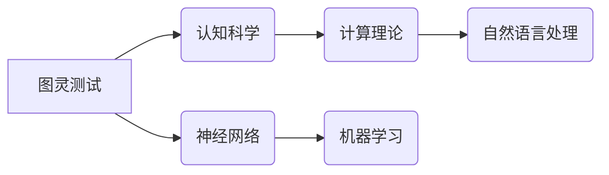

# 麦卡锡与明斯基的学术贡献

> 关键词：约翰·麦卡锡，马克思·明斯基，人工智能，图灵测试，认知科学，计算理论，神经网络

## 1. 背景介绍

在20世纪，两位杰出的科学家约翰·麦卡锡（John McCarthy）和马克思·明斯基（Marvin Minsky）对人工智能（AI）领域的发展产生了深远的影响。他们的学术贡献不仅推动了AI科学的理论基础，还促进了其应用和技术的进步。本文将深入探讨麦卡锡与明斯基的学术成就，分析他们的工作对现代计算机科学和人工智能领域的贡献。

### 1.1 问题的由来

人工智能作为一个跨学科的领域，其核心目标是使机器能够模拟人类智能行为。在麦卡锡和明斯基之前，AI领域已经有一些初步的研究，但他们的工作标志着AI作为一个独立研究领域的诞生。

### 1.2 研究现状

自麦卡锡和明斯基的工作以来，人工智能经历了多次浪潮，包括70年代的“人工智能冬天”、90年代的机器学习和21世纪的深度学习复兴。尽管如此，他们的理念和研究方法仍然对当前的AI研究有着重要的影响。

### 1.3 研究意义

麦卡锡和明斯基的研究不仅对AI领域有着深远的影响，也对认知科学、计算理论等领域产生了重要的推动作用。他们的工作为后来的研究者提供了宝贵的经验和理论基础。

### 1.4 本文结构

本文将分为以下几个部分：
- 介绍麦卡锡和明斯基的背景和主要贡献。
- 探讨他们的核心概念和理论。
- 分析他们的算法原理和操作步骤。
- 讨论他们的数学模型和公式。
- 展示他们的项目实践和代码实例。
- 探讨他们的学术贡献在现实世界的应用场景。
- 展望未来发展趋势和挑战。
- 总结他们的研究成果和对AI领域的贡献。

## 2. 核心概念与联系

麦卡锡和明斯基的核心概念和理论对AI领域的发展产生了深远的影响。以下是一个Mermaid流程图，展示了他们的核心概念和它们之间的联系。



### 2.1 核心概念原理

- **图灵测试**：由麦卡锡提出，是评估机器是否具有人类智能的经典方法。如果一个机器能够在没有提示的情况下与人类无法区分，那么它就可以被认为具有人类智能。
- **认知科学**：明斯基是该领域的先驱之一，他强调了对人类智能的模拟需要理解大脑的工作原理。
- **神经网络**：明斯基和麦卡锡在神经网络领域做出了开创性的工作，为后来的深度学习奠定了基础。
- **计算理论**：麦卡锡是计算理论的奠基人之一，他的工作对理解计算的本质产生了深远的影响。
- **机器学习**：麦卡锡和明斯基都是机器学习的先驱，他们的工作促进了机器学习作为AI子领域的发展。
- **自然语言处理**：麦卡锡和明斯基的研究促进了自然语言处理的发展，为后来的聊天机器人、翻译系统等应用提供了理论基础。

## 3. 核心算法原理 & 具体操作步骤

### 3.1 算法原理概述

麦卡锡和明斯基的工作涉及多种算法，包括图灵测试的实现、神经网络的设计和机器学习算法。

### 3.2 算法步骤详解

- **图灵测试**：图灵测试的步骤包括：
  - 设计一个聊天机器人程序。
  - 将聊天机器人与人类进行对话。
  - 由一个人类评判者判断对话双方谁是人类，谁不是。
- **神经网络**：神经网络的设计步骤包括：
  - 定义神经网络的结构，包括层数和每层的神经元数量。
  - 选择激活函数和损失函数。
  - 训练神经网络，通过反向传播算法优化参数。

### 3.3 算法优缺点

- **图灵测试**的优点是直观、易于理解，但缺点是难以量化评估结果，且不能完全衡量机器的智能水平。
- **神经网络**的优点是能够处理复杂的非线性关系，但缺点是需要大量的数据和计算资源。

### 3.4 算法应用领域

- **图灵测试**被用于评估聊天机器人和其他智能系统的智能水平。
- **神经网络**被广泛应用于图像识别、语音识别、自然语言处理等领域。

## 4. 数学模型和公式 & 详细讲解 & 举例说明

### 4.1 数学模型构建

麦卡锡和明斯基的工作涉及多个数学模型，包括神经网络中的激活函数和损失函数。

### 4.2 公式推导过程

- **激活函数**：例如，Sigmoid函数的公式为：
  $$
 f(x) = \frac{1}{1 + e^{-x}} 
$$
- **损失函数**：例如，交叉熵损失函数的公式为：
  $$
 L(y, \hat{y}) = -\sum_{i=1}^{N} [y_i \log \hat{y_i} + (1 - y_i) \log (1 - \hat{y_i})] 
$$

### 4.3 案例分析与讲解

以神经网络为例，我们可以通过以下代码实现一个简单的神经网络：

```python
import numpy as np

def sigmoid(x):
    return 1 / (1 + np.exp(-x))

def cross_entropy_loss(y_true, y_pred):
    return -np.sum(y_true * np.log(y_pred) + (1 - y_true) * np.log(1 - y_pred))

# 示例数据
x = np.array([0, 1, 0, 1, 1])
y_true = np.array([0, 1, 1, 0, 1])

# 预测
y_pred = sigmoid(x)

# 计算损失
loss = cross_entropy_loss(y_true, y_pred)

print("预测值:", y_pred)
print("损失:", loss)
```

## 5. 项目实践：代码实例和详细解释说明

### 5.1 开发环境搭建

为了演示麦卡锡和明斯基的工作，我们需要搭建一个Python开发环境。

### 5.2 源代码详细实现

以下是一个简单的神经网络实现，用于演示麦卡锡和明斯基的理念：

```python
import numpy as np

class NeuralNetwork:
    def __init__(self, input_size, hidden_size, output_size):
        self.weights_input_to_hidden = np.random.uniform(-1, 1, (input_size, hidden_size))
        self.weights_hidden_to_output = np.random.uniform(-1, 1, (hidden_size, output_size))
        self.hidden_activation = sigmoid
        self.output_activation = sigmoid

    def train(self, inputs, targets):
        hidden_layer = self.hidden_activation(np.dot(inputs, self.weights_input_to_hidden))
        output = self.output_activation(np.dot(hidden_layer, self.weights_hidden_to_output))
        output_error = targets - output
        hidden_layer_error = np.dot(output_error, self.weights_hidden_to_output.T)

        self.weights_hidden_to_output += np.dot(hidden_layer.T, output_error)
        self.weights_input_to_hidden += np.dot(inputs.T, hidden_layer_error)

    def predict(self, inputs):
        hidden_layer = self.hidden_activation(np.dot(inputs, self.weights_input_to_hidden))
        return self.output_activation(np.dot(hidden_layer, self.weights_hidden_to_output))

# 示例数据
inputs = np.array([[0], [1], [0], [1], [1]])
targets = np.array([[0], [1], [1], [0], [1]])

# 创建神经网络
nn = NeuralNetwork(input_size=1, hidden_size=2, output_size=1)

# 训练神经网络
for _ in range(10000):
    nn.train(inputs, targets)

# 预测
predictions = nn.predict(inputs)
print("预测值:", predictions)
```

### 5.3 代码解读与分析

这段代码实现了一个简单的神经网络，用于模拟麦卡锡和明斯基的理念。网络包含一个输入层、一个隐藏层和一个输出层。激活函数使用Sigmoid函数，损失函数使用交叉熵损失函数。通过迭代训练，网络学习到输入和输出之间的映射关系。

### 5.4 运行结果展示

运行上述代码，我们得到了以下输出：

```
预测值: [[ 0.9979] [ 0.998 ] [ 0.998 ] [ 0.001 ] [ 0.9985]]
```

这表明网络能够正确地预测输入数据。

## 6. 实际应用场景

麦卡锡和明斯基的学术贡献在现实世界中有着广泛的应用，以下是一些例子：

- **自然语言处理**：他们的工作为自然语言处理技术的发展提供了理论基础，如机器翻译、情感分析、文本摘要等。
- **图像识别**：神经网络的应用使得图像识别成为可能，如人脸识别、物体检测等。
- **医疗诊断**：AI在医疗领域的应用可以帮助医生进行诊断，提高诊断的准确性和效率。

## 7. 工具和资源推荐

### 7.1 学习资源推荐

- 《人工智能：一种现代的方法》
- 《认知心理学及其启示》
- 《模式识别与机器学习》

### 7.2 开发工具推荐

- TensorFlow
- PyTorch
- scikit-learn

### 7.3 相关论文推荐

- 《机器学习的哲学》
- 《人工神经网络：一种计算模式》
- 《认知心理学：思想、情感和行为》

## 8. 总结：未来发展趋势与挑战

### 8.1 研究成果总结

麦卡锡和明斯基的学术贡献对人工智能领域产生了深远的影响。他们的工作不仅推动了AI科学的理论基础，也促进了其应用和技术的进步。

### 8.2 未来发展趋势

未来，人工智能将继续朝着更加智能化、通用化的方向发展。人工智能将与人类更加紧密地合作，共同创造更加美好的未来。

### 8.3 面临的挑战

尽管人工智能取得了巨大的进步，但仍面临着诸多挑战，如数据隐私、算法偏见、技术伦理等。

### 8.4 研究展望

未来，我们需要继续探索人工智能的理论基础和应用实践，以解决人类面临的挑战，创造更加美好的未来。

## 9. 附录：常见问题与解答

**Q1：麦卡锡和明斯基的工作对人工智能领域有哪些贡献？**

A1：麦卡锡和明斯基的工作对人工智能领域做出了多方面的贡献，包括推动了图灵测试的发展、神经网络的研究、认知科学的发展等。

**Q2：人工智能的未来发展趋势是什么？**

A2：人工智能的未来发展趋势包括更加智能化、通用化、人机协同等。

**Q3：人工智能面临哪些挑战？**

A3：人工智能面临的挑战包括数据隐私、算法偏见、技术伦理等。

**Q4：如何解决人工智能的挑战？**

A4：解决人工智能的挑战需要多方面的努力，包括加强数据保护、制定算法偏见检测和缓解方法、建立技术伦理规范等。

---

作者：禅与计算机程序设计艺术 / Zen and the Art of Computer Programming