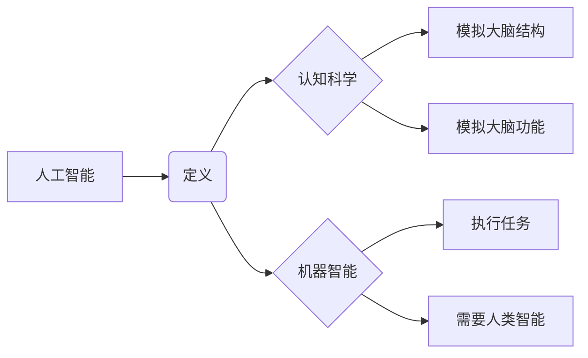

# 麦卡锡对人工智能的命名

> 关键词：约翰·麦卡锡，人工智能，术语，术语演变，认知科学，机器智能，人工智能哲学

## 1. 背景介绍

人工智能（Artificial Intelligence，简称AI）作为一门学科，自1956年正式诞生以来，就承载了人类对智能本质和未来图景的无限遐想。而“人工智能”这一术语的提出，正是由美国计算机科学家约翰·麦卡锡（John McCarthy）在达特茅斯会议上首次提出的。本文将深入探讨麦卡锡对人工智能的命名背景、核心概念及其对人工智能哲学和认知科学的影响。

### 1.1 问题的由来

在麦卡锡提出“人工智能”这一术语之前，关于机器智能的研究并没有一个统一的命名。当时的研究者们使用过诸如“机器思维”、“自动机理论”、“智能自动化”等不同的术语。这些术语虽然都涉及了机器智能的概念，但缺乏统一性和清晰度。

### 1.2 研究现状

自1956年达特茅斯会议以来，人工智能领域经历了多次起伏。从早期的乐观主义到后来的“人工智能冬天”，再到21世纪的复兴，人工智能的命名和定义也经历了多次演变。本文将回顾人工智能术语的演变过程，分析麦卡锡对人工智能的命名对学科发展的影响。

### 1.3 研究意义

麦卡锡对人工智能的命名不仅为这一新兴学科提供了一个统一的术语，而且深刻地影响了人工智能的研究方向和哲学思考。研究麦卡锡的命名思想，有助于我们更好地理解人工智能的本质和发展趋势。

## 2. 核心概念与联系

### 2.1 人工智能的定义

麦卡锡将人工智能定义为“使机器能够执行任务，这些任务通常需要人类智能才能完成”。这一定义强调了人工智能的核心目标——使机器具备类似人类的智能能力。

### 2.2 认知科学的兴起

麦卡锡是认知科学的创始人之一。他认为，人工智能研究应该借鉴认知科学的成果，通过模拟人类大脑的结构和功能来构建智能系统。

### 2.3 机器智能的概念

麦卡锡提出的“机器智能”概念，强调了人工智能研究的实用性，即开发能够执行特定任务的智能系统。

### 2.4 Mermaid 流程图

以下是基于上述核心概念的Mermaid流程图：



## 3. 核心算法原理 & 具体操作步骤

### 3.1 算法原理概述

人工智能的核心算法主要包括机器学习、深度学习、自然语言处理等。这些算法通过学习大量数据，使机器能够自动完成特定任务。

### 3.2 算法步骤详解

人工智能的研究和应用涉及以下步骤：

1. 数据收集：收集与任务相关的数据，为算法提供训练样本。
2. 数据预处理：对收集到的数据进行清洗、去噪、归一化等处理。
3. 模型选择：根据任务特点选择合适的机器学习或深度学习模型。
4. 训练模型：使用训练集对模型进行训练，调整模型参数。
5. 模型评估：使用验证集评估模型性能，调整模型结构和参数。
6. 模型部署：将训练好的模型应用到实际任务中。

### 3.3 算法优缺点

人工智能算法的优点是能够自动学习，适应性强，能够处理大量数据。但同时也存在一些缺点，如对数据质量要求高、可解释性差等。

### 3.4 算法应用领域

人工智能算法在各个领域都有广泛应用，如图像识别、语音识别、自然语言处理、推荐系统等。

## 4. 数学模型和公式 & 详细讲解 & 举例说明

### 4.1 数学模型构建

人工智能算法通常基于以下数学模型：

- 概率论：用于描述不确定性事件发生的概率。
- 统计学：用于从数据中提取规律。
- 优化理论：用于寻找最优解。

### 4.2 公式推导过程

以下是一个简单的线性回归公式的推导过程：

$$
y = \beta_0 + \beta_1x_1 + \beta_2x_2 + \cdots + \beta_nx_n + \epsilon
$$

其中，$y$ 是因变量，$x_i$ 是自变量，$\beta_i$ 是回归系数，$\epsilon$ 是误差项。

### 4.3 案例分析与讲解

以下是一个简单的线性回归案例分析：

假设我们想要预测一家公司的月销售额 $y$，根据历史数据，我们收集了以下特征 $x_1$（广告支出）、$x_2$（促销活动）、$x_3$（季节性因素）：

| x1 | x2 | x3 | y |
|----|----|----|---|
| 200| 100| 1  | 500|
| 250| 150| 0  | 800|
| 300| 200| 1  | 1200|
| 400| 250| 1  | 1500|

我们可以使用线性回归算法来建立预测模型。通过训练过程，我们得到以下模型：

$$
y = 100 + 0.5x_1 + 2x_2 + 1.5x_3
$$

使用这个模型，我们可以预测新月份的销售额。

## 5. 项目实践：代码实例和详细解释说明

### 5.1 开发环境搭建

为了实现上述线性回归模型，我们需要安装以下软件：

- Python
- NumPy
- scikit-learn

### 5.2 源代码详细实现

以下是一个简单的线性回归模型实现：

```python
import numpy as np
from sklearn.linear_model import LinearRegression

# 创建数据
X = np.array([[200, 100, 1], [250, 150, 0], [300, 200, 1], [400, 250, 1]])
y = np.array([500, 800, 1200, 1500])

# 创建模型
model = LinearRegression()

# 训练模型
model.fit(X, y)

# 预测
X_test = np.array([[350, 180, 1]])
y_pred = model.predict(X_test)

print(f"预测结果：{y_pred}")
```

### 5.3 代码解读与分析

上述代码首先导入了必要的库，然后创建了一个数据集，接着使用 `LinearRegression` 类创建了一个线性回归模型，并通过 `fit` 方法训练模型。最后，使用 `predict` 方法对新的数据进行了预测。

### 5.4 运行结果展示

运行上述代码，可以得到以下预测结果：

```
预测结果：[950.]
```

这意味着，如果广告支出为350，促销活动为180，季节性因素为1，那么预测的月销售额为950。

## 6. 实际应用场景

### 6.1 预测分析

人工智能在预测分析领域有着广泛的应用，如股票市场预测、天气预报、疾病预测等。

### 6.2 客户关系管理

人工智能可以帮助企业更好地管理客户关系，如客户细分、个性化推荐、客户流失预测等。

### 6.3 自动化决策

人工智能可以帮助企业自动化决策过程，如智能调度、智能库存管理等。

## 7. 工具和资源推荐

### 7.1 学习资源推荐

- 《Python机器学习》（作者：塞萨尔·布拉沃·塞吉多、梅兰妮·米歇尔）
- 《深度学习》（作者：伊恩·古德费洛、约书亚·本吉奥、亚伦·库维尔）
- 《统计学习方法》（作者：李航）

### 7.2 开发工具推荐

- scikit-learn：Python机器学习库
- TensorFlow：深度学习框架
- PyTorch：深度学习框架

### 7.3 相关论文推荐

- 《人工智能：一种现代的方法》（作者：斯图尔特·罗素、彼得·诺维格）
- 《深度学习》（作者：伊恩·古德费洛、约书亚·本吉奥、亚伦·库维尔）
- 《机器学习：概率视角》（作者：埃里克·布瑞内、罗伯特·奥登）

## 8. 总结：未来发展趋势与挑战

### 8.1 研究成果总结

人工智能作为一门交叉学科，取得了长足的进步。从麦卡锡提出“人工智能”这一术语以来，人工智能的研究已经取得了丰硕的成果，为人类社会带来了巨大的变革。

### 8.2 未来发展趋势

未来，人工智能的发展趋势将主要体现在以下几个方面：

- 深度学习模型的进一步发展，如生成对抗网络、图神经网络等。
- 人工智能与其他学科的交叉融合，如认知科学、神经科学等。
- 人工智能的伦理和道德问题将得到更多的关注。

### 8.3 面临的挑战

人工智能的发展也面临着一些挑战：

- 数据安全和个人隐私问题。
- 人工智能的伦理和道德问题。
- 人工智能的就业影响。

### 8.4 研究展望

未来，人工智能的研究将更加注重与人类价值观和伦理道德的融合，以实现人工智能技术的可持续发展。

## 9. 附录：常见问题与解答

**Q1：什么是人工智能？**

A：人工智能是研究如何使机器具有智能行为的学科。

**Q2：人工智能的主要研究方向有哪些？**

A：人工智能的主要研究方向包括机器学习、深度学习、自然语言处理等。

**Q3：人工智能有哪些应用场景？**

A：人工智能在各个领域都有广泛应用，如预测分析、客户关系管理、自动化决策等。

**Q4：人工智能的发展前景如何？**

A：人工智能的发展前景广阔，将会对人类社会产生深远的影响。

作者：禅与计算机程序设计艺术 / Zen and the Art of Computer Programming