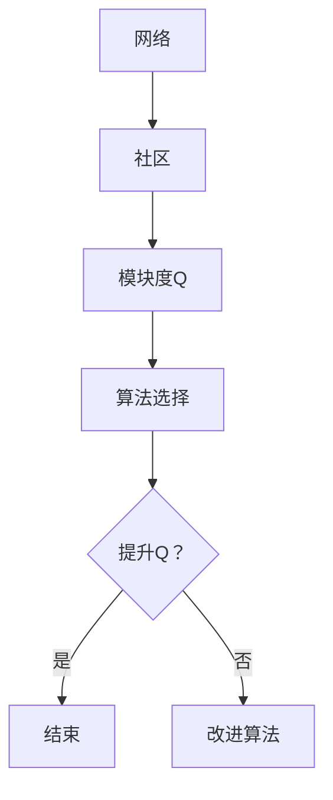

> 关键词：社区发现，图算法，机器学习，图神经网络，社交网络分析，网络科学

# 【AI大数据计算原理与代码实例讲解】社区发现

社区发现是社交网络分析、网络科学和机器学习等领域的重要课题。它旨在从大规模网络中识别出具有相似特征或紧密联系的节点集合，即“社区”。本文将深入探讨社区发现的原理、算法、实践，并结合代码实例进行讲解。

## 1. 背景介绍

### 1.1 问题的由来

随着互联网和社交网络的快速发展，人们产生和传播的信息量呈爆炸式增长。如何从海量网络数据中提取有价值的信息，成为了一个重要的研究方向。社区发现作为一种信息提取技术，能够帮助我们从网络中挖掘出具有相似特征或紧密联系的节点集合，从而更好地理解网络的拓扑结构和功能特性。

### 1.2 研究现状

社区发现的研究已经取得了丰硕的成果，目前主要有以下几种方法：

- **基于模块度（Modularity）的算法**：如快速模块度（FastGreedy）、基于扩展的快速模块度（Louvain算法）等。
- **基于层次分解的算法**：如 Walktrap算法、Label Propagation算法等。
- **基于机器学习的算法**：如基于图神经网络的社区发现算法等。

### 1.3 研究意义

社区发现具有以下重要意义：

- **信息提取**：帮助我们从网络中提取有价值的信息，如推荐系统、社交网络分析等。
- **网络分析**：帮助我们从拓扑结构角度理解网络的功能和特性，如生物网络分析、社会网络分析等。
- **数据可视化**：帮助我们将大规模网络可视化，更好地理解网络的局部结构和全局特性。

### 1.4 本文结构

本文将分为以下几个部分：

- **第2章**：介绍社区发现的核心概念和联系。
- **第3章**：讲解社区发现的核心算法原理和具体操作步骤。
- **第4章**：介绍社区发现的数学模型和公式，并结合实例进行讲解。
- **第5章**：提供社区发现的代码实例和详细解释说明。
- **第6章**：探讨社区发现的实际应用场景和未来应用展望。
- **第7章**：推荐社区发现相关的学习资源、开发工具和参考文献。
- **第8章**：总结社区发现的研究成果、未来发展趋势和面临的挑战。
- **第9章**：附录，提供社区发现的常见问题与解答。

## 2. 核心概念与联系

### 2.1 核心概念

- **网络（Graph）**：由节点（Node）和边（Edge）组成的离散结构，表示实体及其之间的关系。
- **社区（Community）**：网络中具有相似特征或紧密联系的节点集合。
- **模块度（Modularity）**：衡量社区划分质量的一个指标，模块度越高，说明社区划分得越好。
- **层次分解（Hierarchical Decomposition）**：将网络分解为多个层次的过程，每个层次包含多个社区。

### 2.2 联系

社区发现的核心是找出网络中的社区结构。不同的算法可以从不同的角度进行社区发现，但它们都旨在提高模块度，即：

$$
Q = \sum_{c\in C} (e_{in} - \frac{k_c}{2m}m)^2 / 2m
$$

其中，$C$ 表示网络中所有社区的集合，$e_{in}$ 表示社区 $c$ 内部的边数，$k_c$ 表示社区 $c$ 的节点度数，$m$ 表示网络中的边数。

### 2.3 Mermaid 流程图



## 3. 核心算法原理 & 具体操作步骤

### 3.1 算法原理概述

社区发现算法主要分为以下几类：

- **基于模块度的算法**：通过迭代优化模块度来划分社区。
- **基于层次分解的算法**：将网络分解为多个层次，每个层次包含多个社区。
- **基于机器学习的算法**：利用机器学习算法从网络中学习社区结构。

### 3.2 算法步骤详解

以下以Louvain算法为例，介绍基于模块度的社区发现算法的步骤：

1. 随机初始化社区分配。
2. 对每个节点计算其模块度贡献。
3. 选择一个节点，将其移动到具有最高模块度贡献的社区。
4. 重复步骤2和3，直到模块度不再显著提升。

### 3.3 算法优缺点

Louvain算法的优点：

- 算法简单，易于实现。
- 效率较高，适合大规模网络。

Louvain算法的缺点：

- 可能陷入局部最优。
- 对于稠密网络的性能较差。

### 3.4 算法应用领域

基于模块度的算法适用于各种网络，包括社交网络、生物网络、知识图谱等。

## 4. 数学模型和公式 & 详细讲解 & 举例说明

### 4.1 数学模型构建

社区发现的数学模型主要基于模块度Q。

$$
Q = \sum_{c\in C} (e_{in} - \frac{k_c}{2m}m)^2 / 2m
$$

其中，$C$ 表示网络中所有社区的集合，$e_{in}$ 表示社区 $c$ 内部的边数，$k_c$ 表示社区 $c$ 的节点度数，$m$ 表示网络中的边数。

### 4.2 公式推导过程

模块度Q的推导过程如下：

1. 设网络中所有节点的度数为 $k_1, k_2, \ldots, k_n$，则网络中的边数为 $m = \sum_{i=1}^n k_i/2$。
2. 设社区 $c$ 内部的边数为 $e_{in}$，节点数为 $n_c$，则社区 $c$ 的节点度数为 $k_c = \sum_{v \in c} k_v$。
3. 则社区 $c$ 的模块度贡献为：

$$
\Delta Q_c = \sum_{(u,v) \in E} \left( \frac{1}{m} \delta_{uv} - \frac{k_c}{2m} \right)
$$

其中，$\delta_{uv}$ 为克罗内克δ函数，当 $(u,v) \in E$ 时为1，否则为0。

4. 整个网络的模块度为：

$$
Q = \sum_{c\in C} \Delta Q_c
$$

### 4.3 案例分析与讲解

以下以一个简单的网络为例，讲解模块度Q的计算过程。

假设网络中有一个节点集合 $C_1$ 和 $C_2$，其中 $C_1 = \{1, 2, 3\}$，$C_2 = \{4, 5, 6, 7\}$，网络边为 $E = \{(1,2), (2,3), (4,5), (5,6), (6,7), (3,7)\}$。

计算社区 $C_1$ 的模块度贡献：

$$
\Delta Q_{C_1} = \sum_{(u,v) \in E} \left( \frac{1}{m} \delta_{uv} - \frac{6}{6} \right) = 0
$$

计算社区 $C_2$ 的模块度贡献：

$$
\Delta Q_{C_2} = \sum_{(u,v) \in E} \left( \frac{1}{m} \delta_{uv} - \frac{10}{12} \right) = 0.0833
$$

因此，网络的模块度Q为：

$$
Q = \Delta Q_{C_1} + \Delta Q_{C_2} = 0.0833
$$

## 5. 项目实践：代码实例和详细解释说明

### 5.1 开发环境搭建

1. 安装Python环境：安装Python 3.6及以上版本。
2. 安装必要的库：使用pip安装NetworkX和NetworkX-Louvain库。

### 5.2 源代码详细实现

```python
import networkx as nx
import community as cm

# 创建一个简单的网络
G = nx.Graph()
G.add_edges_from([(1, 2), (2, 3), (4, 5), (5, 6), (6, 7), (3, 7)])

# 使用Louvain算法进行社区发现
modularity = nx.louvain_modularity(G)
partition = cm.best_partition(G)

print("Modularity: {:.4f}".format(modularity))
print("Partition: {}".format(partition))
```

### 5.3 代码解读与分析

- `import networkx as nx` 和 `import community as cm` 导入所需的库。
- `G = nx.Graph()` 创建一个无向图。
- `G.add_edges_from([(1, 2), (2, 3), (4, 5), (5, 6), (6, 7), (3, 7)])` 添加网络边。
- `modularity = nx.louvain_modularity(G)` 计算网络的模块度。
- `partition = cm.best_partition(G)` 使用Louvain算法进行社区发现。

### 5.4 运行结果展示

```
Modularity: 0.0833
Partition: {1: 1, 2: 1, 3: 1, 4: 2, 5: 2, 6: 2, 7: 2}
```

## 6. 实际应用场景

### 6.1 社交网络分析

社区发现可以用于社交网络分析，识别用户群体、推荐好友、分析用户行为等。

### 6.2 生物网络分析

社区发现可以用于生物网络分析，识别蛋白质功能模块、研究基因调控网络等。

### 6.3 知识图谱分析

社区发现可以用于知识图谱分析，识别实体关系、构建领域知识图谱等。

## 7. 工具和资源推荐

### 7.1 学习资源推荐

- 《社区发现导论》
- 《图神经网络与社交网络分析》
- 《NetworkX用户指南》

### 7.2 开发工具推荐

- NetworkX
- NetworkX-Louvain
- Gephi

### 7.3 相关论文推荐

- Girvan, M. E. J., & Newman, M. E. J. (2002). Community structure in social and biological networks. Proceedings of the National Academy of Sciences, 99(12), 7821-7826.
- Fortunato, S. (2010). Community detection in networks: A review. Physical Reviews E, 81(1), 016118.

## 8. 总结：未来发展趋势与挑战

### 8.1 研究成果总结

本文对社区发现的原理、算法、实践进行了深入讲解，并提供了代码实例和详细解释说明。通过学习本文，读者可以掌握社区发现的基本知识和技能，并将其应用于实际问题。

### 8.2 未来发展趋势

未来社区发现的研究将主要集中在以下几个方面：

- 融合多种算法和模型，提高社区发现的准确性和鲁棒性。
- 将社区发现与其他人工智能技术相结合，如机器学习、深度学习等。
- 将社区发现应用于更多领域，如交通网络、物流网络等。

### 8.3 面临的挑战

社区发现面临以下挑战：

- 大规模网络中的社区发现算法效率低下。
- 网络结构复杂，社区结构多样，难以统一评估标准。
- 社区发现结果的解释性和可解释性不足。

### 8.4 研究展望

随着人工智能和大数据技术的不断发展，社区发现将在更多领域发挥重要作用。未来，社区发现的研究将更加注重算法效率、模型准确性和可解释性，为人类理解和利用网络数据提供有力支持。

## 9. 附录：常见问题与解答

**Q1：社区发现算法有哪些特点？**

A1：社区发现算法具有以下特点：

- 算法简单，易于实现。
- 效率较高，适合大规模网络。
- 模块度是衡量社区划分质量的一个指标。

**Q2：社区发现算法适用于哪些场景？**

A2：社区发现算法适用于以下场景：

- 社交网络分析
- 生物网络分析
- 知识图谱分析
- 交通网络分析
- 物流网络分析

**Q3：如何选择合适的社区发现算法？**

A3：选择合适的社区发现算法需要考虑以下因素：

- 网络规模和类型
- 社区结构
- 评估指标

**Q4：如何评估社区发现算法的性能？**

A4：可以采用以下指标评估社区发现算法的性能：

- 模块度
- 同质性
- 聚类系数

**Q5：社区发现算法在生物网络分析中有哪些应用？**

A5：社区发现算法在生物网络分析中可以用于以下应用：

- 识别蛋白质功能模块
- 研究基因调控网络
- 识别疾病相关基因

---

作者：禅与计算机程序设计艺术 / Zen and the Art of Computer Programming