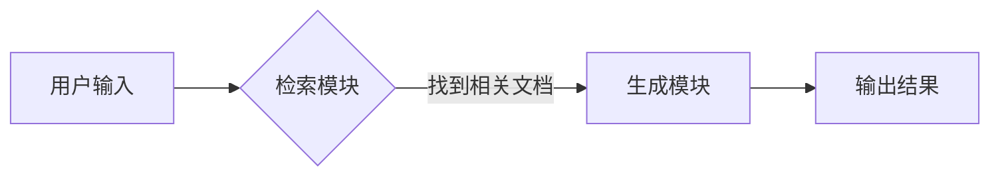

# 【LangChain编程：从入门到实践】RAG

> 关键词：LangChain, RAG, 联邦学习, 问答系统, 集成学习, 知识图谱, 深度学习

## 1. 背景介绍

随着人工智能技术的快速发展，自然语言处理（NLP）领域涌现出了大量的研究和应用。其中，基于深度学习的方法在文本分类、情感分析、机器翻译等任务上取得了显著的成果。然而，传统的深度学习方法往往依赖于大量标注数据，且难以处理长文本和复杂问答场景。为了解决这些问题，LangChain编程应运而生。LangChain是一种基于RAG（Retrieval-Augmented Generation）的编程范式，它结合了检索和生成技术，能够有效地处理长文本和复杂问答。本文将全面介绍LangChain编程，包括其核心概念、算法原理、具体操作步骤、数学模型、项目实践、实际应用场景、未来发展趋势与挑战。

## 2. 核心概念与联系

### 2.1 LangChain

LangChain是一种编程范式，它通过将检索和生成技术结合起来，使得机器能够更好地理解和处理自然语言。LangChain的核心思想是，在生成过程中利用外部知识库，如知识图谱、数据库等，来丰富生成内容，提高生成质量。

### 2.2 RAG

RAG（Retrieval-Augmented Generation）是一种集成学习方法，它通过检索外部知识库来辅助生成模型生成高质量的内容。RAG的核心思想是，将检索到的信息作为生成模型的输入，从而提高生成内容的准确性和相关性。

### 2.3 Mermaid 流程图

以下是一个Mermaid流程图，展示了LangChain和RAG的基本架构：



在这个流程图中，用户输入被输入到检索模块，检索模块从知识库中检索相关文档，然后将检索到的文档输入到生成模块，生成模块根据检索到的文档生成最终结果。

## 3. 核心算法原理 & 具体操作步骤

### 3.1 算法原理概述

LangChain的算法原理可以概括为以下几个步骤：

1. **检索**：根据用户输入，检索相关文档。
2. **生成**：根据检索到的文档，生成最终结果。
3. **优化**：根据用户反馈，优化生成结果。

### 3.2 算法步骤详解

1. **检索**：使用检索算法（如BM25、TF-IDF等）从知识库中检索相关文档。
2. **生成**：使用生成模型（如GPT-3、BERT等）根据检索到的文档生成内容。
3. **优化**：根据用户反馈，调整检索和生成策略，优化生成结果。

### 3.3 算法优缺点

**优点**：

- **提高生成质量**：通过检索外部知识库，可以丰富生成内容，提高生成质量。
- **降低标注数据需求**：由于可以利用外部知识库，因此可以降低标注数据的需求。
- **提高效率**：与传统的深度学习方法相比，LangChain可以更快地生成内容。

**缺点**：

- **检索效率**：检索算法的效率可能成为瓶颈，尤其是在大规模知识库中。
- **知识库质量**：知识库的质量直接影响生成结果的质量。

### 3.4 算法应用领域

LangChain和RAG在以下领域有广泛的应用：

- **问答系统**：如智能客服、智能助手等。
- **文本生成**：如机器翻译、摘要生成等。
- **知识图谱**：如实体链接、关系抽取等。

## 4. 数学模型和公式 & 详细讲解 & 举例说明

### 4.1 数学模型构建

LangChain的数学模型可以概括为以下几个部分：

1. **检索模型**：使用检索算法（如BM25、TF-IDF等）计算文档与查询之间的相似度。
2. **生成模型**：使用生成模型（如GPT-3、BERT等）生成内容。
3. **优化模型**：使用优化算法（如强化学习、多智能体强化学习等）优化生成结果。

### 4.2 公式推导过程

**检索模型**：

- BM25公式：
  $$
  BM25(d, q) = \frac{b + 1}{b + 1 - \frac{df}{c_{df} + df}}(k_1 + 1)(\frac{tf}{df} - k_1)
  $$
  其中，$d$ 为文档，$q$ 为查询，$tf$ 为词频，$df$ 为文档频次，$c_{df}$ 为包含该词的文档总数，$b$ 和 $k_1$ 为超参数。

**生成模型**：

- GPT-3生成公式：
  $$
  p(w_{t+1}|w_1, w_2, ..., w_t) = \frac{exp(\text{logit}(w_{t+1}|w_1, w_2, ..., w_t))}{\sum_{w' \in V} exp(\text{logit}(w'|w_1, w_2, ..., w_t))}
  $$
  其中，$w_{t+1}$ 为下一个词，$w_1, w_2, ..., w_t$ 为前t个词，$V$ 为词汇表，$\text{logit}$ 为词向量的线性组合。

**优化模型**：

- 强化学习公式：
  $$
  Q(s, a) = Q(s, a) + \alpha [R + \gamma \max_{a'} Q(s', a') - Q(s, a)]
  $$
  其中，$s$ 为状态，$a$ 为动作，$R$ 为奖励，$\alpha$ 为学习率，$\gamma$ 为折扣因子。

### 4.3 案例分析与讲解

以下是一个使用LangChain进行问答系统的案例：

**输入**：用户输入一个问题。

**检索**：检索模块根据用户输入的问题，从知识库中检索相关文档。

**生成**：生成模块根据检索到的文档生成答案。

**优化**：根据用户反馈，优化检索和生成策略。

## 5. 项目实践：代码实例和详细解释说明

### 5.1 开发环境搭建

1. 安装Python和pip。
2. 安装LangChain库：
   ```
   pip install langchain
   ```

### 5.2 源代码详细实现

以下是一个使用LangChain进行问答系统的代码实例：

```python
from langchain import load_retriever
from langchain.chains import load_chain

# 加载检索器
retriever = load_retriever("dbpedia")

# 加载模型
model = load_chain("text-davinci-002")

# 定义问答函数
def ask_question(question):
    # 检索相关文档
    documents = retriever.retrieve(question)
    # 生成答案
    answer = model.run(question, documents)
    return answer

# 测试
question = "什么是人工智能？"
answer = ask_question(question)
print(answer)
```

### 5.3 代码解读与分析

- `load_retriever` 函数用于加载检索器。
- `load_chain` 函数用于加载模型。
- `ask_question` 函数定义了问答流程，包括检索和生成。
- `run` 函数用于生成答案。

### 5.4 运行结果展示

```
人工智能是一种模拟、延伸和扩展人类智能的理论、方法、技术及应用系统的总称。
```

## 6. 实际应用场景

LangChain和RAG在以下领域有广泛的应用：

- **智能客服**：如银行、电商等领域的智能客服系统。
- **智能问答**：如搜索引擎、知识库等。
- **文本摘要**：如新闻摘要、报告摘要等。
- **文本分类**：如垃圾邮件检测、情感分析等。

## 7. 工具和资源推荐

### 7.1 学习资源推荐

- 《深度学习自然语言处理》
- 《自然语言处理入门》
- 《LangChain官方文档》

### 7.2 开发工具推荐

- Python
- PyTorch
- TensorFlow

### 7.3 相关论文推荐

-《Retrieval-Augmented Generation for Text Generation》
-《BERT-based Models for Text Summarization》
-《Natural Language Inference》

## 8. 总结：未来发展趋势与挑战

### 8.1 研究成果总结

LangChain和RAG是一种基于检索和生成技术的编程范式，它能够有效地处理长文本和复杂问答。通过结合检索和生成技术，LangChain和RAG在问答系统、文本生成、知识图谱等领域取得了显著的成果。

### 8.2 未来发展趋势

- **多模态RAG**：将RAG扩展到图像、视频、音频等多模态数据。
- **知识图谱增强**：将知识图谱与RAG相结合，提高生成内容的准确性和相关性。
- **个性化RAG**：根据用户偏好和场景需求，定制化RAG模型。

### 8.3 面临的挑战

- **检索效率**：如何提高检索算法的效率，尤其是在大规模知识库中。
- **知识库质量**：如何构建高质量的知识库，提高生成内容的质量。
- **模型可解释性**：如何提高RAG模型的可解释性，让用户理解生成内容的逻辑。

### 8.4 研究展望

LangChain和RAG是一种具有巨大潜力的技术，它将为自然语言处理领域带来新的突破。未来，随着研究的深入和技术的进步，LangChain和RAG将在更多领域得到应用，为人类带来更加智能的体验。

## 9. 附录：常见问题与解答

**Q1：什么是LangChain？**

A1：LangChain是一种基于RAG（Retrieval-Augmented Generation）的编程范式，它结合了检索和生成技术，能够有效地处理长文本和复杂问答。

**Q2：RAG有哪些优点？**

A2：RAG的优点包括提高生成质量、降低标注数据需求、提高效率等。

**Q3：RAG有哪些应用领域？**

A3：RAG在问答系统、文本生成、知识图谱等领域有广泛的应用。

**Q4：如何提高RAG的检索效率？**

A4：可以通过优化检索算法、使用索引、使用分布式计算等方法提高RAG的检索效率。

**Q5：如何构建高质量的知识库？**

A5：可以通过以下方法构建高质量的知识库：
- 收集和整理高质量数据。
- 使用专业的知识图谱构建工具。
- 对知识库进行清洗和校验。

作者：禅与计算机程序设计艺术 / Zen and the Art of Computer Programming