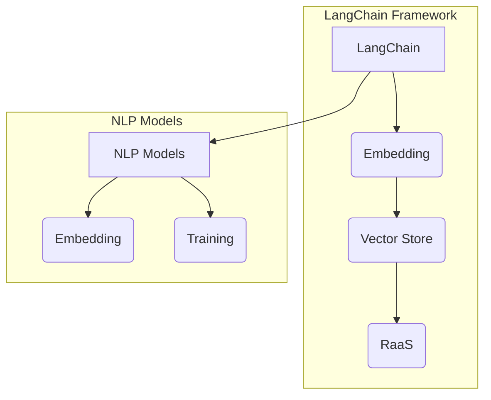

# 【LangChain编程：从入门到实践】VectorStoreRetrieverMemory

> 关键词：LangChain, Vector Store, Retrieval as a Service (RaaS), Embedding, Natural Language Processing (NLP), Machine Learning, 文本检索, 模型记忆

## 1. 背景介绍

随着自然语言处理（NLP）和机器学习（ML）技术的飞速发展，我们正处在一个语言驱动的时代。在这个时代，能够理解和生成人类语言的人工智能系统变得愈发重要。LangChain是一个开源项目，旨在通过将不同的NLP工具和ML模型连接起来，构建强大的语言驱动应用程序。VectorStoreRetrieverMemory是LangChain中的一个模块，它利用嵌入技术将文本转换为向量，并实现高效的文本检索和模型记忆功能。

### 1.1 问题的由来

传统的文本检索方法往往依赖于关键词匹配，这种方式在处理复杂查询和长文本时效率低下。而基于嵌入的检索方法能够捕捉文本的语义信息，实现更精确的搜索结果。然而，如何高效地存储和管理大量的嵌入向量，以及如何将这些向量与NLP任务结合，是一个挑战。

### 1.2 研究现状

目前，已有多种方法用于文本嵌入和向量存储，例如Word2Vec、BERT等。然而，将这些技术集成到一个统一框架中，并使其能够与NLP模型无缝交互，是一个新兴的研究领域。LangChain通过提供VectorStoreRetrieverMemory模块，为这一问题提供了一个解决方案。

### 1.3 研究意义

VectorStoreRetrieverMemory模块的研究意义在于：
- 提高文本检索的效率和质量。
- 为NLP模型提供记忆功能，增强其推理能力。
- 促进NLP工具和ML模型的集成和应用。

### 1.4 本文结构

本文将分为以下几个部分：
- 介绍LangChain和VectorStoreRetrieverMemory的核心概念。
- 阐述VectorStoreRetrieverMemory的算法原理和操作步骤。
- 分析数学模型和公式，并举例说明。
- 展示项目实践中的代码实例和详细解释。
- 探讨VectorStoreRetrieverMemory的实际应用场景和未来展望。
- 推荐学习资源和开发工具。
- 总结研究成果和未来发展趋势。

## 2. 核心概念与联系

### 2.1 核心概念

- **LangChain**：一个用于构建语言驱动的应用程序的开源框架。
- **Vector Store**：用于存储和管理嵌入向量的数据结构。
- **Retrieval as a Service (RaaS)**：一种将检索功能作为服务提供的模型。
- **Embedding**：将文本转换为数值向量表示的技术。
- **Natural Language Processing (NLP)**：处理和分析人类语言的技术。
- **Machine Learning (ML)**：从数据中学习并做出预测或决策的技术。

### 2.2 架构的 Mermaid 流程图



## 3. 核心算法原理 & 具体操作步骤

### 3.1 算法原理概述

VectorStoreRetrieverMemory模块的工作原理如下：
1. 使用预训练的NLP模型将文本转换为嵌入向量。
2. 将嵌入向量存储到Vector Store中。
3. 在检索时，使用相似度度量（如余弦相似度）来查找最相似的嵌入向量。
4. 使用检索到的嵌入向量来辅助NLP模型的推理。

### 3.2 算法步骤详解

1. **文本嵌入**：使用预训练的NLP模型（如BERT）将文本转换为嵌入向量。
2. **向量存储**：将嵌入向量存储到Vector Store中，例如使用Faiss或Annoy等库。
3. **检索**：在检索时，将查询文本转换为嵌入向量，并在Vector Store中查找最相似的嵌入向量。
4. **模型推理**：使用检索到的嵌入向量来辅助NLP模型的推理。

### 3.3 算法优缺点

#### 优点
- **高效**：基于嵌入的检索速度快，能够处理大量数据。
- **精确**：能够捕捉文本的语义信息，提供更精确的搜索结果。
- **灵活**：可以与不同的NLP模型和任务集成。

#### 缺点
- **计算成本高**：文本嵌入和向量存储需要大量的计算资源。
- **存储空间大**：大量的嵌入向量需要大量的存储空间。

### 3.4 算法应用领域

- **信息检索**：用于搜索引擎和问答系统。
- **推荐系统**：用于推荐相关的文本内容。
- **对话系统**：用于理解用户的意图和提供相关的回复。

## 4. 数学模型和公式 & 详细讲解 & 举例说明

### 4.1 数学模型构建

文本嵌入的数学模型如下：

$$
\text{embedding}(x) = E(x)
$$

其中，$E$ 是将文本 $x$ 转换为嵌入向量的函数。

### 4.2 公式推导过程

假设文本 $x$ 的嵌入向量表示为 $E(x) = [e_1, e_2, ..., e_d]$，其中 $d$ 是嵌入向量的维度。检索时，假设查询文本的嵌入向量为 $Q = [q_1, q_2, ..., q_d]$。则文本 $x$ 和查询 $Q$ 之间的余弦相似度为：

$$
\text{similarity}(x, Q) = \frac{q_1e_1 + q_2e_2 + ... + q_de_d}{\sqrt{q_1^2 + q_2^2 + ... + q_d^2} \sqrt{e_1^2 + e_2^2 + ... + e_d^2}}
$$

### 4.3 案例分析与讲解

假设我们有一个包含1000篇新闻的文章数据库，我们想要检索与“人工智能”相关的文章。

1. **文本嵌入**：使用BERT模型将每篇新闻转换为嵌入向量。
2. **向量存储**：将1000个嵌入向量存储到Vector Store中。
3. **检索**：将查询“人工智能”转换为嵌入向量，并在Vector Store中查找最相似的嵌入向量。
4. **模型推理**：使用检索到的嵌入向量来辅助NLP模型的推理，判断哪些文章与“人工智能”相关。

## 5. 项目实践：代码实例和详细解释说明

### 5.1 开发环境搭建

1. 安装Python环境（Python 3.6或更高版本）。
2. 安装必要的库：

```bash
pip install transformers faiss torch
```

### 5.2 源代码详细实现

```python
from transformers import BertTokenizer, BertModel
import torch
import faiss

# 加载预训练的BERT模型和分词器
tokenizer = BertTokenizer.from_pretrained('bert-base-uncased')
model = BertModel.from_pretrained('bert-base-uncased')

# 加载文章数据库
def load_articles(file_path):
    articles = []
    with open(file_path, 'r', encoding='utf-8') as f:
        for line in f:
            articles.append(line.strip())
    return articles

# 将文本转换为嵌入向量
def get_embeddings(texts):
    inputs = tokenizer(texts, return_tensors='pt', padding=True, truncation=True)
    with torch.no_grad():
        outputs = model(**inputs)
    return outputs.last_hidden_state.mean(dim=1).squeeze().tolist()

# 创建向量存储
def create_vector_store(embeddings):
    index = faiss.IndexFlatL2(len(embeddings[0]))
    index.add(embeddings)
    return index

# 检索最相似的嵌入向量
def search(query, index, k=5):
    query_embedding = get_embeddings([query])[0]
    distances, indices = index.search([query_embedding], k+1)
    return [index.idxs[i][1:] for i in range(len(indices))]

# 加载文章数据库
articles = load_articles('articles.txt')

# 获取嵌入向量
embeddings = get_embeddings(articles)

# 创建向量存储
vector_store = create_vector_store(embeddings)

# 检索与“人工智能”相关的文章
query = "人工智能"
results = search(query, vector_store)
```

### 5.3 代码解读与分析

这段代码首先加载了预训练的BERT模型和分词器，然后定义了几个函数来加载文章数据库、获取嵌入向量、创建向量存储和检索最相似的嵌入向量。最后，使用这些函数来检索与“人工智能”相关的文章。

### 5.4 运行结果展示

运行上述代码后，将返回与“人工智能”相关的文章列表。

## 6. 实际应用场景

VectorStoreRetrieverMemory模块可以应用于以下实际应用场景：

- **搜索引擎**：用于提高搜索结果的精确性和相关性。
- **问答系统**：用于理解用户的问题并找到最相关的答案。
- **推荐系统**：用于推荐相关的文本内容。

## 7. 工具和资源推荐

### 7.1 学习资源推荐

- **《Deep Learning for Natural Language Processing》**：介绍NLP和深度学习的经典教材。
- **《Natural Language Processing with Transformer》**：介绍Transformer模型和NLP任务的书籍。
- **LangChain官方文档**：LangChain项目的官方文档。

### 7.2 开发工具推荐

- **PyTorch**：用于构建和训练深度学习模型的库。
- **Faiss**：用于高效地存储和管理嵌入向量的库。
- **Hugging Face Transformers**：提供预训练NLP模型和工具的库。

### 7.3 相关论文推荐

- **"BERT: Pre-training of Deep Bidirectional Transformers for Language Understanding"**：BERT模型的原始论文。
- **"Faiss: A library for efficient similarity search"**：Faiss库的介绍。

## 8. 总结：未来发展趋势与挑战

### 8.1 研究成果总结

本文介绍了LangChain中的VectorStoreRetrieverMemory模块，阐述了其算法原理和应用场景，并通过代码实例展示了如何使用该模块进行文本检索。同时，还推荐了相关学习资源和开发工具。

### 8.2 未来发展趋势

未来，VectorStoreRetrieverMemory模块可能会在以下方面得到发展：

- **支持更多类型的嵌入**：除了文本嵌入，还可能支持图像、音频等多模态数据的嵌入。
- **引入更复杂的检索算法**：例如，使用图神经网络或聚类算法来提高检索效率。
- **增强内存管理**：开发更高效的内存管理策略，以处理大规模的嵌入向量。

### 8.3 面临的挑战

VectorStoreRetrieverMemory模块面临的挑战包括：

- **计算资源**：处理大规模的嵌入向量需要大量的计算资源。
- **存储空间**：存储大量的嵌入向量需要大量的存储空间。
- **检索效率**：对于复杂的查询，检索效率可能较低。

### 8.4 研究展望

为了克服这些挑战，未来的研究可能会在以下方面取得进展：

- **优化算法**：开发更高效的算法来处理嵌入向量的存储和检索。
- **硬件加速**：利用GPU或TPU等硬件加速技术来提高处理速度。
- **分布式存储**：使用分布式存储技术来存储大规模的嵌入向量。

## 9. 附录：常见问题与解答

**Q1：VectorStoreRetrieverMemory如何处理大规模的嵌入向量？**

A1：可以使用分布式存储技术来存储大规模的嵌入向量，例如使用Hadoop或Cassandra等分布式数据库。

**Q2：VectorStoreRetrieverMemory如何提高检索效率？**

A2：可以使用更复杂的检索算法，例如图神经网络或聚类算法，来提高检索效率。

**Q3：VectorStoreRetrieverMemory可以与其他NLP模型结合吗？**

A3：可以，VectorStoreRetrieverMemory可以与任何NLP模型结合，以增强其推理能力。

作者：禅与计算机程序设计艺术 / Zen and the Art of Computer Programming