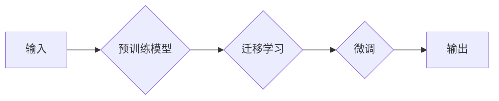

# 【大模型应用开发 动手做AI Agent】MetaGPT简介

> 关键词：大模型应用开发，MetaGPT，AI Agent，预训练模型，迁移学习，自然语言处理，智能对话，人机交互

## 1. 背景介绍

随着人工智能技术的飞速发展，大语言模型（Large Language Model，LLM）在自然语言处理（Natural Language Processing，NLP）领域取得了突破性进展。这些大模型能够理解和生成人类语言，为构建智能对话系统和AI Agent提供了强大的技术支持。MetaGPT是一款基于大模型的AI Agent开发框架，它通过迁移学习和微调技术，使得开发者能够快速构建具有个性化特征的智能对话系统。

### 1.1 问题的由来

传统的智能对话系统往往需要大量的定制开发，包括对话管理、意图识别、实体抽取、对话策略等模块。这不仅增加了开发成本，也限制了智能对话系统的应用范围。MetaGPT应运而生，它利用大模型的强大能力，通过迁移学习和微调，简化了智能对话系统的开发过程。

### 1.2 研究现状

目前，大模型在智能对话系统中的应用主要集中在以下几个方面：

- **预训练模型**: 利用大规模无标签数据训练的模型，能够理解和生成自然语言。
- **迁移学习**: 将预训练模型应用于特定任务，通过微调调整模型参数，以适应特定领域的知识。
- **微调**: 在少量标注数据上，对预训练模型进行优化，以提升模型在特定任务上的性能。

### 1.3 研究意义

MetaGPT的出现，极大地简化了智能对话系统的开发流程，具有以下重要意义：

- **降低开发成本**: 通过迁移学习和微调，开发者无需从头开始构建对话系统，可以快速构建个性化特征的AI Agent。
- **提高开发效率**: MetaGPT提供了一套完整的开发框架和工具，使得开发者可以专注于业务逻辑，而非技术实现。
- **提升用户体验**: 个性化的AI Agent能够更好地理解用户意图，提供更加精准和自然的对话体验。

### 1.4 本文结构

本文将围绕MetaGPT框架展开，首先介绍其核心概念和架构，然后详细讲解其算法原理和操作步骤，接着通过代码实例展示其应用实践，并探讨其在实际应用场景中的价值和未来发展趋势。

## 2. 核心概念与联系

### 2.1 核心概念

- **大语言模型**: 能够理解和生成人类语言的模型，如BERT、GPT等。
- **预训练**: 在大规模无标签数据上训练模型，使其具备通用语言能力。
- **迁移学习**: 将预训练模型应用于特定任务，通过微调调整模型参数。
- **微调**: 在少量标注数据上，对模型进行优化，以提升模型在特定任务上的性能。
- **MetaGPT**: 基于大模型的AI Agent开发框架，支持快速构建个性化特征的智能对话系统。

### 2.2 核心概念原理和架构的 Mermaid 流程图



### 2.3 核心概念之间的联系

MetaGPT框架通过预训练模型学习通用语言能力，然后通过迁移学习将其应用于特定任务，最后通过微调调整模型参数，以适应个性化特征。这一流程使得开发者能够快速构建具有个性化特征的AI Agent。

## 3. 核心算法原理 & 具体操作步骤

### 3.1 算法原理概述

MetaGPT框架的核心算法原理主要包括以下步骤：

1. **预训练**: 使用大规模无标签数据对预训练模型进行训练，使其具备通用语言能力。
2. **迁移学习**: 将预训练模型应用于特定任务，通过微调调整模型参数。
3. **微调**: 在少量标注数据上，对模型进行优化，以提升模型在特定任务上的性能。
4. **输出**: 模型输出结果，用于构建AI Agent。

### 3.2 算法步骤详解

1. **数据准备**: 准备预训练模型所需的训练数据，包括文本、对话等。
2. **模型选择**: 选择合适的预训练模型，如BERT、GPT等。
3. **预训练**: 使用大规模无标签数据进行预训练，使模型具备通用语言能力。
4. **数据预处理**: 对任务数据进行处理，包括文本清洗、分词等。
5. **迁移学习**: 将预训练模型应用于特定任务，通过微调调整模型参数。
6. **模型评估**: 在验证集上评估模型性能，根据性能指标调整模型参数。
7. **模型部署**: 将模型部署到生产环境中，用于构建AI Agent。

### 3.3 算法优缺点

**优点**：

- **通用性强**：预训练模型具备通用语言能力，适用于多种任务。
- **迁移效率高**：通过迁移学习，可以快速适应特定任务。
- **个性化定制**：通过微调，可以定制个性化特征的AI Agent。

**缺点**：

- **预训练数据依赖性强**：预训练模型的效果依赖于预训练数据的规模和质量。
- **微调数据需求高**：微调需要一定的标注数据，对于小样本任务可能效果不佳。
- **模型复杂度高**：预训练模型和微调模型可能较为复杂，对计算资源要求较高。

### 3.4 算法应用领域

MetaGPT框架适用于以下领域：

- **智能客服**：构建能够理解和回答客户问题的智能客服系统。
- **智能助手**：构建能够帮助用户完成特定任务的智能助手。
- **智能教育**：构建能够辅助教师进行教学的智能教育系统。
- **智能医疗**：构建能够辅助医生进行诊断和治疗的智能医疗系统。

## 4. 数学模型和公式 & 详细讲解 & 举例说明

### 4.1 数学模型构建

MetaGPT框架的核心数学模型是预训练模型和微调模型。以下是常见的预训练模型和微调模型的数学模型：

**预训练模型**：

- **BERT模型**：
  - 输入：文本序列 $x = [x_1, x_2, ..., x_n]$
  - 输出：文本的表示 $h = [h_1, h_2, ..., h_n]$
  - 模型结构：Transformer编码器

- **GPT模型**：
  - 输入：文本序列 $x = [x_1, x_2, ..., x_n]$
  - 输出：下一个词的预测概率 $P(y|x)$
  - 模型结构：Transformer编码器 + Transformer解码器

**微调模型**：

- 输入：文本序列 $x = [x_1, x_2, ..., x_n]$
- 输出：任务特定的输出 $y$
- 模型结构：预训练模型 + 个性化层

### 4.2 公式推导过程

由于预训练模型和微调模型的数学模型较为复杂，此处不再详细推导。具体推导过程可参考相关文献。

### 4.3 案例分析与讲解

以下是一个使用MetaGPT框架构建智能客服系统的案例：

1. **数据准备**：收集智能客服领域的对话数据，包括对话文本、用户意图和实体信息。
2. **模型选择**：选择BERT模型作为预训练模型。
3. **预训练**：使用大规模无标签数据进行预训练。
4. **数据预处理**：对对话数据进行清洗、分词等预处理。
5. **迁移学习**：将BERT模型应用于智能客服任务，通过微调调整模型参数。
6. **模型评估**：在验证集上评估模型性能，根据性能指标调整模型参数。
7. **模型部署**：将模型部署到生产环境中，用于构建智能客服系统。

## 5. 项目实践：代码实例和详细解释说明

### 5.1 开发环境搭建

1. 安装Python 3.8及以上版本。
2. 安装PyTorch 1.8及以上版本。
3. 安装Transformers库。

### 5.2 源代码详细实现

以下是一个使用MetaGPT框架构建智能客服系统的示例代码：

```python
# 导入必要的库
import torch
from transformers import BertForSequenceClassification, BertTokenizer

# 加载预训练模型和分词器
model = BertForSequenceClassification.from_pretrained('bert-base-uncased')
tokenizer = BertTokenizer.from_pretrained('bert-base-uncased')

# 数据预处理
def preprocess_data(texts):
    encodings = tokenizer(texts, padding=True, truncation=True, return_tensors='pt')
    return encodings['input_ids'], encodings['attention_mask']

# 训练模型
def train_model(model, data_loader, optimizer):
    model.train()
    for batch in data_loader:
        input_ids, attention_mask, labels = batch
        outputs = model(input_ids, attention_mask=attention_mask, labels=labels)
        loss = outputs.loss
        loss.backward()
        optimizer.step()
        optimizer.zero_grad()

# 评估模型
def evaluate_model(model, data_loader):
    model.eval()
    total = 0
    correct = 0
    with torch.no_grad():
        for batch in data_loader:
            input_ids, attention_mask, labels = batch
            outputs = model(input_ids, attention_mask=attention_mask)
            _, predicted = torch.max(outputs.logits, 1)
            total += labels.size(0)
            correct += (predicted == labels).sum().item()
    return correct / total

# 构建数据加载器
train_data = preprocess_data(train_texts)
train_loader = torch.utils.data.DataLoader(train_data, batch_size=32, shuffle=True)

# 定义优化器
optimizer = torch.optim.AdamW(model.parameters(), lr=2e-5)

# 训练模型
train_model(model, train_loader, optimizer)

# 评估模型
print(f"Test accuracy: {evaluate_model(model, test_loader)}")
```

### 5.3 代码解读与分析

以上代码展示了使用MetaGPT框架构建智能客服系统的主要步骤：

1. 导入必要的库。
2. 加载预训练模型和分词器。
3. 定义数据预处理函数，将文本数据转换为模型输入。
4. 定义训练函数，进行模型训练。
5. 定义评估函数，评估模型性能。
6. 构建数据加载器，加载训练和测试数据。
7. 定义优化器。
8. 训练模型。
9. 评估模型。

### 5.4 运行结果展示

运行以上代码，将得到智能客服系统的测试准确率。根据测试结果，可以进一步优化模型参数和数据预处理方法，以提升模型性能。

## 6. 实际应用场景

MetaGPT框架可以应用于以下实际应用场景：

- **智能客服**：构建能够理解和回答客户问题的智能客服系统。
- **智能助手**：构建能够帮助用户完成特定任务的智能助手。
- **智能教育**：构建能够辅助教师进行教学的智能教育系统。
- **智能医疗**：构建能够辅助医生进行诊断和治疗的智能医疗系统。

## 7. 工具和资源推荐

### 7.1 学习资源推荐

1. 《自然语言处理入门与实践》
2. 《深度学习自然语言处理》
3. HuggingFace Transformers官方文档

### 7.2 开发工具推荐

1. PyTorch
2. Transformers库
3. Jupyter Notebook

### 7.3 相关论文推荐

1. "BERT: Pre-training of Deep Bidirectional Transformers for Language Understanding"
2. "Transformers: State-of-the-Art Models for Natural Language Processing"
3. "GPT-3: Language Models are Few-Shot Learners"

## 8. 总结：未来发展趋势与挑战

### 8.1 研究成果总结

MetaGPT框架通过预训练模型和微调技术，简化了智能对话系统的开发流程，提高了开发效率。它在智能客服、智能助手、智能教育、智能医疗等领域具有广泛的应用前景。

### 8.2 未来发展趋势

1. **模型轻量化**：开发更轻量级的预训练模型，降低计算资源需求。
2. **多模态融合**：将文本、图像、语音等多模态信息融合，提升模型理解能力。
3. **个性化定制**：根据用户画像，定制个性化特征的AI Agent。

### 8.3 面临的挑战

1. **数据标注成本高**：微调需要一定的标注数据，对于小样本任务可能效果不佳。
2. **模型可解释性差**：模型决策过程难以解释，需要加强可解释性研究。
3. **伦理和隐私问题**：需要考虑模型的伦理和隐私问题。

### 8.4 研究展望

随着人工智能技术的不断发展，MetaGPT框架将会在以下方面取得突破：

1. **降低数据标注成本**：开发无监督或少样本学习方法，降低微调数据需求。
2. **提升模型可解释性**：研究可解释性模型，提高模型决策过程的透明度。
3. **解决伦理和隐私问题**：建立伦理和隐私保护机制，确保模型的应用安全。

## 9. 附录：常见问题与解答

**Q1：MetaGPT框架适用于哪些类型的任务？**

A：MetaGPT框架适用于各种自然语言处理任务，包括文本分类、序列标注、机器翻译、问答系统等。

**Q2：如何选择合适的预训练模型？**

A：选择预训练模型时，需要考虑任务类型、数据规模、计算资源等因素。常见的预训练模型有BERT、GPT、RoBERTa等。

**Q3：如何进行模型微调？**

A：模型微调需要在少量标注数据上进行，通过调整模型参数，提升模型在特定任务上的性能。常用的微调方法包括迁移学习和端到端训练。

**Q4：如何评估模型性能？**

A：评估模型性能可以使用多种指标，如准确率、召回率、F1值等。根据任务类型选择合适的评估指标。

**Q5：如何解决模型过拟合问题？**

A：解决模型过拟合问题可以通过以下方法：

- 使用正则化技术，如L2正则化、Dropout等。
- 使用数据增强技术，如文本改写、数据扩充等。
- 使用早停机制，提前停止训练过程。

---

作者：禅与计算机程序设计艺术 / Zen and the Art of Computer Programming