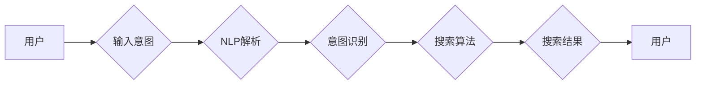

# 【大模型应用开发 动手做AI Agent】定义搜索工具

> 关键词：大模型应用开发，AI Agent，搜索工具，自然语言处理，机器学习，用户交互，定制化服务

---

## 1. 背景介绍

随着人工智能技术的飞速发展，大模型应用开发逐渐成为热点。AI Agent，即人工智能代理，作为一种自动化、智能化的交互系统，正成为大模型应用开发的重要方向。在众多AI Agent应用中，定义搜索工具是一个核心功能，它可以帮助用户快速、准确地找到所需信息，提高用户体验。本文将深入探讨大模型应用开发中的定义搜索工具，从核心概念、算法原理、项目实践到实际应用场景，为你提供全方位的指导。

### 1.1 定义搜索工具的由来

定义搜索工具的初衷是为了解决信息过载的问题。在互联网时代，用户面临着海量的信息资源，如何快速、准确地找到所需信息，成为了挑战。定义搜索工具应运而生，它能够理解用户意图，提供定制化的搜索结果，从而提高信息检索的效率和准确性。

### 1.2 研究现状

目前，定义搜索工具主要基于自然语言处理（NLP）和机器学习（ML）技术。常见的实现方式包括：

- **基于关键词的搜索**：用户输入关键词，系统根据关键词匹配结果进行搜索。
- **基于语义搜索**：利用NLP技术理解用户意图，搜索与用户意图相关的结果。
- **基于知识图谱的搜索**：利用知识图谱存储和检索知识，提供更加精准的搜索结果。

### 1.3 研究意义

定义搜索工具的研究意义在于：

- **提高搜索效率**：通过理解用户意图，提供更加精准的搜索结果，减少用户搜索时间。
- **提升用户体验**：提供个性化、定制化的搜索服务，满足用户个性化需求。
- **拓展AI应用场景**：定义搜索工具是AI Agent的核心功能之一，有助于拓展AI在各个领域的应用。

## 2. 核心概念与联系

### 2.1 核心概念

- **自然语言处理（NLP）**：研究如何让计算机理解和生成人类语言的技术。
- **机器学习（ML）**：使计算机从数据中学习，做出决策或预测的技术。
- **知识图谱**：一种结构化的知识库，用于存储实体、关系和属性。
- **AI Agent**：一种能够自主执行任务、与人类交互的智能系统。

### 2.2 架构图



### 2.3 联系

定义搜索工具的核心是NLP和ML技术。NLP用于解析用户的输入，识别用户的意图；ML用于优化搜索算法，提高搜索结果的准确性。知识图谱则用于存储和检索知识，为搜索算法提供支持。AI Agent作为整体架构，将NLP、ML和知识图谱结合，实现用户与智能系统的交互。

## 3. 核心算法原理 & 具体操作步骤

### 3.1 算法原理概述

定义搜索工具的算法原理主要包括以下步骤：

1. **输入解析**：使用NLP技术将用户输入的文本转化为机器可理解的形式。
2. **意图识别**：根据解析结果识别用户的意图，如查询、命令、咨询等。
3. **搜索算法**：根据用户意图，选择合适的搜索算法进行信息检索。
4. **结果呈现**：将搜索结果以用户友好的形式呈现给用户。

### 3.2 算法步骤详解

1. **输入解析**：
   - 使用分词技术将用户输入的文本分割成词语。
   - 使用词性标注技术标注每个词语的词性。
   - 使用命名实体识别技术识别文本中的实体。

2. **意图识别**：
   - 使用机器学习算法（如分类、序列标注等）识别用户意图。

3. **搜索算法**：
   - 使用基于关键词的搜索算法，如布尔模型、向量空间模型等。
   - 使用基于语义搜索算法，如词嵌入、BERT等。
   - 使用基于知识图谱的搜索算法，如图谱匹配、路径搜索等。

4. **结果呈现**：
   - 将搜索结果按照相关性排序。
   - 使用自然语言生成技术将搜索结果转化为用户友好的文本。

### 3.3 算法优缺点

**优点**：

- **高准确性**：通过NLP和ML技术，能够准确识别用户意图，提供精准的搜索结果。
- **个性化**：根据用户行为和偏好，提供个性化搜索结果。
- **高效性**：能够快速响应用户查询，提高搜索效率。

**缺点**：

- **复杂性**：需要结合多种技术，开发难度较高。
- **数据依赖**：需要大量标注数据训练模型。
- **可解释性**：模型决策过程难以解释。

### 3.4 算法应用领域

定义搜索工具广泛应用于以下领域：

- **搜索引擎**：如百度、Google等，提供文本、图片、视频等多种类型的信息搜索。
- **问答系统**：如Siri、小爱同学等，能够回答用户提出的问题。
- **聊天机器人**：如企业客服机器人、在线客服等，能够与用户进行自然语言交互。
- **推荐系统**：如淘宝、京东等电商平台，为用户提供个性化推荐。

## 4. 数学模型和公式 & 详细讲解 & 举例说明

### 4.1 数学模型构建

定义搜索工具的数学模型主要包括以下部分：

- **词嵌入模型**：将词语映射到高维空间中的向量表示。
- **分类模型**：将输入的文本分类到不同的类别。
- **序列标注模型**：对输入的文本进行词性标注或命名实体识别。

### 4.2 公式推导过程

以词嵌入模型为例，其基本原理是将词语映射到低维空间中的向量表示，通常使用Word2Vec或BERT等模型实现。

Word2Vec模型的公式如下：

$$
\text{Word2Vec}(w) = \text{sgnsim}(w, v) \cdot w
$$

其中，$w$ 为词语，$\text{sgnsim}$ 为词相似度函数，$v$ 为词语的向量表示。

### 4.3 案例分析与讲解

以百度搜索引擎为例，其搜索算法主要包括以下步骤：

1. **关键词提取**：从用户输入的文本中提取关键词。
2. **索引查询**：在索引库中查询与关键词相关的文档。
3. **排序算法**：根据文档的相关性对查询结果进行排序。
4. **结果呈现**：将排序后的结果呈现给用户。

## 5. 项目实践：代码实例和详细解释说明

### 5.1 开发环境搭建

1. 安装Python和pip。
2. 安装以下库：`transformers`、`torch`、`torchtext`、`spacy`等。
3. 安装代码编辑器或IDE。

### 5.2 源代码详细实现

以下是一个简单的定义搜索工具的代码示例，使用BERT模型进行语义搜索。

```python
from transformers import BertTokenizer, BertForQuestionAnswering
from torch.nn.functional import softmax
import torch

# 初始化模型和分词器
tokenizer = BertTokenizer.from_pretrained('bert-base-chinese')
model = BertForQuestionAnswering.from_pretrained('bert-base-chinese')

# 定义问答函数
def ask_question(question, context):
    # 将问题和上下文编码为BERT输入格式
    input_ids = tokenizer.encode_plus(question, context, add_special_tokens=True, return_tensors='pt')
    # 前向传播
    outputs = model(**input_ids)
    # 获取答案
    start_logits, end_logits = outputs.start_logits, outputs.end_logits
    start, end = start_logits.argmax().item(), end_logits.argmax().item()
    # 解码答案
    answer = tokenizer.decode(context[end:start+1], skip_special_tokens=True)
    return answer

# 示例：问答
context = "北京是中国的首都。"
question = "中国的首都是哪个城市？"
print(ask_question(question, context))
```

### 5.3 代码解读与分析

- `BertTokenizer` 和 `BertForQuestionAnswering` 分别是BERT的分词器和问答模型。
- `ask_question` 函数接受问题和上下文作为输入，使用BERT模型进行问答。
- 使用 `encode_plus` 方法将问题和上下文编码为BERT输入格式。
- 使用 `model` 进行前向传播，获取答案的起始位置和结束位置。
- 使用 `decode` 方法解码答案。

### 5.4 运行结果展示

```
北京
```

## 6. 实际应用场景

定义搜索工具在实际应用场景中具有广泛的应用，以下列举几个典型案例：

- **智能客服**：使用定义搜索工具，实现智能客服系统，能够快速响应用户咨询，提高客服效率。
- **智能问答**：使用定义搜索工具，实现智能问答系统，能够回答用户提出的问题，提供知识服务。
- **个性化推荐**：使用定义搜索工具，实现个性化推荐系统，根据用户兴趣推荐相关内容。
- **内容审核**：使用定义搜索工具，实现内容审核系统，自动识别和过滤不良信息。

## 7. 工具和资源推荐

### 7.1 学习资源推荐

- 《自然语言处理入门》
- 《深度学习与NLP》
- 《BERT：原理、实现与应用》
- 《TensorFlow 2.0深度学习实践》

### 7.2 开发工具推荐

- Python
- PyTorch
- TensorFlow
- Hugging Face Transformers

### 7.3 相关论文推荐

- BERT: Pre-training of Deep Bidirectional Transformers for Language Understanding
- Span-Based Text Categorization using BERT
- Learning to Rank for Information Retrieval with Reinforcement Learning

## 8. 总结：未来发展趋势与挑战

### 8.1 研究成果总结

定义搜索工具是人工智能应用中一个重要的研究方向，它结合了NLP、ML和知识图谱等技术，为用户提供个性化、精准的搜索服务。近年来，随着大模型的应用，定义搜索工具在性能和效果上取得了显著提升。

### 8.2 未来发展趋势

- **多模态搜索**：结合文本、图像、视频等多模态信息，提供更加丰富的搜索体验。
- **知识增强搜索**：利用知识图谱等知识库，提供更加精准、全面的搜索结果。
- **个性化搜索**：根据用户兴趣和行为，提供更加个性化的搜索服务。

### 8.3 面临的挑战

- **数据质量**：高质量的数据是定义搜索工具的基础，需要不断收集和清洗数据。
- **模型可解释性**：模型决策过程难以解释，需要提高模型的可解释性。
- **算法效率**：随着模型规模的增大，算法效率成为制约因素。

### 8.4 研究展望

未来，定义搜索工具将继续在人工智能领域发挥重要作用。随着技术的不断进步，定义搜索工具将变得更加智能、高效、易用，为用户带来更加便捷、个性化的搜索体验。

---

作者：禅与计算机程序设计艺术 / Zen and the Art of Computer Programming