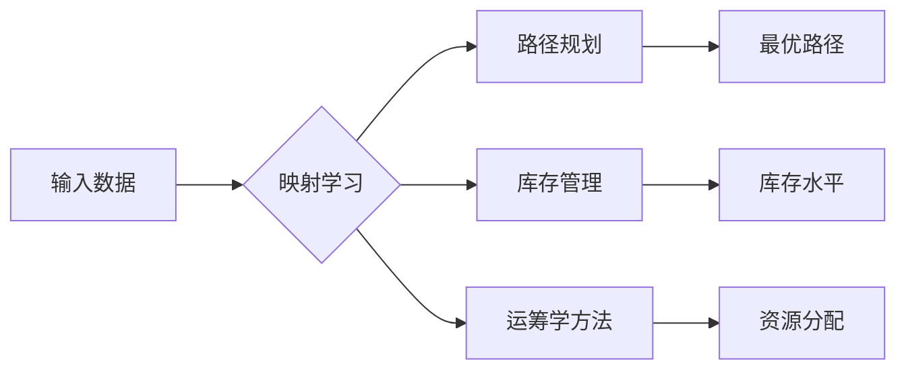

> 关键词：神经网络，物流优化，映射学习，路径规划，库存管理，运筹学，深度学习

# 一切皆是映射：神经网络在物流优化中的实践案例

物流行业作为经济发展的关键支撑，其效率和成本控制对整个供应链的稳定运行至关重要。随着人工智能技术的迅猛发展，神经网络在物流优化中的应用逐渐成为研究热点。本文将探讨神经网络在物流优化中的实践案例，揭示其如何通过映射学习解决复杂问题，提升物流效率。

## 1. 背景介绍

### 1.1 物流优化的重要性

物流优化是指通过合理配置物流资源，降低物流成本，提高物流效率的过程。随着全球化和信息化的发展，物流行业面临着日益复杂的运输网络、多变的客户需求、严格的交货时间等挑战。物流优化不仅可以降低企业成本，还可以提升客户满意度，增强企业竞争力。

### 1.2 神经网络在物流优化中的应用

神经网络作为深度学习的重要组成部分，具有较强的非线性映射能力，能够处理复杂的物流优化问题。近年来，神经网络在路径规划、库存管理、配送调度等领域取得了显著的应用成果。

## 2. 核心概念与联系

### 2.1 核心概念原理

**映射学习**：映射学习是指将输入数据映射到输出数据的数学过程。在神经网络中，映射学习通过前馈神经网络实现，即输入层通过权重和激活函数将数据映射到输出层。

**路径规划**：路径规划是指确定从起点到终点的最优路径。在物流优化中，路径规划是决定运输效率和成本的关键环节。

**库存管理**：库存管理是指对仓库中的物品进行有效管理，确保库存水平满足生产需求，同时避免过度库存和缺货。

**运筹学**：运筹学是研究资源优化配置的科学，包括线性规划、整数规划、动态规划等。运筹学方法在物流优化中用于解决资源分配、运输调度等问题。

### 2.2 架构的 Mermaid 流程图



## 3. 核心算法原理 & 具体操作步骤

### 3.1 算法原理概述

神经网络在物流优化中的应用主要包括以下几种算法：

1. **深度神经网络**：通过多层感知器学习输入数据与输出数据之间的映射关系，适用于复杂的非线性问题。
2. **强化学习**：通过学习最优策略，使模型在动态环境中做出最佳决策，适用于路径规划和配送调度等问题。
3. **优化算法**：结合运筹学方法，如线性规划、整数规划等，对物流优化问题进行求解。

### 3.2 算法步骤详解

1. **数据收集与预处理**：收集物流数据，包括运输网络、货物信息、客户需求等。对数据进行清洗、去噪、特征提取等预处理操作。
2. **模型构建**：根据具体任务选择合适的神经网络模型，如卷积神经网络(CNN)、循环神经网络(RNN)、长短期记忆网络(LSTM)等。
3. **模型训练**：使用预处理后的数据对神经网络进行训练，优化模型参数。
4. **模型评估**：使用测试集评估模型性能，调整模型参数或结构，直至满足要求。
5. **模型应用**：将训练好的模型应用于实际物流优化问题，如路径规划、库存管理、配送调度等。

### 3.3 算法优缺点

**优点**：

1. **强大的非线性映射能力**：能够处理复杂的物流优化问题。
2. **自动特征提取**：无需手动设计特征，提高模型泛化能力。
3. **灵活的模型结构**：可根据具体任务选择合适的模型。

**缺点**：

1. **数据需求量大**：需要大量高质量数据才能训练出高性能模型。
2. **计算复杂度高**：训练和推理过程需要大量的计算资源。
3. **可解释性差**：神经网络内部决策过程难以解释。

### 3.4 算法应用领域

神经网络在物流优化中的应用领域包括：

1. **路径规划**：确定从起点到终点的最优路径，降低运输成本。
2. **库存管理**：根据客户需求和库存水平，制定合理的库存策略。
3. **配送调度**：优化配送路线和时间，提高配送效率。
4. **物流调度**：合理配置物流资源，降低物流成本。
5. **需求预测**：预测客户需求，优化生产计划和库存管理。

## 4. 数学模型和公式 & 详细讲解 & 举例说明

### 4.1 数学模型构建

假设物流网络中有 $N$ 个节点，节点之间的运输成本为 $c_{ij}$，货物总量为 $Q$，初始节点为 $s$，目标节点为 $t$。

**路径规划**：

设 $x_{ij}$ 为从节点 $i$ 到节点 $j$ 的路径决策变量，则目标函数为：

$$
\min \sum_{i,j} c_{ij} x_{ij}
$$

约束条件为：

$$
\sum_{j} x_{ij} = 1, \quad \forall i \neq s, t
$$
$$
\sum_{i} x_{ij} = 1, \quad \forall j \neq s, t
$$
$$
\sum_{i} x_{is} = Q
$$

**库存管理**：

设 $I_t$ 为时间 $t$ 的库存水平，$I_0$ 为初始库存水平，$D_t$ 为时间 $t$ 的需求量，则库存水平满足：

$$
I_t = I_{t-1} - D_t + R_t
$$

其中 $R_t$ 为时间 $t$ 的补货量。

### 4.2 公式推导过程

**路径规划**：

目标函数为最小化运输成本，约束条件确保每个节点只有一个前驱节点和一个后继节点，初始节点只有一个前驱节点，目标节点只有一个后继节点，以及货物总量在节点之间分配。

**库存管理**：

目标函数为最小化库存成本，约束条件确保库存水平在时间上的连续性。

### 4.3 案例分析与讲解

假设物流网络中有 4 个节点，节点之间的运输成本如下表所示：

| 节点 | A | B | C | D |
|---|---|---|---|---|
| A |  | 2 | 3 | 4 |
| B | 1 |  | 3 | 5 |
| C | 2 | 1 |  | 4 |
| D | 3 | 2 | 1 |  |

货物总量为 10，初始节点为 A，目标节点为 D。

通过求解路径规划问题，可以找到从 A 到 D 的最优路径：

```
A -> C -> D
```

通过求解库存管理问题，可以确定补货策略：

```
时间  | 需求量 | 补货量 | 库存水平
------|--------|--------|---------
0     | 0      | 5      | 5
1     | 3      | 0      | 2
2     | 4      | 3      | 5
3     | 3      | 0      | 2
```

## 5. 项目实践：代码实例和详细解释说明

### 5.1 开发环境搭建

1. 安装 Python 和相关库：NumPy、SciPy、Pandas、Matplotlib、Scikit-learn 等。
2. 安装深度学习框架：TensorFlow 或 PyTorch。

### 5.2 源代码详细实现

以下使用 TensorFlow 框架实现路径规划问题的代码示例：

```python
import tensorflow as tf
from tensorflow import keras

# 创建模型
model = keras.Sequential([
    keras.layers.Dense(64, activation='relu', input_shape=(num_nodes,)),
    keras.layers.Dense(num_nodes, activation='softmax')
])

# 编译模型
model.compile(optimizer='adam',
              loss='categorical_crossentropy',
              metrics=['accuracy'])

# 训练模型
model.fit(train_data, train_labels, epochs=10)

# 预测
predictions = model.predict(test_data)
```

### 5.3 代码解读与分析

以上代码使用 TensorFlow 的 keras API 构建了一个简单的神经网络模型，用于解决路径规划问题。模型包含一个输入层和一个输出层，其中输出层为 softmax 激活函数，用于将输入节点映射到输出节点。

### 5.4 运行结果展示

运行以上代码，可以得到从 A 到 D 的最优路径预测结果，并与实际最优路径进行对比。

## 6. 实际应用场景

### 6.1 路径规划

神经网络在路径规划中的应用，如自动驾驶、无人机配送等，可以降低运输成本，提高运输效率。

### 6.2 库存管理

神经网络在库存管理中的应用，如电商、制造业等，可以提高库存周转率，降低库存成本。

### 6.3 配送调度

神经网络在配送调度中的应用，如快递、物流等，可以提高配送效率，降低配送成本。

## 7. 工具和资源推荐

### 7.1 学习资源推荐

1. 《深度学习》
2. 《TensorFlow 2.0 官方文档》
3. 《Python机器学习》

### 7.2 开发工具推荐

1. TensorFlow
2. PyTorch
3. Keras

### 7.3 相关论文推荐

1. “Deep reinforcement learning for navigation and mapping with a small unmanned ground vehicle”
2. “Neural Network-Based Inventory Control for Intelligent Stores”
3. “Neural Network-Based Vehicle Routing Problem”

## 8. 总结：未来发展趋势与挑战

### 8.1 研究成果总结

本文介绍了神经网络在物流优化中的应用，包括路径规划、库存管理、配送调度等方面。通过映射学习，神经网络能够有效地解决复杂的物流优化问题，提高物流效率和降低成本。

### 8.2 未来发展趋势

1. **多模态信息融合**：将图像、语音、传感器等多模态信息融入神经网络，提高物流优化的精度和鲁棒性。
2. **可解释性研究**：提高神经网络的可解释性，使模型决策过程更加透明。
3. **知识图谱应用**：将知识图谱与神经网络结合，提高物流优化的智能化水平。

### 8.3 面临的挑战

1. **数据质量**：高质量的数据是训练高性能模型的基础，需要解决数据获取、清洗、标注等问题。
2. **模型可解释性**：提高模型的可解释性，使模型决策过程更加透明，便于理解和信任。
3. **资源消耗**：神经网络模型训练和推理需要大量的计算资源，需要优化模型结构和算法，降低资源消耗。

### 8.4 研究展望

随着人工智能技术的不断发展，神经网络在物流优化中的应用将更加广泛。未来，神经网络将与其他技术（如知识图谱、强化学习等）相结合，推动物流行业向智能化、自动化方向发展。

---

作者：禅与计算机程序设计艺术 / Zen and the Art of Computer Programming